# 使用 Python 开发和部署您的首个以太坊智能合约

> 原文：<https://itnext.io/develop-and-deploy-your-first-ethereum-smart-contract-with-python-7048f25ba507?source=collection_archive---------3----------------------->


这篇文章会*长一点，因为我将涉及多个概念。我将介绍以下内容:*

*   智能合约及其在区块链以太坊的运作方式。
*   Solidity 编程语言的基础知识，以及如何使用在线和现有的 ide 来编写和测试它们。
*   使用**松露**和**加纳切**进行以太坊开发环境设置。
*   **Web3.py** 有助于将智能合约与 Python 应用集成。

# 什么是智能合同

根据 [Investopedia](https://www.investopedia.com/terms/s/smart-contracts.asp) :

> 智能合同是一种自动执行的合同，买卖双方的协议条款直接写入代码行。守则和其中包含的协议存在于一个分散的区块链网络中。代码控制执行，事务是可跟踪和不可逆的。

根据[以太坊](https://ethereum.org/en/developers/docs/smart-contracts/):

> 一份“智能合同”仅仅是运行在以太坊区块链上的一个程序。它是代码(它的功能)和数据(它的状态)的集合，驻留在以太坊区块链上的一个特定地址。

简单地说，智能合同是在区块链中运行的一段代码。这个术语是由 90 年代的人创造的，他们实际上想要一个在多方之间充当中间人的软件。以太坊使用这个术语来运行以太坊区块链中的任何一段代码。

[Solidity](https://docs.soliditylang.org/) 是用来写以太坊智能合约的语言。它从 C++、Javascript 和 Python 中获得了灵感。Vyper 是以太坊生态系统的新成员，它的灵感很大程度上来自 Python。因为 Solidity 是一门相当成熟的语言，并且有大量的资源可用，所以我建议学习它而不是 Vyper 来获得智能契约编程的基础。一旦学会了，学习 Vyper 就变得容易了。在接下来的几个月里，我将尝试报道 Vyper。

Remix 是一个非常流行的开发、运行和测试智能合约的 IDE。你可以连接本地以太网或者使用它已经提供的网络，没关系。快速测试代码的好处是什么？

# 固体底漆

Solidity 是以太坊推出的编写智能合约的原始编程语言。几乎所有运行在以太坊平台上的著名硬币和代币都在使用 Solidity。我要去重新混合基于网络的 IDE 来写我们的第一份合同。当您访问 Remix 时，您将会看到如下内容:

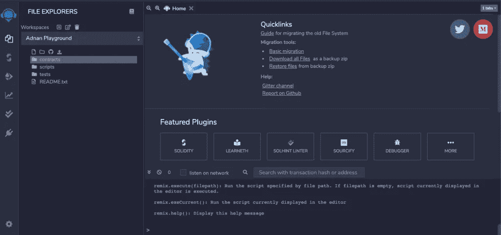

正如你所看到的，这是一个非常先进的 IDE。你在左边看到的屏幕是一个与文件浏览相关的侧面板。它有不同的预定义文件夹可用于编写和测试您的代码。下一个是针对 *Solidity 编译器*，你可以选择不同的选项，我会说保留默认选项。之后是用于编译和运行智能合同的*部署和事务*。在*合同*文件夹下，我创建了一个新文件`FirstContract.sol`。所有的 solidity 文件都有`.sol`扩展名，所以无论你是在本地运行还是重新混合，你都必须为你的智能合同文件使用`.sol`扩展名。

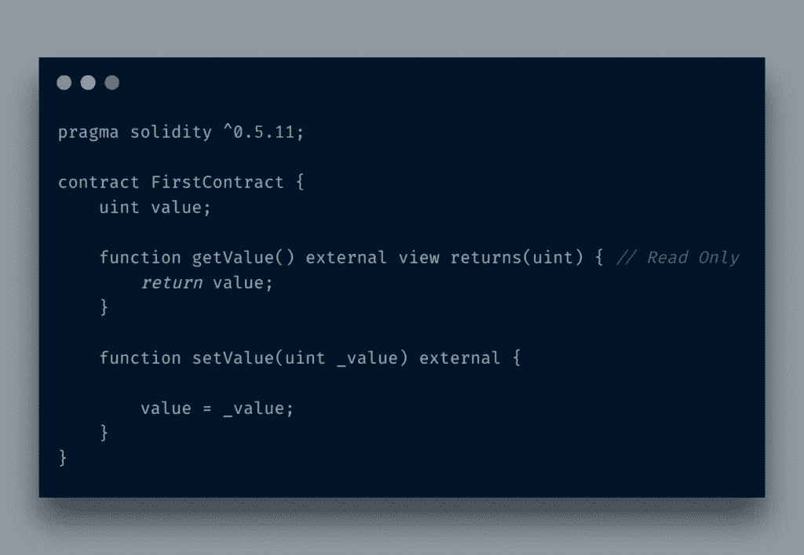

第一行实际上是告诉哪种语言和编译器版本是兼容的。语言 *solidity* 正在被用来编写代码。接下来的事情是关于版本。如果你熟悉正则表达式，那么你应该不会感到陌生。很明显，这段代码不适用于早于 *0.5.11 的编译器。*它也不适用于像 *0.6.x 或更高版本*的编译器，你知道这都是因为`^`符号。您有各种方法使您的代码兼容不同的版本。例如，`pragma solidity >=0.4.22 <0.6.0;`将确保你的代码只对高于 *0.4.22* 和低于 *0.6.0* 的编译器有效。

如果你做过 OOP，下一个代码块对你来说应该很熟悉。关键词`contract`实际上就像`class`一样，开始一个代码块，谈论软件的某些特性。我定义了一个类型为`uint`的私有变量`value`。这些变量的默认可访问性是*私有*。变量*的值*实际上是一个*状态变量*，这意味着变量的内容被永久存储在契约存储器中。当我说这个变量是私有的时，这意味着它不能被另一个契约访问，也不能从另一个程序(如 Python 应用程序)直接调用它。你必须知道存储在区块链中的信息仍然是公开的。所以不要混淆，通过私有变量，你可以隐藏一些机密。 ***在区块链世界里没有什么是机密的。***

接下来，我们定义一个函数`getValue()`，它返回一个无符号整数`value`。接下来，你找到`external`关键字。它使此功能可用于导入此合同文件的其他合同。与之相反的是，`internal`只能在契约的内部被调用。当您在其中添加`public`时，您使它的功能在环境外部可用，并且可以从系统外部调用，例如在您的 Python 应用程序中通过 *web3.js* 或 *web3.py* 。与`public`相反的是`private.`，如果一个变量或函数是私有的，那么它就不能被访问。`returns`关键字实际上告诉这个函数返回一个括号中给定类型的值，在本例中是`uint`。

getter/setter 函数的逻辑是不言自明的。

是时候编译代码了。

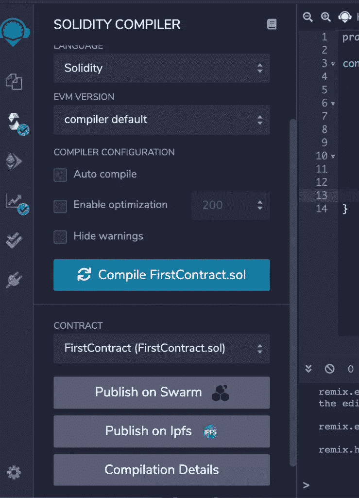

一旦合同编译完毕，现在就可以在区块链上部署和运行合同了。

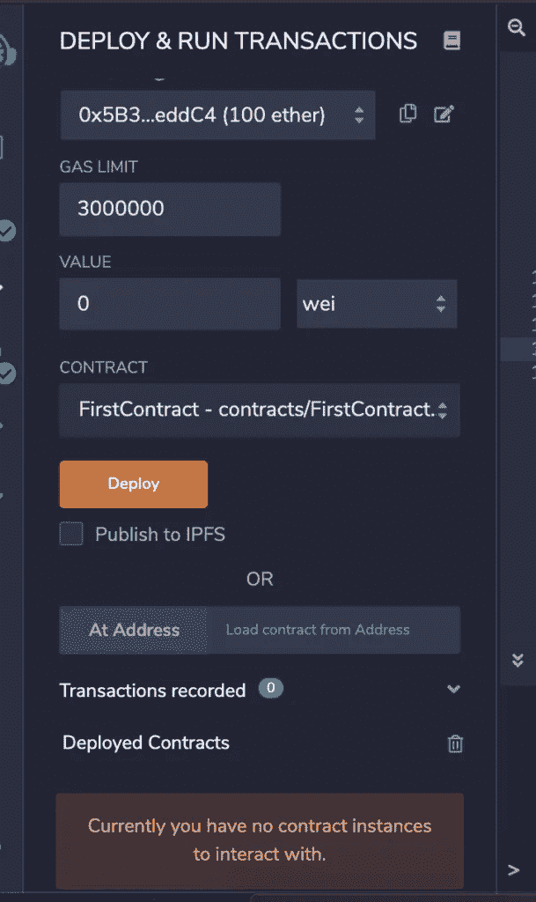

您会注意到一些事情，ETH 钱包地址将用于扣除汽油费。默认环境是 JS。让一切保持原样，并确保为部署选择正确的智能合同。当您点击“部署”按钮时，它会将其部署到区块链上。


您会看到状态显示该交易由全球各地的矿工开采。他们的服务是有报酬的。任何改变以太坊状态的事情，区块链实际上都认为是一个*交易*。这意味着你必须为此付出代价。如果你向下滚动一点，你会发现交易和执行成本都以 *gas* 的形式出现。谁来买单？你的钱包。每次交易发生时，金额将从您的钱包中扣除。

部署完成后，您将在*已部署合同*部分看到您的合同及其功能。

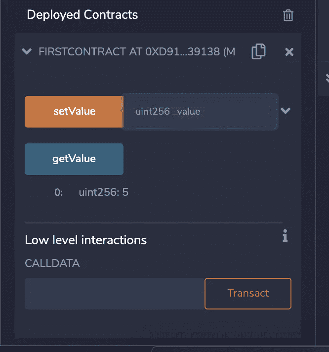

正如你所看到的，我们写的函数在这里是可见的。我们将首先设置值。


我输入并点击*设定值*按钮。当它执行时，您将看到调试窗口有几个新条目。向下滚动，您将再次找到交易的天然气值，因为值 *5* 现在存储在区块链中。现在点击 *getValue* 按钮执行该功能。

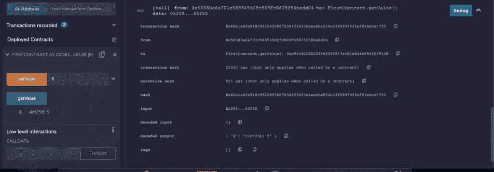

注意开头的标签，而不是**【VM】**。这意味着这是一个简单的函数调用，而不是一个事务，因此这里不涉及天然气成本，因为它没有改变区块链的状态，因此不涉及采矿，这意味着没有天然气扣除。这些是你必须知道的非常重要的概念，因为你的每一行代码都会给你的雇主或客户带来损失。这并不像你只是用了一个*阵*因为你*爱*它。你使用 Remix 或任何其他 IDE 或环境，概念将是相同的。在我进入下一节之前，如果我想以编程的方式知道谁在支付执行费用，答案是`msg.sender`。

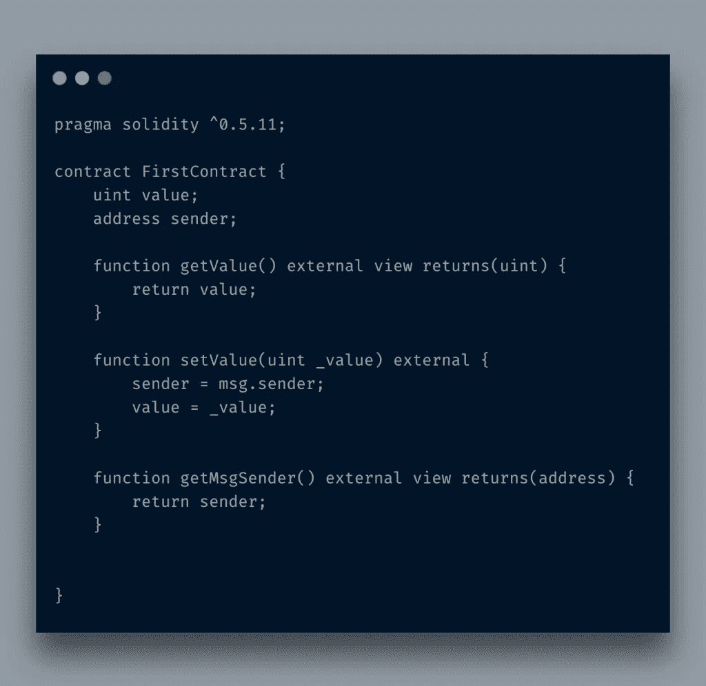

这里我添加了一个新的变量和一个函数。`sender`变量属于`address`类型。虽然你不会为了好玩而创建一个函数。这只是为了解释的目的。

像以前一样，您将编译和部署契约。每次部署合同时，它都会创建一个新的副本。所以确保你选择了正确的版本。

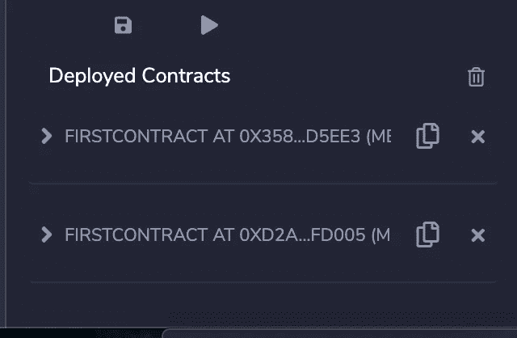

从新部署的合同中选择`setValue`函数，输入任意值，然后运行`getMsgSender`。不出所料它会打印第一个地址，`0x5B3..`在这里。你先执行`setValue`的原因是因为我在这里设置了`msg.Sender`变量。Solidity 提供了一些特殊的变量来查找钱包和交易相关的细节。你可以在这里了解更多。

Remix IDE 很适合在线测试，但我们应该有一些本地设置来编码、测试和部署智能合约。我将在这里介绍两个工具: [Truffle](https://www.trufflesuite.com/) 为区块链应用程序提供开发环境，以及 [Ganache](https://www.trufflesuite.com/ganache) 为测试目的提供本地以太坊区块链。

# 设置松露和加纳切

为了安装 truffle，我们将使用`npm`,因为 Truffle 实际上是一个节点模块:

`npm install -g truffle`

为了检查它是否安装正确，在控制台中运行`truffle`命令:

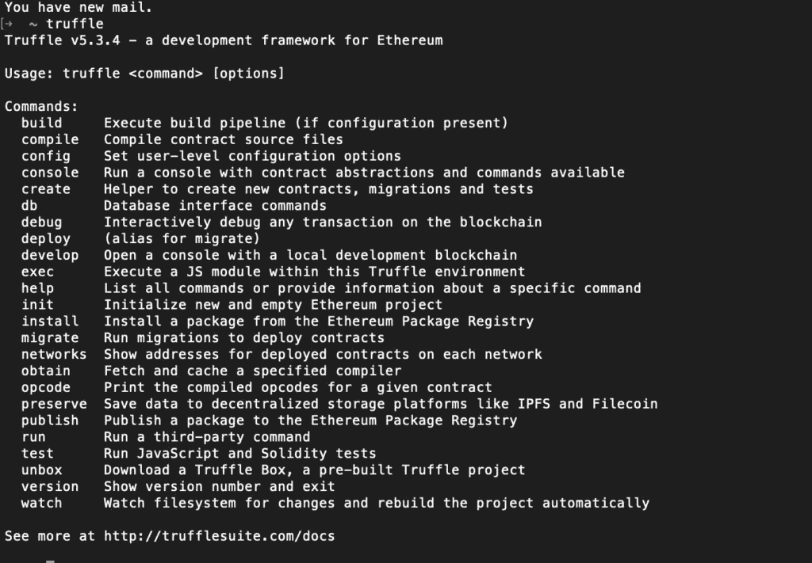

安装完成后，我将创建一个新的文件夹来初始化 truffle 项目。


如您所见，它创建了几个文件夹和一个配置文件。我正在使用 VS 代码集成开发环境，带有胡安布兰科*的*可靠性*插件。*

假设您已经安装了 Ganache 桌面 GUI，您将在其中创建一个新的工作区。

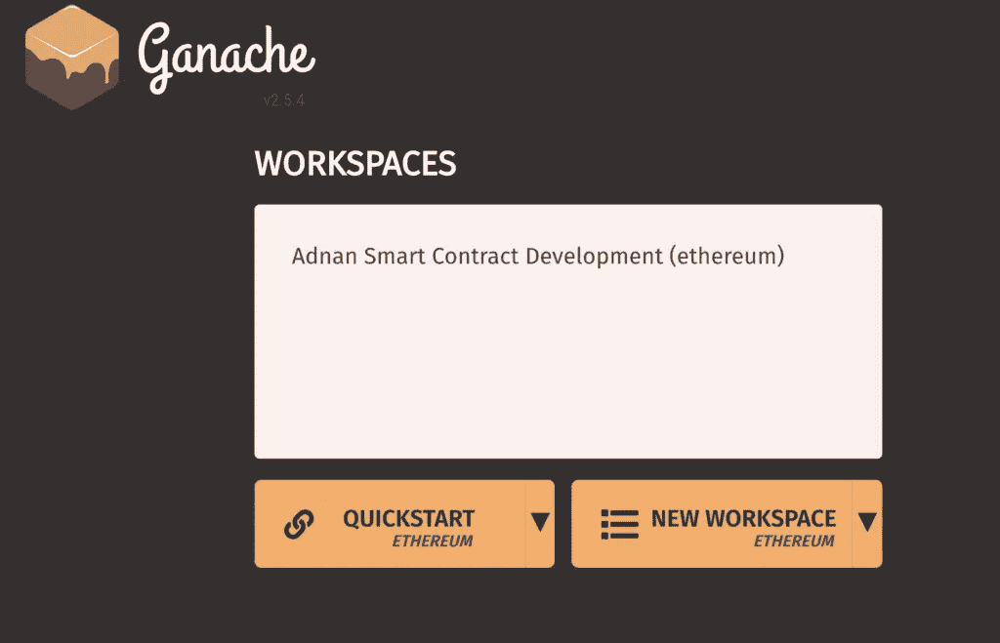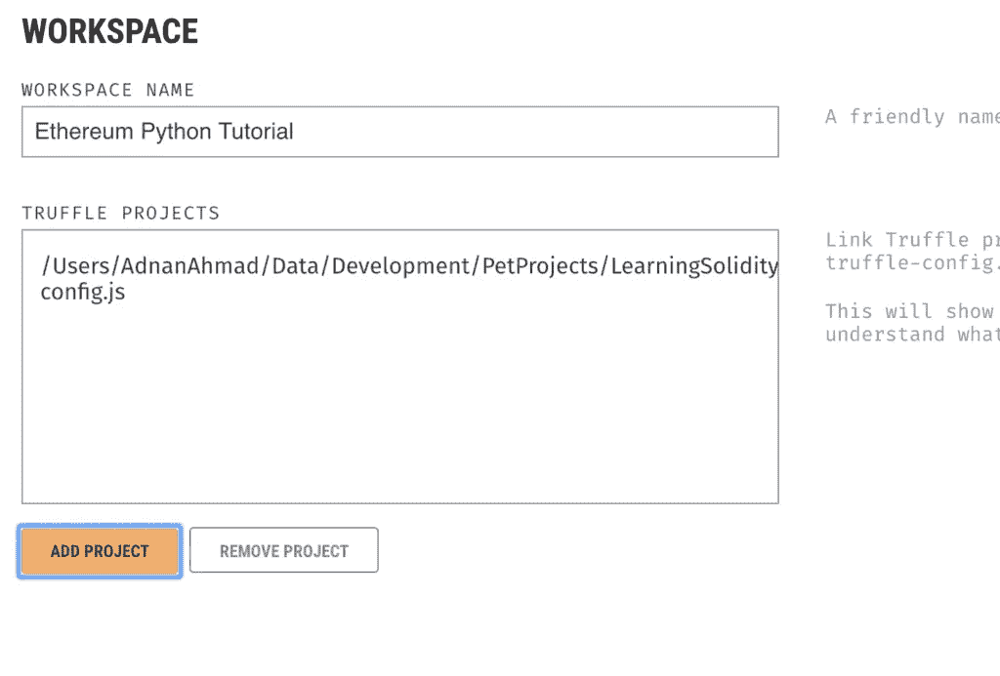

您选择以太坊作为项目类型，然后设置`truffle-config.js`文件所在的目录。完成后，您可以看到如下屏幕:

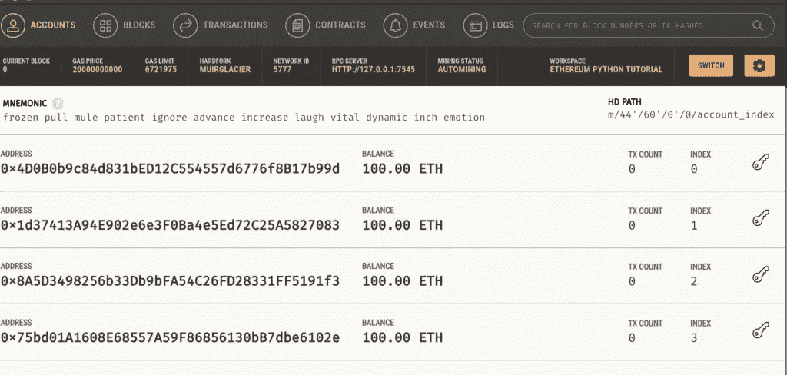

除了可用的以太网地址列表之外，您还可以注意到一些东西，如 gas limit、网络 ID 和 RPC 服务器等。

在*合同*标签下，我创建了一个新文件`FirstContract.sol`，并复制了我们在 Remix IDE 中开发的合同。

在 migrations 文件夹中，您将添加一个文件`2_deploy_contracts.js`并在其中添加以下内容。

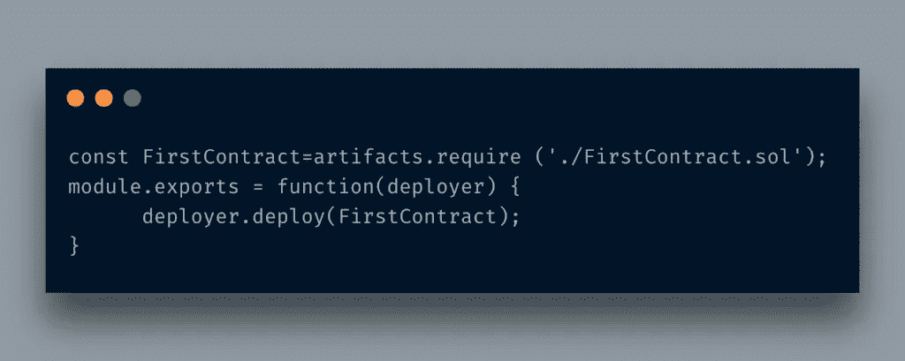

对于从事 RoR、Django 和 Laravel 等框架工作的 web 开发人员来说，术语*迁移*并不新鲜。第一行告诉我们期望的合同文件在哪里。然后将契约实例变量设置为`deploy`方法。你不需要担心，松露会处理好的。只要确保设置了正确的契约路径。一切就绪，现在是时候编译我们的项目了。


如果您注意到它创建了一个新的*构建*文件夹，其中包含两个文件: *FirstContract.json* 和 *Migrations.json.* 前一个文件包含与您想要部署的契约相关的所有信息，比如它的原始源代码、编译的字节码等。

```
"metadata": "{\"compiler\":{\"version\":\"0.5.16+commit.9c3226ce\"},\"language\":\"Solidity\",\"output\":{\"abi\":[{\"constant\":true,\"inputs\":[],\"name\":\"getMsgSender\",\"outputs\":[{\"internalType\":\"address\",\"name\":\"\",\"type\":\"address\"}],\"payable\":false,\"stateMutability\":\"view\",\"type\":\"function\"},{\"constant\":true,\"inputs\":[],\"name\":\"getValue\",\"outputs\":[{\"internalType\":\"uint256\",\"name\":\"\",\"type\":\"uint256\"}],\"payable\":false,\"stateMutability\":\"view\",\"type\":\"function\"},{\"constant\":false,\"inputs\":[{\"internalType\":\"uint256\",\"name\":\"_value\",\"type\":\"uint256\"}],\"name\":\"setValue\",\"outputs\":[],\"payable\":false,\"stateMutability\":\"nonpayable\",\"type\":\"function\"}],\"devdoc\":{\"methods\":{}},\"userdoc\":{\"methods\":{}}},\"settings\":{\"compilationTarget\":{\"/Users/AdnanAhmad/Data/Development/PetProjects/LearningSolidity/SolidityPythonTutorial/contracts/FirstContract.sol\":\"FirstContract\"},\"evmVersion\":\"istanbul\",\"libraries\":{},\"optimizer\":{\"enabled\":false,\"runs\":200},\"remappings\":[]},\"sources\":{\"/Users/AdnanAhmad/Data/Development/PetProjects/LearningSolidity/SolidityPythonTutorial/contracts/FirstContract.sol\":{\"keccak256\":\"0x8f927552ec9dc73acee0143c170c276f19ee1e1a85959b49979ef7f524923ff3\",\"urls\":[\"bzz-raw://ba69d6310ad02e5c74228ea971e184bc5debdfb3e3af280fe43a867b136c83cd\",\"dweb:/ipfs/QmT4HoJ6bSDHqcK2jyciU5CaRqyzZfgFbeTGKfJwWwjPU3\"]}},\"version\":1}",
  "bytecode": "0x608060405234801561001057600080fd5b5061018f806100206000396000f3fe608060405234801561001057600080fd5b50600436106100415760003560e01c8063209652551461004657806355241077146100645780637a6ce2e114610092575b600080fd5b61004e6100dc565b6040518082815260200191505060405180910390f35b6100906004803603602081101561007a57600080fd5b81019080803590602001909291905050506100e5565b005b61009a610130565b604051808273ffffffffffffffffffffffffffffffffffffffff1673ffffffffffffffffffffffffffffffffffffffff16815260200191505060405180910390f35b60008054905090565b33600160006101000a81548173ffffffffffffffffffffffffffffffffffffffff021916908373ffffffffffffffffffffffffffffffffffffffff1602179055508060008190555050565b6000600160009054906101000a900473ffffffffffffffffffffffffffffffffffffffff1690509056fea265627a7a72315820ea770f34255d72ae19ebe6d36b62a54850a9602e70b039c54b29b65dc7cb7f2364736f6c63430005100032",
  "deployedBytecode": "0x608060405234801561001057600080fd5b50600436106100415760003560e01c8063209652551461004657806355241077146100645780637a6ce2e114610092575b600080fd5b61004e6100dc565b6040518082815260200191505060405180910390f35b6100906004803603602081101561007a57600080fd5b81019080803590602001909291905050506100e5565b005b61009a610130565b604051808273ffffffffffffffffffffffffffffffffffffffff1673ffffffffffffffffffffffffffffffffffffffff16815260200191505060405180910390f35b60008054905090565b33600160006101000a81548173ffffffffffffffffffffffffffffffffffffffff021916908373ffffffffffffffffffffffffffffffffffffffff1602179055508060008190555050565b6000600160009054906101000a900473ffffffffffffffffffffffffffffffffffffffff1690509056fea265627a7a72315820ea770f34255d72ae19ebe6d36b62a54850a9602e70b039c54b29b65dc7cb7f2364736f6c63430005100032",
  "sourceMap": "26:367:0:-;;;;8:9:-1;5:2;;;30:1;27;20:12;5:2;26:367:0;;;;;;;",
  "deployedSourceMap": "26:367:0:-;;;;8:9:-1;5:2;;;30:1;27;20:12;5:2;26:367:0;;;;;;;;;;;;;;;;;;;;;;;;;;;;;97:78;;;:::i;:::-;;;;;;;;;;;;;;;;;;;185:100;;;;;;13:2:-1;8:3;5:11;2:2;;;29:1;26;19:12;2:2;185:100:0;;;;;;;;;;;;;;;;;:::i;:::-;;295:86;;;:::i;:::-;;;;;;;;;;;;;;;;;;;;;;;97:78;139:4;163:5;;156:12;;97:78;:::o;185:100::-;244:10;235:6;;:19;;;;;;;;;;;;;;;;;;272:6;264:5;:14;;;;185:100;:::o;295:86::-;341:7;368:6;;;;;;;;;;;361:13;;295:86;:::o",
  "source": "pragma solidity ^0.5.11;\n\ncontract FirstContract {\n    uint value;\n    address sender; \n    \n    function getValue() external view returns(uint) { \n        return value;\n    }\n    \n    function setValue(uint _value) external {\n        sender = msg.sender;\n        value = _value;\n    }\n    \n    function getMsgSender() external view returns(address) { \n        return sender;\n    }\n    \n    \n}",
  "sourcePath": "/Users/AdnanAhmad/Data/Development/PetProjects/LearningSolidity/SolidityPythonTutorial/contracts/FirstContract.sol",
  "ast": {
    "absolutePath": "/Users/AdnanAhmad/Data/Development/PetProjects/LearningSolidity/SolidityPythonTutorial/contracts/FirstContract.sol",
    "exportedSymbols": {
      "FirstContract": [
        37
      ]
    },
```

好吧。现在，我们已经准备好在区块链本地以太坊上部署我们的第一份合同。

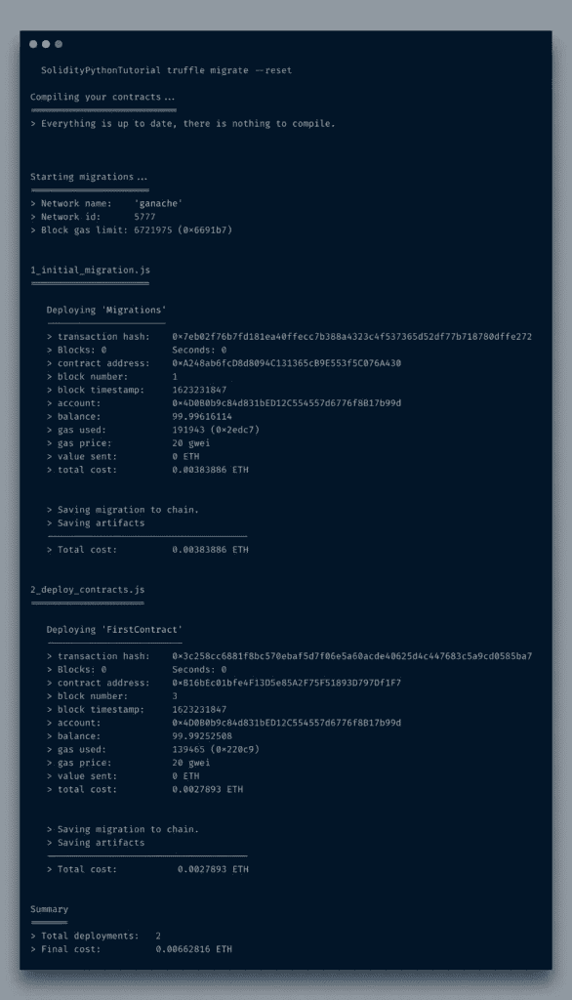

这里没什么需要注意的。嗯，有很多需要注意的地方。您会看到一个事务哈希。这是一个交易，因为你改变了区块链的状态。然后你找到合同地址。实际部署合同的客户。此操作消耗的 eth 和总成本。合同地址非常重要，因为我们将在编写 Python 应用程序时使用它进行交互。您可以在下图中看到 Ganache 中调用的部署和执行。无论你在上面看到什么，你也可以在 Ganache 界面上找到它。

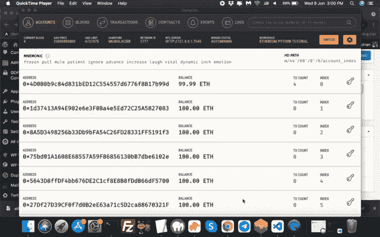

# 智能合约和 Python 集成

我们的智能合同已部署。为了让它变得有用，我们需要某种方式来与不能在区块链运行的应用程序进行交互。幸运的是，Javascript 和 Python 的 Web3 库可以在这里有所帮助。

为了将我们的 Python 应用与基于以太坊的智能合约连接起来，我们将使用 [Web3](https://web3py.readthedocs.io/en/stable/) 库。

`pip install web3`

*web3* 库安装完毕，是时候编写我们的第一段代码了。

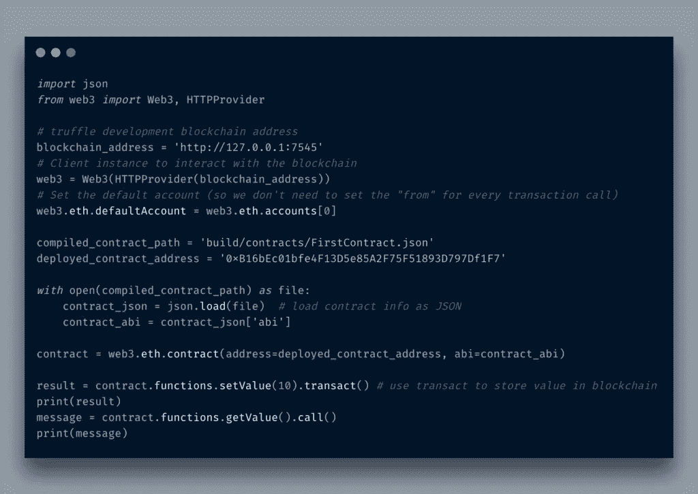

在典型的导入之后，我做的第一件事就是设置以太坊区块链 RPC 服务器地址。这是你可以在 Ganache 的帐户列表界面上找到的地址。RPC 变量被分配给`Web3`构造函数。我还为 Web3 库设置了默认的 ETH 帐户，以便与部署的智能合约进行交互。我做的下一件事是设置包含 ABI 数据的文件的路径。 *ABI* 代表*应用二进制接口*，这是与以太坊区块链交互的标准方式。是的，他们从 API 的东西里拿来的。ABI 不仅有助于提供智能合约和非区块链程序之间的通信，还有助于智能合约之间的通信。你可以在这里了解更多信息。

下一件重要的事情是查看部署的契约地址。您可以从部署后返回的数据中找到它，或者直接转到 Ganache 的 ***合同*** 部分并从那里复制。

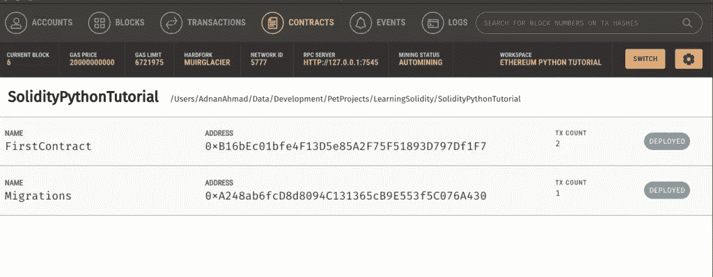

这里可以看到 *FirstContract(0xB16b…)* 的地址，将用于交互。之后，我将文件中的 ABI 部分和部署的契约地址传递给`.contract()`方法。之后，我首先用值调用了`setValue()`函数，然后调用了`getValue()`函数。现在请注意，我在设置值时使用了`transact()`，在从区块链读取值时使用了`call()`，`transact()`改变了正在消耗汽油的区块链的状态，而`call()`只是读取值，根本没有使用汽油，因此不会从钱包中扣除任何金额。

到目前为止一切顺利。如果你想得到事务的事务 hash 或者 txHash 怎么办？您可以执行以下操作:


无论你得到什么值，只要用`hex()`函数得到它的十六进制值，它就是事务的事务哈希值。


你在这里看到的十六进制值是 *txHash* 或 *TX ID* 。您可以通过进入*交易*选项卡或在 Ganache 的搜索栏中搜索来轻松验证。TX IDs 非常有用，因为您可能希望将它存储在数据库中以供审计和其他用途。

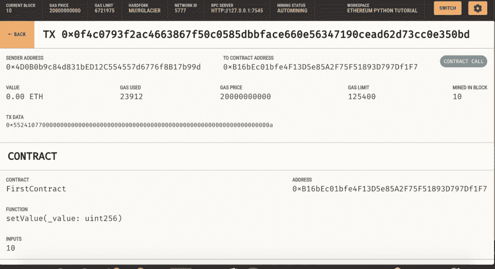

正如您所看到的细节，它还告诉我们执行了什么功能，给出了什么输入。酷不？

# 结论

最后，这个帖子结束。相当长，因为我花了 3 天时间来写它🙂

所以在这篇文章中，我们了解了智能合约的目的，使用 *Solidity* 编写智能合约，然后使用 *Web3.py* 在 Python 应用程序中与智能合约进行通信。*如果你同时拥有钱包的公钥和私钥，Web3.py* 是不错的选择。如果你想让其他人通过网络应用程序使用你的智能合约，而不用交出他们的私钥，那么 *web3.js* 是最好的选择，因为它将与 *Meta Mask* 通信，Chrome 扩展许多人用来连接钱包和 dapp。像往常一样，代码可以在 [Github](https://github.com/kadnan/SolidityPythonTutorial) 获得。

*原载于 2021 年 6 月 11 日*[*http://blog . adnansiddiqi . me*](http://blog.adnansiddiqi.me/develop-and-deploy-your-first-ethereum-smart-contract-with-python/)*。*