# 使用 Amazon Athena 开发用于在 AWS 上查询数据湖的 Spring Boot 应用程序

> 原文：<https://itnext.io/developing-spring-boot-applications-for-querying-data-lakes-on-aws-eeefa298741?source=collection_archive---------0----------------------->

## 了解如何开发云原生的 RESTful Java 服务，使用 Amazon Athena 的 API 在基于 AWS 的数据湖中查询数据

# 介绍

AWS 提供了一系列完全托管的服务，使构建和管理安全的数据湖更快更容易，包括 AWS Lake Formation、AWS Glue 和亚马逊 S3。Amazon EMR、AWS Glue Studio 和 Amazon Redshift 等其他分析服务允许数据科学家和分析师快速、经济地对大量半结构化和结构化数据运行高性能查询。

不太明显的是团队如何开发基于数据湖之上的内部和外部面向客户的分析应用程序。例如，想象一下电子商务平台上的卖家，这篇文章中使用的场景，想要通过分析销售趋势和买家偏好来做出关于他们产品的更好的营销决策。此外，假设分析所需的数据必须从多个系统和数据源聚集；数据湖的理想用例。

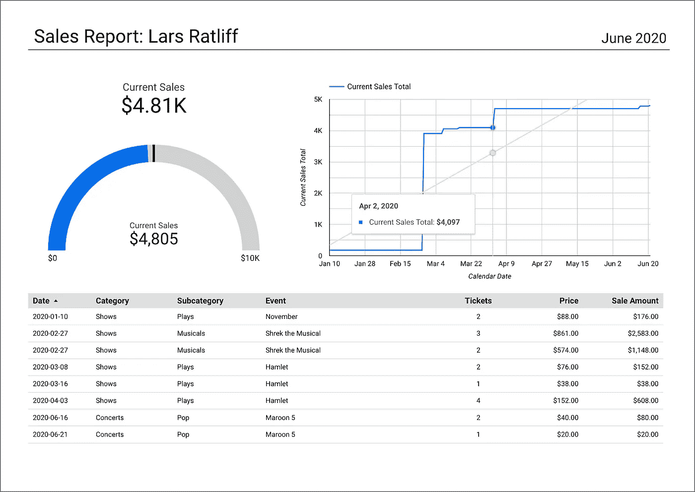

从 Spring Boot 服务的`salesbyseller`端点生成的个性化销售报告示例

在本帖中，我们将探索一个示例 Java[Spring Boot](https://spring.io/projects/spring-boot)RESTful Web 服务，它允许最终用户查询存储在 AWS 上的数据湖中的数据。RESTful Web 服务将使用 Amazon Athena 通过一个 [AWS Glue 数据目录](https://docs.aws.amazon.com/glue/latest/dg/populate-data-catalog.html)访问存储为亚马逊 S3[Apache Parquet](https://parquet.apache.org/)的数据。该服务将使用 Spring Boot 和用于 Java 的[AWS SDK](https://aws.amazon.com/sdk-for-java/)来公开一个安全的 RESTful 应用编程接口(API)。

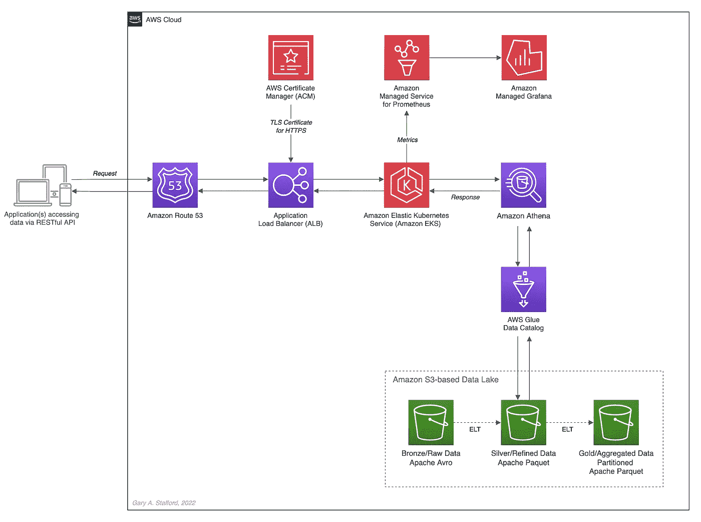

这篇文章展示了高级 AWS 架构

[Amazon Athena](https://aws.amazon.com/athena/) 是基于 [Presto](https://prestodb.io/) 的无服务器交互式查询服务，用于使用标准 SQL 在亚马逊 S3 查询数据和分析大数据。使用 AWS SDK for Java 和 Athena API 公开的 Athena 功能，Spring Boot 服务将演示如何访问[表](https://docs.aws.amazon.com/athena/latest/ug/creating-tables.html)、[视图](https://docs.aws.amazon.com/athena/latest/ug/views.html)、[准备好的语句](https://docs.aws.amazon.com/athena/latest/ug/querying-with-prepared-statements.html)和[保存的查询](https://docs.aws.amazon.com/athena/latest/ug/saved-queries.html)(又名[命名查询](https://docs.aws.amazon.com/athena/latest/APIReference/API_NamedQuery.html))。

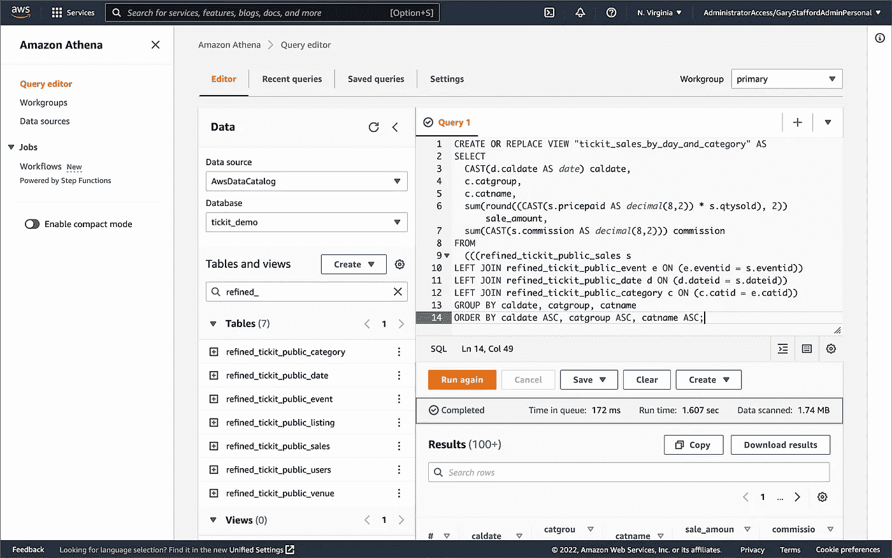

亚马逊雅典娜查询编辑器

# TL；速度三角形定位法(dead reckoning)

在阅读整篇文章之前，您是想探索一下这篇文章的 Spring Boot 服务的源代码，还是想将其部署到 Kubernetes？所有的源代码、Docker 和 Kubernetes 资源都是开源的，可以在 GitHub 上获得。

```
git clone --depth 1 -b main \
    [https://github.com/garystafford/athena-spring-app.git](https://github.com/garystafford/athena-spring-app.git)
```

在 [Docker Hub](https://hub.docker.com/r/garystafford/athena-spring-app/tags) 上还可以看到 Spring Boot 服务的 Docker 图像。

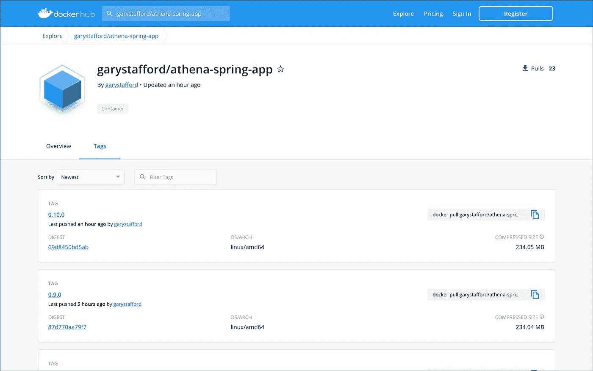

Docker Hub 上提供的 Spring Boot 服务图片

# 数据湖数据源

在 AWS 上构建一个演示数据湖有无穷无尽的数据源。这篇文章使用了由 AWS 提供的 [TICKIT 样本数据库](https://docs.aws.amazon.com/redshift/latest/dg/c_sampledb.html)，它是为 AWS 的云数据仓库服务 Amazon Redshift 设计的。数据库由七个表组成。前两篇文章和相关视频[用 Apache Airflow 在 AWS 上构建数据湖](https://garystafford.medium.com/building-a-data-lake-with-apache-airflow-b48bd953c2b)和[在 AWS 上构建数据湖](https://garystafford.medium.com/building-a-simple-data-lake-on-aws-df21ca092e32)，详细介绍了本文中使用 AWS Glue 和可选的 Apache Airflow 与亚马逊 MWAA 的数据湖的设置。

[](https://garystafford.medium.com/building-a-data-lake-with-apache-airflow-b48bd953c2b) [## 用 Apache 气流构建数据湖

### 使用服务组合，包括 Amazon 管理的工作流，以编程方式在 AWS 上构建一个简单的数据湖…

garystafford.medium.com](https://garystafford.medium.com/building-a-data-lake-with-apache-airflow-b48bd953c2b) [](https://garystafford.medium.com/building-a-simple-data-lake-on-aws-df21ca092e32) [## 在 AWS 上构建数据湖

### 使用服务组合在 AWS 上构建一个简单的数据湖，包括 AWS Glue、AWS Glue Studio、Amazon Athena…

garystafford.medium.com](https://garystafford.medium.com/building-a-simple-data-lake-on-aws-df21ca092e32) 

这两篇文章使用了数据湖模式，将数据分为青铜(*即原始的*)、白银(*即精炼的*)和黄金(*即聚集的*)，并通过[数据块](https://databricks.com/)推广开来。数据湖模拟了一个典型的场景，其中数据来自多个来源，包括一个电子商务平台、一个 CRM 系统和一个必须进行聚合和分析的 SaaS 提供商。

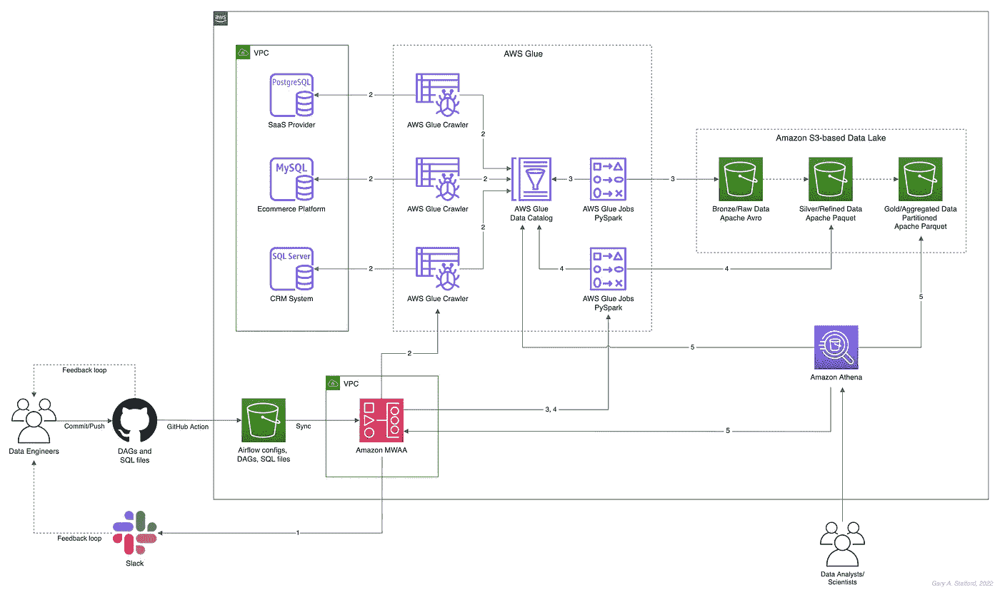

上一篇文章中展示的高级数据湖架构

# 使用智能集成开发的 Spring 项目

尽管不是必需的，我还是使用了 JetBrains IntelliJ IDEA 2022(终极版)来开发和测试邮报的 Spring Boot 服务。用 IntelliJ 引导 Spring 项目很容易。开发人员可以使用 IntelliJ 附带的 Spring Initializr 插件快速创建一个 Spring 项目。

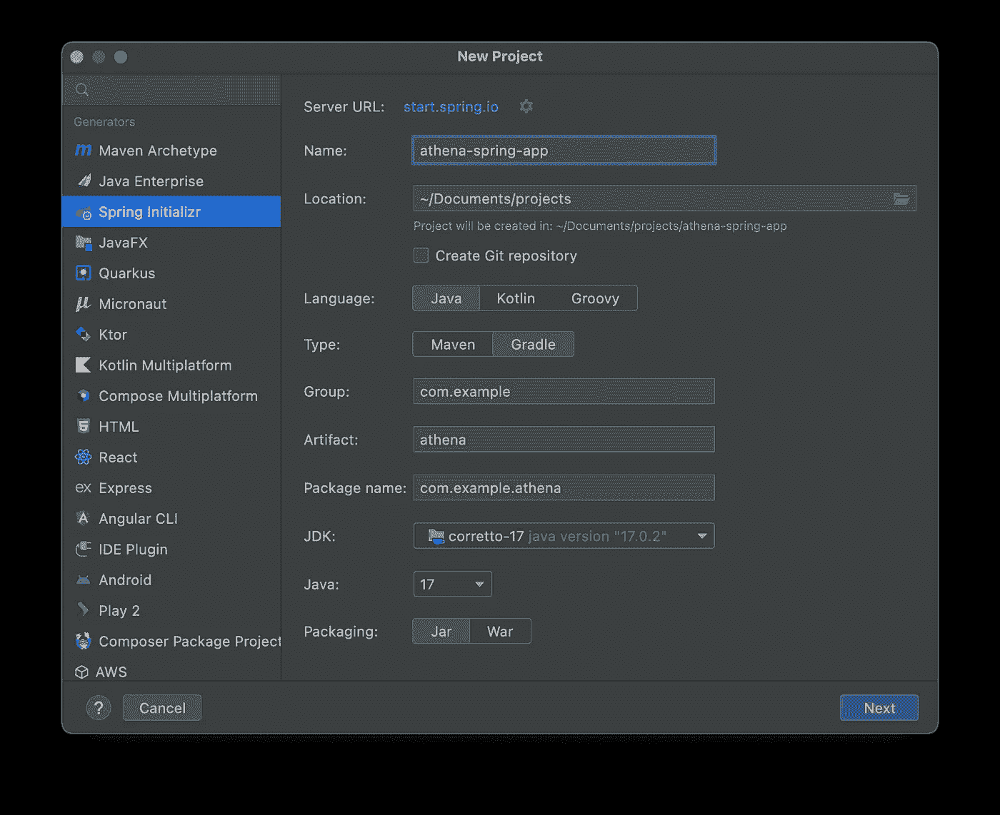

对 Spring 项目的 JetBrains IntelliJ IDEA 插件支持

Spring Initializr 插件的新项目创建向导基于 [start.spring.io](https://start.spring.io/) 。该插件允许您快速选择想要合并到项目中的 Spring 依赖项。

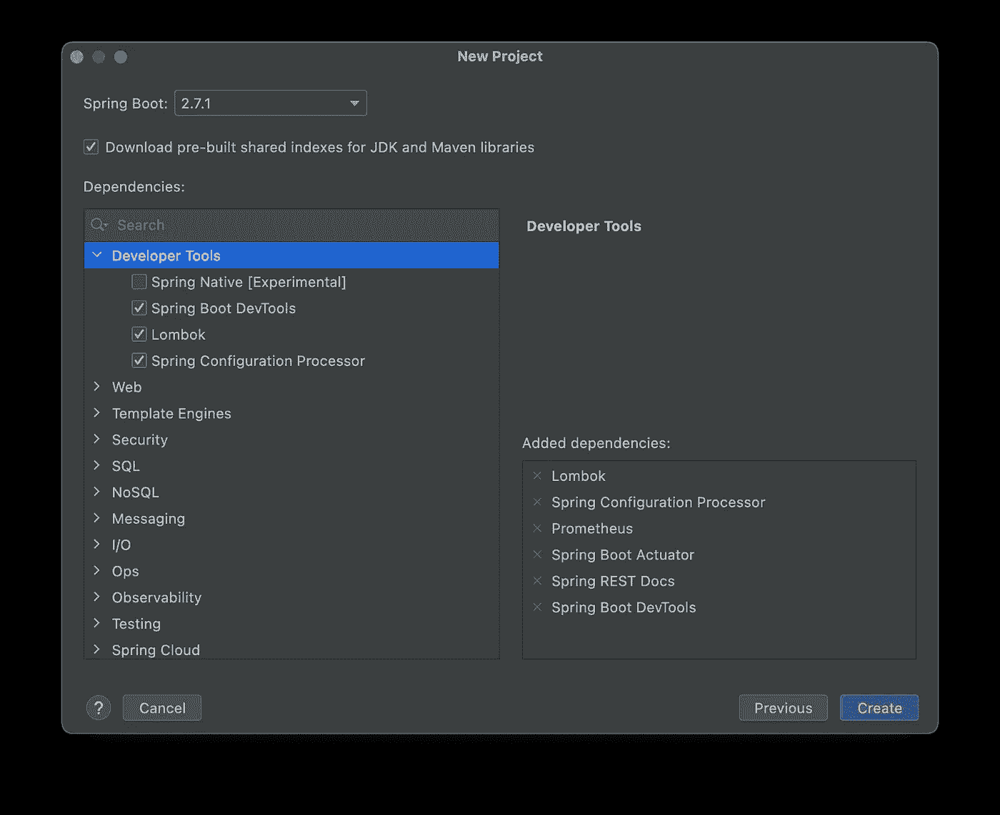

在 IntelliJ 中向新的 Spring 项目添加依赖项

# Visual Studio 代码

流行的 Visual Studio 代码 IDE 也有几个 Spring 扩展，包括微软的 [Spring Initializr Java 支持](https://marketplace.visualstudio.com/items?itemName=vscjava.vscode-spring-initializr)扩展。

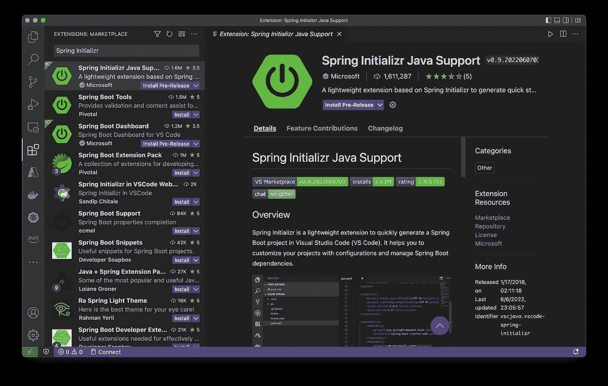

微软对 Visual Studio 代码的扩展

# 格拉德勒

这篇文章使用 Gradle 代替 Maven 来开发、测试、构建、打包和部署 Spring 服务。基于上面显示的新项目设置中选择的包，Spring Initializr 插件的新项目创建向导创建一个`build.gradle`文件。额外的包，如[隆巴克](https://projectlombok.org/)、[千分尺](https://github.com/micrometer-metrics/micrometer)和[放心](https://github.com/rest-assured/rest-assured/wiki/GettingStarted#maven--gradle-users)被单独添加。

# 亚马逊科雷托

Spring boot 服务是为最新版本的[亚马逊 Corretto 17](https://docs.aws.amazon.com/corretto/latest/corretto-17-ug/what-is-corretto-17.html) 开发和编译的。根据 AWS 的说法，亚马逊 Corretto 是一个免费的、多平台的、生产就绪的[开放 Java 开发包](https://openjdk.org/) (OpenJDK)发行版。Corretto 提供长期支持，包括性能增强和安全修复。Corretto 被认证为与 Java SE 标准兼容，并在 Amazon 内部用于许多生产服务。

# 源代码

Spring Boot RESTful Web 服务中的每个 API 端点都有一个对应的 POJO 数据模型类、服务接口和服务实现类以及控制器类。此外，还有一些公共类，如配置、客户端工厂和特定于 Athena 的请求/响应方法。最后，对于视图和准备好的语句，还有额外的类依赖。

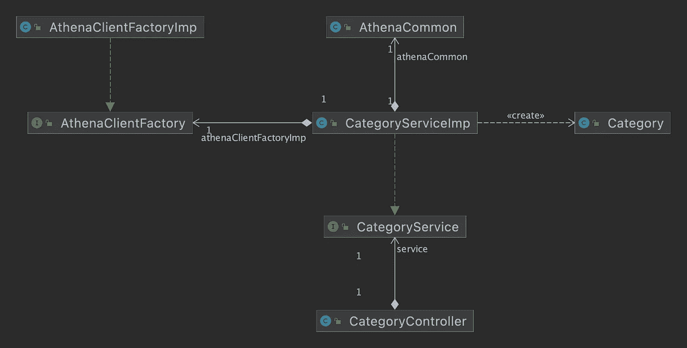

与查询 Amazon Athena `refined_tickit_public_category`表相关的 Java 类关系

项目的源代码按照包和类类型的逻辑层次进行排列。

# 亚马逊雅典娜访问

使用 AWS SDK for Java 访问 Amazon Athena 有三种标准方法:1)使用`[AthenaClient](https://sdk.amazonaws.com/java/api/latest/software/amazon/awssdk/services/athena/AthenaClient.html)`服务客户端，2)使用`[AthenaAsyncClient](https://sdk.amazonaws.com/java/api/latest/software/amazon/awssdk/services/athena/AthenaAsyncClient.html)`服务客户端异步访问 Athena，3)使用 [JDBC 驱动程序](https://docs.aws.amazon.com/athena/latest/ug/connect-with-jdbc.html)和 AWS SDK。`[AthenaClient](https://sdk.amazonaws.com/java/api/latest/software/amazon/awssdk/services/athena/AthenaClient.html)`和`AthenaAsyncClient`服务客户端都是`[software.amazon.awssdk.services.athena](https://sdk.amazonaws.com/java/api/latest/software/amazon/awssdk/services/athena/package-summary.html)`包的一部分。为了简单起见，本文的 Spring Boot 服务使用了`AthenaClient`服务客户端，而不是 Java 的异步编程模型。AWS 提供基本的[代码样本](https://docs.aws.amazon.com/athena/latest/ug/code-samples.html)作为他们文档的一部分，作为使用 SDK 编写 Athena 应用程序的起点。代码示例也使用了`AthenaClient`服务客户端。

# 基于 POJO 的数据模型

对于 Spring Boot RESTful Web 服务中的每个 API 端点，都有一个对应的普通旧 Java 对象(POJO)。根据维基百科的说法，POGO 是一个普通的 Java 对象，不受任何特定限制的约束。POJO 类类似于 JPA 实体，表示存储在关系数据库中的持久数据。在这种情况下，POJO 使用 Lombok 的`@Data`注释。根据文档，这个注释为所有字段生成 getters，一个有用的`toString`方法，以及检查所有非瞬态字段的`hashCode`和`equals`实现。它还为所有非 final 字段和一个构造函数生成 setters。

`Event` POJO 数据模型

每个 POJO 都直接对应于 AWS Glue 数据目录中的一个“银”表。例如，`Event` POJO 对应于`tickit_demo`数据目录数据库中的`refined_tickit_public_event`表。POJO 为从相应的 AWS 粘合数据目录表中读取的数据定义了 Spring Boot 服务的数据模型。

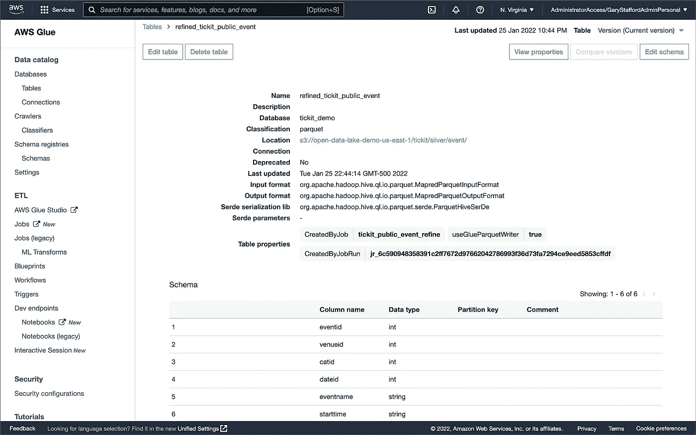

粘附数据目录 refined_tickit_public_event 表

粘合数据目录表是 Athena 查询和存储在亚马逊 S3 对象存储中的底层数据之间的接口。Athena 查询的目标是从 S3 返回底层数据的表。

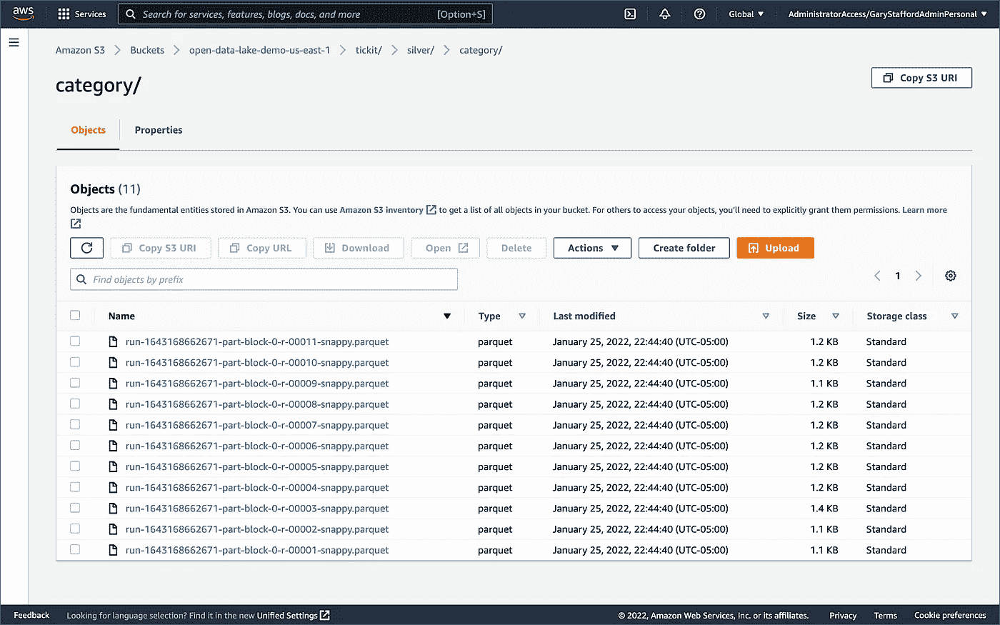

Tickit 类别数据存储为亚马逊 S3 的 Apache Parquet 文件

# 服务

使用 Athena 通过 AWS Glue 从数据湖中检索数据是由一个服务类处理的。对于 Spring Boot RESTful Web 服务中的每个 API 端点，都有相应的服务接口和实现类。服务实现类使用 Spring 框架的`@Service`注释。根据文档，它表明一个带注释的类是一个“服务”，最初由域驱动设计(Evans，2003)定义为“*一个作为独立于模型的接口提供的操作，没有封装的状态。对于 Spring Boot 服务来说，最重要的是，这个注释充当了`@Component`的专门化，允许通过类路径扫描自动检测实现类。*

使用 Spring 的通用[基于构造函数的依赖注入](https://docs.spring.io/spring-boot/docs/2.0.x/reference/html/using-boot-spring-beans-and-dependency-injection.html) (DI)方法(*又名构造函数注入*)，服务自动连接`AthenaClientFactory`接口的一个实例。注意，我们是自动连接服务接口，而不是服务实现，如果需要的话，允许我们连接不同的实现，比如为了测试。

该服务调用`AthenaClientFactory`类的`createClient()`方法，该方法使用几种可用的身份验证方法之一返回到 Amazon Athena 的连接。身份验证方案将取决于服务的部署位置以及您希望如何安全地连接到 AWS。一些选项包括环境变量、本地 AWS 配置文件、EC2 实例配置文件或来自 web 身份提供者的令牌。

服务类将由实例`GetQueryResultsResponse`返回的有效负载转换成有序集合(*也称为序列*)，`List<E>`，其中`E`代表一个 POJO。例如，对于数据湖的`refined_tickit_public_event`表，服务返回一个`List<Event>`。对于表、视图、预处理语句和命名查询，这种模式会重复出现。可以动态转换和格式化列数据类型，添加新列，跳过现有列。

对于控制器类中定义的每个端点，例如`get()`、`findAll()`和`FindById()`，在服务类中都有相应的方法。下面，我们看到了一个在`SalesByCategoryServiceImp`服务类中的`findAll()`方法的例子。这个方法对应于`SalesByCategoryController`控制器类中同名的方法。这些服务方法都遵循一个相似的模式，即基于输入参数构造一个动态 Athena SQL 查询，该查询通过使用`GetQueryResultsRequest`实例的`AthenaClient`服务客户端传递给 Athena。

# 控制器

最后，在 Spring Boot RESTful Web 服务中，每个 API 端点都有一个对应的控制器类。控制器类使用 Spring 框架的`@RestController`注释。根据文档，该注释是一个方便的注释，它本身用`@Controller`和`@ResponseBody`进行了注释。带有该注释的类型被视为控制器，其中默认情况下`@RequestMapping`方法采用`@ResponseBody`语义。

控制器类使用[基于构造函数的依赖注入](https://docs.spring.io/spring-boot/docs/2.0.x/reference/html/using-boot-spring-beans-and-dependency-injection.html) (DI)依赖于相应的服务类应用组件。像上面的服务例子一样，我们自动连接服务接口，而不是服务实现。

控制器负责将有序的 POJOs 集合序列化为 JSON，并在对初始 HTTP 请求的 HTTP 响应正文中返回 JSON 有效负载。

# 查询视图

除了查询 AWS Glue 数据目录表(*又名 Athena 表*)之外，我们还查询视图。根据[文档](https://docs.aws.amazon.com/athena/latest/ug/views.html)，Amazon Athena 中的视图是一个逻辑表，而不是物理表。因此，每次在查询中引用视图时，都会运行定义视图的查询。

为了方便起见，每次 Spring Boot 服务启动时，主`AthenaApplication`类调用`View.java`类的`CreateView()`方法来检查视图`view_tickit_sales_by_day_and_category`的存在。如果该视图不存在，则会创建该视图，所有应用程序最终用户都可以访问该视图。通过服务的`/salesbycategory`端点查询视图。

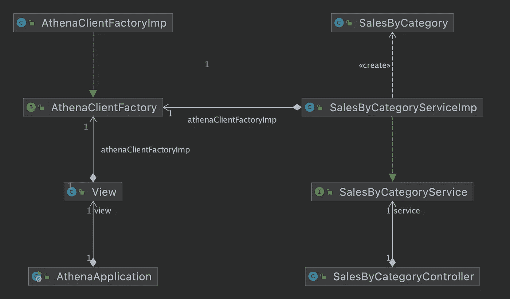

与查询 Amazon Athena 视图相关的 Java 类关系

这种确认或创建模式在主`AthenaApplication`类(下一节中详述的*)的准备好的语句中重复。*

下面，我们看到服务在启动时调用的`View`类。

除了`/salesbycategory`端点查询视图之外，其他一切都与查询表相同。这个端点使用相同的模型-服务-控制器模式。

# 执行预准备语句

根据[文档](https://docs.aws.amazon.com/athena/latest/ug/querying-with-prepared-statements.html)，您可以使用 Athena 参数化查询特性来准备语句，以便使用不同的查询参数重复执行相同的查询。服务使用的准备好的语句`tickit_sales_by_seller`接受单个参数，即销售者的 ID(`sellerid`)。使用`/salesbyseller`端点执行准备好的语句。这个场景模拟了一个分析应用程序的最终用户，他想要检索有关其销售的丰富的销售信息。

查询数据的模式类似于表和视图，只是我们没有使用常见的`SELECT...FROM...WHERE` SQL 查询模式，而是使用了`EXECUTE...USING`模式。

例如，要为 ID 为 3 的销售者执行准备好的语句，我们将使用`EXECUTE tickit_sales_by_seller USING 3;`。我们将销售者的 ID 3 作为路径参数传递，类似于服务公开的其他端点:`/v1/salesbyseller/3`。

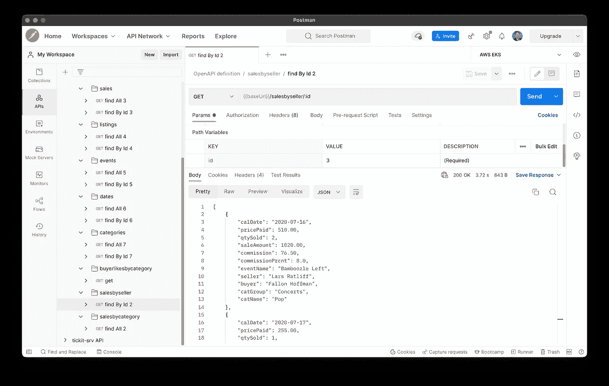

Athena 的 Sales by seller 查询结果使用销售者的 ID 作为预准备语句的参数

同样，除了`/salesbyseller`端点执行一个准备好的语句并传递一个参数之外；其他一切都与查询表或视图相同，使用相同的模型-服务-控制器模式。

# 使用命名查询

除了表、视图和准备好的语句，Athena 还有[保存的查询](https://docs.aws.amazon.com/athena/latest/ug/saved-queries.html)的概念，在 Athena API 中和使用 AWS CloudFormation 时称为[命名查询](https://docs.aws.amazon.com/athena/latest/APIReference/API_NamedQuery.html)。您可以使用 Athena 控制台或 API 来保存、编辑、运行、重命名和删除查询。使用查询的唯一标识符(UUID)来持久化查询。当使用现有的命名查询时，必须引用`NamedQueryId`。

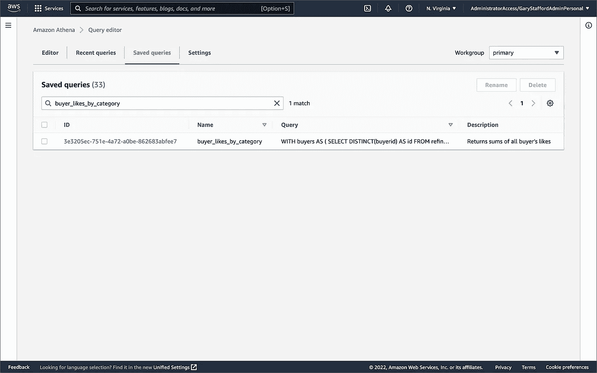

本帖中使用的已保存查询(命名查询)示例

有多种方法可以以编程方式使用和重用现有的命名查询。对于这个演示，我预先创建了命名查询`buyer_likes_by_category`，然后将结果`NamedQueryId`存储为应用程序属性，在运行时或 kubernetes 部署时通过本地环境变量注入。

或者，您可以遍历一个命名查询列表，在启动时找到一个匹配名称的查询。然而，这种方法无疑会影响服务性能、启动时间和成本。最后，您可以在启动时使用包含在未使用的`NamedQuery`类中的`NamedQuery()`这样的方法，类似于 view 和 prepared 语句。该命名查询的惟一属性`NamedQueryId`将作为[系统属性](https://docs.oracle.com/javase/tutorial/essential/environment/sysprop.html)持久化，可由服务类引用。缺点是，每次启动服务时，您都会创建一个命名查询的副本。因此，也不推荐这种方法。

# 配置

负责持久化 Spring Boot 服务配置的两个组件是`application.yml`属性文件和`ConfigProperties`类。该类使用 Spring 框架的`@ConfigurationProperties`注释。根据文档，该注释用于外部化配置。如果您想要绑定和验证一些外部属性(例如，来自`.properties`或`.yml`文件)，请将其添加到`@Configuration`类的类定义或`@Bean`方法中。绑定是通过调用带注释的类上的 setters 来执行的，或者，如果`@ConstructorBinding`正在使用，通过绑定到构造函数参数来执行。

`[@ConfigurationPropert](http://twitter.com/ConfigurationPropert)ies`标注包括`athena`的`prefix`。该值对应于`application.yml`属性文件中的`athena`前缀。`ConfigProperties`类中的字段被绑定到`application.yml`中的属性。例如，属性`namedQueryId`被绑定到属性`athena.named.query.id`。此外，该属性被绑定到外部环境变量`NAMED_QUERY_ID`。这些值可以由外部配置系统、Kubernetes 秘密或外部秘密管理系统提供。

# AWS IAM:验证和授权

为了让 Spring Boot 服务与 Amazon Athena、AWS Glue 和 Amazon S3 进行交互，您需要建立一个 AWS IAM 角色，一旦通过身份验证，服务就会承担这个角色。该角色必须与包含必需的 Athena、Glue 和 S3 权限的附加 IAM 策略相关联。对于开发，该服务使用类似于下面所示的策略。请注意，该政策比建议的生产范围更广；它不代表最低特权的安全最佳实践。特别是，在创建策略时，应该严格避免对资源使用过于宽泛的`*`。

除了 IAM 策略授予的授权之外， [AWS Lake Formation](https://aws.amazon.com/lake-formation/) 可以与亚马逊 S3、AWS Glue 和亚马逊 Athena 一起使用，以授予对数据集的细粒度数据库级、表级、列级和行级访问。

# Swagger UI 和 OpenAPI 规范

查看和试验通过控制器类可用的所有端点的最简单方法是通过`[springdoc-openapi](https://springdoc.org/)` Java 库使用示例 Spring Boot 服务中包含的 Swagger UI。在`/v1/swagger-ui/index.html`访问 Swagger UI。

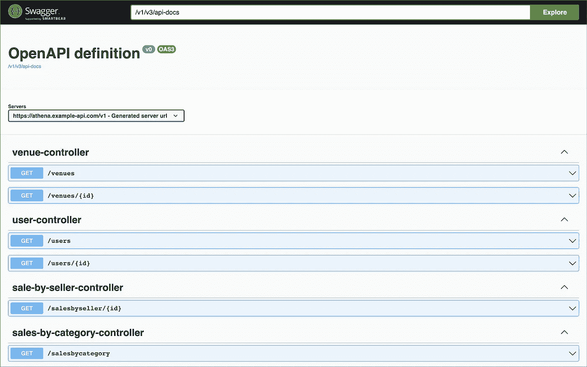

显示由服务的控制器类公开的端点的 Swagger UI

OpenAPI 规范(以前的 Swagger 规范)是 REST APIs 的 API 描述格式。`/v1/v3/api-docs`端点允许您生成一个 [OpenAPI v3 规范](https://github.com/OAI/OpenAPI-Specification/blob/main/versions/3.0.0.md)文件。OpenAPI 文件描述了整个 API。


Spring Boot 服务的 OpenAPI v3 规范

[OpenAPI v3 规范](https://github.com/OAI/OpenAPI-Specification/blob/main/versions/3.0.0.md)可以保存为文件，并导入到像 [Postman](https://www.postman.com/) 这样的应用程序中，这是一个用于构建和使用 API 的 API 平台。

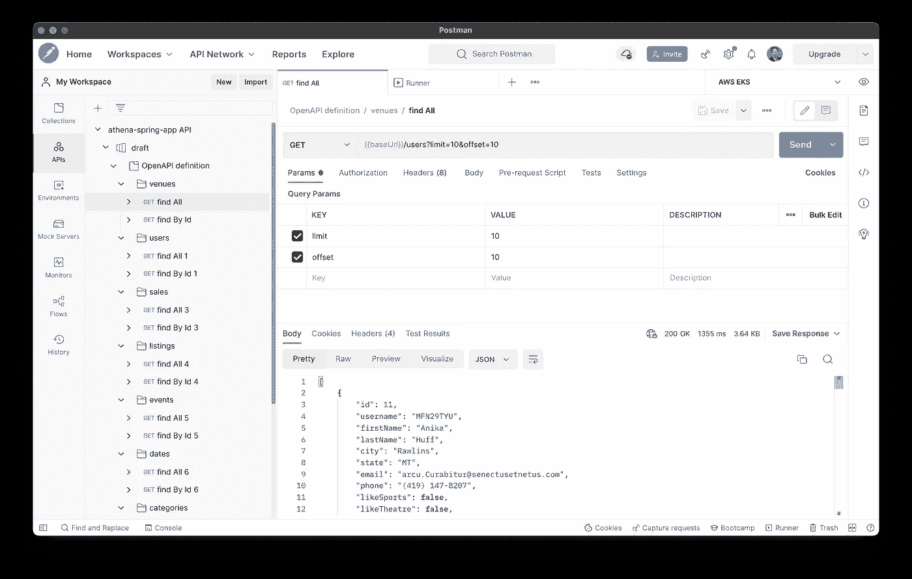

使用 Postman 调用服务的`/users` API 端点

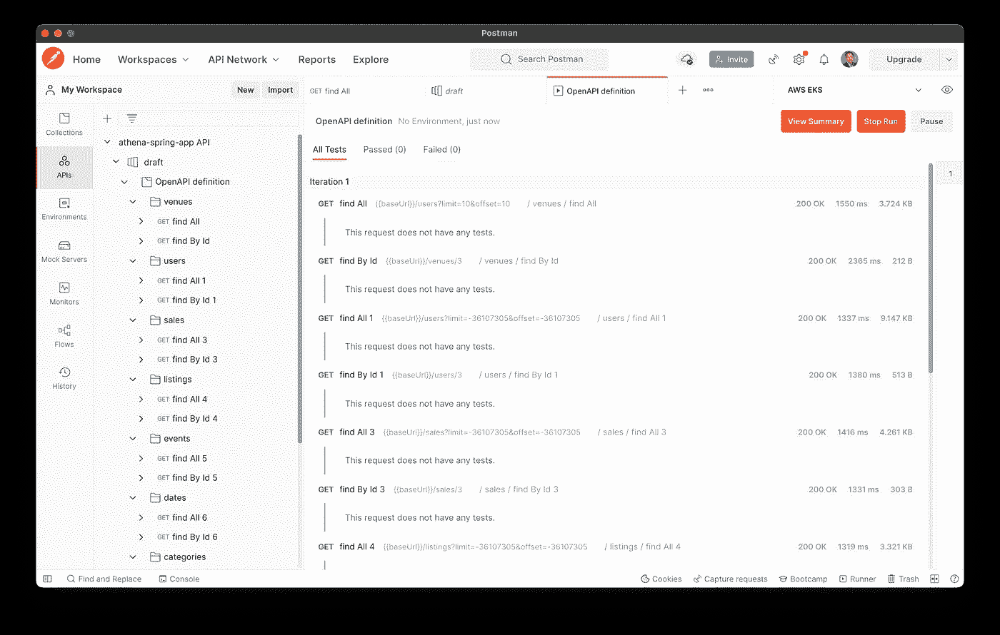

使用 Postman 对 Spring Boot 服务运行一套集成测试

# 集成测试

Spring Boot 服务的源代码中包括有限数量的集成测试示例，不要与单元测试混淆。每个测试类都使用 Spring 框架的`[@SpringBootTest](https://docs.spring.io/spring-boot/docs/current/api/org/springframework/boot/test/context/SpringBootTest.html)`注释。根据[文档](https://docs.spring.io/spring-boot/docs/current/api/org/springframework/boot/test/context/SpringBootTest.html)，这个注释可以在运行基于 Spring Boot 的测试的测试类上指定。它提供了常规 Spring `TestContext`框架之外的几个特性。

集成测试使用[放心](https://rest-assured.io/)的测试时给定模式，作为[行为驱动开发](http://dannorth.net/introducing-bdd/) (BDD)的一部分而流行。此外，每个测试都使用 JUnit 的`@Test`注释。根据文档，这个注释表明被注释的方法是一个测试方法。因此，使用此批注的方法不能是私有的或静态的，并且不能返回值。

使用 Gradle 从项目的根:`./gradlew clean build test`运行集成测试。一个详细的“测试总结”以 HTML 格式生成在项目的`build`目录中，以便于审查。

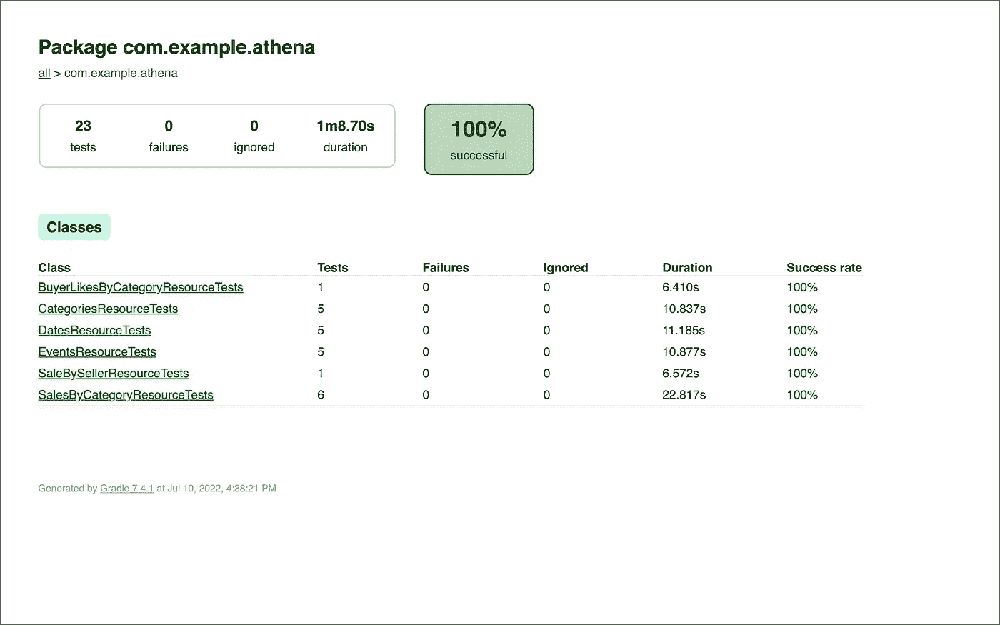

测试详情

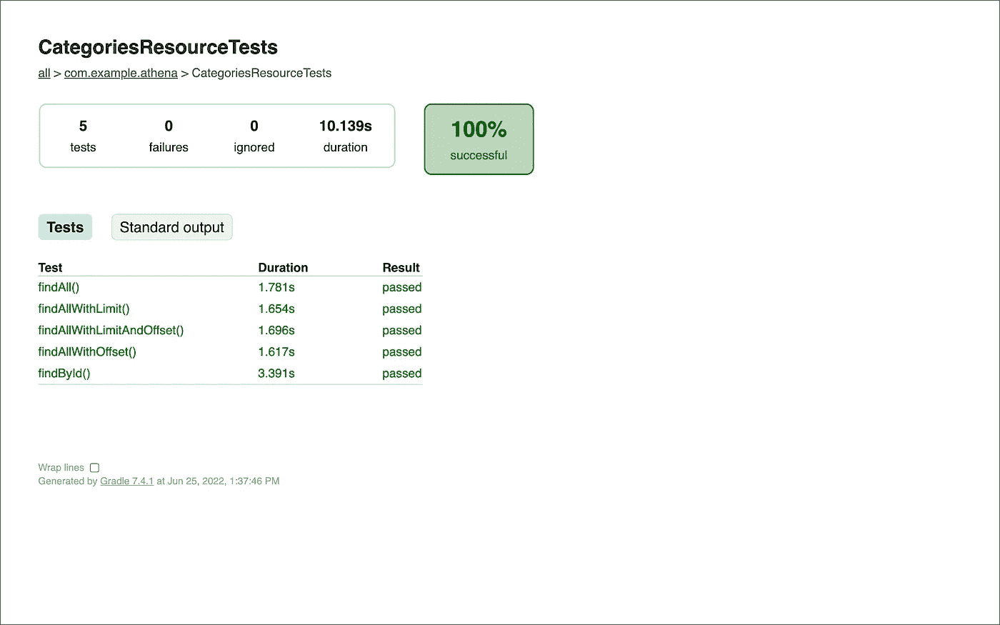

测试详情

# 对服务进行负载测试

在生产中，Spring Boot 服务将需要处理多个并发用户对 Amazon Athena 执行查询。

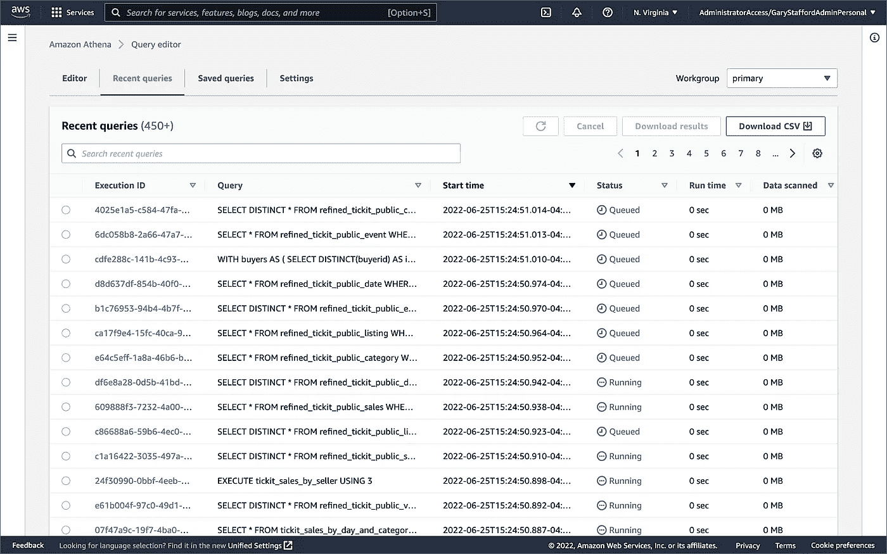

Athena 的最近查询控制台显示了正在排队和执行的多个并发查询

我们可以使用各种负载测试工具来评估服务处理多个并发用户的能力。其中最简单的一个是我最喜欢的基于 go 的实用程序`[hey](https://github.com/rakyll/hey)`，它在提供的并发级别中使用提供的请求数量将负载发送到 URL，并打印统计数据。它还支持 HTTP2 端点。例如，我们可以使用`hey`对 Spring Boot 服务的`/users`端点执行 500 个并发级别为 25 的 HTTP 请求。《邮报》的集成测试是针对部署在亚马逊 EKS 的三个 Kubernetes 服务副本进行的。

```
hey -n 500 -c 25 -T "application/json;charset=UTF-8" \
  -h2 [https://athena.example-api.com/v1/users](https://athena.example-api.com/v1/users)
```

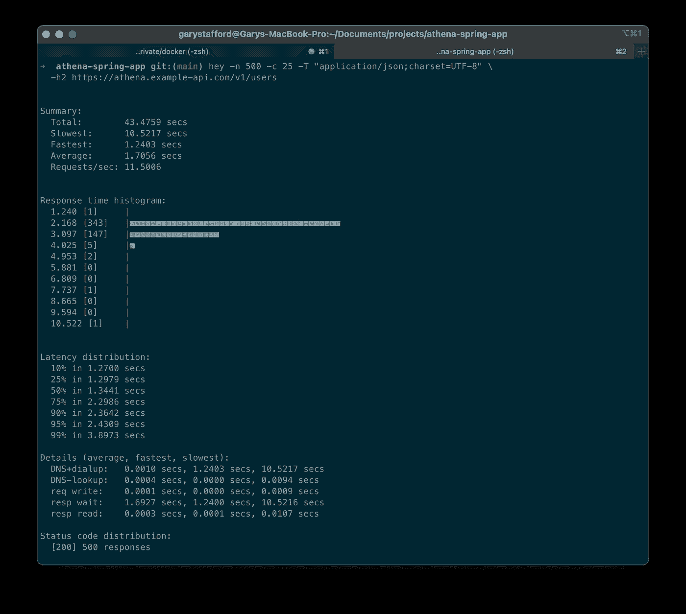

从 Athena 的最近查询控制台，我们看到许多并发查询正在排队，并由一个`hey`通过 Spring Boot 服务的端点执行。

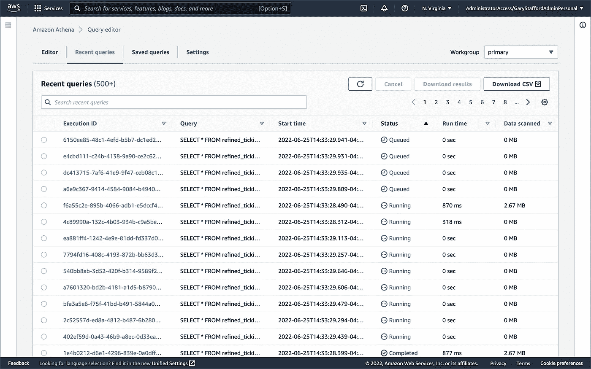

Athena 的最近查询控制台显示正在排队和执行的同步查询

# 韵律学

Spring Boot 服务实现了`[micrometer-registry-prometheus](https://quarkus.io/guides/micrometer)`扩展。微米度量库公开了运行时和应用度量。[千分尺](https://micrometer.io/)定义了一个核心库，提供了度量和核心度量类型的注册机制。这些指标由服务的`/v1/actuator/prometheus`端点公开。

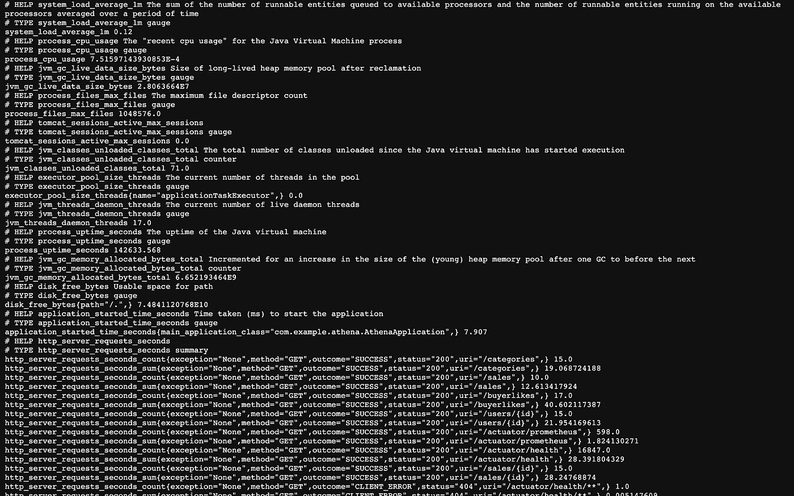

使用 Prometheus 端点公开的指标

使用千分尺扩展，由`/v1/actuator/prometheus`端点暴露的指标可以通过工具如[普罗米修斯](https://prometheus.io/)刮取和可视化。方便的是，AWS 为普罗米修斯(AMP) 提供完全托管的[亚马逊托管服务，该服务可以轻松与亚马逊 EKS 集成。](https://docs.aws.amazon.com/grafana/latest/userguide/prometheus-data-source.html)

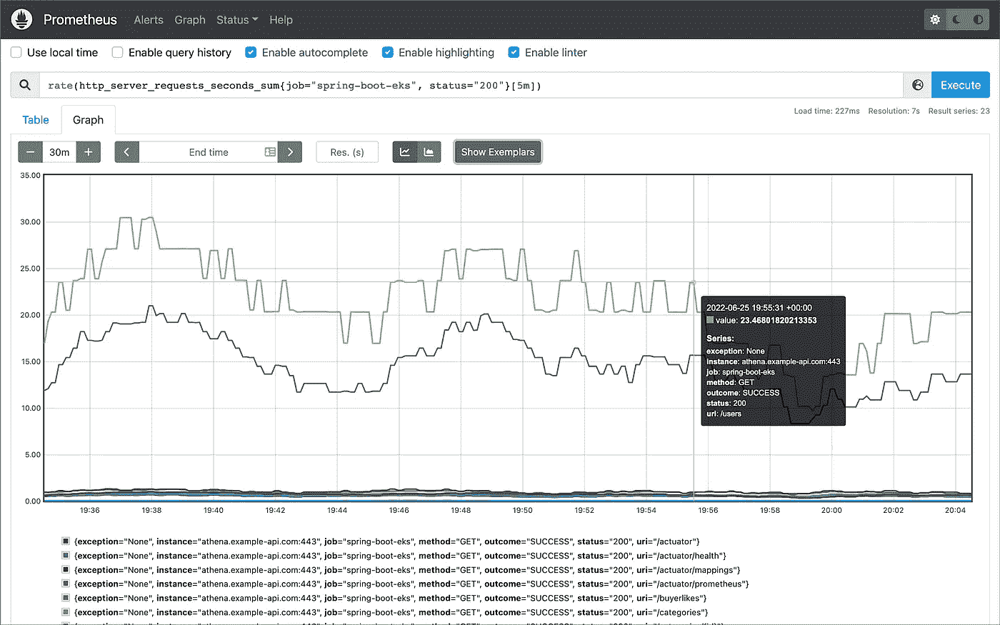

Prometheus 从 Spring Boot 服务收集的 HTTP 服务器请求的图形

使用 Prometheus 作为数据源，我们可以在 [Grafana](https://grafana.com/) 中构建仪表板来观察服务的指标。像 AMP 一样，AWS 也提供完全管理的[亚马逊管理的 Grafana](https://aws.amazon.com/grafana/) (AMG)。

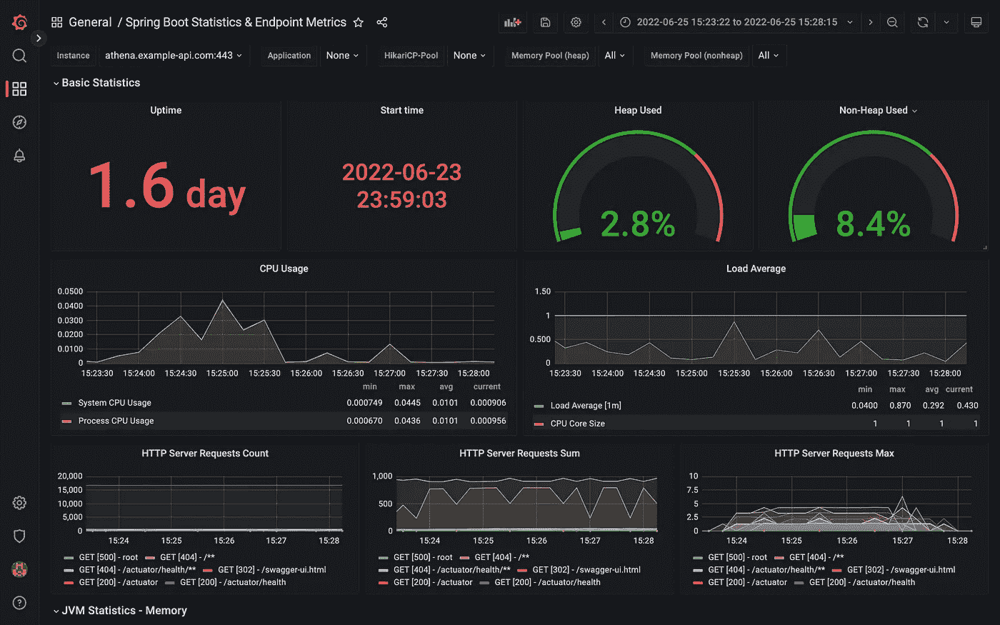

Grafana 仪表板显示部署到亚马逊 EKS 的普罗米修斯 Spring Boot 服务的指标

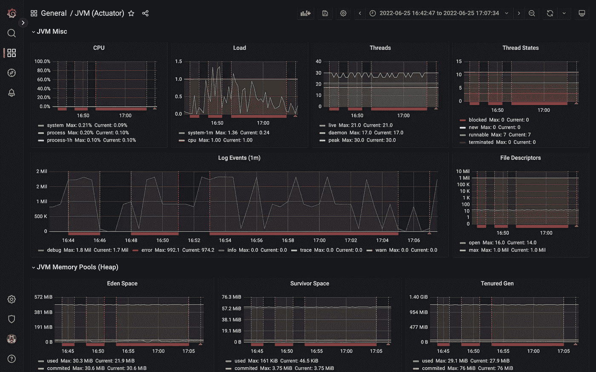

Grafana 仪表板显示部署到亚马逊 EKS 的 Prometheus for Spring Boot 服务的 JVM 指标

# 结论

这篇文章告诉我们如何创建一个 Spring Boot RESTful Web 服务，允许终端用户应用程序安全地查询存储在 AWS 上的数据湖中的数据。该服务使用 AWS SDK for Java，通过使用 Amazon Athena 的 AWS Glue 数据目录来访问存储在亚马逊 S3 的数据。

这篇博客代表我自己的观点，而不是我的雇主亚马逊网络服务公司(AWS)的观点。所有产品名称、徽标和品牌都是其各自所有者的财产。除非另有说明，所有图表和插图都是作者的财产。