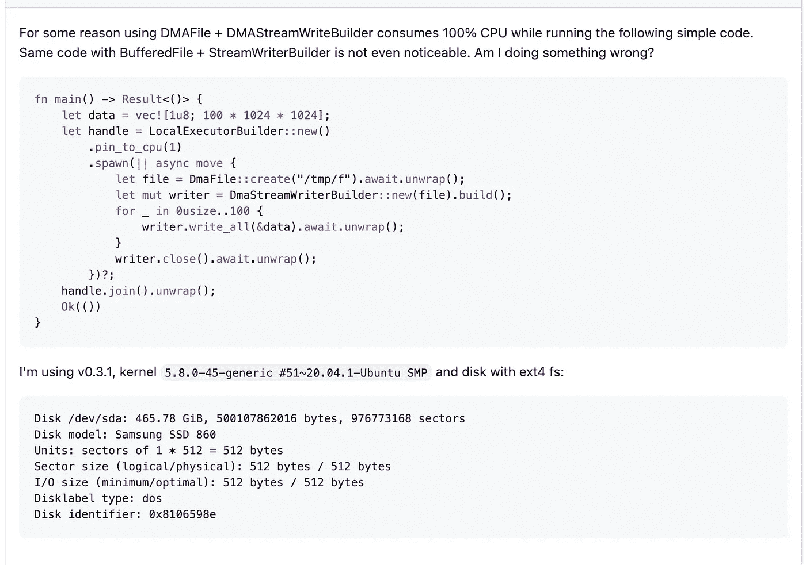

# 直接 I/O 写入:提高信用评分的最佳方式。

> 原文：<https://itnext.io/direct-i-o-writes-the-best-way-to-improve-your-credit-score-bd6c19cdfe46?source=collection_archive---------0----------------------->


我最近写了[关于存储技术的重大变化如何改变如何处理存储 I/O 的传统知识。文章的中心论点很简单:随着快速 NVMe 设备变得普遍，软件层的影响变得更大。为存储访问以数百毫秒为单位的时代设计的旧思想和 API 应该被重新审视。](/modern-storage-is-plenty-fast-it-is-the-apis-that-are-bad-6a68319fbc1a)

特别是，我研究了缓冲 I/O 的想法，在缓冲 I/O 中，操作系统代表用户缓存数据页，应该总是比直接 I/O 好，在直接 I/O 中，不发生这种缓存。一旦我们使用现代 API，情况就完全不同了。事实上，在使用 Glommio `io_uring`异步执行器执行 Rust 的例子中，大多数情况下，直接 I/O 读取比缓冲 I/O 执行得*更好*。

但是写呢？在本文中，我们将看看写操作的问题，它与读操作有何不同，并说明就像信用卡债务一样，缓冲的 I/O 写操作只是提供了廉价财富的假象。在某些时候，你还是要买单。另一方面，真正的财富来自直接 I/O。

# 读取和写入有何不同？

读和写在特性上不同的事实不应该让任何人感到惊讶:这在计算机科学中是一件常见的事情，也是近年来不可变数据结构趋势的背后原因。

然而，关于存储设备，有一个公开的秘密特别令人震惊:


***根本不可能向存储设备发出原子写入。*** 至少在实践中没有。这篇 stackoverflow 文章很好地总结了这种情况，我也推荐这篇[LWN.net](https://lwn.net/Articles/789600/)文章，它讨论了一些 Linux 文件系统开发人员正在讨论的改变，以改善这种情况。

对于固态硬盘来说，情况很无奈。对 NVMe 来说，这要好得多:规范中有原子写的规定，但是即使所有的设备都实现了原子写(他们没有实现)，仍然有大量的设备需要运行软件，而这些设备是完全不可用的。

由于这个原因，在应用程序中，写到文件中间是非常罕见的*，即使它们真的发生了，也往往伴随着一个[](https://en.wikipedia.org/wiki/Transaction_log)**，*日志，这在本质上是连续的。**

**这有两个直接后果:**

1.  **仅附加数据结构极大地主导了存储写入。大多数写优化的现代存储都建立在 [LSM 树](https://en.wikipedia.org/wiki/Log-structured_merge-tree)之上，甚至使用更传统的数据结构(如 B 树)的工作负载也会有一个日志和/或其他技术来确保数据被可靠地写入。**
2.  **通常有一个内存缓冲区，用于在写入传递到文件之前累积写入:这保证了在写入发生时对文件状态的某种程度的控制。例如，如果我们要直接写入一个 mmap 文件，刷新可能在任何时候发生，我们根本不知道文件处于哪种状态。虽然我们确实可以强制一个最大的*时间来与像`msync`这样的专门系统调用同步，但是操作系统可能不得不强制刷新，因为在此之前的任何时间点都有内存压力。***

**这意味着合并并不适用于写入，而合并是缓冲的常见优势。对于大多数现代数据结构来说，没有什么理由在内存中保留一个缓冲区来等待下一次访问:除了将来的读取，发送到文件的内容可能再也不会被触及。在这一点上，我在[阅读的文章](/modern-storage-is-plenty-fast-it-is-the-apis-that-are-bad-6a68319fbc1a)中的计算适用。下一次写入可能是针对文件中的下一个位置。**

**这更有利于直接 I/O。预计将来会使用最近写入的页面，缓冲的 I/O 可能会使用操作系统页面缓存中的大量内存。虽然这确实是*缓存的*内存，但在丢弃之前，需要先将该内存写入设备。如果设备不够快，我们很容易就会耗尽内存。这是我以前写过的关于[的问题](https://www.scylladb.com/2016/12/15/sswc-part1/)。**

**因为我们可以写一个完整的万亿字节大小的文件，而只在内存中保留几千字节，所以直接 I/O 是写入文件的无可争议的方式。**

# **但是直接 I/O 的成本是多少呢？**

**与读取非常相似，您需要确保测量的是正确的东西，以实现直接 I/O 的优势。如何做到这一点还远不明显。**

**最近，我们的一位用户在我们的 Github 页面上发表了一篇文章，他在文章中指出，尽管我们做了宣传，但直接 I/O 写入比缓冲写入消耗了更多的 CPU。为什么会这样呢？**

****

**原因是:缓冲写入就像贷款:你现在可以廉价获得你的资产，但你必须在未来连本带利地偿还。当您发出一个直接 I/O 写操作时，您立即支付了与事务相关的大部分成本，并且是在调度 I/O 的 CPU 中，这是可预测的。对于缓冲的 I/O，情况有所不同:唯一需要立即支付的成本是非常便宜的内存写入。**

**使数据持久化的实际工作是在内核线程中完成的。这些内核线程可以在其他 CPU 中自由运行，因此在一个远离饱和点的简单系统中，这可能会给用户带来便宜访问的*幻觉*。**

**就像贷款一样，在某些情况下，这肯定会对你有利。然而，在实践中，这种情况会在不可预测的时间发生，并且在将来可能会很不方便。**

**除了这种不可预测性，为了做出正确的决定，人们至少需要意识到这样一个事实:贷款的总成本*可能会更高。通常情况下，在饱和或接近饱和时，*所有的*CPU 都很忙，在这种情况下，总成本更重要。***

*如果我们使用`time`命令来测量用户提供的相同代码的直接 I/O 与缓冲版本，并关注系统和用户时间，我们得到:*

*直接输入输出:*

```
*user 0m7.401s
sys 0m7.118s*
```

*和缓冲 I/O:*

```
*user	0m3.771s
sys	0m11.102s*
```

*现在我们知道了:缓冲 I/O 版本所做的只是将用户时间切换到系统时间。因为内核线程消耗了系统时间，这可能更难看到，我们可以得到这样的错觉，即缓冲写入消耗的 CPU 更少。*

*但是，如果我们总结用户和系统时间，我们可以清楚地看到，实际上我们最终支付了贷款的利息:缓冲写入比直接 I/O 写入多使用了 1.7%的 CPU。这实际上与我信用卡的月利率相差不远。如果这是一个令人震惊的巧合，还是一个大阴谋，由你，读者，来决定。*

# *但是哪个更快呢？*

*许多用户很乐意支付一定比例的 CPU 时间来获得更快的结果。但是如果我们看看上面例子中的实时，直接 I/O 不仅更便宜，而且更快。*

*你会注意到在示例代码中，用户正确地发出了对`close.`的调用，默认情况下，Glommio 的流关闭[意味着同步](https://docs.rs/glommio/0.4.1/glommio/io/struct.DmaStreamWriterBuilder.html#method.with_sync_on_close_disabled)。但不仅如此，在其他语言和框架中，大多数时候都不是这样。特别是对于 Posix，*关闭*并不意味着*同步*。*

*这意味着，即使你写完所有的缓冲区，并关闭你的文件，你的数据可能仍然不会安全地出现在设备的媒体！然而，令人惊讶的是，即使您使用直接 I/O，数据也不会被安全地存储。这是因为直接 I/O 会立即将数据写入设备，但存储设备有自己的内部缓存。并且在断电的情况下，如果这些高速缓存没有被持久化，数据仍然可能丢失。*

*此时，我们有理由问:如果同步对于缓冲写入和直接 I/O 都是必要的，那么直接 I/O 真的有优势吗？为了研究这种行为，我们可以使用 Glommio 的[示例存储基准](https://github.com/DataDog/glommio/blob/master/examples/storage.rs)。*

*首先，我们将写一个比内存小的文件，并且不发出 sync。人们很容易认为缓冲 I/O 更快。如果我们在具有 64gb DRAM 的服务器中写入 4gb 文件，我们会看到以下内容:*

```
*Buffered I/O: Wrote 4.29 GB in 1.9s, 2.25 GB/s
Direct   I/O: Wrote 4.29 GB in 4.4s, 968.72 MB/s*
```

*缓冲 I/O 的速度提高了一倍多！这是因为与内存相比，这个文件太小了，所以它可以一直放在内存中。但是，在这一点上，您的数据根本没有安全地提交到存储中。如果我们考虑到在我们的同步调用返回之前的安全时间，设置成本、缺乏并行性、映射和其他成本[在分析读取](/modern-storage-is-plenty-fast-it-is-the-apis-that-are-bad-6a68319fbc1a?source=your_stories_page-------------------------------------)时开始显示:*

```
*Buffered I/O: Wrote 4.29 GB in 1.9s, 2.25 GB/s
Buffered I/O: Closed in 4.7s, Amortized total 642.54 MB/sDirect   I/O: Wrote 4.29 GB in 4.4s, 968.72 MB/s
Direct   I/O: Closed in 34.9ms, Amortized total 961.14 MB/s*
```

*正如我们所见，缓冲 I/O 贷款给我们带来了财富的幻觉。一旦我们不得不支付账单，直接 I/O 更快，我们更富有。如前所述，同步直接 I/O 文件不是免费的:但 35 毫秒后，我们可以预见地保证它是安全存储的。相比之下，缓冲 I/O 的时间超过 4 秒。*

*随着文件变大，事情开始发生变化。这是因为操作系统虚拟内存压力更大。随着文件大小的增长，操作系统不再能够承受等到文件末尾才发出刷新的奢侈。如果我们现在写一个 16 GiB、一个 32Gib 和一个 64Gib 的文件，我们会发现缓冲 I/O 和直接 I/O 之间虚幻的差别也开始消失*

```
*Buffered I/O: Wrote 17.18 GB in 10.4s, 1.64 GB/s
Buffered I/O: Closed in 11.8s, Amortized total 769.58 MB/sBuffered I/O: Wrote 34.36 GB in 29.9s, 1.15 GB/s
Buffered I/O: Closed in 12.2s, Amortized total 814.85 MB/sBuffered I/O: Wrote 68.72 GB in 69.4s, 989.7 MB/s
Buffered I/O: Closed in 12.3s, Amortized total 840.59 MB/s*
```

*在上述所有情况下，直接 I/O 以大约 960MB/s 的速度保持写入，这是这个特定设备的最大吞吐量。*

*一旦文件变得比内存更大，那么就没有更多的伪装了:无论从哪个角度看，直接 I/O 都更快。*

```
*Buffered I/O: Wrote 107.37 GB in 113.3s, 947.17 MB/s
Buffered I/O: Closed in 12.2s, Amortized total 855.03 MB/sDirect   I/O: Wrote 107.37 GB in 112.1s, 957.26 MB/s
Direct   I/O: Closed in 43.5ms, Amortized total 956.89 MB/s*
```

# *结论*

*获得信贷并不坏。很多时候，这对于积累财富至关重要。然而，我们需要关注总成本，确保利率合理，确保我们正在创造真实的财富，而不是虚幻的财富。*

*当在现代存储设备上写入文件时，同样适用。一开始我们可以以低廉的价格发行它们，但我们以后肯定会付出真正的成本——包括利息。这是否是一件好事，当然要视情况而定。但是，由于利率很高，而且如果你写的速度超过了设备能消化的速度，内存有可能失控，缓冲的 I/O 很容易变成次优。直接 I/O 具有固定的内存使用量和更便宜的 CPU 成本，是 AAA 级。*

*我希望这篇文章能让你做出更好的选择，这样你就能积累真正的存储财富。*