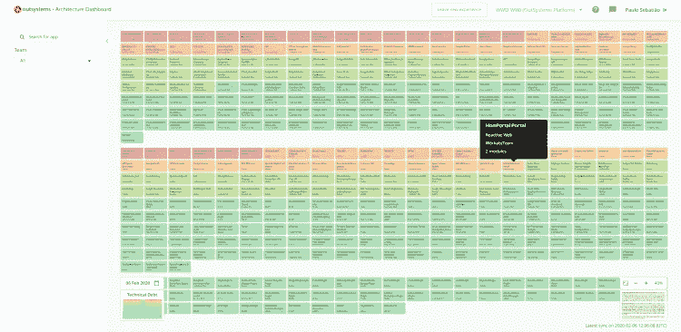
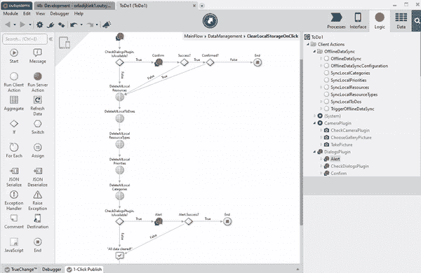

# 你的外部系统代码有味道吗？

> 原文：<https://itnext.io/does-your-outsystems-code-smell-dea38b0dbfc?source=collection_archive---------4----------------------->

你知道你的代码有味道吗？它可能有一点香味，也可能完全散发出臭味。至少你可能有一些代码的味道。

什么是代码气味？代码气味是一种模式，表明您的代码质量有问题。这表明可能需要某种类型的重构。尽管有异味的代码可以工作，但这表明您的代码可能有问题。幸运的是，气味很容易被嗅出*，即使对于经验不足的开发人员来说也是如此。*

*我在硕士论文中发现的一件事是，大多数开发人员都会遇到很多代码味道。这些开发人员还认为代码有异味对代码的可维护性是一种威胁。*

*你的代码工作正常，对吗？它在上线前经过了严格的测试，在生产中没有发现任何错误，一切都很好！但是如果你需要做出改变呢？甚至，还得有别人来做改变？在臭烘烘的代码中进行更改可能会很麻烦。*

*因此，您需要创建质量代码。当技术债务增加时，你的代码变得更容易出错，更难维护，可读性更差。技术债真的可以**拖慢发展**。*

*如果您在代码中发现了某种味道，您必须进行调查。有什么问题？为什么会出现这种气味？找到问题，就可以开始重构了。重构代码可以确保你保持 OutSystems 提供给你的高开发速度。*

## *我们不是有架构仪表板吗？*

**

*外部系统架构仪表板*

*是的，[架构仪表盘](https://www.outsystems.com/blog/posts/architecture-dashboard/)和[其他](https://www.bon-code.nl) [代码](https://www.omnext.com) [扫描](https://www.softwareimprovementgroup.com/partners/outsystems/)工具都很棒！但是并不是所有的代码味道都在那些工具里。通常会有很多发现。你需要理解这些发现，并根据严重程度对它们进行优先排序。*

> *“代码气味并不总是表明有问题。你必须更深入地观察，看看是否存在潜在的问题——气味本身并不坏——它们通常是问题的指示器，而不是问题本身。”马丁·福勒*

*您想知道如果您不解决代码味道，会出现什么问题。一个质量保证工具支持你嗅出这些气味，开发者有判断气味的知识。如果你能解释为什么你选择了某种方法，那就足够了。*

# *重复代码*

*所以，让我们从最明显的代码味道开始，至少对我来说，重复代码。重复代码是指你有两个看起来几乎相同的代码片段。*

*出现重复的原因有很多:*

*   *您没有意识到另一个开发人员已经构建了一个您本可以使用的逻辑，所以您再次构建它。*
*   *代码的特定部分看起来不同，但实际上执行相同的工作。这种重复很难发现和修复。*
*   *有目的的复制，因为复制一段工作代码会更容易或更快。*

## *如何解决*

*当您发现重复时，思考重复的原因。如果它仍然有效，请将其保留，并点击**架构仪表板**中的暂停按钮。如果无效，就该重构了。*

*重构很简单，找到重复的动作片段，使用**提取动作**，并在两个地方调用新的动作。如果重复的代码在不同的模块中，确保新创建的动作在一个模块中，模块可以在不违反 [3 架构规则](https://success.outsystems.com/Support/Enterprise_Customers/Maintenance_and_Operations/Designing_the_architecture_of_your_OutSystems_applications/03_Validating_your_application_architecture)的情况下使用它。*

**

*提取到行动*

*有时候事情并不那么简单:*

*   *如果两个操作做同样的事情，但使用不同的算法，选择最佳操作，删除另一个操作，并将所有呼叫从删除的操作更改为选择的操作。*
*   *如果存在大量条件表达式并执行相同的代码(仅条件不同)，则将重复的代码提取到一个具有易于理解的名称的操作中，并将条件作为输入参数。*
*   *如果在 If 语句的两个分支或 switch 语句的所有分支中执行相同的代码:将相同的代码放在条件树之外。*

*去掉重复的代码会使你的代码更短并简化结构。这导致代码更容易简化，支持成本更低。*

*在极少数情况下，合并两个相同的代码片段会使代码变得不直观和不明显。例如，您在多个地方有相同的逻辑，但是有一点点不同。如果您最终得到一个带有许多输入参数的操作或带有许多 If 和开关的逻辑，那么进行一些复制可能会更好。有一种东西叫做过度概括。*

# *下一步是什么？*

*当然，代码重复是最容易解决的问题之一。我将研究其他几种代码味道，并就它们写一系列文章。对于每一种代码味道，我都会给出解释，并检查风险是什么，以及如何减轻这些风险。加入我的旅程吧！*