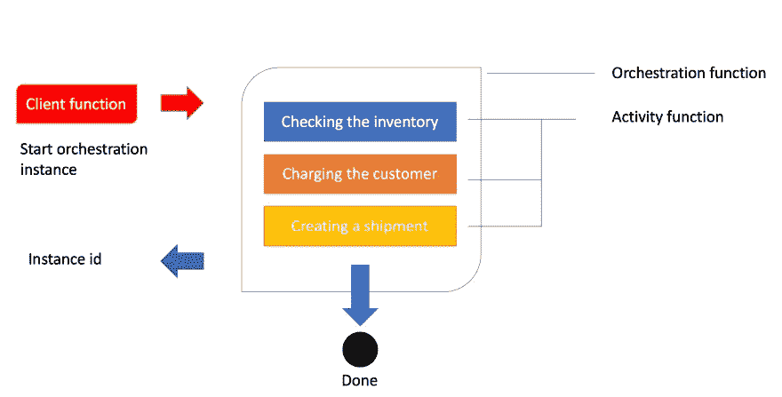
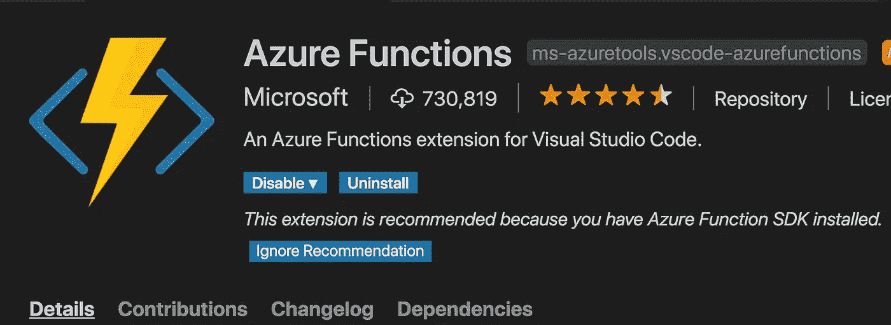
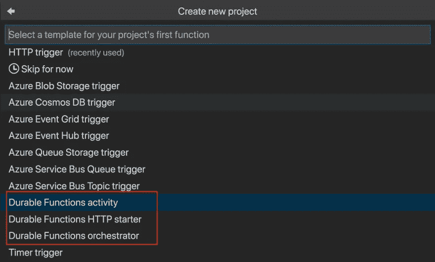
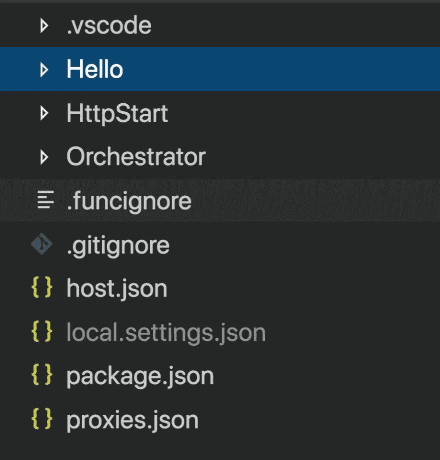
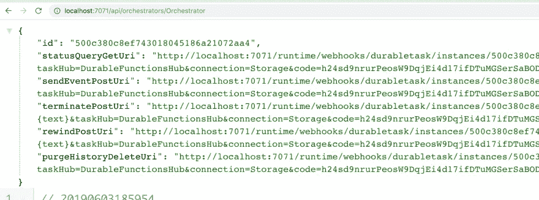
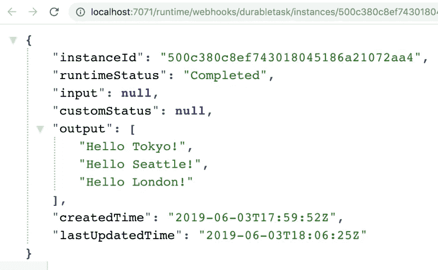

# 创建第一个具有持久功能的无服务器工作流

> 原文：<https://itnext.io/durable-functions-stateful-long-running-functions-in-serverless-part-i-1f707b8878c7?source=collection_archive---------8----------------------->

在 [Twitter](https://twitter.com/chris_noring) 上关注我，很高兴接受您对主题或改进的建议/Chris

> *持久函数是 Azure 函数的一个扩展，它允许你在一个无服务器的环境中编写有状态的函数。持久功能为您管理*`*state*`*`*checkpoints*`*，* `*restarts*` *。**

*你问这话是什么意思？*

*这意味着你可以拥有长时间运行的函数，比如真正的长时间运行的函数。它也有一个状态，这意味着它记得它在哪里，就像一个工作流。*

*这个怎么样？想象一下你有这样一种情况，你需要通过将某样东西划分到不同的检查点来管理它。每个检查点都离被认为*已处理*更近了一步。更具体地想象一个游戏，例如，你需要加载一堆不同的资源，只有当所有的东西都被加载并准备好了，你才能玩这个游戏。*

> **哦，好的，这就像一个工作流框架**

*是的，正是如此，它使您能够指定应该如何通过流程来执行某件事情。甚至有不同的架构模式被推荐给不同的流程。*

> *听起来很贵，是吗？*

*不，不完全是，付费模式非常接近 Azure Functions 使用的模式，只在功能/工作流实际执行时付费。*

> **听起来很棒，多告诉我一些**

*在本文中，我们将涵盖:*

*   *什么是持久功能，让我们讨论一下它是什么，核心概念是什么*
*   *它是如何工作的，我们将解释一下它是如何工作的*
*   *资源，我们会给你一些资源，这样你可以更深入地研究*
*   ***实验室**，我们将通过一个例子进行编码，这样你就可以看到使用中的主要概念以及当*

# *概念和高级解释*

*在处理持久函数时，我们需要了解一些概念。所有的概念都扮演着一个角色，共同使我们能够运行我们的持久功能。*

*   ***Orchestrator 功能**，这是一个我们定义工作流的功能，我们设置工作流中应该发生什么、要执行什么活动以及完成后发生什么*
*   ***活动功能**，活动功能是持久功能编排中的基本*工作单元*。活动功能是流程中编排的功能和任务。您可以拥有任意多的活动功能。确保给它们起描述性的名字，代表你的流程中的步骤*
*   ***客户端功能**，客户端功能是创建编排新实例的触发功能。客户端功能是创建持久功能编排实例的入口点*

> *好的，我想我明白了，但是你能再解释一下吗？*

*当然，最好的解释方式是通过一个现实的例子和一幅图像。那么我们来说说*订单处理*。在*订单处理*中，我们假设要执行以下任务:*

*鉴于我们知道订单是如何处理的，让我们向您展示这张图片，以便您对工作流程有所了解:*

**

*好了，上面我们看到了一个客户端函数是如何被调用的。在创建订单的情况下，这通常是我们从应用程序中点击的 HTTP 端点。接下来要发生的事情是，客户端函数启动一个编排实例。这意味着我们将获得一个`instance id`，我们对那个特定流的唯一引用。接下来要发生的事情是，我们尝试在流程编排中执行所有事情，比如`checking the inventory`、`charging the customer`和`creating a shipment`。*

# *它是如何工作的*

*让我们更详细地讨论一下这在技术上是如何工作的。编排的问题在于，它编排的内容通常是异步的，这意味着我们不知道某件事情的确切完成时间。为了避免你为它支付运行成本，持久函数关闭并保存状态。*

*当一个编排功能被赋予更多的工作要做时(例如，接收到一个响应消息或一个持久定时器到期)，该编排器醒来并从头重新执行整个功能以重建本地状态。*

> **等等，重新运行一切？**

*不用担心，在重放期间，如果代码试图调用一个函数(或做任何其他异步工作)，持久任务框架会查询当前编排的执行历史。如果发现 activity 函数已经执行并产生了结果，它会重放该函数的结果，orchestrator 代码会继续运行。*

> *哦，好的，听起来更好*

*重放会一直继续，直到函数代码完成或者它已经调度了新的异步工作*

# *资源*

*- [免费帐户 Azure 帐户](https://azure.microsoft.com/en-gb/free/?wt.mc_id=medium-blog-chnoring)你需要在 Azure 上注册才能使用持久功能
- [用 JavaScript 创建你的第一个持久功能](https://docs.microsoft.com/en-us/azure/azure-functions/durable/quickstart-js-vscode?wt.mc_id=medium-blog-chnoring)快速入门，带你创建持久功能
- [持久功能概念](https://docs.microsoft.com/en-us/azure/azure-functions/durable/durable-functions-concepts?wt.mc_id=medium-blog-chnoring)在这里阅读更多关于概念和模式以及如何实现所述模式的内容。
- [ [Orchestrator 功能约束](https://docs.microsoft.com/en-us/azure/azure-functions/durable/durable-functions-checkpointing-and-replay#orchestrator-code-constraints?wt.mc_id=medium-blog-chnoring) ]您需要了解的约束。*

# *实验室—简单的活动流程*

*我们相信最好的学习方法是用它来建立一些东西。那么我们该怎么做呢？嗯，很简单。使用 VS 代码，我们可以安装一个插件，让这个过程变得非常简单:*

**

## *创建我们的项目*

*打开命令面板或键入`COMMAND + SHIFT + P`。*

*然后，我们选择以下选项，创建一个新项目*

**

*接下来是我们选择一种语言，我们来看一下`javascript`。然后我们面临着一系列的选择:*

**

*正如您在上面看到的，我们突出显示了三个选项，因为这些是我们将在整个实验中使用的选项。我们需要一个入口点`Durable Functions HTTP Start`，所以让我们先选择它:*

*接下来，让我们再次创建我们的 orchestrator 函数 os，点击`COMMAND + SHIFT + P`并选择`Azure Functions: Create Function`和`Durable Functions Orchestrator`，让我们将其命名为`Orchestrator`。*

*这样做时，将要求您选择一个存储帐户:*

**

*您需要选择`Subscription`、`Storage account`和`Resource group`。这样做的原因是，当您保存函数的状态时，需要将它保存在某个地方，以便以后恢复。*

*我们就快成功了，只差一件事来创建`Activity function`。我们也可以用`COMMAND+SHIFT+P`、`Azure Functions: Create Function`和`Durable functions activity`来创建它，当它要求我们给它命名时，我们就给它命名为`Hello`。*

*如果你跟着它走，它应该是这样的:*

**

## *解释艺术品*

*好了，我们创建了三个不同的工件，一个 *orchestrator* 函数，一个 *HTTP start/client 函数，*和一个*活动函数*。这一切是如何运作的？*

*嗯，这一切都始于`HttpStart`功能，启动一切。然后，所述函数启动`Orchestrator`,这又启动编排器中指定的`Activity functions`。听起来有点理论化，但是让我们深入这些工件，看看代码中发生了什么。*

## *HttpStart*

*如上所述，这是启动这一切的函数。让我们看看它的源代码，并讨论发生了什么:*

```
*// HttpStart/index.jsconst df = require("durable-functions");

module.exports = async function (context, req) {
    const client = df.getClient(context);
    const instanceId = await client.startNew(
      req.params.functionName, 
      undefined, req.body
    );

    context.log(`Started orchestration with ID = '${instanceId}'.`);

    return client.createCheckStatusResponse(
      context.bindingData.req, 
      instanceId
    );
};*
```

*上面我们可以看到，我们通过调用从库`durable-functions`导入的持久函数实例`df`上的`getClient`来获取对`client`的引用。
接下来，我们的`client`实例调用`startNew`，产生一个`instanceId`。`instanceId`是对这个特定函数调用的引用或*处理程序*。这对于本演示来说并不重要，但对于第二个演示，我们将使用该信息。最后要做的事情是我们创建一个 HTTP 响应。*

*让我们看看`function.json`，我们的配置文件，在这里我们为我们的函数设置输入和输出:*

```
*// HttpStart/function.json{
  "bindings": [
    {
      "authLevel": "function",
      "name": "req",
      "type": "httpTrigger",
      "direction": "in",
      "route": "orchestrators/{functionName}",
      "methods": [
        "post",
        "get"
      ]
    },
    {
      "name": "$return",
      "type": "http",
      "direction": "out"
    },
    {
      "name": "starter",
      "type": "orchestrationClient",
      "direction": "in"
    }
  ]
}*
```

*我们有两条有趣的信息。首先，我们有一个`httpTrigger`，也就是说，我们可以通过一个 HTTP 调用，特别是通过一个名为`orchestrators/{functionName}`的路由来访问这个函数。另一条有趣的信息是最后一个类型为`orchestrationClient`的条目。这使我们能够在代码中获得一个`client`引用，没有它我们就不能。因此，如果您需要一个客户机实例，请记住包含这个配置。*

## *管弦乐演奏家*

*接下来让我们看看管弦乐队。这是所有有趣的事情发生的地方，这是我们建立流程的地方，什么时候调用什么函数以及为什么调用。让我们看看代码:*

```
*// Orchestrator/index.jsconst df = require("durable-functions");

module.exports = df.orchestrator(function* (context) {
    const outputs = [];

    // Replace "Hello" with the name of your Durable Activity Function.
    outputs.push(yield context.df.callActivity("Hello", "Tokyo"));
    outputs.push(yield context.df.callActivity("Hello", "Seattle"));
    outputs.push(yield context.df.callActivity("Hello", "London"));

    // returns ["Hello Tokyo!", "Hello Seattle!", "Hello London!"]
    return outputs;
});*
```

*首先我们看到我们有一个方法`orchestrator`,它采用了一个生成器函数。*

> *什么是发电机？*

*它们是与`async/await`非常相似的概念，允许你以一种看起来同步的方式执行异步代码。您可以通过将`*`作为函数声明的一部分来识别它们，如下所示:*

```
*function*() {}*
```

*并且使用了关键字`yield`。`yield`的用法和`await`一样，意思是我们应该呆在这里，在代码中等待，直到我们的异步操作结束。*

*那么这对我们上面的代码意味着什么呢？让我们更仔细地看看:*

```
*outputs.push(yield context.df.callActivity("Hello", "Tokyo"));*
```

*这里我们可以看到，我们用参数`Hello`调用了`context.df.callActivity()`，用关键字`yield`调用了`Tokyo`。这仅仅意味着我们正在调用带有参数`Tokyo`的活动函数`Hello`。我们可以看到，还有两个对`callActivity()`的调用在我们的活动函数结束之前不会执行。*

## *你好*

*接下来我们有一个活动函数。这是我们进行所有繁重工作的地方。查看`Hello`目录的`index.js`,我们看到以下代码:*

```
*module.exports = async function (context) {
    return `Hello ${context.bindings.name}!`;
};*
```

*我们看到它会立即返回，但它肯定会是一个长期运行的活动。关键是它是在一毫秒内运行还是需要一些时间，这都不重要，编排功能仍然要等待它结束。*

# *排除故障*

*到目前为止，你可能认为你已经理解了所有的东西，但是当你看到调试流程发生时，你真的明白了。这就是我们接下来要做的，我们将从 VS 代码中启动我们的持久函数，您将能够看到断点是如何命中的以及何时命中的。*

*我们需要做的第一件事是安装我们一直提到的`durable-functions` NPM 库，让我们开始吧:*

```
*npm install durable-functions*
```

*现在我们已经准备好调试，让我们点击调试按钮。*

*我们应该在终端中打印出这样的内容*

**

*下一件我们需要做的事情是通过点击我们的客户端函数路径来启动一切，如上所述`orchestrators/{functionName}`。因为我们只有一个名为`Orchestrator`的函数，所以我们需要通过在浏览器中调用以下 URL 来启动整个过程:*

```
*[http://localhost:7071/api/orchestrators/Orchestrator](http://localhost:7071/api/orchestrators/Orchestrator)*
```

*首先发生的是我们的`HttpStart`函数和它的`index.js`函数被这样攻击:*

**

*我们让调试器前进:*

**

*上面我们看到了`Orchestrator`号和它的`index.js`号是如何被击中的。*

*接下来我们前进到下一个断点，我们看到我们的活动函数`Hello`和它的`index.js`下一次被点击。*

*我们推进了断点，发现自己又回到了编排功能中:*

*这将导致再次点击`activity`函数，这次使用参数`Seattle`，如下所示:*

**

*如您所见，在活动函数和 orchestrator 之间会一直这样，直到 orchestrator 完成。*

*让我们前进通过所有的断点。*

*我们最终来到这样一个页面，这是来自名为`HttpStart`的方法的 HTTP 响应*

**

*我们现在想知道的有趣的是，我们最终生产了什么？答案就在那个叫`statusQueryGetUri`的网址里。让我们跟随链接:*

**

*正如您在上面看到的，我们的`Orchestration`函数的响应是一个由所有活动函数的响应组成的数组，如下所示:*

```
*"output": [
  "Hello Tokyo!",
  "Hello Seattle!",
  "Hello London"
]*
```

*因为我们构建代码的方式，我们这样写:*

```
*outputs.push(yield context.df.callActivity("Hello", "Tokyo"));
outputs.push(yield context.df.callActivity("Hello", "Seattle"));
outputs.push(yield context.df.callActivity("Hello", "London"));

// returns ["Hello Tokyo!", "Hello Seattle!", "Hello London!"]
return outputs;*
```

# *摘要*

*关于持久函数还有很多东西要学，但是我已经听到你们中的一些人在这一点上打鼾了，这就是为什么我们将把诸如应用程序模式和模式实现的主题留到下一部分。*

*所以我希望你对此感到兴奋。*

## *感谢*

*如果没有您在持久函数如何工作方面的指导，我不会写这篇文章。你们两个都是了不起的人。*

*——安东尼·朱
[dev.to](https://dev.to/anthony) ，
[Twitter](https://twitter.com/nthonyChu)
——杰里米·利克内斯
[dev . to](https://dev.to/jeremylikness)
[Twitter](https://twitter.com/jeremylikness)*

*所以给他们一个关注，他们真的知道他们的无服务器的东西*

**原载于 2019 年 6 月 3 日*[*https://dev . to*](https://dev.to/softchris/durable-functions-stateful-long-running-functions-in-serverless-part-i-5bm)*。**