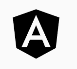

# 有角度的动态形式——嗡嗡声之外的模式

> 原文：<https://itnext.io/dynamic-forms-in-angular-the-pattern-beyond-the-buzz-da12f560b0d4?source=collection_archive---------1----------------------->



在这篇文章中，我的目标是用 Angular 来解释术语“动态”形式背后的思想。

**动态表单**实际上是一个**模式**(不是一些人认为的另一个构建表单的 API)，其中我们基于**元描述**构建一个表单，我们使用**反应式表单 API** 来实现它。

反应式表单 API 为我们提供了一些非常有用的工具来**构建**表单，**通过访问表单组**控件**(直接通过控件或使用某个控件的 getter)等来访问**其**数据模型**，并且**通过代码定义**其**验证器**。

该 API 提供了以下功能:

```
**import** { FormBuilder, FormControl, FormGroup, Validators, FormArray } **from '@angular/forms'**;
```

**短评:**

*   新表单组将创建表单组的一个实例。
*   新的 FormControl 将创建控件的一个实例—提供给一个窗体组。
*   验证器——在控件上设置许多验证选项。
*   form builder——以相对较短的语法创建表单组和相关控件(以及验证)的静态方法。
*   格式数组—允许以格式数组的形式访问控件，以动态创建一组控件，这有点难以捕捉，所以我添加了以下代码片段:

```
@Input() **myfromGroup**: FormGroup;

addItem() {
   **this**.**repeatControls** = **this**.**myfromGroup**.get(**'repeatControls'**) **as** FormArray;
   **this**.**repeatControls**.push(**this**.createItem());
}

createItem() {
   **return this**.**formBuilder**.array(
      [**this**.**formBuilder**.group(**this**.**myfromGroup**.**controls**.repeatControls)],
   );
}
```

(此外，还有相关的指令，如 **formControlName，formGroup，formArrayName)**

在该 API 之上，构建了术语“**动态表单**”,

> 基于描述业务对象模型的元数据动态创建表单可能更经济

元描述的一个例子:

```
**nameDescription**: {
   **name**: {
      **type**: **'text'**,
      **value**: **'Type policy name'**,
      **label**: **'name'**,
      **validation**: {
         **required**: **true**,
      },
   },
   **description**: {
      **type**: **'text'**,
      **value**: **'Type description for policy'**,
      **label**: **'description'**,
      **validation**: {
         **required**: **false**,
      },
   },
   **notes**: {
      **type**: **'text'**,
      **value**: **'Write a comment to explain what changes'**,
      **label**: **'notes'**,
      **validation**: {
         **required**: **false**,
      },
   }, **cancel: {
   type: 'button',
   label: 'Cancel',
 },
 OK: {
   type: 'button',
   label: 'OK',
}**
},
```

一个可玩的例子:

[](https://stackblitz.com/edit/dynamic-form-simple-example?file=src/app/dynamic-form-simple-example/dynamic-form-simple-example.component.ts) [## 动态表单简单示例堆栈

### 导出到 Angular CLI 的 Angular 应用程序的启动项目

stackblitz.com](https://stackblitz.com/edit/dynamic-form-simple-example?file=src/app/dynamic-form-simple-example/dynamic-form-simple-example.component.ts) 

至于包含内部形式的更复杂的形式:

我最近意识到，用嵌套的表单组创建表单组不是一个好的架构模式。

在嵌套表单的情况下——通过使用**[**ControlValueAccessor**](https://angular.io/api/forms/ControlValueAccessor)API 使内部表单成为**控件**,并在发生变化时反应性地更新表单组，IMO 这是处理嵌套表单的角度方式，它是更优雅和简单的方法，一般来说，最好尽可能保持结构扁平，这样迭代的复杂性将保持线性:**

**做:**

```
createForm(descriptor): FormGroup {
   **const** _simpleFormGroup: FormGroup | **any** = {};
   **for** (**const** _control **of *Object***.keys(descriptor)) {
      **let** control: FormControl;
      **if** ( **this**.**descriptor**[_control].**value** ) {
         **if** (**this**.**descriptor**[_control].Validators) {
            control = **this**.formBuilder.control(**this**.**descriptor**[_control].**value**, {
               **validators**: **this**.**descriptor**[_control].Validators,
            });
         } **else** {
            control = **this**.formBuilder.control(**this**.**descriptor**[_control].**value**);
         }
      }
      _simpleFormGroup[_control] = control;
   }
   **return this**.formBuilder.group(_simpleFormGroup);
}
```

**如果出于某种原因，您选择了嵌套表单结构，我的解决方案是:**

**DONT:**

```
createMainForm(desc) {
   **const** mainFormGroup = {};
   **for** (**const** nestedGroup **of *Object***.keys(desc)) {
      **const** nestedFormGroup = {};
      **let** formControl;
      **for** (**const** control **of *Object***.keys(desc[nestedGroup])) {
         formControl = **this**.**formBuilder**.control(desc[nestedGroup][control].**value**);
         nestedFormGroup[control] = formControl;
      }
      mainFormGroup[nestedGroup] = **this**.**formBuilder**.group(nestedFormGroup);
   }
   **return this**.**formBuilder**.group(mainFormGroup);
}
```

**我希望我能以简单的方式解释它，一旦你理解了反应式表单 API，它就真的不复杂了，把它和 ngSwitch，NGF 一起使用，我们可以做一些非常酷的通用东西。**

**参考:**

 **[## 角度文档

### 编辑描述

angular.io](https://angular.io/guide/dynamic-form)**