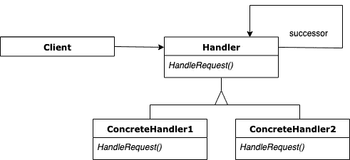

# 简单模式:责任链

> 原文：<https://itnext.io/easy-patterns-chain-of-responsibility-9a84307ad837?source=collection_archive---------2----------------------->

责任链模式的结构

本文是 easy patterns 系列描述的延续，提出了一个名为责任链的行为模式，它通过添加一个或多个有机会以特定方式处理请求的处理对象来帮助避免请求发送者和接收者之间的耦合。

也请参考其他模式文章:

## 创作模式:

> [**简易工厂**](/easy-patterns-simple-factory-b946a086fd7e)
> 
> [**工厂法**](/easy-patterns-factory-method-5f27385ac5c)
> 
> [**建造者**](/easy-patterns-builder-d85655bcf8aa)
> 
> [**单个**](/easy-patterns-singleton-283356fb29bf)
> 
> [**抽象工厂**](/easy-patterns-abstract-factory-2325cb398fc6)
> 
> [**原型**](/easy-patterns-prototype-e03ec6962f89)

## 结构模式:

> [**适配器**](/easy-patterns-adapter-9b5806cb346f)
> 
> [**装饰者**](/easy-patterns-decorator-eaa96c0550ea)
> 
> [**桥**](/easy-patterns-bridge-28d50dc25f9f)
> 
> [**复合**](/easy-patterns-composite-8b28aa1f158)
> 
> [**立面**](/easy-patterns-facade-8cb185f4f44f)
> 
> [**飞锤**](/easy-patterns-flyweight-dab4c018f7f5)
> 
> [**代理**](/easy-patterns-proxy-45fc3a648020)

## 行为模式:

> [**来访者**](/easy-patterns-visitor-b8ef57eb957)
> 
> [**调解员**](/easy-patterns-mediator-e0bf18fefdf9)
> 
> [**观察者**](/easy-patterns-observer-63c832d41ffd)
> 
> [**纪念物**](/easy-patterns-memento-ce966cec7478)
> 
> [**迭代器**](/easy-patterns-iterator-f5c0dd85957)
> 
> **责任链**(本文)
> 
> [**策略**](/easy-patterns-strategy-ecb6f6fc0ef3)
> 
> [**状态**](/easy-patterns-state-ec87a1a487b4)

# 主要本质

耦合减少是通过给多个对象一个处理请求的机会来实现的。链项接收请求，并在一些逻辑将请求传递给处理程序链中的下一个处理程序。

链中的第一个对象接收请求，并处理它或将其转发给链中的下一个候选对象，后者也会这样做。发出请求的对象不知道谁将处理它——请求有一个隐式接收者**。**

**这种模式包括两个主要角色:**

*   ****处理程序—** 定义处理请求的接口，处理请求本身并实现后继链接**
*   ****客户端** —向链上的处理程序对象发起请求。**

# **使用示例**

**在这个例子中，我们将创建一个咖啡机，它包含一组**处理程序**，这些处理程序接受要修改的咖啡杯项目和后续链接，以便将控制传递给集合中的下一个处理程序。每个咖啡杯项目都包含名为`ingredientsToBeAdded`的内部属性，您可以将它想象成订单中的标签，这样咖啡师(我们示例中的咖啡机)就知道在咖啡中添加什么。`setNewIngredients`方法会用一个新的咖啡杯替换一个咖啡杯，并设置新的配料加入其中，之后你可以用更新的配料设置再次`processCoffee`。**

# **利润**

**如果许多对象应该能够处理请求，而专门的处理程序事先不知道，那么责任链模式是有用的，它将在运行时确定。**

**可以不明确地确定请求的特定处理程序，而是为这个请求定义一组潜在的处理程序。这组处理程序请求的对象可以在运行时动态定义。它使对象不必知道哪个对象处理请求。一个对象只应该知道一个请求将被适当地处理。因此，责任链可以简化对象互连。**

**增加了为对象分配责任的灵活性。您可以通过在运行时添加或更改链来添加或更改处理请求的职责。**

# **薄弱的地方**

**责任链给处理特定请求的逻辑带来了一些复杂性。如果可以在运行时定义特定的处理程序集，那么可能会有多种结果(我们不能确定哪个具体的处理程序集会出现在特定的请求中)。所以，通过计划单元测试来预测一个特定的结果是很困难的。**

**因为请求没有明确的接收者，所以根本不能保证它会被处理。**

**责任链的配置应该仔细。当链配置不正确时，请求也可能无法处理。**

# **结论**

**目前，这种模式已经在许多地方找到了一席之地。例如，在支付逻辑中，如果用户持有多张信用卡，您应该实施不同的策略。在这种情况下，我们可以有一套策略，每个策略将检查它是否可以应用于特定的银行卡。**

**另一方面，Express (NodeJS)或 Redux(用于处理全局应用程序状态的 lib)有一个特殊的地方来放置一个额外的逻辑，称为中间件。这些中间件功能接受当前状态对象和到后继者的链接(后继者将当前状态传递给中间件集中的下一个中间件处理器)。**

**责任链通常与[复合](/easy-patterns-composite-8b28aa1f158)模式结合使用。在那里，一个组件的父组件可以作为它的后继组件。**

**如果您觉得这篇文章有帮助，请点击👏按钮并在下面随意评论！**