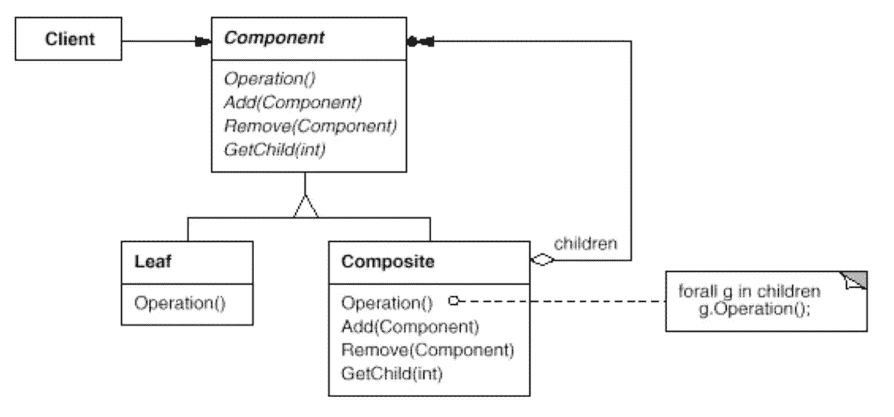

# 简单模式:复合

> 原文：<https://itnext.io/easy-patterns-composite-8b28aa1f158?source=collection_archive---------6----------------------->

本文是 easy patterns 系列描述的延续，介绍了一种复合模式，它解决了如何在一组不同的对象之间使用递归组合的问题，因此客户不必进行这种区分。

## 创作模式:

> [**简易工厂**](/easy-patterns-simple-factory-b946a086fd7e)
> 
> [**工厂法**](/easy-patterns-factory-method-5f27385ac5c)
> 
> [**构建器**](/easy-patterns-builder-d85655bcf8aa)
> 
> [**单个**](/easy-patterns-singleton-283356fb29bf)
> 
> [**抽象工厂**](/easy-patterns-abstract-factory-2325cb398fc6)
> 
> [**原型**](/easy-patterns-prototype-e03ec6962f89)

## 结构模式:

> [**适配器**](/easy-patterns-adapter-9b5806cb346f)
> 
> [**装饰者**](/easy-patterns-decorator-eaa96c0550ea)
> 
> [**桥**](/easy-patterns-bridge-28d50dc25f9f)
> 
> [**复合**](/easy-patterns-composite-8b28aa1f158) *(本文)*
> 
> [**立面**](/easy-patterns-facade-8cb185f4f44f)
> 
> [**飞锤**](/easy-patterns-flyweight-dab4c018f7f5)
> 
> [**代理**](/easy-patterns-proxy-45fc3a648020)

## 行为模式:

> [**来访者**](/easy-patterns-visitor-b8ef57eb957)
> 
> [**调解员**](/easy-patterns-mediator-e0bf18fefdf9)
> 
> [**观察者**](/easy-patterns-observer-63c832d41ffd)
> 
> [**纪念物**](/easy-patterns-memento-ce966cec7478)
> 
> [**迭代器**](/easy-patterns-iterator-f5c0dd85957)
> 
> [**责任链**](/easy-patterns-chain-of-responsibility-9a84307ad837)
> 
> [**策略**](/easy-patterns-strategy-ecb6f6fc0ef3)
> 
> [状态**状态**状态](/easy-patterns-state-ec87a1a487b4)

# 主要本质

复合模式有助于以统一的顺序操作单独的对象。这是可能的，因为特殊的类对象为合成集中的所有参与者声明了公共表示操作。

这种模式包括三个主要角色:

*   **组件** —声明组合中对象的接口并实现默认行为(基于组合)
*   **叶子** —代表构图中的图元对象
*   **复合** —在组件接口中实现子相关操作，并存储叶(原语)对象。

客户端使用组件接口与合成集中的对象进行交互。如果接收者是一个简单的对象(叶子)，那么请求直接由这个简单的对象处理。如果接收方是一个复合组件，它通常会将请求转发给子组件。For composite 也通常执行一些挂钩前和挂钩后操作。

# 使用示例

在这个例子中，我们处理获取一个具体组织的雇员的平均工资。一个组织将雇员存储在一个数组中，可以计算所有雇员的平均工资。

这是一个简单的用法表示，当组织只能存储典型的雇员时(使用`name`和`getSalary`方法)。

要感受模式的强大功能，只需想象一下这样一种情况:父组织不仅可以存储雇员，还可以存储子组织。所有需要做的就是为这样的子组织实现`getSalary`方法，它将返回其内部雇员的平均工资。这样，调用母公司的`avgSalary`将不会中断，并且结果将是所有员工的平均工资，无论是直接在母公司工作还是通过子公司工作。

# 利润

这种模式使客户端变得简单。客户可以以类似的方式处理单个或组合结构。这使得客户端代码更简单，因为它避免了为简单和复杂对象的类编写 case 语句函数。

这种模式使得添加新类型的组件变得容易。新创建的项自动与现有的结构和客户端代码一起工作。

# 薄弱的地方

另一方面，这种模式可以让你的设计更加通用。这使得限制组合的组件变得更加困难(例如，您希望组合只包含某些组件)。这种方法迫使您使用运行时检查。

# 结论

复合模式通常与其他模式一起使用，如:

*   装饰者(Decorator)——当与组合一起使用时，它们通常有一个共同的父元素，所以装饰者必须支持组件接口，如添加、删除等。
*   [Flyweight](/easy-patterns-flyweight-dab4c018f7f5) —让你共享组件。
*   迭代器—允许您遍历复合对象。
*   [访问者](/easy-patterns-visitor-b8ef57eb957) —本地化操作和行为，否则这些操作和行为将分布在复合类中。

如果您觉得这篇文章有帮助，请点击👏按钮并在下面随意评论！