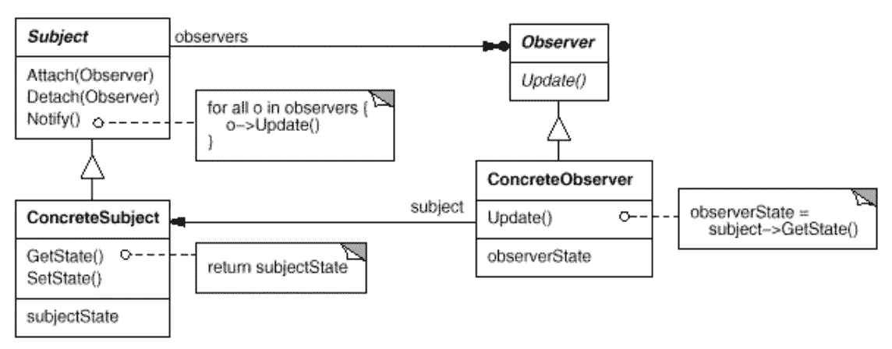

# 简单模式:观察者

> 原文：<https://itnext.io/easy-patterns-observer-63c832d41ffd?source=collection_archive---------12----------------------->

本文是“简单模式描述”系列的延续，描述了通知对象关于他们感兴趣的另一个对象的变化的行为模式。

目前，您可以找到此类模式的文章:

## 创作模式:

> [**简易工厂**](/easy-patterns-simple-factory-b946a086fd7e)
> 
> [**工厂法**](/easy-patterns-factory-method-5f27385ac5c)
> 
> [**建造者**](/easy-patterns-builder-d85655bcf8aa)
> 
> [**单个**](/easy-patterns-singleton-283356fb29bf)
> 
> [**抽象工厂**](/easy-patterns-abstract-factory-2325cb398fc6)
> 
> [**原型**](/easy-patterns-prototype-e03ec6962f89)

## 结构模式:

> [**适配器**](/easy-patterns-adapter-9b5806cb346f)
> 
> [**装饰者**](/easy-patterns-decorator-eaa96c0550ea)
> 
> [**桥**](/easy-patterns-bridge-28d50dc25f9f)
> 
> [**复合**](/easy-patterns-composite-8b28aa1f158)
> 
> [**立面**](/easy-patterns-facade-8cb185f4f44f)
> 
> [**飞锤**](/easy-patterns-flyweight-dab4c018f7f5)
> 
> [**代理**](/easy-patterns-proxy-45fc3a648020)

## 行为模式:

> [**来访者**](/easy-patterns-visitor-b8ef57eb957)
> 
> [**调解员**](/easy-patterns-mediator-e0bf18fefdf9)
> 
> [**观察者**](/easy-patterns-observer-63c832d41ffd) *(本文)*
> 
> [**纪念品**](/easy-patterns-memento-ce966cec7478)
> 
> [**迭代器**](/easy-patterns-iterator-f5c0dd85957)
> 
> [**责任链**](/easy-patterns-chain-of-responsibility-9a84307ad837)
> 
> [**策略**](/easy-patterns-strategy-ecb6f6fc0ef3)
> 
> [**状态**](/easy-patterns-state-ec87a1a487b4)

# 主要本质

观察者模式决定了两个对象之间的关系:**观察者**和**订户**。因此，当一个对象(观察者)改变时，其他一个或多个对象(订阅者)会立即知道。

**现实生活中的例子。**出版机构为机场出版杂志。机场对每月获得新鲜杂志感兴趣，所以他们订阅它的更新。一旦新版本发布，他们就会收到通知。一旦机场意识到不再需要订阅杂志，就可以取消订阅通知。

# 使用示例

在示例中，我们正在创建新的发行商和几个机场(1，2)。之后，订阅他们获得通知的具体杂志类型(3)。最后，一旦新杂志出版，通知机场。

# 利润

这种模式有助于管理两个对象之间的关系，其中一个对象被更新。观察者模式保证一旦一个对象被更新，所有其他对象都会立即得到通知。

# 薄弱的地方

观察者模式会导致内存泄漏，这被称为[失效的监听器问题](http://ilkinulas.github.io/development/general/2016/04/17/observer-pattern.html)，因为主体持有对观察者的强引用，使它们保持活动状态。

观察者模式刺激你拥有全局状态。这意味着副作用会导致全球应用程序状态发生不可预测和不明显的变化。

观察者模式导致了对象之间的紧密耦合，因此它们知道并可以访问彼此。

# 结论

如果您觉得这篇文章有帮助，请点击👏按钮并在下面随意评论！