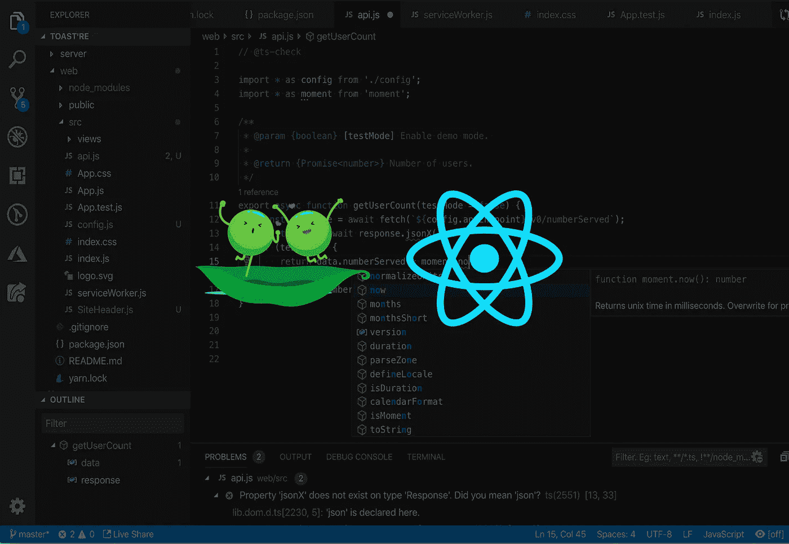

# 简单的反应 Redux 包装

> 原文：<https://itnext.io/easy-peasy-the-react-redux-wrapper-b31a5911c5e3?source=collection_archive---------4----------------------->



## 如何使用简单的全局状态和反应

> 这篇文章假设读者对新的 React Hooks 特性有一些基本的了解。

最近发布的[钩子](https://reactjs.org/docs/hooks-intro.html)吹走了复杂性，完全重新激发了我对 React 的热爱。有了这些新工具，我决定重新评估我所接触的库和模式，看看是否可以用本机实现来代替它们。

一个直接的考虑是全球国家。一些内置的 React 挂钩包括`[useReducer](https://reactjs.org/docs/hooks-reference.html#usereducer)`和`[useContext](https://reactjs.org/docs/hooks-reference.html#usecontext)`。这些都是强大的原语，如果有人说服自己不再需要第三方州立图书馆，那也情有可原。

钩子很棒，这是必须要说的。随着时间的推移，更复杂的状态管理组件(例如异步流和派生状态)开始出现。这些问题需要自制的解决方案或第三方库——冲淡了我的体验。

我试图继续进行迁移，但是我的全局状态的复杂性继续增长，最终我达到了一个临界点，在这个临界点上，我非常渴望一个更健壮、更包容的状态解决方案。bug 在蔓延，我发现识别和解决它们非常困难——我的调试工具已经从令人难以置信的 [Redux Dev Tools 扩展](https://github.com/zalmoxisus/redux-devtools-extension)减少到明显更简单的`console.log`。

我练习的结果是一个结论，钩子很棒，但是它们只能带你到这里。仍然存在复杂的应用程序状态结构，Redux 等将是更好的选择。

另一个结果是，我无意中重新点燃了对 Redux 及其成熟生态系统的欣赏。鉴于最近社区(包括我自己)对它的抵制，这是一个有趣的地方。

过去有一种教条式的信念，认为 Redux 是任何“值得尊敬的”应用程序的一个要求。令人鼓舞的是，社区正在摆脱这种思维，但是，我们应该注意不要把钟摆摆向另一端。宣称没有 Redux 的位置也同样是不负责任的。我们更应该选择一个实用的中间地带，一个我们花时间考虑添加 Redux 到项目中是否会带来价值的地方。

就我而言，我觉得我的项目肯定需要一个更强大的国家系统。我下定决心，我将允许第三方库再次管理我的状态。

Redux 在叫我。

所有这些样板文件虽然…

# 容易的事

这是围绕 redux 的第三方包装。这是一个一体化，零配置，全局状态库！最重要的是，它使用钩子作为与组件集成的机制。

我已经积极地使用它一个多星期了，解决了最初的错误和性能问题。我的观点肯定有很大的偏见，但我必须说，我觉得这是一股新鲜空气。我的速度和快乐水平正在飙升，因为我正在开发 [ComicKult](https://comickult.com/) 。

你需要做的就是安装一个软件包。您需要的一切都包括在内，不需要额外的配置。

`npm install easy-peasy`

> *记住，这个包依赖于 React Hooks 特性，它只在 React/React-DOM-v 16 . 7 . 0-alpha . 0 的 alpha 版本中可用。我当然不建议你在生产中使用它，但是如果你必须足够负责任地只在你的个人项目中使用它。*

主要的 API 可以很容易地通过下面简洁的代码片段来说明。

```
import { StoreProvider, createStore, useStore, useAction } from 'easy-peasy';// 👇 firstly, create your store by providing your model
const store = createStore({
  todos: {
    items: ['Install easy-peasy', 'Build app', 'Profit'],
    // 👇 define actions
    add: (state, payload) => {
      state.items.push(payload) // 👈 you mutate state to update (we convert
                                //    to immutable updates)
    }
  }
});function App() {
  return (
    // 👇 secondly, surround your app with the provider to expose the store to your app
    <StoreProvider store={store}>
      <TodoList />
    </StoreProvider>
  );
}function TodoList() {
  // 👇 finally, use hooks to get state or actions. your component will receive
  //    updated state automatically
  const todos = useStore(state => state.todos.items)
  const add = useAction(dispatch => dispatch.todos.add)
  return (
    <div>
      {todos.map((todo, idx) => <div key={idx}>{todo.text}</div>)}
      <AddTodo onAdd={add} />
    </div>
  )
}
```

你可以简单地定义一个模型来描述你的状态，而不是绘制出无尽的减少器、动作等等。这个模型只是一个很好的旧 JavaScript 对象，可以简单也可以复杂。它用来描述您的状态结构及其默认值。在引擎盖下，我们将做所有的艰苦工作，将你的模型转换成 Redux 期望的惯用结构(Redux，actions 等)。

让我们把 API 分成更小的部分。首先，定义您的模型…

```
const model = {
  todos: {
    items: [],
  },
  session: {
    user: null 
  }
};
```

要定义用于更新状态的动作，只需在状态的适当部分添加一个函数。

```
const model = {
  todos: {
    items: [],
    // 👇 an action
    add: (state, payload) => {
      state.items.push(payload);  
    }
  },
  session: {
    user: null 
  }
};
```

注意动作是如何接收状态片作为它的第一个参数的，第二个参数包含可能已经提供给动作的任何有效负载。您还会注意到，您直接改变了状态。我们在这里使用`[immer](https://github.com/mweststrate/immer)`是为了让我们熟悉和容易使用基于突变的 API。在引擎盖下，它为我们做了所有的艰苦工作，将对`state`的任何修改转换成一个单一的不可变更新。

然后，您将您的模型提供给`createStore`，它将输出一个 Redux store，它与标准 Redux store 的唯一区别是，动作已经方便地绑定到了`dispatch`属性。

```
import { createStore } from 'easy-peasy';// Pass in your model and you get back a Redux store
const store = createStore(model);// you can query state as normal
store.getState().todos.items;
// ['Install easy-peasy']// and dispatch actions
store.dispatch.todos.add('Build an app')
//            |---------|
//                 |- Actions are bound to a path matching model

// and access the other standard APIs of a Redux store
store.listen(() => console.log('An update occurred'))
```

为了向您的应用程序公开您的商店，您将它提供给`StoreProvider`。

```
import { StoreProvider } from 'easy-peasy';function App() {
  return (
    // 👇 secondly, surround your app with the provider to expose the store to your app
    <StoreProvider store={store}>
      <TodoList />
    </StoreProvider>
  );
}
```

最后，您可以使用提供的挂钩与您的商店进行交互。

```
import { useStore, useAction } from 'easy-peasy';function TodoList() {
  // 👇 Access state
  const todos = useStore(state => state.todos.items)
  // 👇 Access actions
  const add = useAction(dispatch => dispatch.todos.add)
  return (
    <div>
      {todos.map((todo, idx) => <div key={idx}>{todo.text}</div>)}
      <AddTodo onAdd={add} />
    </div>
  )
}
```

只有当组件跟踪的相应状态被更新时，组件才会收到新的状态。

需要执行数据提取/持久化等效果？然后使用`effect`助手。

```
import { createStore, effect } from 'easy-peasy'; // 👈 import the helperconst store = createStore({
  session: {
    user: undefined,
    // 👇 define your effectful action
    login: effect(async (dispatch, payload, getState) => {
      const user = await loginService(payload)
      dispatch.session.loginSucceeded(user)
    }),
    loginSucceeded: (state, payload) => {
      state.user = payload
    }
  }
});
```

注意你如何使用 async/await，或者 Promises，或者任何你喜欢的异步编程风格。提供的`dispatch`允许您用任何结果更新您的状态。

派生状态呢？`select`帮手为你撑腰。

```
import { select } from 'easy-peasy'; // 👈 import the helperconst store = createStore({
  shoppingBasket: {
    products: [{ name: 'Shoes', price: 123 }, { name: 'Hat', price: 75 }],
    // 👇 define your derived state
    totalPrice: select(state =>
      state.products.reduce((acc, cur) => acc + cur.price, 0)
    )
  }
});
```

只有当它所关心的状态发生变化时，才会重新计算派生状态。它是开箱记忆的。