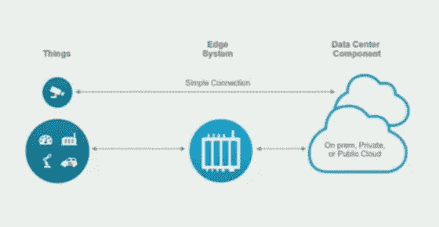
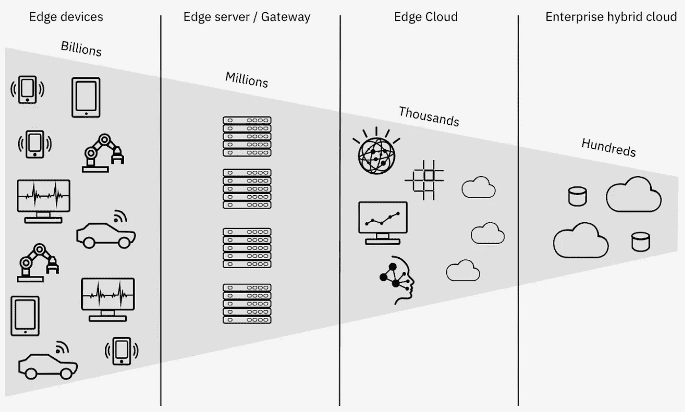
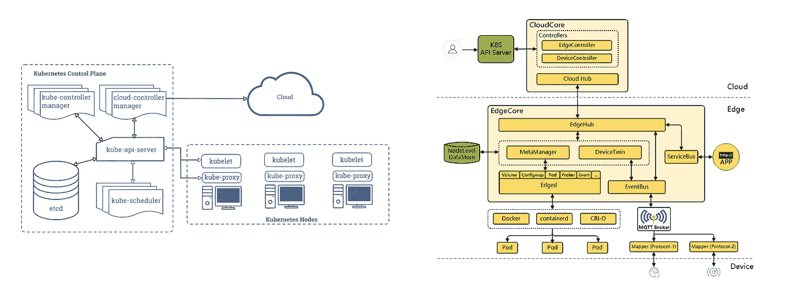

# 边缘计算 KubeEdge 之旅

> 原文：<https://itnext.io/edge-computing-journey-to-kubeedge-13bd4febf8b?source=collection_archive---------1----------------------->

**更新:**演进到边缘计算在[https://medium . com/@ sakthishanmugam 02/what-is-Edge-Computing-6c 7546051834？sk = 5db 039951650 db 0154 f 10 C5 f 171 cc 176](https://medium.com/@sakthishanmugam02/what-is-edge-computing-6c7546051834?sk=5db039951650db0154f10c5f171cc176)(如有兴趣)

在进入什么是边缘计算的话题之前，理解对这种基础设施方法的真正需求是最重要的。IT 世界经历了从传统的客户端-服务器架构到云计算的发展。这还不够，原因很简单:与计算世界相比，访问基础设施的设备数量呈指数级增长，其生成的数据量也是如此。截至目前，世界上的一切都与互联网相连，无论是智能手表、智能手机、智能电视还是无人驾驶汽车。

这引发了对现有云基础设施的担忧，包括它需要支持的带宽、每个请求的延迟、设备和云之间传输的数据的安全性和安全性。我们来看一个简单的自动驾驶汽车紧急情况场景，假设一辆自动驾驶汽车要为同一轨道驶来的救护车铺路。要做到这一点，汽车必须将其当前的交通信息发送到云端，并且必须通过比较同一条最近的赛道上的其他车辆来进行一些分析。然后，必须向轿厢发出指令，让出道路。所有这些都需要在几秒钟内完成。但是，对于距离数据来源设备数英里之外的云基础设施来说，这是一个很大的挑战。这就引出了边缘计算的概念。

那么，什么是边缘计算呢？它是将智能推向网络的边缘。这意味着，让计算、存储、分析(+缓存)功能尽可能接近设备本身。我们如何实现这一壮举？通过在设备和云数据中心之间引入网络层(边缘系统)。因此，数据不需要一直传输到云端进行处理，而是由边缘系统来完成。首先，我们从这种方法中获得的是超低延迟，因为边缘系统将尽可能靠近设备。第二，数据过滤和减少:这意味着所有的数据都不会发送到云中，因此减少了对带宽需求的压力。第三，数据的安全性和隐私合规性可以得到满足，因为它不会一直发送到云。

传统云计算与边缘计算

然而，在设备和云之间引入边缘系统并不是一件容易的事情。我们需要补充有效的供应和协调功能，以使其具有弹性。因为我们要管理的系统数量并不像上图这么简单。将会有数十亿台设备。

请务必记住，边缘设备不会将自己局限于一种通信协议。它依赖于多种机制，如蓝牙、WiFi、3G/4G/5G 等等。因此，边缘服务器也不会运行属于同一架构/运行时的应用程序。因此，在 docker 等运行时的帮助下，将应用程序容器化以部署在边缘服务器上是很好的做法。当我们这么说的时候，我们脑海中浮现的最明显的东西就是 Kubernetes 来编排这些应用程序容器。遗憾的是，由于计算资源有限的特性，在边缘服务器上直接运行 Kubernetes 并不那么直接。即使这些服务器允许我们安装所有 Kubernetes 组件，客户也可能不愿意花费宝贵的计算资源来管理 Kubernetes 控制面板，而是希望使用它来处理数据。

这里出现了对 Kubernetes 的精简/优化版本的需求，这就是 KubeEdge。KubeEdge 是一个开源系统，用于将本机容器化应用程序编排功能扩展到边缘主机，它本质上是轻量级的，从 Kubernetes 二进制文件中剥离了一些功能。值得注意的区别是 edged 是一个轻量级节点代理(相当于 kubelet)，使用 SQLite 代替 etcd。此外，编排功能从边缘节点分离到云端。也就是说，Kubernetes 控制平面[主节点组件]将放在云端，计算功能[pod 部署]将在边缘端处理。下面的图片将显示库贝内特斯和库比奇之间的建筑差异。

Kubernetes 和 EdgeKube 建筑的并排比较

IBM 推出了名为 Edge Application Manager 的产品，它具有一系列独特的功能，尤其是与自主管理相关的功能！

我希望这篇文章能让你深入了解什么是边缘计算，以及 Kubernetes 在提高边缘计算效率方面的作用。

> 感谢安德鲁·金最近给我带来一本书。我欠你的！我想把这个博客献给你。

> 感谢安库尔·斯里瓦斯塔瓦给了我学习新概念的机会。
> 
> 感谢马努·马修斯，他总是给像我这样的人很大的鼓舞。