# K8s 上的 Elasticsearch & Kibana，带有 Rancher Desktop & Rancher Cluster Manager 2.6

> 原文：<https://itnext.io/elasticsearch-kibana-on-k8s-w-rancher-desktop-rancher-cluster-manager-2-6-f155c86164c0?source=collection_archive---------2----------------------->

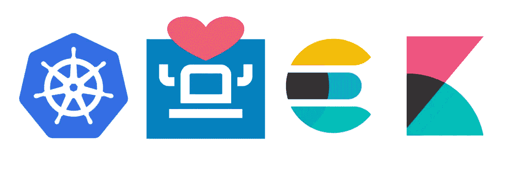

牧场主桌面让它变得如此简单！

## **唯一先决条件:从 https://rancherdesktop.io/**[**安装牧场主桌面**](https://rancherdesktop.io/)

就是这么简单:双击并获得一个 Kubernetes (K8s)集群！我一直在寻找这么简单的东西[有一段时间了](/rancher-desktop-and-nerdctl-for-local-k8s-dev-d1348629932a)，我非常感谢 SUSE/Rancher 实验室的伟大的人们！

[](https://jyeee.medium.com/rancher-2-4-14c31af12b7a) [## 这篇文章是对你的 Windows 10 笔记本电脑上的 Rancher 2.4 & Kubernetes 和 multipass & k3s 的更新——然后部署 ES+Kibana

### 这篇文章展示了如何使用 chocolatey & multipass 在 Windows 10 上设置一个最小的 k3s Kubernetes dev env，然后…

jyeee.medium.com](https://jyeee.medium.com/rancher-2-4-14c31af12b7a) 

一旦安装了 Rancher Desktop，您将拥有一个 K8s 集群，其中包含您需要的所有工具，包括 kubectl、nerdctl 和 helm！注意，所有这些工具都将被方便地配置为与您的本地集群一起工作😃

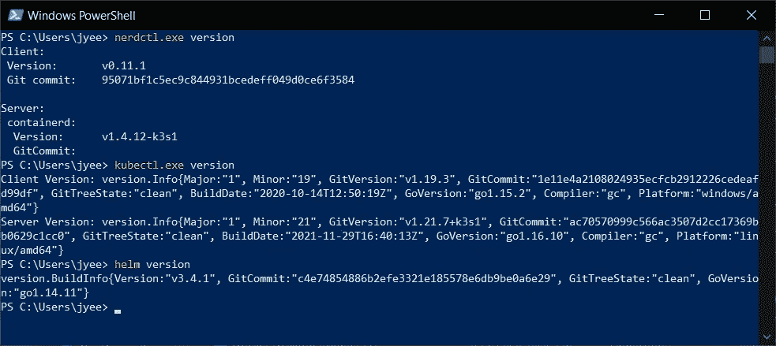

K8s 工具自动安装！

## 1/6 部署 Rancher 集群管理器先决条件证书-管理器 1.5.1

Rancher Cluster Manager 为观察和编辑从集群到用户的所有级别的 K8s 资源提供了一个极好的 GUI。你不需要有这个来运行 K8s，但是它让任务变得更简单，更容易观察。

要通过 helm 部署 Rancher，您需要首先部署 cert-manager 应用程序。我们将遵循 Rancher 文档中的说明:[https://Rancher . com/docs/Rancher/v 2.5/en/installation/install-Rancher-on-k8s/# 4-install-cert-manager](https://rancher.com/docs/rancher/v2.5/en/installation/install-rancher-on-k8s/#4-install-cert-manager)

通过 helm 部署工作负载的标准方式是:
1。为部署
2 创建一个名称空间。添加舵回购并更新
3。通过`helm install`安装应用程序

对于 cert-manager，需要执行两个额外的步骤，您必须安装 CustomResourceDefinition 资源并标记 cert-manager 名称空间以禁用资源验证。幸运的是，cert-manager 在其 install 命令中提供了这些参数😃

```
# Add the Jetstack Helm repository
helm repo add jetstack https://charts.jetstack.io

# Update your local Helm chart repository cache
helm repo update

# Install the cert-manager Helm chart
helm install cert-manager jetstack/cert-manager --namespace cert-manager --create-namespace --set installCRDs=true --version v1.5.1 --wait
```

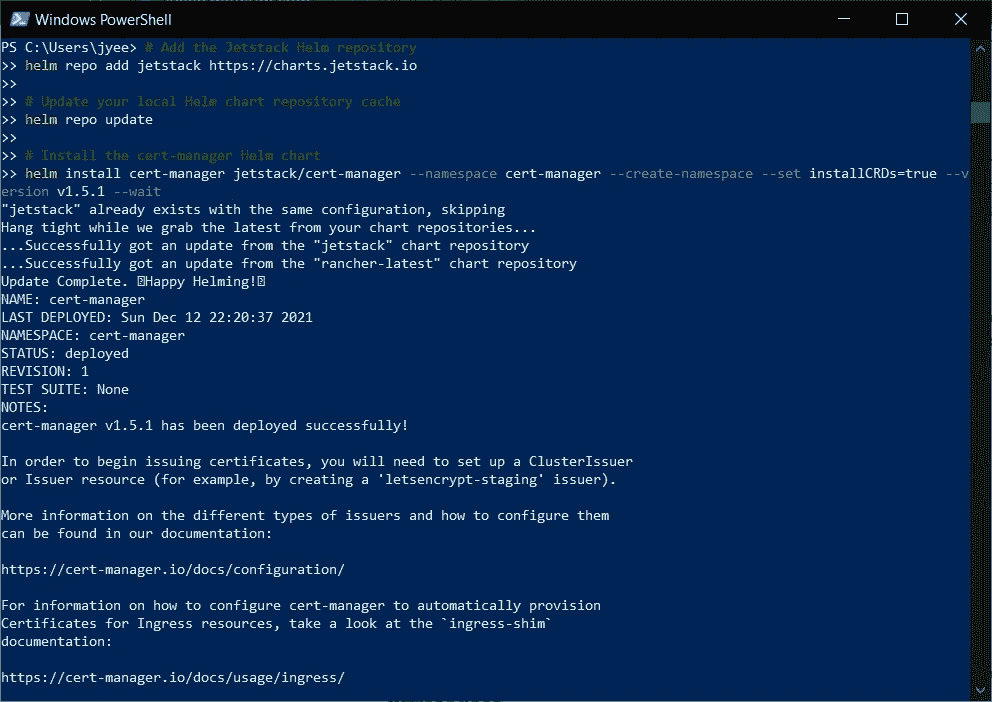

## 2/6 通过 helm 部署 Rancher 集群管理器

这应该与我们安装 cert-manager 的方式非常相似。我们将为我们的集群使用 [localhost magic](https://en.wikipedia.org/wiki/.localhost) ,这样我们就可以引导所有。本地主机流量到我们的 K8s 集群！

```
$env:RANCHER_SERVER_HOSTNAME="rancher.localhost"helm repo add rancher-latest  https://releases.rancher.com/server-charts/latesthelm repo updatekubectl create namespace cattle-systemhelm install rancher rancher-latest/rancher --namespace cattle-system  --set hostname=${env:RANCHER_SERVER_HOSTNAME} --set bootstrapPassword=admin --wait
```

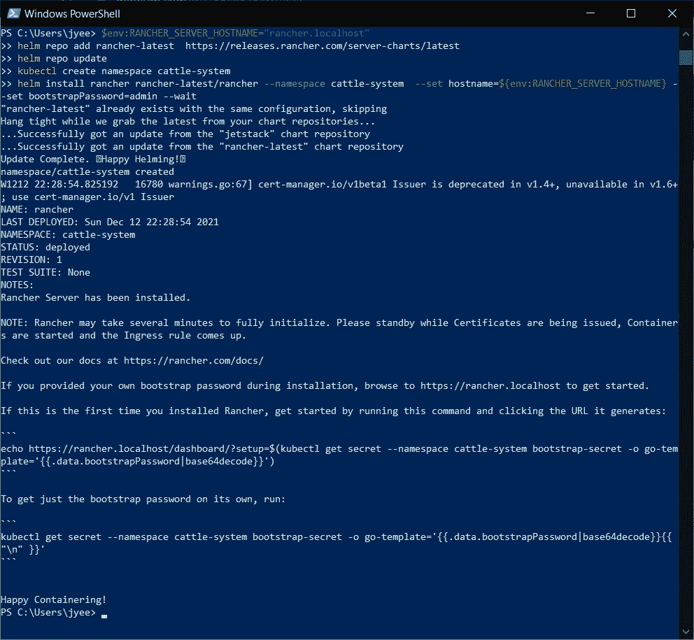

现在已经安装了 Rancher Cluster Manager，通过浏览到[https://Rancher . localhost](https://rancher.localhost)，登录到 GUI 来部署 Elasticsearch 和 Kibana。这使用了。本地主机魔术，重定向到我们的环回 127.0.0.1。您将在这里更新您的新密码(相对于我选择的默认管理员)

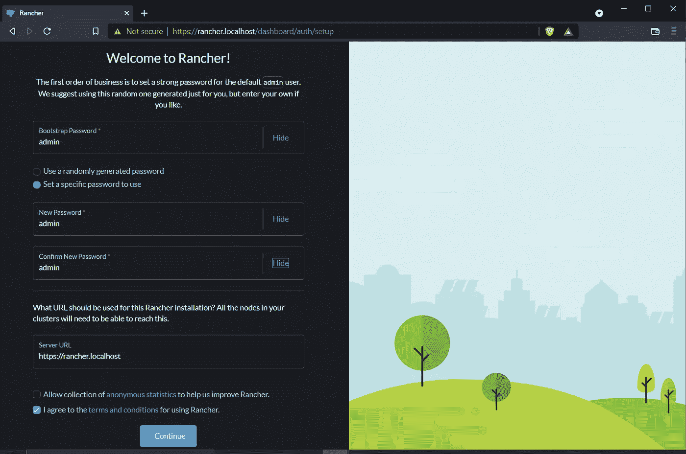

一旦进入，您将看到这样一个页面，其中显示了一个可用的`local`集群。这个本地集群是打算**只运行 Rancher 集群管理器**的集群。出于本文的目的，我们将部署其他工作负载，但是**您不应该在生产中这样做**

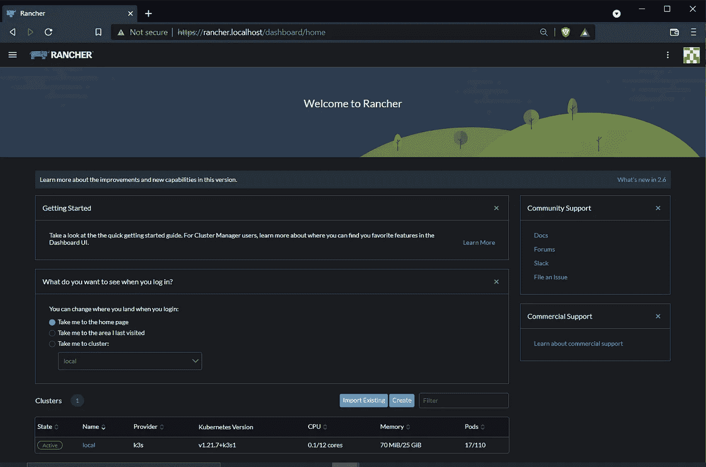

## 3/6 部署 Elasticsearch & Kibana —设置

> **在生产或其他任何不在你笔记本电脑上的地方，我建议你使用官方的 ES/Kibana 头盔图，就像这个**[https://bitnami.com/stack/kibana/helm](https://bitnami.com/stack/kibana/helm)

为了在您的笔记本电脑上部署 ES & Kibana，我们将使用*svelet Rancher 集群管理器 GUI* 来:
1。在本地集群
2 上创建一个牧场主项目 **ES** 。在 Rancher 项目中创建一个 K8s 名称空间，也命名为**es
3。在该名称空间中部署 ES 和 Kibana 工作负载**

点击`local`集群，进入 https://rancher.localhost/dashboard/c/local/explorer[页面](https://rancher.localhost/dashboard/c/local/explorer)

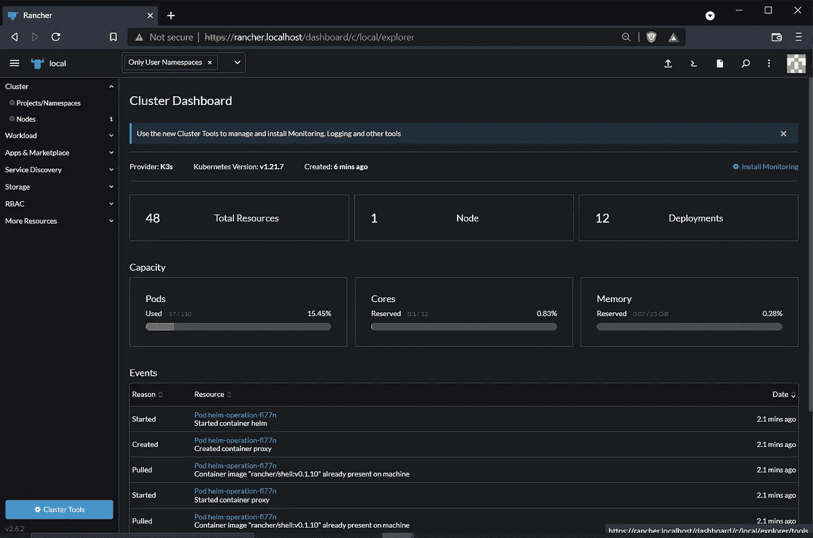

单击左侧的 Projects/Namespaces 并创建一个名为 es 的项目。请注意， ***项目是一个 Rancher 构造，它允许一个项目及其用户“拥有”多个 K8s 名称空间资源***

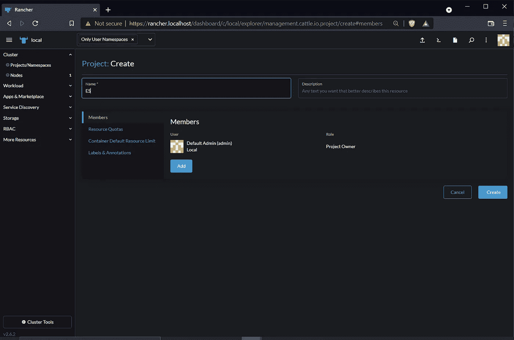

然后转到 ES 项目并创建一个名为 ES 的名称空间。

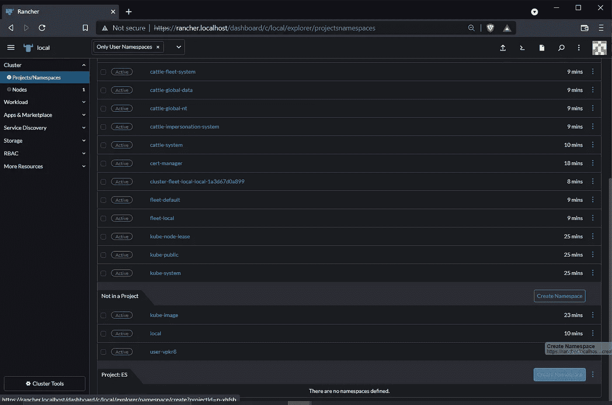

***记住，项目是一个 Rancher 构造，它允许一个项目“拥有”多个 K8s 名称空间资源*** 。一旦您创建了 Rancher 项目名称空间，让我们部署 Elasticsearch 工作负载部署。在左侧，单击 Workloads and Deployments 进入此屏幕并创建一个命名空间。

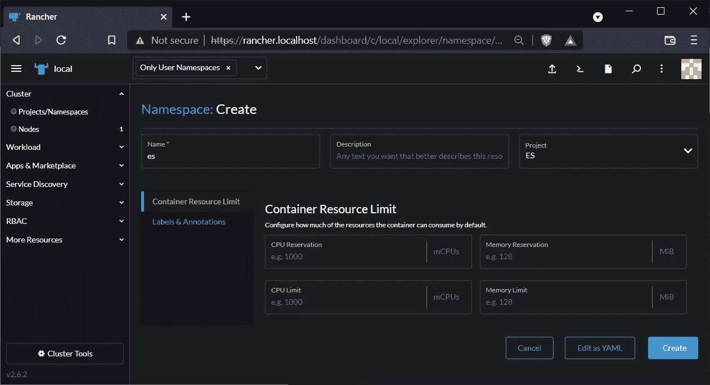

单击 Create 按钮，然后输入正确的参数，使用默认值创建一个 **es** 名称空间

## 4/6 部署专家系统

在左侧，单击工作负载→部署，然后单击右上角的**创建**按钮

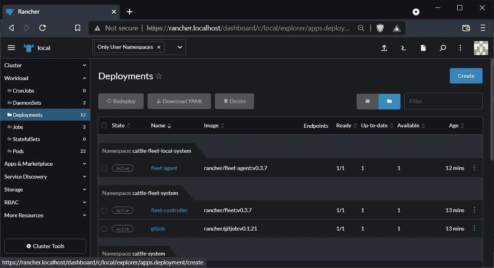

输入部署 Elasticsearch 的参数

*   命名空间:es
*   容器图片: **elasticsearch:7.14.2** 从[https://hub.docker.com/_/elasticsearch?tab=description](https://hub.docker.com/_/elasticsearch?tab=description)取回，截至泰勒·斯威夫特 32 岁生日🤩
*   更新端口以打开 9200 和 9300，并确保将服务类型设置为**集群 IP**
*   添加环境变量`discovery.type=single-node`

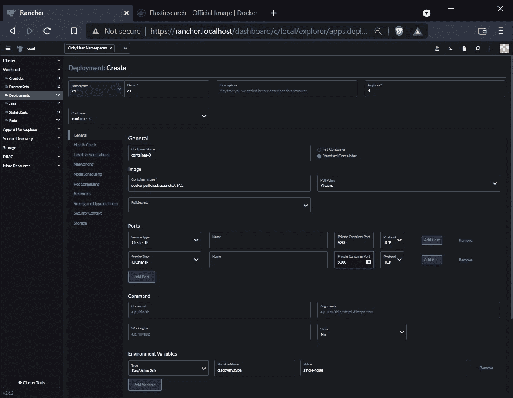

您可以点击`es`来查看部署的进展情况。开始可能需要几秒钟，但不会更多。如果花费的时间更长，您应该删除此工作负载并重新开始，以确保您完成了每个步骤。

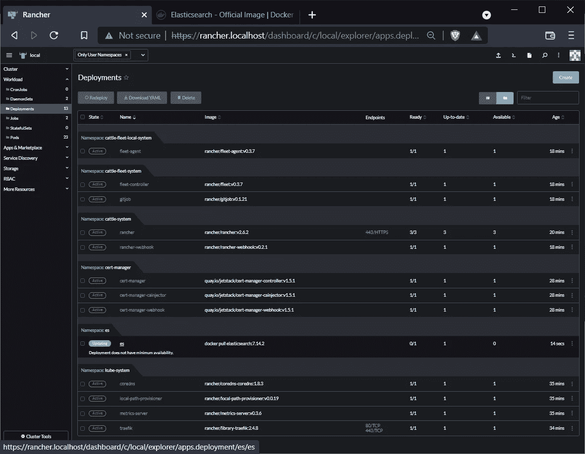

您还可以在 Rancher Cluster Management UI 中查看计划的 pod 和 Elasticsearch 部署的日志

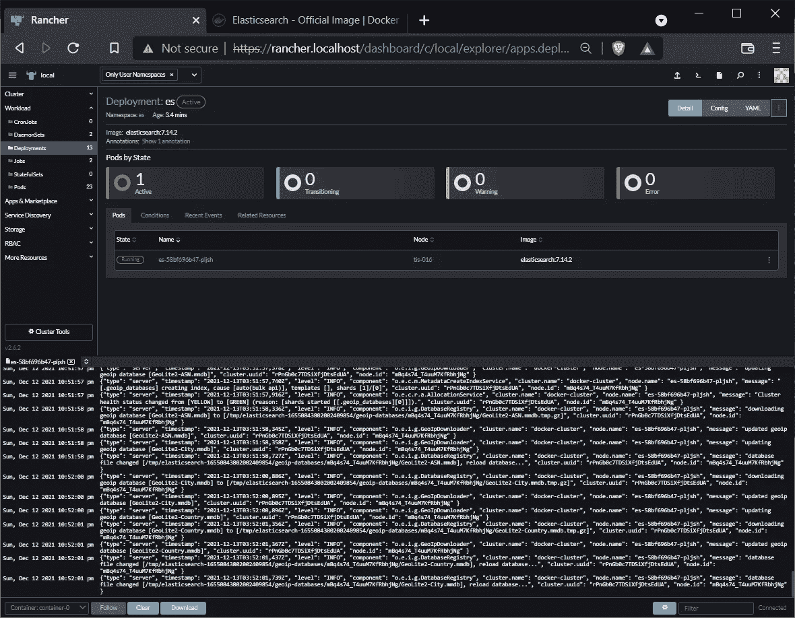

## 5/6 部署基巴纳

既然我们已经建立并运行了一个 Elasticsearch 数据库，让我们将一个 Kibana viz/management 应用程序连接到它！我们将按照相同的步骤，转到工作负载→部署，并使用这些参数部署 Kibana

*   命名空间:es
*   容器图像:基巴纳:7.14.2 从[https://hub.docker.com/_/kibana?tab=description](https://hub.docker.com/_/elasticsearch?tab=description)检索
*   更新端口以打开 5601 —将服务类型设置为**集群 IP**
*   为**elastic search _ HOST*S*=**[**设置一个 env 变量 http://es:9200**](http://es:9200/)

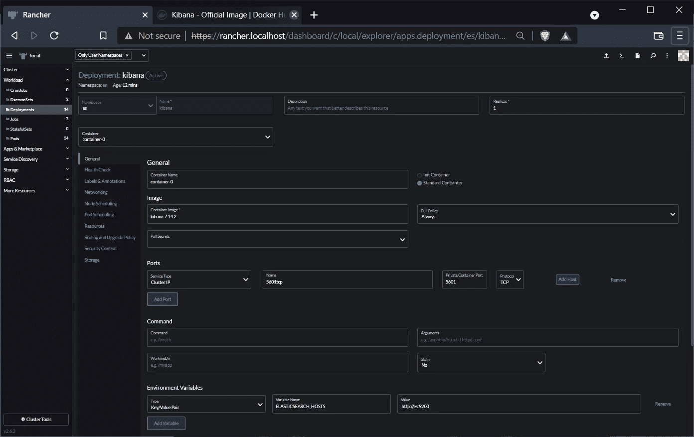

以下是 Kibana 运行时的日志

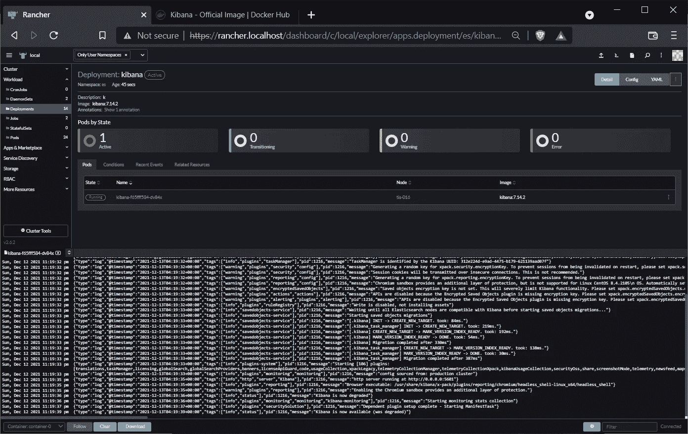

现在 Kibana 正在运行，让我们创建一个 K8s 入口，这样我们就可以访问它了。这是 K8s 的一个非常棒的安全特性——**你必须明确地为一个应用程序打开一个端口，否则它将保持内部安全**。

转到服务发现→入口并创建一个新入口。你可以看到牧场主已经有一个了！

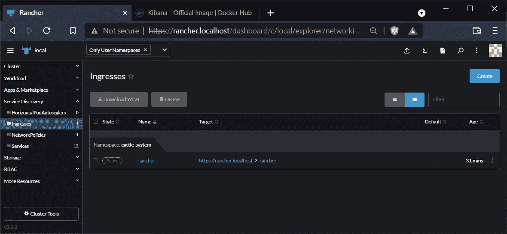

请务必正确遵循说明，尤其是集群 IP 服务，这样您就会看到创建新 K8s 入口的屏幕。我们会再次使用那个`localhost`魔法

*   命名空间:es
*   名称:基巴纳.牧场主.本地主机
*   规则。请求主机:kibana.rancher.localhost
*   规则。豆荚。路径:/
*   规则。目标服务:基巴纳(选择)
*   规则。豆荚。端口:5601(选择)

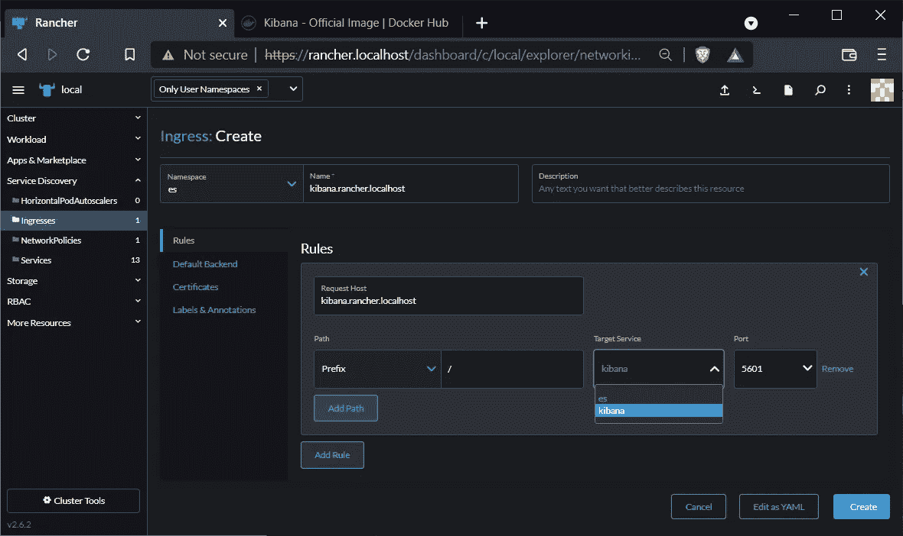

完成后，我们将看到一个带我们进入入口的 URL[http://ki Bana . rancher . localhost](http://kibana.rancher.localhost/app/home#/)

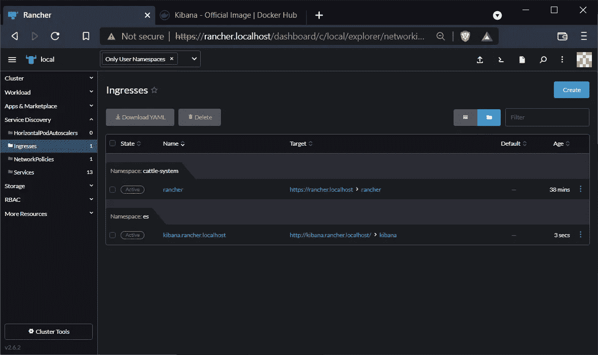

## 基巴纳的 6/6 虚拟化数据

现在我们可以浏览到[http://kibana.rancher.localhost/app/home#/](http://kibana.rancher.localhost/app/home#/)

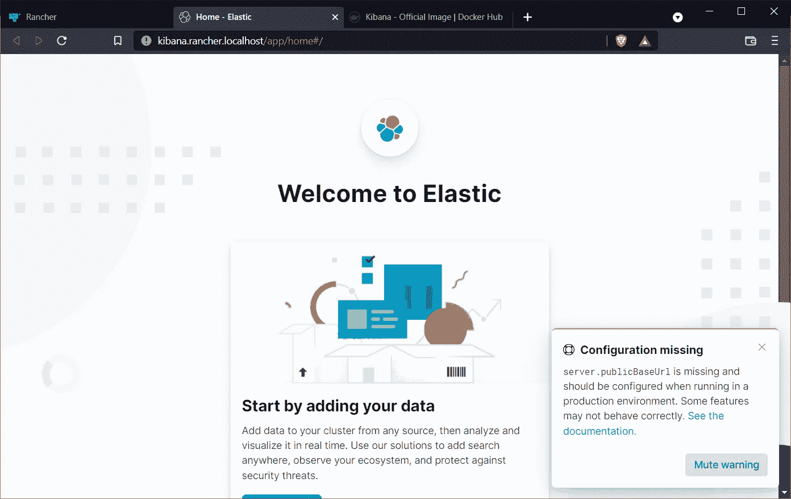

在选择添加数据之后，我挑选了样本数据并添加了样本 web 日志

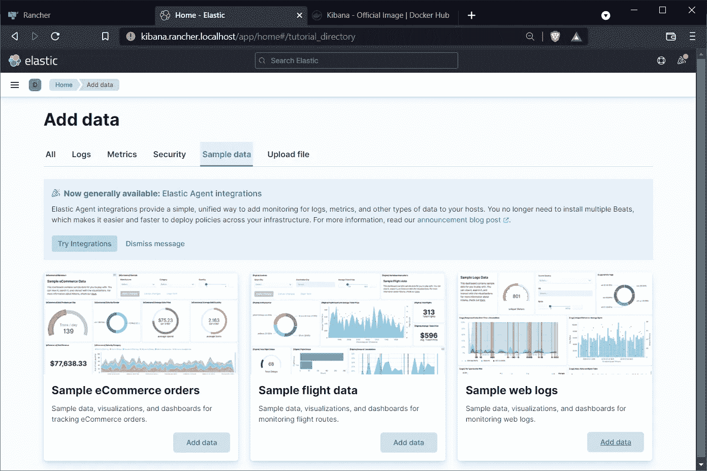

这提供了一些伟大的，尤其是桑基图表[http://kibana.rancher.localhost/app/dashboards](http://kibana.rancher.localhost/app/dashboards)

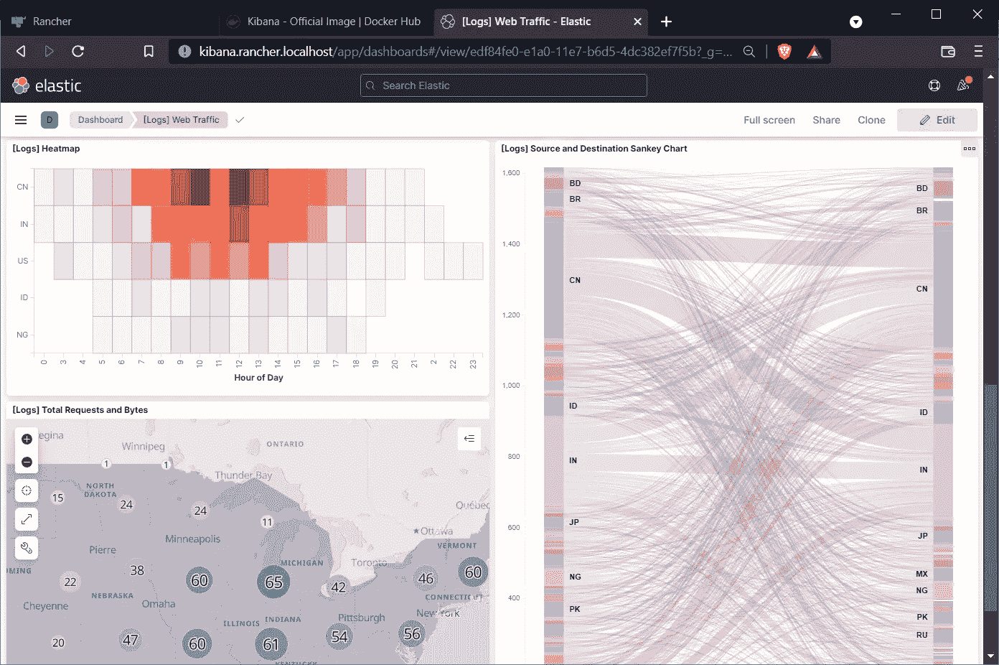

我希望你喜欢这条通过牧场主桌面到基巴纳的路！如果你想了解更多关于 K8s 的知识并部署一些应用程序，可以看看这些文章

[](/simplest-minimal-k8s-app-tutorial-with-rancher-desktop-in-5-min-5481edb9a4a5) [## 最简单的 K8s 应用程序教程，5 分钟内完成

### 本文为一个应用程序提供了最简单、最容易、最小化的 Kubernetes (K8s)集群和清单，您可以…

itnext.io](/simplest-minimal-k8s-app-tutorial-with-rancher-desktop-in-5-min-5481edb9a4a5) 

部署一个简单的 K8s app！

[](/rancher-desktop-and-nerdctl-for-local-k8s-dev-d1348629932a) [## 适用于本地 K8s 开发的 Rancher Desktop 和 nerdctl

### 我花了相当长的时间(2.6)试图(2.5)为 Kubernetes 初学者找出(2.4)一个好的本地开发设置(2.3)

itnext.io](/rancher-desktop-and-nerdctl-for-local-k8s-dev-d1348629932a) [](https://jyeee.medium.com) [## 贾森·易-中号

### 阅读杰森.易在媒体上的文章。问题解决者。每天，贾森·易和成千上万的其他声音读，写…

jyeee.medium.com](https://jyeee.medium.com)