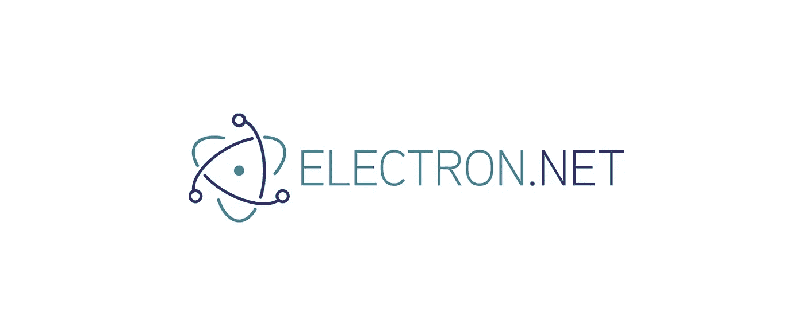

# 电子。NET:保存对话框和文件写入

> 原文：<https://itnext.io/electron-net-save-dialog-file-writing-6afa20d76c96?source=collection_archive---------5----------------------->



这篇文章是我的 Electron.NET 示例的另一个扩展，展示了如何用保存对话框提示用户并将文件写入磁盘。修改前的示例代码可以在[这里](https://github.com/elanderson/Electron.NET/tree/3b4e2c3a1d20b1215ea5691730935d922fdc353f)找到。正如我在 Electron.NET 发布的所有帖子一样，API 演示[回购](https://github.com/ElectronNET/electron.net-api-demos)帮了大忙。

对于本例，我们将向联系人详细信息页面添加一个导出按钮，将联系人导出为 JSON。

## 对话控制器

按照 API 演示的设置方式，我添加了一个 DialogController，代码如下。

```
public class DialogsController : Controller
{
    private static bool saveAdded;

    public IActionResult Index()
    {
        if (!HybridSupport.IsElectronActive || saveAdded) return Ok();

        Electron.IpcMain.On("save-dialog", async (args) =>
        {
            var mainWindow = Electron.WindowManager.BrowserWindows.First();
            var options = new SaveDialogOptions
            {
                Title = "Save contact as JSON",
                Filters = new FileFilter[]
                {
                    new FileFilter { Name = "JSON", 
                                     Extensions = new string[] {"json" } }
                }
            };

            var result = await 
                  Electron.Dialog.ShowSaveDialogAsync(mainWindow, options);
            Electron.IpcMain.Send(mainWindow, "save-dialog-reply", result);
        });

        saveAdded = true;

        return Ok();
    }
}
```

上面的设置告诉 Electron，当它接收到一个保存对话框请求时，显示操作系统的保存对话框和指定的选项。当用户完成对话交互时，它被设置，因此电子将发送一个保存-对话-回复消息，因此任何列表都可以根据用户的选择进行操作。

添加了 saveAdded 是为了解决我遇到的对话框多次显示的问题。关于我的设置有一些问题，我还没有时间去追踪，但我觉得即使有了这个 querk，这个帖子仍然是有价值的。

接下来，我将下面的导入添加到 _Layout.cshtml 文件中。

```
<link rel="import" href="Dialogs">
```

当我写这篇文章时，我想知道这是否是我的多重对话问题的原因？也许这应该只是在联系详情页面？

## 联系人详细信息页面更改

其余的更改在 Views/Contacts/Details.cshtml 中。我做的第一件事是在页面底部添加一个新的 div 和 button。基于现有页面的外观，它不是最漂亮的东西，但 UI 的外观并不是这篇文章的重点。下面是新 div 的代码。请注意，按钮有一个特定的 ID。

```
<div>
    <button id="save-dialog" class="btn">Export</button>
</div>
```

最后，添加了以下脚本部分。

```
<script>
    (function(){
        const { ipcRenderer } = require("electron");
        const fs = require('fs');
        var model = '@Html.Raw(Json.Serialize(@Model))';

        document.getElementById("save-dialog")
                .addEventListener("click", () => {
            ipcRenderer.send("save-dialog");
        });

        ipcRenderer.on("save-dialog-reply", (sender, path) => {
            if (!path) return;

            fs.writeFile(path, model, function (err) {
                console.log(err);
                return;
            });
        });

    }());
</script>
```

在服务器端，模型被转换成 JSON 并存储起来，在编写文件时会用到。如果有人有更好的方法来完成这一部分，我很乐意在评论中听到。我指的是这段代码。

```
var model = '@Html.Raw(Json.Serialize(@Model))';
```

接下来，一个 click 事件被添加到 export 按钮，该按钮被触发时会发送一条消息，显示在控制器中定义的保存对话框。

```
document.getElementById("save-dialog")
        .addEventListener("click", () => {
                                     ipcRenderer.send("save-dialog");
                                   });
```

最后，为用户已经完成所显示的对话框的消息添加一个回调。

```
ipcRenderer.on("save-dialog-reply", (sender, path) => {
    if (!path) return;

    fs.writeFile(path, model, function (err) {
        console.log(err);
        return;
    });
});
```

在回调中，如果用户输入了一个路径，那么模型的 JSON 将被写入所选的路径。

## 包扎

虽然将联系人写入 JSON 可能不是世界上最有用的事情，但同样的想法可以用于将信息写入 vCard 文件。

做完这个例子后，我终于感觉到我对电子是如何工作的有了更好的理解。希望这个系列能帮助你有同样的感觉。完整的代码可以在这里找到[。](https://github.com/elanderson/Electron.NET/tree/07a9faaceae7bd12290094345490990189677a6e)

*原载于* [*安德森*](https://elanderson.net/2018/06/electron-net-save-dialog-file-writing/) *。*