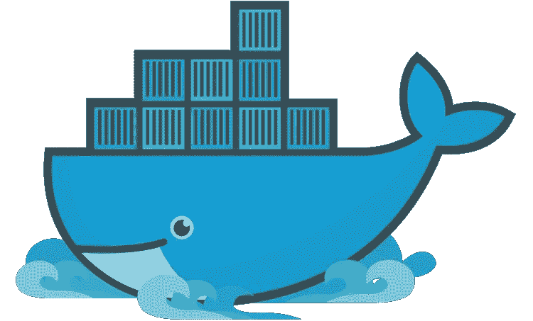

# 使用 BuildKit 启用 docker 构建

> 原文：<https://itnext.io/enabling-docker-builds-with-buildkit-a931c6f9aa91?source=collection_archive---------1----------------------->

## 介绍 Docker BuildKit

我是一名 SRE，我做的很多工作都与码头集装箱有关。围绕 docker 容器的大量工作都是在构建它们。有些 docker 文件非常简单，比如在 alpine/scratch 映像中添加一个 Go 二进制文件，而有些文件非常复杂，尤其是在使用多阶段构建时。在后一种情况下，除了创建映像之外，通常还会用 docker 构建二进制文件。有时，在这种情况下，运行 docker 构建命令可能需要几分钟以上的时间(例如 [Argo-CD](https://github.com/argoproj/argo-cd/blob/master/Dockerfile) 大约需要 12-15 分钟，尽管并不只是创建一个映像)。



从 Docker 18.09 开始，有一种新的构建图像的方式叫做 [BuildKit](https://docs.docker.com/develop/develop-images/build_enhancements/) 。这被认为是 docker 版本的 V2，目前它甚至不是 Docker 19.03 的默认方式，你需要启用它。激活它最简单的方法是设置一个环境变量: *DOCKER_BUILKIT=1* 。这个 V2 增加了许多有趣的功能，其中一些是开箱即用。此外，生成的 docker 映像类似于用普通构建创建的映像，因此运行该映像或将其推送到注册表应该不会有任何问题。

## BuildKit 性能改进

在正常的 docker 构建中，每一层都是按顺序构建的，您需要等待第 n 层构建 n+1。这个限制最初并不明显，但是随着多阶段构建的引入，它变成了一个更大的问题，因为您可以并行地开始更多的步骤，直到它们相互依赖。因此，通过引入一些并行性，可以节省宝贵的时间。

为了找出哪些步骤可以并行构建，哪些步骤需要相互等待，BuildKit 将构建一个依赖关系图，并使用它来提高构建效率。docker 构建命令的输出将与您之前使用的完全不同，其中一些步骤并行运行，类似于下面的内容(您可以看到#4 与#10 并行运行):

```
#2 [internal] load build definition from Dockerfile
#2 transferring dockerfile: 1.15kB done
#2 DONE 0.0s

#1 [internal] load .dockerignore
#1 transferring context: 2B done
#1 DONE 0.0s

#3 [internal] load metadata for docker.io/library/openjdk:8
#3 DONE 1.7s

#4 [1/8] FROM docker.io/library/openjdk:8@sha256:291ef47999c4ee7160cc1208ff...
#4 resolve docker.io/library/openjdk:8@sha256:291ef47999c4ee7160cc1208ff49244bf93a43b7eca1c31842615fc529efc24e done
#4 ...

#10 [internal] load build context
#10 transferring context: 10.60kB done
#10 DONE 0.0s

#4 [1/8] FROM docker.io/library/openjdk:8@sha256:291ef47999c4ee7160cc1208ff...
```

性能并不是 BuildKit 提供的唯一改进，但是我们可以在不对 Dockerfile 文件进行任何更改的情况下就获得它。这是我接下来想要检查的，如何在多阶段 docker 构建上启用 BuildKit，以及它是否真的是一个显著的改进。

## 使用 BuildKit 构建 ArgoCD

因此，让我们通过将 BuildKit 引入到一个真实的项目中，并将其与普通的构建进行比较，来看看我们是否真的能从中受益。一个很好的候选是 ArgoCD，因为它有一个复杂的 docker 文件和构建图像所花费的时间(他们通过使用多个目标从一个 docker 文件构建多个图像)。我的计划是在本地克隆它，将其推送到我的帐户(不是 fork，因为我不打算创建 PR)，禁用现有的 GitHub 工作流，添加两个简单的新工作流，只以标准方式和 BuildKit 方式构建图像，然后比较运行它 5 次的结果。

所以首先我在 github 上创建了一个名为 argocd-buidkit 的空的新项目。然后我把原来的 argo-cd 项目，克隆到本地，去掉遥控器，把这个 argocd-buldkit 作为一个新的遥控器添加进去，推送给它。最后我以 [argocd-buildkit repo](https://github.com/lcostea/argocd-buildkit) 结束。

然后我创建了两个新的 GitHub 动作，一个以正常方式构建图像，另一个使用额外的 env 变量来启用 BuildKit。这是增加了变量的第二个例子，与第一个例子的唯一区别是增加了最后两行(28 & 29)。

您可以查看我在 argocd-buildkit 项目的[动作部分执行的运行。](https://github.com/lcostea/argocd-buildkit/actions)

第一轮:

*   [Docker-Image-Standard](https://github.com/lcostea/argocd-buildkit/actions/runs/340202242):13m 27s
*   Docker-Image-build kit:12 米 13 秒

第二轮:

*   [Docker-Image-Standard](https://github.com/lcostea/argocd-buildkit/actions/runs/340424391):14m 11s
*   [Docker-Image-build kit](https://github.com/lcostea/argocd-buildkit/actions/runs/340424392):10m 56s

第三次运行:

*   [Docker-Image-Standard](https://github.com/lcostea/argocd-buildkit/actions/runs/340568618):12m 43s
*   [Docker-Image-build kit](https://github.com/lcostea/argocd-buildkit/actions/runs/340568617):11m 19s

第四轮:

*   [Docker-Image-Standard](https://github.com/lcostea/argocd-buildkit/actions/runs/340591871):13m 49s
*   Docker-Image-build kit:12 米 29 秒

第五次运行:

*   [Docker-Image-Standard](https://github.com/lcostea/argocd-buildkit/actions/runs/341238041):12m 59s
*   [Docker-Image-build kit](https://github.com/lcostea/argocd-buildkit/actions/runs/341238096):12m 59s

显然存在一些差异，与标准运行相比，BuildKit 版本花费的时间少了 3.5 分钟，但一次花费的时间完全相同。需要特别说明的是，这不是 docker build 的一个实验性特性，因为实验性特性不建议在生产中使用。相反，这是一个选择加入的。

但是有任何已知的项目实际上使用 BuildKit 来创建它们的 docker 映像吗？在 CNCF 空间，我发现了 [dex](https://github.com/dexidp/dex) ，这是一个身份服务，它使用 [OpenID Connect](https://openid.net/connect/) 来驱动其他应用的认证。而 dex 是 ArgoCD 内部使用的。如果你去看看它的工作流程，在 docker 部分你会看到它使用了 [buildx](https://docs.docker.com/buildx/working-with-buildx/) (这实际上是一个实验性的特性，但是在 [20.10](https://github.com/moby/moby/milestone/76) 版本中它可能会停止实验)，它在下面使用 BuildKit 来创建 docker 图像。

所以使用 BuildKit 应该没有问题，除了性能之外，它还有许多其他特性。但是，如果您仍然有疑问，您可以首先尝试使用您的内部映像，如 CI/CD 中使用的映像或您的内部工具，在您建立更多信心后，您可以使用您的生产映像。