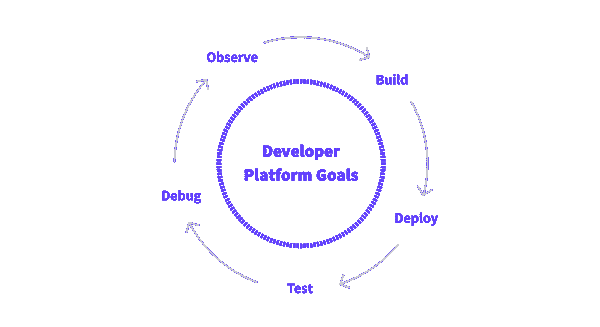
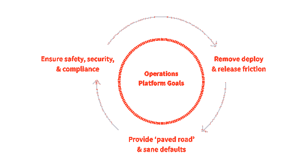
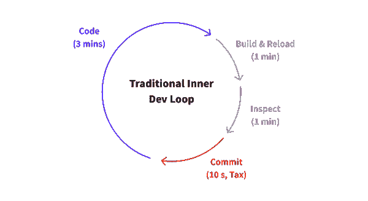
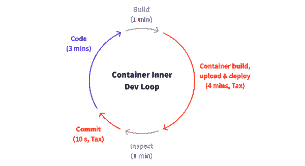

# 支持全周期开发:四大核心云平台能力

> 原文：<https://itnext.io/enabling-full-cycle-development-four-core-cloud-platform-capabilities-8670e5a4cd04?source=collection_archive---------4----------------------->

## 容器管理、渐进交付、边缘管理和可观察性

云计算和容器编排框架为部署和运行现代软件应用程序提供了良好的基础。然而，为了让这些技术支持向“全周期开发”的转变——开发者从想法到交付拥有越来越多的所有权——对于开发和平台/SRE 角色来说，有几个需求必须被满足。为了支持这些需求，许多团队设计并构建了一个平台，通常使用 Kubernetes 作为基础。该平台必须专注于提供自助服务功能，并且必须支持四个核心功能:容器管理、渐进式交付、边缘管理和可观察性。

在本系列的第一部分中，我们讨论了主题[“为什么是原生云？”](https://www.getambassador.io/resources/why-cloud-native)详细。本文将探索新的开发/运营需求，概述四个核心平台功能，并提供在构建应用程序平台时避免常见反模式的指导。

# 全周期开发人员:更多反馈，更快

当采用云原生方法时，开发人员需要能够独立运行整个 SDLC。他们需要快速完成这项工作，并确信他们正在为最终用户增加价值(并且不会造成任何意想不到的负面影响)。开发人员希望在容器中构建和打包应用程序，并且只依赖自助服务界面和自动化(由平台团队提供)来测试、部署、发布、运行和观察生产中的应用程序。

这种快速的反馈循环支持开发人员变得更加以客户为中心。这使得能够交付更多的功能，目标是以可重复的方式向最终用户提供更多可验证的价值。

# 平台团队:消除摩擦，增加安全

平台团队需要能够提供三个主要功能:

*   消除将应用程序打包到容器中的摩擦，以及部署和发布功能的摩擦。
*   允许观察系统行为，并设置合理的默认值和警报，以防止平台内的意外功能导致级联故障。
*   协助组织了解并满足安全和法规要求。

持续交付的基本目标集中在能够以业务所需的快速和稳定的方式向最终用户交付功能。创建一个支持平台对此至关重要，同样重要的是创建一个有效的开发者体验(DevEx ),以便通过工具和 API 与平台进行交互。

# 四大核心云平台功能

将到目前为止讨论的所有需求结合在一起，可以得出云原生平台必须提供的四个核心功能:容器管理、渐进式交付、边缘管理和可观察性管理。

## 集装箱管理

这是在各种基础设施上大规模管理和运行基于容器的应用程序的能力。开发人员应该能够以一种自助的方式执行这些操作，这种方式很容易自动化和观察。该功能还必须允许平台团队围绕访问、控制和可审计性设置策略。

## 渐进式交货

这种能力集中于支持管道的创建，使开发人员能够自动构建、验证、部署、发布和观察应用程序。这一能力还应支持平台团队集中进行质量和安全属性的编码和验证。

## 边缘管理

有效的边缘管理应该支持开发人员自助发布新功能。它还应支持 sane 默认值的集中配置，如用于 DDoS 保护的 TLS 实施和速率限制，以及与流量管理相关的其他跨职能要求的分散配置，如 authn/z、重试和电路中断。

## 可观察性

这种能力应该支持开发人员和平台团队直接收集和分析最终用户和应用程序的反馈。这允许产品团队迭代业务目标和 KPI，并支持平台团队观察和管理基础设施，并确保满足他们的服务级别目标(SLO)。

# 避免平台反模式

乍一看，提供一个能提供所有四种功能的平台似乎相对简单。然而，在最近的软件开发历史中，已经发现了许多平台反模式。无论一个组织是购买云原生平台还是一次构建一个 sprint，都有一些必须避免的常见错误。

## 集中设计和所有权:一种尺寸不适合所有人

许多在组织内部创建平台的早期尝试都是由一个单独的操作团队驱动的，没有与开发团队协作。这些平台的所有权往往是集中的，设计工作提前完成，最终的平台在操作上通常是单一的。为了使用该平台，开发人员必须通过票证与运营团队进行通信，以完成任何事情，例如部署工件 X、打开端口 Y 和启用路由 z。

这些平台通常只支持有限的“核心”用例，这些用例被确定为前期设计过程的一部分。当开发人员想要设计和部署更模块化的系统，或者实现新的通信协议时，问题经常出现。例如，随着开发人员接受微服务架构风格，他们经常在系统边缘暴露更多的 API。他们还为应用程序采用了多种协议:类似 REST 的交互用于资源操作，WebSockets 用于流数据，gRPC 用于低延迟 RPC 调用

随着开发人员远离一刀切的规范，这越来越意味着为运营团队筹集越来越多的门票。移交的高成本和经常不适当(或变化缓慢)的平台的结合意味着开发人员不能以业务需要的速度发布软件。这通常会导致开发团队将事情掌握在自己手中。

## 分散的平台实现

集中式平台设计和所有权模式的失败导致了相反方向的转变。独立的服务开发团队开始构建他们自己的微平台。这通常表现为粗粒度的访问点暴露在系统的边缘，将所有最终用户请求转发给几个开发团队管理的反向代理或 API 网关之一。开发人员可以完全控制这些端点。然而，团队间的合作往往很少。个别服务通常配置为使用第三方身份验证和授权服务，导致身份验证蔓延。支持可用性和可靠性目标的能力是通过特定于语言的库以特别的方式实现的。

这种失败的模式导致许多团队重新发明(微妙不同的)轮子。甚至流行的开源库，如网飞的 Hystrix 断路器，在不同的语言平台上也有细微的不同。碎片化意味着很难确保可用性、可靠性和安全性的一致性。因为所有这些特性都被嵌入到每个应用程序中，所以每个团队都必须使用不同的工作流来部署、测试和观察他们的应用程序。缺乏共同的开发人员经验通常会带来额外的挑战。

## 缓慢的开发循环:更少的时间编码，更多的时间辛苦工作

云原生技术也从根本上改变了开发人员的体验。现在，不仅工程师需要设计和构建基于分布式服务的应用程序，他们的整个开发循环也被打乱了。开发人员再也不能依赖单一的应用程序开发最佳实践，例如检查整个代码库，并使用快速“实时重新加载”的内部开发人员循环在本地编码。他们现在必须管理外部依赖关系，构建容器，并实现编排配置(例如 Kubernetes YAML)。乍一看，这似乎微不足道，但是这对开发时间有很大的影响。

如果一个典型的开发人员一天编码 360 分钟(6 小时)，传统的本地迭代开发循环为 5 分钟——3 次编码，1 次构建，即编译/部署/重新加载，1 次测试检查，10-20 秒提交代码——他们可以期望每天进行大约 70 次代码迭代。这些迭代中的任何一个都可能成为发布候选。这里支付的唯一“开发人员税”是提交过程，可以忽略不计。

如果构建时间增加到 5 分钟——对于标准的容器构建、注册表上传和部署来说，这并不常见——那么每天可能的开发迭代次数就会减少到大约 40 次。在极端情况下，即将发布的潜在新功能减少了 40%。这个新的容器构建步骤是一种隐性税收，相当昂贵。

许多开发团队开始使用定制代理来自动并持续地将他们的本地开发代码库与远程代理同步(在远程集群中启用“实时重载”)，或者将所有远程服务流量路由到他们的本地服务进行测试。前一种方法对编译语言的价值有限，后一种方法通常不支持团队内部的协作，因为团队中有多个用户希望使用相同的服务。

除了内部开发循环的挑战之外，不断变化的外部开发循环也带来了问题。在过去的 20 年里，最终用户和客户变得越来越苛刻，但也越来越不确定他们的需求。由网飞、Spotify 和谷歌等颠覆性组织开创的这一模式，导致软件交付团队需要能够快速将实验交付到产品中。单元、集成和组件测试仍然非常重要，但是现代应用程序平台还必须支持向最终用户逐步发布功能和应用程序，以便允许在生产中进行测试。

软件工程师的代码合并、代码审查、构建工件、测试执行和部署的传统外部开发循环现在已经发展了。一个典型的现代外部循环现在由代码合并、自动化代码审查、构建工件和容器、测试执行、部署、受控(canary)发布和结果观察组成。如果开发人员不能访问发布的自助服务配置，则该外部循环所花费的时间至少增加一个数量级，例如，部署更新的 canary 发布路由配置需要 1 分钟，而提出要通过平台团队修改的路由的票据需要 10 分钟。

# 后续步骤

介绍了支持全周期开发的动机，定义了云原生平台的四种功能，强调了一些反模式，接下来呢？答案是设计和构建一个有效的平台来支持团队和工作流程。对于一个将在 2020 年迁移到云的组织来说，这个平台很可能基于一种技术，这种技术已经迅速成为事实上与供应商无关的计算抽象:Kubernetes。我们将在下一篇文章中更详细地讨论这个问题。

要了解有关在您的组织中实现这些转变的更多信息，请单击此处下载我们的白皮书[“Kubernetes 平台的 4 个基本要素”](https://www.getambassador.io/downloads/whitepaper-4-essential-elements-kubernetes-platform.pdf)。

我将在下周发表该系列的第三部分。在此之前，我非常希望听到您的反馈和意见。