# 端到端指南:用 Kubernetes 启动 Wordpress 网站

> 原文：<https://itnext.io/end-to-end-guide-launch-wordpress-website-with-kubernetes-4e8788f5ee41?source=collection_archive---------1----------------------->

## 用 Google Kubernetes 引擎和 Wordpress 创建我的第一个个人网站时，我从不同的渠道学到了很多东西。为了社区的利益，记录这些知识是值得的。

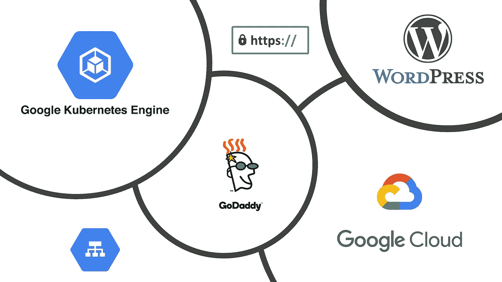

[https://microlearninghub.com/](https://microlearninghub.com/)

用 Kubernetes、Google Cloud 和 Wordpress 实现一个端到端的网站涉及到许多移动部分。如果你在建立你的 Wordpress 网站时需要帮助，请随时拨打 imarunrk@gmail.com[的电话联系我](mailto:imarunrk@gmail.com)

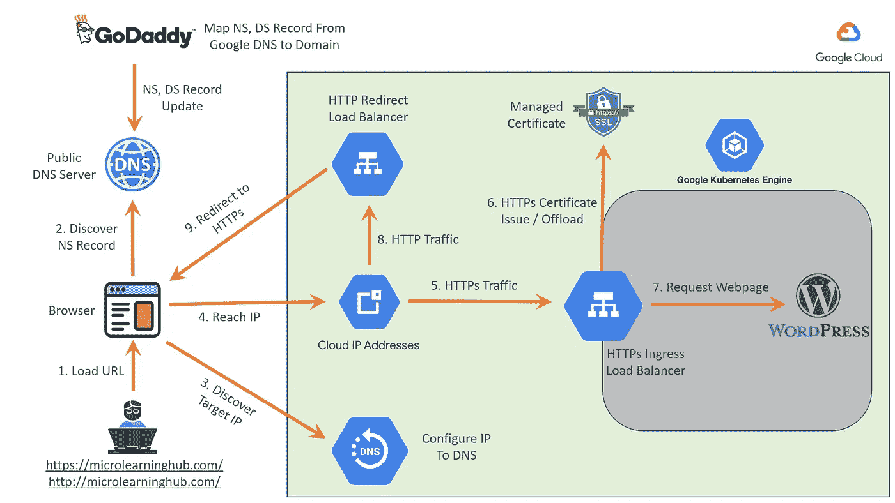

*   购买域名
*   设置一个免费的谷歌云账户
*   推出谷歌 Kubernetes 引擎
*   将 Wordpress 部署到 Kubernetes
*   为入口负载平衡器生成 HTTPs 证书和静态 IP
*   创建一个 Google DNS 配置，将静态 IP 和名称服务器配置与域进行映射
*   设置负载平衡器以仅允许 HTTPs 流量，并将 HTTP 流量重定向到 HTTPs

## 购买域名

有许多网站购买域名。我在 GoDaddy (microlearninghub.com)购物。不管你在哪里购买域名，你几乎要经历相同的步骤。我们必须根据购买的域名设置名称服务器(NS)和数字签名(DS)记录。

> 提示:对于 DS 记录更新，GoDaddy 希望我们以额外的费用为该域名购买附加产品(DNSSEC 和高级域名系统)。当你与其他网站比较购买成本时，考虑任何额外的附加购买。

HTTPs 安装需要 DS 记录。要用 GoDaddy 购买这些附加产品，请访问 [**域控制中心**](https://dcc.godaddy.com/domains?showAdvanceListView=true&prog_id=PROG_ID) **> >** 选择合适的域，> >点击更多> >点击附加产品


这将把我们带到升级页面，然后转到 DNS 部分购买附加产品 DNSSEC &高级 DNS。

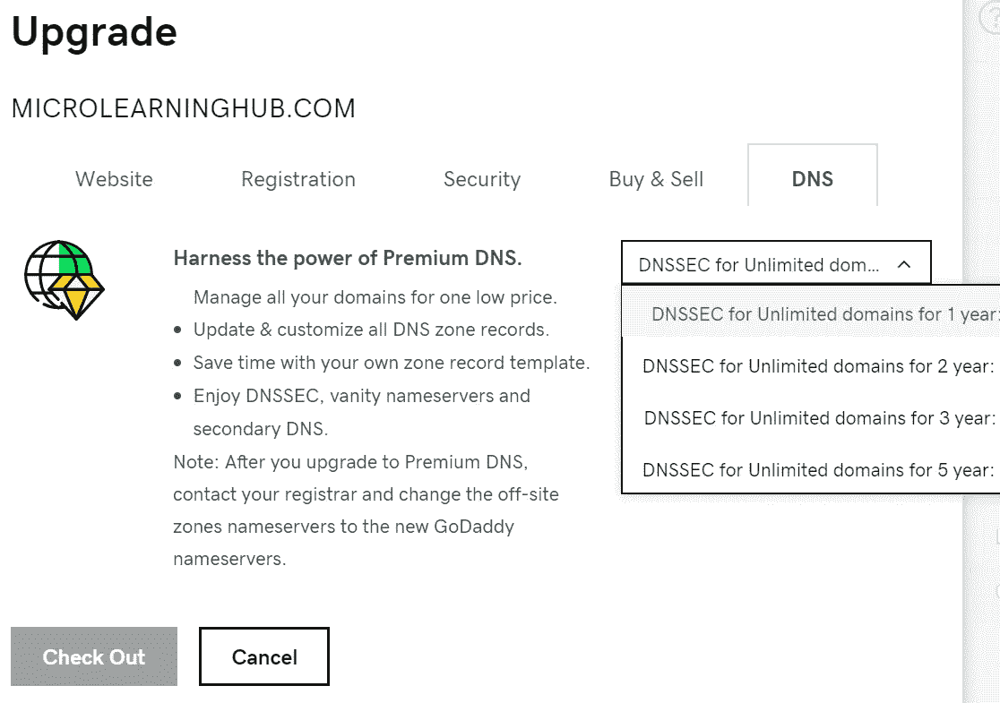

## 谷歌云静态 IP 和 DNS 配置

任何人都可以使用 Gmail id 创建一个谷歌云帐户，并激活 300 美元的免费信用，以购买谷歌云平台产品，并免费试用一年。在这里 阅读更多关于如何得到这个 [**的内容。在你的电脑上安装谷歌云软件开发套件的下一步。只是一个**](https://cloud.google.com/free) **[**”。exe"**](https://cloud.google.com/sdk/docs/quickstart-windows) 为 windows PC 安装。其他操作系统请在此处阅读[](https://cloud.google.com/sdk/docs/quickstarts)**。****

**一旦您安装了正确的 google 帐户和 SDK，让我们通过执行以下命令来创建一个静态 IP。**

```
#Create IP, microlearninghub-ip our choice of name***gcloud compute addresses create microlearninghub-ip --global***#This will read and show us the created IP***gcloud compute addresses describe microlearninghub-ip  --global***
```

**进入谷歌云 [**控制台**](https://console.cloud.google.com/)***网络服务> >云 DNS* 然后点击*创建区域*****

********

****给你选择的区域起一个名字，保持区域类型为公共，用你购买的域名填充 DNS 名称，保持 DNSSEC“开”，可选地给出一个描述，然后点击创建。****

****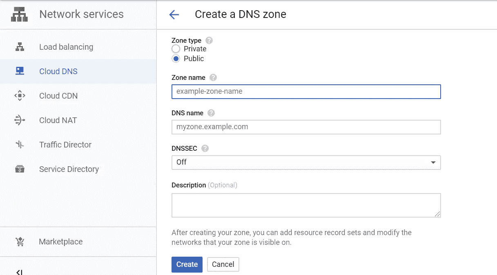****

****您的 DNS 区域将被创建。单击“*添加记录集*”将“A”记录添加到分区，并将其与创建的静态 IP 进行映射。应该有一个“A”记录到域和每个子域。****

************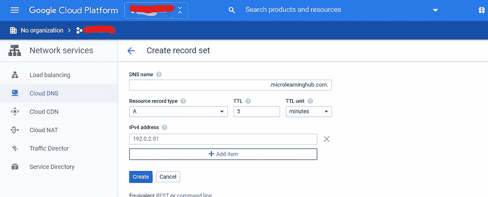****

****看一下自动创建的 NS 记录，手动创建 A，以及下面截图中 DS 记录的“*注册设置*”。****

****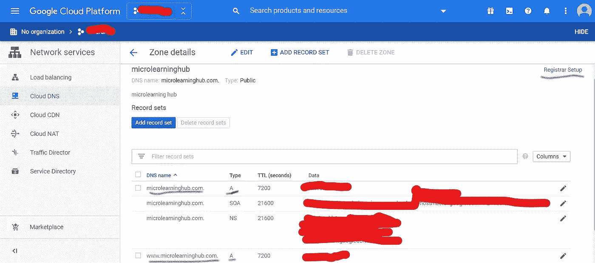********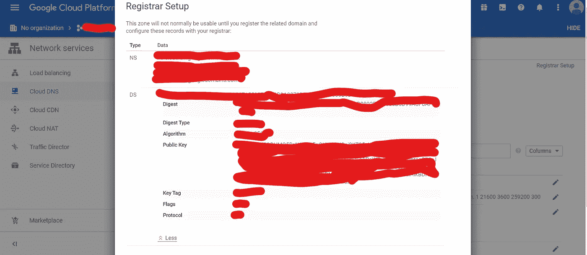****

****现在您有了 NS 和 DS 记录，我们必须将其映射到 GoDaddy 门户中的域配置中。访问 GoDaddy [**域控制中心**](https://dcc.godaddy.com/domains?showAdvanceListView=true&prog_id=PROG_ID) 更新 DS 和 NS 记录。DS 和 NS 记录的值应该从我们刚刚创建的 google cloud“托管区域”中复制。****

****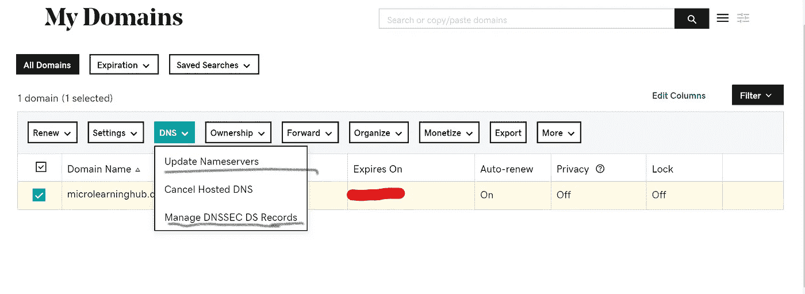****

****有一个工具可以检查我们是否正确地完成了所有的配置。给所有这些配置 15 分钟的思考时间。****

```
**Visit the below link, input you domain name and press enter to see if every thing is green.[https://dnssec-analyzer.verisignlabs.com/](https://dnssec-analyzer.verisignlabs.com/microlearninghub.com)**
```

****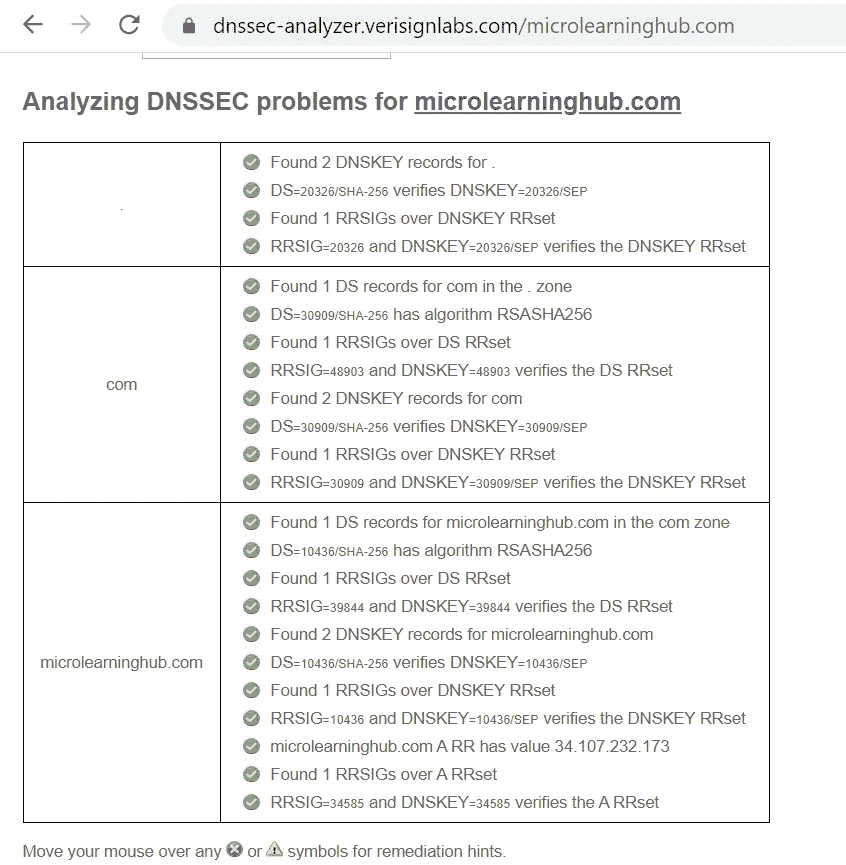****

## ****创建 GKE 集群并部署 Wordpress****

****我们将使用 Google Kubernetes 引擎来部署 Wordpress 并创建我们的博客文章。在 GKE 建立一个集群非常简单。转到顶部中间的搜索栏并键入 GKE，或者转到左上角的菜单并导航到计算部分下的 Kubernetes Engine，然后单击集群。您将进入“GKE 集群”页面，并可以在那里创建一个集群。****

> ****提示:大多数默认选项对于托管 Wordpress 网站是有意义的。您可以改变的一件事是节点的数量。我们应该有一个单节点集群，以保持免费信用慢慢燃烧。默认值为 3。****

****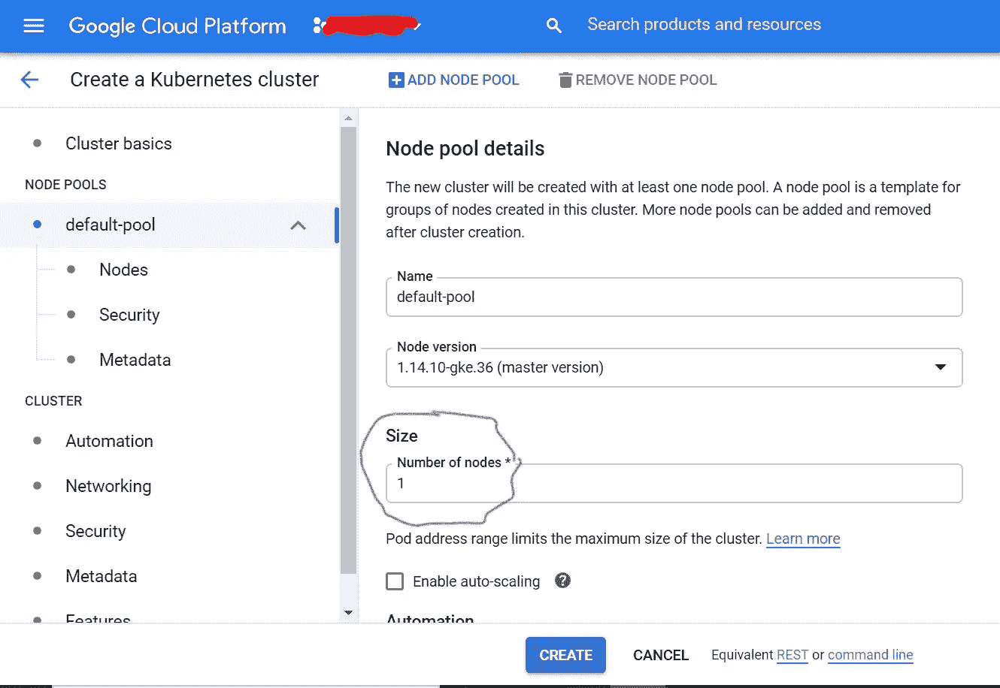****

****一旦集群启动并运行，现在我们必须在您的本地 PC 上设置" *kubectl* "集群配置。如果你还没有安装 kubectl，每个操作系统都有自己的方法。更多关于那个 [*的阅读这里*](https://kubernetes.io/docs/tasks/tools/install-kubectl/) 。一旦您安装了 *kubectl* ，现在我们必须连接到为您的本地创建的集群。只需通过单击下图所示的连接按钮复制命令，并在本地终端中运行它。这使得您的本地 *kubectl* config 指向刚刚创建的 GKE 集群。****

********

****接下来，让我们安装 WordPress。谷歌云让这件事变得非常简单。有一个点击部署[选项](https://console.cloud.google.com/marketplace/details/google/wordpress)，帮助你点击部署 WordPress 到现有的 GKE 集群。****

****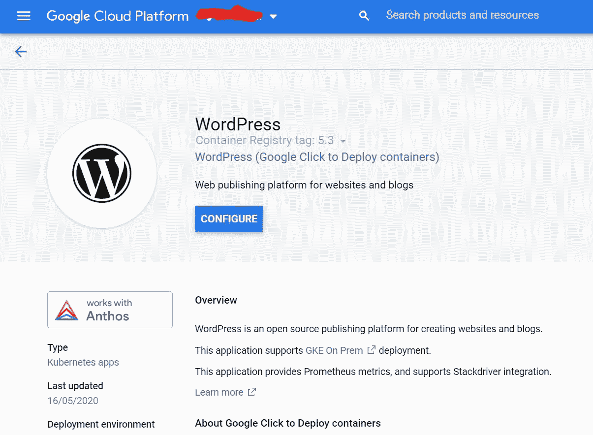****

****点击配置将要求我们选择需要安装 WordPress 的 GKE 集群和名称空间。****

> ****提示:将 WordPress 安装在一个单独的名称空间中，这样您就可以很好地管理它。如果尚未创建，您可以在同一个屏幕上创建它。****
> 
> ****提示:**永远不要**启用公共 ip，因为我们稍后会用适当的 HTTPs 来设置它。****

****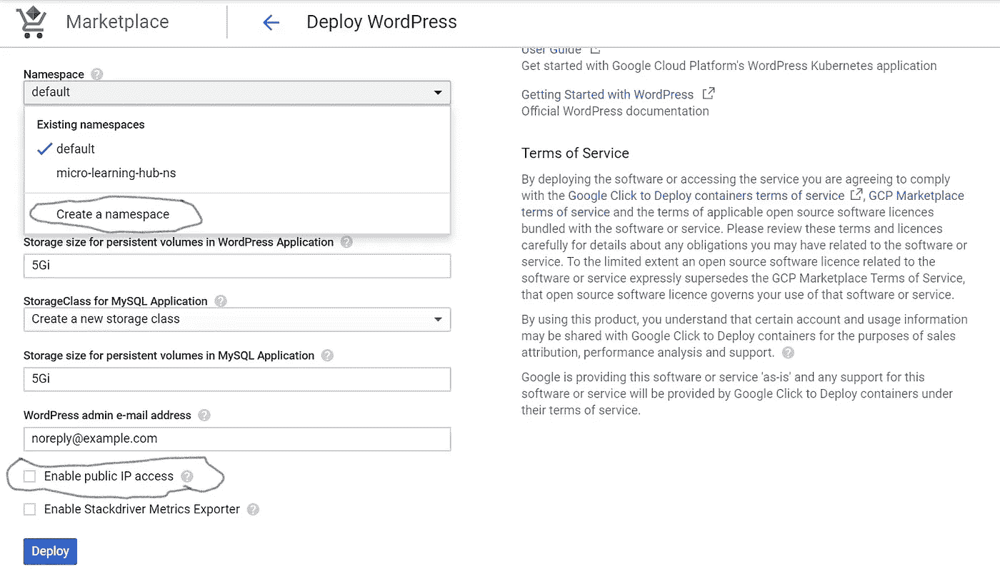****

****单击部署后，需要几分钟时间来完成设置。****

## ****HTTPs 证书和入口负载平衡器****

****下一步是创建 HTTPs 证书。那简单，用***“kubectl apply-f cert . YAML”***运行下面的 YAML。别忘了更换你的域名。****

```
**apiVersion: networking.gke.io/v1beta1kind: ManagedCertificatemetadata: name: micro-learning-hub-certificate namespace: micro-learning-hub-nsspec: domains: - yourdomainhere.com**
```

****接下来，我们必须更新 WordPress 部署创建的服务对象。这是因为服务是使用“ClusterIP”创建的，我们必须将其更改为“NodePort ”,以使用入口公开相同的内容。因此，我们将删除并重新创建该服务。****

```
**Kubectl delete scv micro-learning-hub-wordpress-wordpress-svc --namespace micro-learning-hub-wordpress**
```

****使用上述命令删除时，请正确选择服务名和名称空间。这将是你在安装 WordPress 时使用的名称空间。转到您的 Kubernetes 引擎部分，点击左侧菜单中的“服务和入口”,浏览服务列表并识别您的服务名称。服务名将以“wordpress-svc”结尾。****

****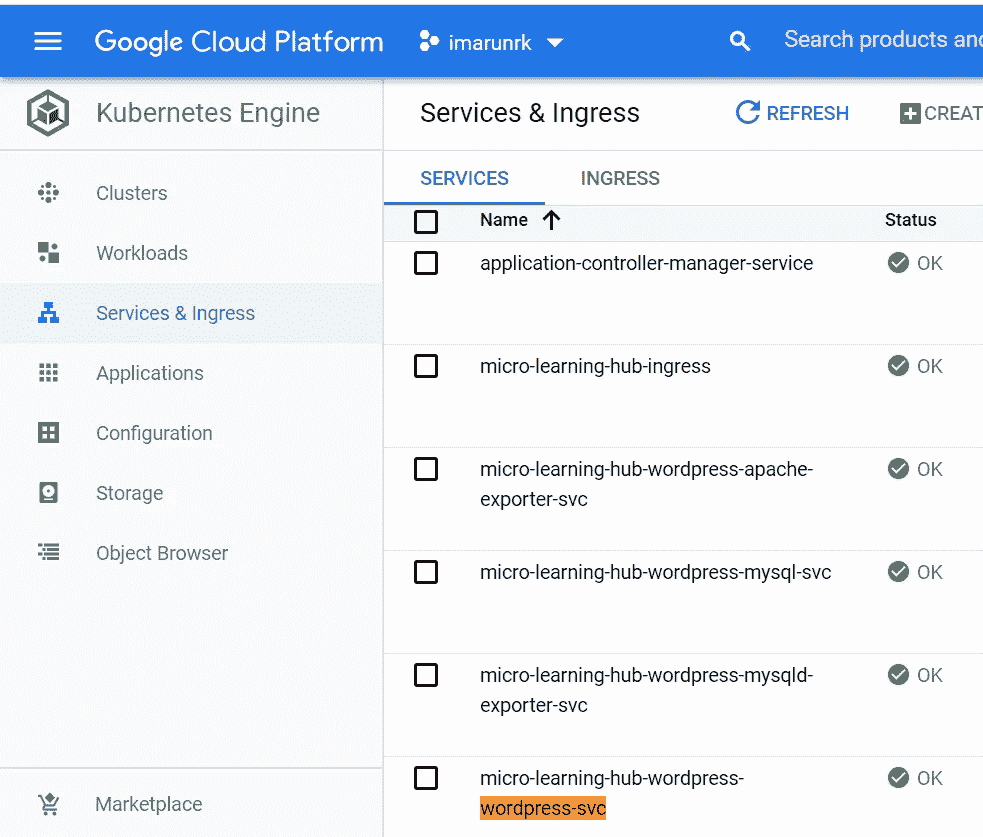****

****删除服务前，复制服务 YAML 进行修改。为此，单击已确定的服务并转到 YAML 选项卡。将 JSON 复制到“kube CTL . kubernetes . io/last-applied-configuration:”下。我们可以在任何在线转换器中把 JSON 改成 YAML。****

********

****从 YAML，只有一个变化。将“类型”从“群集 IP”更改为“节点端口”。运行***“ku bectl apply-f SVC . YAML”***。****

```
**---apiVersion: v1kind: Servicemetadata: annotations: {} labels: app.kubernetes.io/component: wordpress-webserver app.kubernetes.io/name: micro-learning-hub-wordpressname: micro-learning-hub-wordpress-wordpress-svcnamespace: micro-learning-hub-nsownerReferences:- apiVersion: app.k8s.io/v1beta1 blockOwnerDeletion: true kind: Application name: micro-learning-hub-wordpress uid: 3045c7e9-bf0f-43d0-b10e-7466fac4e6efspec: ports: - name: http port: 80 targetPort: http selector: app.kubernetes.io/component: wordpress-webserver app.kubernetes.io/name: micro-learning-hub-wordpresstype: NodePort**
```

****然后创建一个入口负载平衡器。在你进入 YAML 时，要确定几件事。****

> ****在“注释”下，使用您之前创建的 IP 名称作为"kubernetes.io/ingress.global-static-ip-name"的值。****
> 
> ****在“注释”下，使用创建的 HTTPs 证书的名称作为"networking.gke.io/managed-certificates"的值。****
> 
> ****在“注释”下添加“kubernetes . io/ingress . allow-http:“false”以仅允许 HTTPs 流量****
> 
> ****将 spec 下的“主机名”替换为您的主机名****
> 
> ****将“serviceName”替换为您在上述服务中使用的名称。****

****只需运行下面的 YAML(***" kubectl apply-f ingress . YAML ")***)加上上面的改动。****

```
**apiVersion: extensions/v1beta1kind: Ingressmetadata: name: micro-learning-hub-ingress namespace: micro-learning-hub-ns annotations: kubernetes.io/ingress.global-static-ip-name: micro-learning-hub-ip networking.gke.io/managed-certificates: micro-learning-hub-certificate kubernetes.io/ingress.allow-http: "false"spec: rules: - host: microlearninghub.com http: paths: - backend: serviceName: micro-learning-hub-wordpress-wordpress-svc servicePort: 80**
```

****一切都完成了，点击你的域名，看看 WordPress 网站启动并运行。要访问 Wordpress 管理页面，查看 Kubernetes 引擎>>应用>>你的 WordPress 应用详情下的凭证。****

********

## ****将 HTTP 流量重定向到 HTTPs****

****我们必须创建一个额外的负载平衡器来将 HTTP 流量重定向到 HTTPs****

> ****即[http://microlearninghub.com/](http://microlearninghub.com/)到[https://microlearninghub.com/](https://microlearninghub.com/)****

******命名您的负载平衡器******

1.  ****转到谷歌云控制台的负载平衡页面。
    [转到负载平衡页面](https://console.cloud.google.com/networking/loadbalancing/add)****
2.  ****在 **HTTP(S)负载均衡**下，点击**开始配置**。****
3.  ****选择**从互联网到我的虚拟机**。****
4.  ****对于负载均衡器的**名称**，输入`web-map-http`。****
5.  ****保持窗口打开以继续。****

******配置主机和路径规则******

****主机和路径规则配置负载平衡器的 URL 映射资源。****

1.  ****在屏幕的左栏中，点击**主机和路径规则**。****
2.  ****选择**高级主机和路径规则(URL 重定向，URL 重写)**。****
3.  ****在**动作**下，选择**将客户端重定向到不同的主机/路径**。****
4.  ****在**路径重定向**下，选择**前缀重定向**。****
5.  ****在**重定向响应代码**下，选择 **301 —永久移动**。****
6.  ****在 **HTTPS 重定向**下，选择**启用**。****
7.  ****点击**完成**。****

******配置前端******

1.  ****在左侧面板中，点击**前端配置**。****
2.  ****在**名称**字段，输入`http-content-rule`。****
3.  ****在**协议**字段中，选择`HTTP`。****
4.  ****保持窗口打开以继续。****

******配置 IPv4 转发规则******

1.  ****将 **IP 版本**设置为`IPv4`。****
2.  ****一个 **IP 地址**，选择我们为该域创建的 IP。****
3.  ****确保**端口**设置为`80`，以允许 HTTP 流量。****
4.  ****点击**完成**。****
5.  ****保持窗口打开以继续。****

******审核并最终确定******

1.  ****在左侧面板中，点击**审核并最终确定**。****
2.  ****将您的设置与您想要创建的内容进行比较。****
3.  ****如果一切正常，单击 **Create** 创建您的 HTTP 负载平衡器。****

************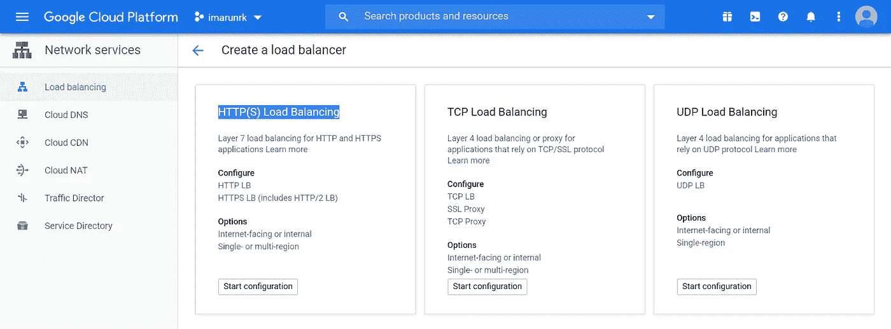********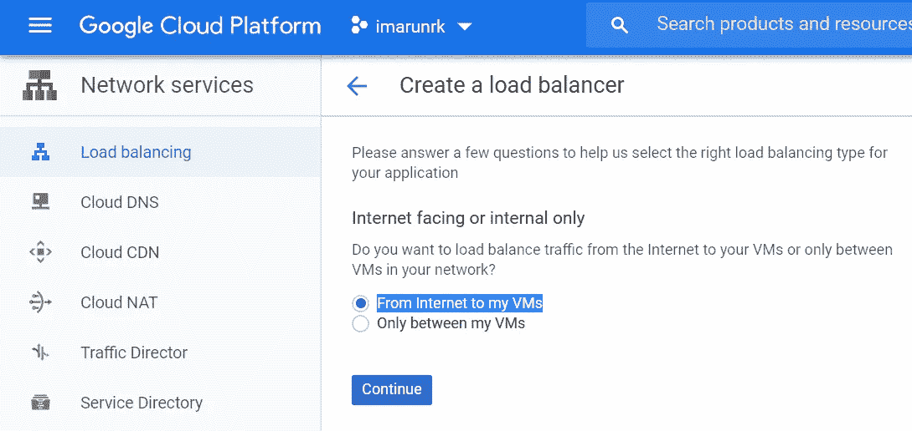********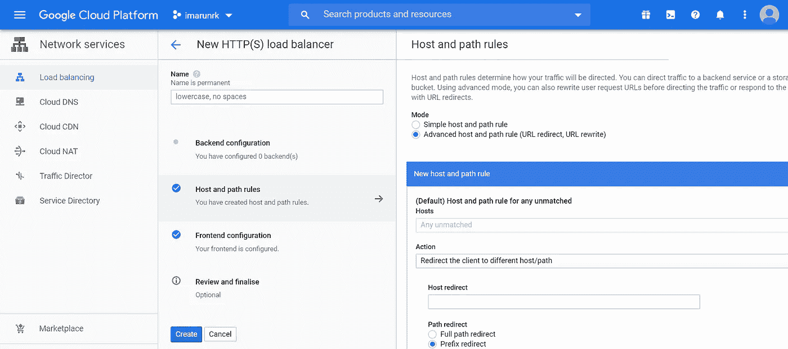********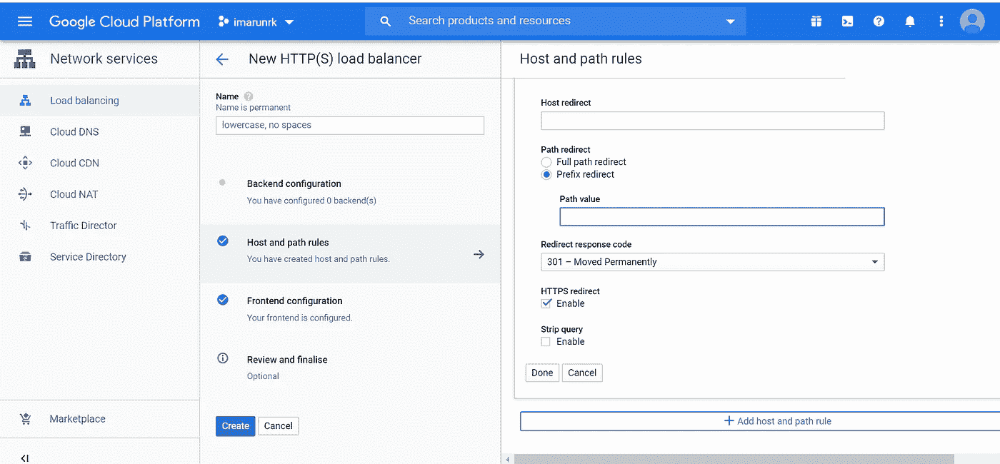********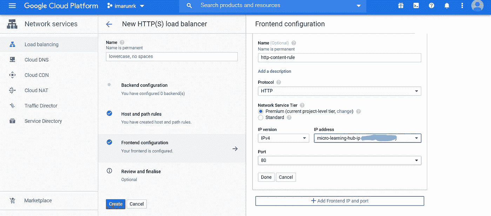****

****都做好了，你的网站应该完全上线运行了:)玩 WordPress 设计你的个人网站，摇滚。🏄****

****如果你在建立你的 Wordpress 网站时需要帮助，请随时拨打[imarunrk@gmail.com](mailto:imarunrk@gmail.com)联系我🚀****