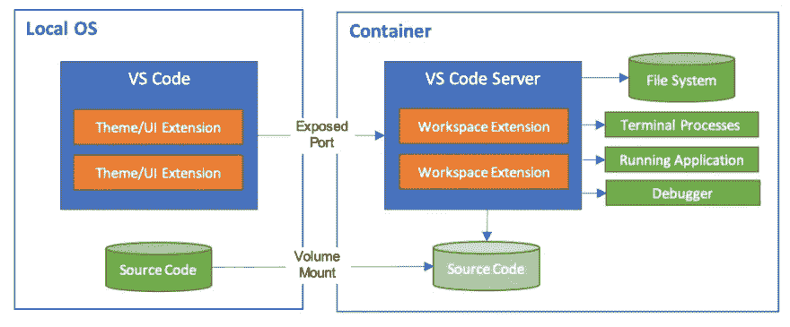

# 使用 Azure Cosmos DB Linux 模拟器和 VS 代码增强本地开发体验

> 原文：<https://itnext.io/enhance-local-development-experience-using-the-azure-cosmos-db-linux-emulator-and-vs-code-dfe77f9e1dfb?source=collection_archive---------4----------------------->

## 标题说明了一切！👆

这篇博客文章提供了如何在 Docker (在撰写本文时是预览版)上使用 [Azure Cosmos DB Linux 模拟器以及](https://docs.microsoft.com/azure/cosmos-db/linux-emulator?tabs=ssl-netstd21) [Visual Studio 代码](https://code.visualstudio.com/)的快速概述和演示，以增强您的本地开发体验。

由于 Azure Cosmos DB Linux 模拟器作为 Docker 映像(简称为`docker pull mcr.microsoft.com/cosmosdb/linux/azure-cosmos-emulator`)随时可用，因此很容易将其集成到您现有的设置中。例如，它可以在一个`docker-compose`文件中，作为一个更大的堆栈的一部分(这里有一个[例子，说明如何与 Apache Kafka](https://devblogs.microsoft.com/cosmosdb/kafka-azure-cosmos-db-docker/) 一起使用)。然而，用[Visual Studio Code Remote-Containers](https://code.visualstudio.com/docs/remote/containers)扩展来补充它，使您能够将 Docker 容器作为一个成熟的开发环境。

假设您想要使用[Azure Cosmos DB Core(SQL)API](https://docs.microsoft.com/azure/cosmos-db/sql/sql-query-getting-started)和 [Java SDK](https://docs.microsoft.com/azure/cosmos-db/sql/sql-api-sdk-java-v4) 构建一个应用程序，并且您有 VS 代码和 Docker(可选 Docker Compose)可用。只需创建一个 JSON 配置文件(名为`devcontainer.json`)来定义您的堆栈。然后，只需点击几下鼠标，就可以按需构建一个环境——这将构成一个或多个 Docker 容器，以及整个操作系统、编程语言运行时(这里是 Java)、工具集等。这是您最初在`devcontainer.json`中指定的。

使用模拟器的一些明显的好处包括:它的成本效益(免费！)，当您的应用程序有其他组件(例如消息系统)时非常方便，非常适合迭代开发/原型开发/演示，因为设置和拆除环境很容易、一致且没有错误(在大多数情况下！)

# 如何在 VS 代码中使用 Azure Cosmos DB Linux 模拟器

使用本 [GitHub repo](https://github.com/Azure-Samples/cosmosdb-java-devcontainers-demo) 中的说明快速入门。它基于用于 SQL API 的 Azure Cosmos DB Java SDK 的[原始示例代码 repo](https://github.com/Azure-Samples/azure-cosmos-java-sql-api-samples)和[添加的文件](https://github.com/Azure-Samples/cosmosdb-java-devcontainers-demo/tree/main/.devcontainer)，以实现“Visual Studio 代码远程-容器”体验。

您还可以观看视频，了解所有这些活动:

这个例子可以扩展到任何 Java 应用程序。你需要做的就是添加*。devcontainer* 文件夹到您当前的项目中，并(可能)根据您的需求对一些东西进行调整，例如对 [Java 版本](https://github.com/Azure-Samples/cosmosdb-java-devcontainers-demo/blob/main/.devcontainer/Dockerfile#L5)。

这只是冰山一角，你可以用很多有趣的方式利用它。期待听听大家怎么用！

# 更多资源

*   使用 Azure Cosmos DB 找到更多免费开发/测试的方法
*   下载 [Azure Cosmos DB 本地仿真器](https://docs.microsoft.com/azure/cosmos-db/local-emulator?tabs=ssl-netstd21)
*   查看 Azure Cosmos DB 的[技术文档](https://docs.microsoft.com/azure/cosmos-db/)