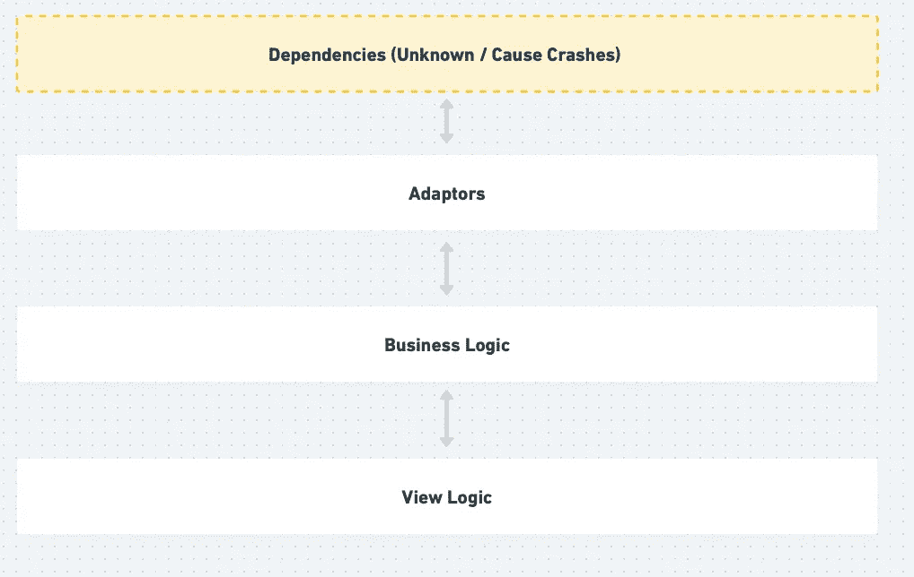

# JavaScript 中的错误处理:未知世界中的稳定软件(第 1 部分)

> 原文：<https://itnext.io/error-handling-in-javascript-stable-software-in-an-unknown-world-part-1-cc66adcb0b6b?source=collection_archive---------5----------------------->

最近，我一直在思考如何在一个质量不一、互不标准化的 JavaScript 世界中实现稳定的软件。这并不涉及将整个应用程序包装在一个 try…catch 语句中，这显然不允许您以应有的谨慎处理错误。这篇文章是关于错误处理的，特别是这个系列的这一部分将是关于处理未知的依赖关系“未知的海洋”,那里可能生活着许多怪物，有些是友好的和驯服的，但有些是非常可怕的，可能会吃掉你、你的团队和你的整个应用程序。


由[大卫·梅尼德雷](https://unsplash.com/@cazault?utm_source=unsplash&utm_medium=referral&utm_content=creditCopyText)在 [Unsplash](https://unsplash.com/s/photos/halloween?utm_source=unsplash&utm_medium=referral&utm_content=creditCopyText) 上拍摄的照片

所以让我们来谈谈 JavaScript 世界中的依赖关系。依赖性很强，开源社区是 JavaScript 生态系统的支柱，它们为开发人员和应用程序节省了大量时间来实现他们想要的东西，但这里的问题是我们永远不知道我们会得到什么，来自第三方依赖性的单个方法可能会使您的整个应用程序崩溃。

那么我们如何防止这种情况发生呢？这就是适配器概念的由来。现实世界中的适配器允许一个系统与另一个系统通信或传输信息，它们处理信息并包括安全功能，就像你去欧洲时用来转换电器电压的适配器，反之亦然🔌。


马库斯·温克勒在 [Unsplash](https://unsplash.com/s/photos/voltage-adapter?utm_source=unsplash&utm_medium=referral&utm_content=creditCopyText) 上拍摄的照片

JavaScript 中的适配器包装了一个特定的依赖关系，以添加任何额外的处理并优雅地处理任何错误。我们开始吧。

## **使用适配器进行数据处理**

适配器可用于获取 X 数据结构并将其转换为 Y 数据结构，其中 Y 是为我们的应用程序代码库定义的数据结构。

例如，假设我们有一个 picker 库从移动库中选取附件，这些附件在一个名为“Asset”的数据结构中返回，但我们有一个自定义的数据结构来处理我们的应用程序中的资产，名为“MediaObject”。我们可以使用一个适配器来包装 picker 库，并确保每个资产都被处理为 MediaObject:

```
export async function launchImageLibraryAsync() : MediaObject {
  try {
    // ‘launchImageLibrary’ npm dependancy
    const asset = await launchImageLibrary(options);
    // process media object from asset
    const result = MediaObject.fromAsset(asset); return result;
  } catch(e) {
    // process error
  }
}
```

现在，通过这种方法，我们可以处理来自第三方依赖项的所有数据，这有以下好处:它为我们提供了一层来自未知来源的安全性，并允许我们使用为我们的应用程序构建的自定义结构，这使得将来更容易为另一个应用程序交换依赖关系。

> 构建适配器的目的是将数据从一种形式处理成另一种形式。

## **处理适配器时出错——适配器应该处理视图逻辑吗？**

根据设计，适配器不应该处理任何视图逻辑。这意味着，如果有一个错误，我们不应该在那个时候用警告或模式通知用户。构建适配器的目的是将数据从一种形式处理为另一种形式。这包括错误。

停下来想一想……每个依赖项都可能抛出一个错误，使你的应用程序崩溃。“launchImageLibrary”方法未知，可能随时引发错误。这就是为什么必须将每个依赖项包装在“try…catch”中并处理错误，不仅仅是处理错误，还要返回一个可以由应用程序处理的错误。

在 Qeepsake，我们使用 neverthrow 包来处理错误。适配器的工作不是捕捉错误并立即抛出另一个错误，适配器永远不会爆炸！或者使您的应用程序崩溃。相反，您应该从适配器返回错误。例如，下面是一个将对象作为错误返回的适配器:

```
try {
  …
  if (result.errorCode === ‘camera_unavailable’) {
    return new ErrorResult({
      code: ‘CAMERA_NOT_SUPPORTED’,
      message: ‘Camera is NOT supported by this device’,
    });
  } else if (result.errorCode === ‘permission’) {
    return new ErrorResult({
     code: ‘CAMERA_NO_PERMISSION’,
     message: ‘Device does NOT have permission to access the camera’,
    });
 } else if (result.didCancel) {
   return new ErrorResult({
    code: ‘CAMERA_CANCELLED’,  
    message: ‘User cancelled from the camera’,
   });
 } else if (result.errorMessage === ‘Unsupported file type’) {
  return new ErrorResult({
   code: ‘CAMERA_UNSUPPORTED_TYPE’,
   message: ‘MIME type selected from the camera is not supported’,
  });
 } else {
  return new ErrorResult({
   code: ‘CAMERA_NO_DATA’,
   message: ‘No data returned from the camera’,
  });
 }
} catch (e) {
  // Maybe track an error here
  return new ErrorResult({
   code: ‘CAMERA_UNKNOWN_ERROR’,
   message: ‘An unknown error occrured when using the camera’,
  });
}
```

函数的返回类型类似于“MediaObject | ErrorResult”。然后，您将在代码中处理 ErrorResult，该代码使用适配器来显示错误消息或继续处理成功的结果。记住…这里的想法是处理未知的输出，并将其转换成我们的应用程序能够理解和处理的东西。

适配器是你和未知之间的一层，用于在你的应用程序中建立容错。

## 适应还是不适应，这是个问题

一个自然的问题是什么依赖关系应该被修改，什么不应该被修改，这不是一个简单的问题。你可能会发现一些灰色地带。我迄今为止最好的模板是改编库而不是框架，尽管有些库你可能不想改编，比如 lodash。你必须用你自己的直觉来解决这个问题…尽管我会分享一些 Qeepsake 依赖的例子，以及什么应该被修改，什么不应该被修改，但是我还没有创建或者碰到一个标准的规则集

*   @ alessiocancian/react-native-action sheet:改编✅(见下文我们涵盖改编组件)
*   @ react-native-async-storage/async-storage:adapt✅您永远不知道什么时候您可能会更换您的存储实现！
*   @ react-native-community/camera roll:改编✅这是一个必不可少的 API，我们为什么不改编它呢！？
*   @ react-native-community/datetime picker:改编✅另一个组件
*   @ react-native-community/netinfo:改编✅
*   @ react-native-fire base/analytics:将✅改编成一个分析类(便于将来替换)
*   @ react-navigation/stack:notadapt✖️这更像是一个框架
*   世博档案系统:适应✅
*   世博会-视频-缩略图:适应✅
*   福米克:adapt✖️formic 不像是一个框架
*   反应:不是 adapt✖️
*   当地人:不是 adapt✖️人
*   react-native-animatable:改编✅是一个很好的实践，因为这意味着交换你的动画库可能更容易，而且允许你正确地重命名组件，不与 react-native 的“视图”、“图像”等冲突。
*   反应-原生-视图-拍摄:适应✅你可以适应这个也正确处理错误的参考方法
*   react-redux:不是作为框架的 adapt✖️acts
*   反应-中继:不是作为框架的 adapt✖️acts
*   redux:不是作为框架的 adapt✖️acts
*   redux-persist:不是 adapt✖️framework 扩展

如您所见，对于用适配器包装哪些依赖项，没有明确的答案。

## **适配器的文件夹结构**

我提倡扁平的文件夹结构，这在使用适配器时不会改变。适配器应该是它们自己的根级文件夹，您的文件夹结构可能如下所示:

```
/pages
/components
/adapters
/utils
…
```

适配器可以是函数、类或组件，目的是在依赖项和应用程序的其余部分之间提供一个安全的通信层。符合该定义的一切都属于适配器。

## **嘲讽第三方库**

适配器还允许我们轻松模仿第三方库，现在您在应用程序业务逻辑和依赖关系之间有了一个层，我们可以轻松地为那些依赖关系编写模仿实现，这些依赖关系位于我们的适配器旁边，这样您就不太可能为了编写模仿而调整应用程序的部分结构。

## **通过适配器**扩展和组合 D 依赖关系

**适配器不仅仅是用依赖关系建立一对一的通信，还可以用来组合大量的依赖关系，并扩展这些依赖关系的功能。例如，我们在 Qeepsake 中有一个文件，它采用了 Expo 文件系统 API 中的“makeDirectoryAsync”方法，我们在其中添加了额外的功能，以便为返回目录提供更好的支持，下面的示例将返回目录(如果它已经存在)并且不会抛出错误:**

```
static async makeDirectoryAsync(
  directory: string,
  options?: { intermediates: boolean },
): Promise<ResultAsync<string,   ErrorResult<’MAKE_DIRECTORY_UNKNOWN_ERROR’>>> {
  try {
    const { exists } = await ExpoFileSystem.getInfoAsync(directory);

    if (!exists) {
      await ExpoFileSystem.makeDirectoryAsync(directory, options);
    }

    return okAsync(directory);
  } catch (e) {
    trackException(e); return errAsync({
      code: ‘MAKE_DIRECTORY_UNKNOWN_ERROR’,
      message: ‘An unknown error occrured when creating the directory: ‘ + directory,
    });
  }
}
```

**此外，除了改进现有依赖项的功能之外，您还可以在同一个适配器下组合多个依赖项。假设您有一个文件系统类，您可以从 expo-file-system 引入依赖项，获得 MIME 类型方法，以及其他访问 EXIF 数据的方法，所有这些都在同一个文件系统类下，使用多个依赖项来为您的业务逻辑提供一个健壮的文件系统类。**

**它让您知道如何构建您的适配器。没有正确的方法。用一种适合你的应用程序的方式来组织它们是有意义的。**

## **我们能为组件编写适配器吗？**

**是的。您应该将作为组件的依赖项包装为适配器。这允许您调整参考方法并围绕组件建立误差边界。适配器的目标是确保我们通过以一种不会使应用程序崩溃的方式传递错误来捕获和处理错误。所以当在适配器中用错误边界包装你的依赖时，你应该问，**如果这个组件崩溃了，回退的体验是什么？****

**如果你想让你的适配器变得更高级，你甚至可以在回退界面和功能中构建，以防一个方法崩溃！**

## ****最后，缩小范围，思考业务逻辑……****

**还有一个想法尚未完全形成，但我可能会在将来谈到它，我将在这里简要讨论它，这就是业务逻辑作为其自己的一层的想法，例如，您可能采用了 Axios 等 HTTP 库来返回格式化错误并添加一些额外的功能，尽管我们的业务逻辑可能会在另一层发挥作用。 我们可能有许多函数: *fetchOrders、fetchCustomers、fetchTags* ，它们包装了 Axios 适配器，但仍然返回错误，并且不处理任何视图逻辑(即向用户显示错误)。 然后，我们会有一个类似于 *loadOrders* 的函数，它会拉入 *fetchOrders* 函数，并处理任何错误，向用户显示反馈。 *loadOrders* 将从组件中调用。像这样的层类型方法:**

****

**逻辑图(适配器->业务逻辑->视图逻辑)**

**不要认为这是关于如何构建应用程序的建议，这最后一部分是关于我们如何为业务逻辑构建一个有组织的架构的一些总结性想法，允许我们构建没有副作用(或知道副作用)的方法。这里还有很多有待开发的地方，我希望很快能带着更多的答案回来…现在…适应一种方式！**

**感谢阅读。如果你喜欢这个，那就去看看 Qeepsake.com，它在引擎盖下使用了很多这样的方法！**