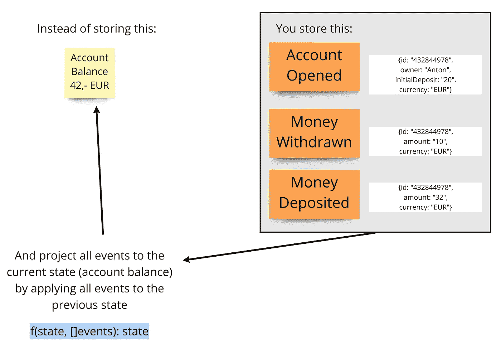
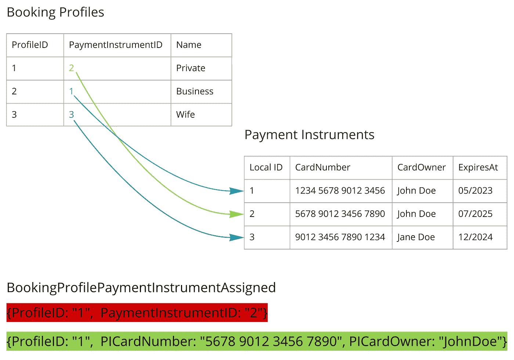

# 事件来源解释

> 原文：<https://itnext.io/event-sourcing-explained-b19ccaa93ae4?source=collection_archive---------1----------------------->

## 互联网上有许多令人困惑的文章，将事件采购与 EDA 和 CQRS 混为一谈。让我们看看它是什么，不是什么。

我可能不会在这篇文章中描述任何没有被写过大约 100 次的东西。可悲的是，随着事件采购越来越受欢迎，每一篇好文章都会有另外五篇误导性的文章发表。部分原因是一些人试图将卡夫卡作为一个事件商店。我最近写了一篇关于这个的文章:

 [## 事件采购:为什么 Kafka 不适合作为事件商店

### 不要相信一个公司或者一些顾问想卖给你的一切！

medium.com](https://medium.com/@TonyBologni/event-sourcing-why-kafka-is-not-suitable-as-an-event-store-796e5d9ab63c) 

总的来说，人们将事件源与事件驱动架构和 CQRS 混为一谈。这些项目中的一些失败了，导致了一些文章将问题归咎于事件源，这些问题大多是由那些松散相关的概念的有问题的混合引起的。

我喜欢事件采购(还有埃达和 CQRS)，这就是为什么我试着加入一些文章来帮助区分这些概念。

# 基本模式



换句话说——不是存储当前状态，而是存储所有状态变化(事件),并从中导出当前状态(投影)。

> 💡在实际的应用程序中，您很可能将货币金额存储为最小单位(在我的例子中是 2000 美分，而不是 20 欧元)。

# 但是这不是很复杂吗？

我并不想假装事件采购没有缺陷(稍后会有更多介绍)。但是基本模式就是这样——存储状态的不同方式。如果你看看你的 PoEAA 书(企业应用程序架构的模式— Martin Fowler**)** —或者你可能拥有的其他关于架构模式的书—你可能会发现一些更复杂的模式。

根据我的经验，开发人员只需要习惯事件源。这需要一点练习，在你开始一个时间和任务关键的事件采购项目之前练习一下可能是个好主意！

如果你想发现这个模式，你可能想看看我在工作室里使用的*代码 Koans* 格式的形:

[](https://github.com/MaibornWolff/aggregate-implementation-patterns-java) [## GitHub-MaibornWolff/aggregate-implementation-patterns-Java

### 实现聚合时有许多不同的可能性。他们中的许多人并不普遍好于…

github.com](https://github.com/MaibornWolff/aggregate-implementation-patterns-java) [](https://github.com/MaibornWolff/aggregate-implementation-patterns-kotlin) [## GitHub-MaibornWolff/aggregate-implementation-patterns-kot Lin

### 实现聚合时有许多不同的可能性。他们中的许多人并不普遍好于…

github.com](https://github.com/MaibornWolff/aggregate-implementation-patterns-kotlin) [](https://github.com/klimisa/aggregate-implementation-patterns-csharp) [## GitHub-klimisa/Aggregate-implementation-patterns-cs harp:Aggregate implementations workshop port…

### 实现聚合时有许多不同的可能性。他们中的许多人并不普遍好于…

github.com](https://github.com/klimisa/aggregate-implementation-patterns-csharp) [](https://github.com/jursimplicate/aggregate-implementation-patterns-php) [## GitHub-jursimplicate/aggregate-implementation-patterns-PHP

### 实现聚合时有许多不同的可能性。他们中的许多人并不普遍好于…

github.com](https://github.com/jursimplicate/aggregate-implementation-patterns-php) 

# 一些定义

一个**事件流**是一系列**事件**，它们形成了一个一致性单元，如果你实践*领域驱动设计*或者一个 e *实体*、*业务对象*、…

你也可以用事件源流程代替*事物*——但是现在让我们保持简单。

> 💡在下文中，我将只使用术语**实体。**

流中的所有事件都需要共享一个公共的主 ID，通常称为 **streamID、**和 **eventVersion** ，通常是一个整数，用于在事件发生时对其进行排序，以便能够以正确的顺序读取它们，从而重建当前状态。

此外，每个事件都应该有一个时间戳，告诉它什么时候发生，理想的分辨率应该高于几秒(微秒或纳秒)。请注意，时间戳不适合排序(不同的服务器有不同的时钟偏差，事件可能在同一纳秒内发生，…)。

最后，每个事件都有一个 **eventType** 或 **eventName** ，例如上面例子中的 *AccountOpened* ，当然还有有效负载(id、所有者、数量……)。

# 事件的粒度

在我发表这篇文章后，我被告知 *AccountOpened* 事件可能是一个更细粒度的事件，所以在那个事件中不要有 *initialDeposit* 。我不是银行领域的专家，所以这可能完全正确。

我的经验是:1 个命令-> 1 个事件，所以我倾向于更粗粒度的事件。但是我认为这不是很关键，所以更细粒度的设计应该不会引起问题，反之亦然。

# 为什么使用活动采购—有什么好处？

不同的人对活动采购有不同的卖点，以下是我的观点:

## 模型出色的可变性

您可以随时更改模型的实现，而无需进行数据库迁移。你可以从 OOP 风格转变为函数风格，重新排列你的对象图，提升一些标量到*值对象*，…。

限制是由事件流给出的边界。如果您必须将一个实体分成两个实体，反之亦然，那么您应该迁移事件流，这在您的应用程序处于活动状态时可能并不简单(使用有状态持久性模型不会更简单)。界限总是至关重要的，所以要仔细考虑！

## 出色的去毛刺能力

如果您发现您的一些实体处于错误的状态，您可以逐个重放导致该状态的事件，以找出哪个事件是错误的。一旦发现可以检查产生此事件的代码并修复它，这样错误就不会再次发生。最后，您必须修复所有损坏的实体的状态，这应该通过在所有受影响的流的末尾附加一个所谓的*校正事件*来完成。对于有状态持久性模型，这最后一步可能不会更简单，但也不会更复杂。但是有了事件源，那些修复现在可以在你的事件流中看到了(也见下面的*审计日志*)。

## 决策和状态变化的分离

在软件开发中，我们经常要处理高负荷的脑力劳动。一旦你习惯了事件源，决策和状态的分离有助于减少这种精神负担:

1.  决定一个命令( *changeSomething* )是否可以应用到当前状态。业务规则允许这种变化吗？是否有任何变化，或者该命令可以被忽略，因为没有任何变化(等幂)？该命令的结果可以是零个、一个或多个新事件。
2.  确保下次重新生成实体时正确地投影新事件。

## 出色的可测试性

因为每个命令会产生 0…N 个事件，所以你可以随时测试你的应用程序的行为(它会产生预期的事件吗？)而且不用测试内部状态。类似于上面描述的两个步骤，您将需要另一个测试用例来测试状态变化(投影)。两个简单的测试用例，而不是一个更复杂的。我们喜欢简单——不是吗？

## 一整袋阅读模型

到目前为止我主要讲了所谓的*写模型*。写模型用来处理命令，改变应用程序的状态。您可能还需要*阅读模型*，即向您的客户展示状态，以便他们做出决策。事件源的一个优点是，对于一个新的(简单的)读取模型，您需要做的就是添加构建它的代码。数据库没有变化。我不想在这里深究太多的细节，我写了另一篇文章，你可能有兴趣了解更多:

[https://medium . com/@ TonyBologni/live-projections-for-read-models-with-event-sourcing-and-cqrs-42 DD 18 b 19 FD 0](https://medium.com/@TonyBologni/live-projections-for-read-models-with-event-sourcing-and-cqrs-42dd18b19fd0)

> 时间旅行

您可以构建投影，为您提供实体在过去某个时间点的状态:

*   今年 1 月 1 日我的账户余额是多少？

## 其他时间特征

事件源支持的时态行为非常强大！

其中一些例子可能不完全准确，但我们开始了:

*   如果在一小时内更改密码的尝试失败了 3 次，则将密码更改功能锁定一小时
*   不允许每天取款超过 10 次
*   如果购物车在添加第一个商品后的一小时内没有被签出，则清除购物车
*   2021 年全年，我的账户上存了多少钱？

## 免费审计日志

如果您在需要审计日志的领域工作，例如银行、股票交易、核电厂……您可以通过基于事件的解决方案免费获得审计日志。如果你把所有必要的信息都放在你的事件中，那么你就能说出发生了什么，什么时候发生的，为什么会发生，以及谁发布了改变。

## 没有 ORM，没有连接，简单的查询

> 💡我采用下面的关系数据库术语。如果您使用现成的 EventStore 或库，这将在幕后发生。

如果你爱你的 ORM(年轻时有过),你现在必须坚强！您肯定不需要 ORM 来进行事件采购。你也不需要连接。每个事件都应该存储为表中的一行。

您通常运行的重建(预测)当前状态的查询可能如下所示:

```
select * from events where stream_id = “account_1234567” order by stream_id asc;
```

您可以使用附加的过滤器，如“发生时间”或“流版本”来进行调试或时间旅行。

给定必要的索引，这些查询简单、高效、快速！

# 但是不是很慢吗？我需要快照吗？

简短的回答:**没有！**

如上所示，读取事件流的查询是简单的主 ID 查询，可能带有附加的过滤器。与可能必须连接两个表的传统关系存储相比，这种查询通常更快。

相应地，将事件附加到事件流是一个简单的插入查询。

性能的**关键是你的**事件流**的**大小**(它们包含多少个事件？).**

如果您有包含数千个事件的巨大流，那么数据库查询和事件的反序列化会变得很慢。所以你的目标应该是保持你的溪流短。我可以说像*最多几百个事件*这样的话，但是数字不应该成为建模你的事件流和它们所代表的实体的驱动力。相反，看看你的领域，看看你是否可以减少你的流的**生命周期，或者改变实体边界，这样你就有了多个更小的流。**

我的朋友**奥斯卡**写了一篇[关于保持短流的优秀文章](https://www.eventstore.com/blog/keep-your-streams-short-temporal-modelling-for-fast-reads-and-optimal-data-retention)。

如果您需要大的、长期存在的流，那么拍摄快照可能是一个解决方案。快照只是一个缓存，它将实体在某个时间点的状态具体化。为了重建它，首先读取最新的快照，并且仅读取和应用在拍摄快照之后发生的事件。

请注意，使用快照是有代价的。更多的代码，更多的逻辑，更多的出错机会…

# 一些要避免的陷阱

## 有效载荷应该包含所有必要的信息

我个人过去在事件源方面犯的一个大错误是没有将所有必要的数据放入事件的有效载荷中。

我们在汽车共享领域实现了预订配置文件，其中包含支付工具(如信用卡)以及其他信息(如账单地址):



该事件的错误(第一个，红色)版本包含本地的*PaymentInstrumentID*——这是特定于实现的——而不是分配给预订配置文件的关于支付工具的所有信息。这将我们的事件和实现捆绑在一起，我们失去了轻松更改模型的能力。幸运的是，这是在应用程序上线之前发现的。

Fix(第二个，绿色):我们修改了这个事件，以包含关于支付工具的所有数据。

**总是把一个变化中包含的所有数据放进你的事件中！**

## 有效负载不应包含完整的实体

**不要在采购活动中增加关于贵公司的额外信息(与变更无关)!**

例如，预订配置文件的名称和账单地址不应该出现在*bookingprofilepaymentstrumentchanged*事件中，因为该数据尚未更改！

您可能希望用更多的元数据来丰富您的事件，如实体名称、有界上下文或可追溯性数据，如导致此事件的另一个(外部)事件的 causationID。

## 事件应该是私人的

**不要在消息代理上发布(所有)您的事件采购事件！**

这是我犯的另一个错误。我说过事件源只是另一种(更好的)存储状态的方式。在分布式应用程序(微服务……)中，状态应该是服务所属的有界上下文的私有状态。否则，你很快就会有可怕的*分布式整体*，并且很快你会为此写一篇愤怒的博文。如果您发布了所有事件，那么任何其他服务都可以使用它们并在本地重建您的整个状态。如前所述，对于 EDA，您会发布一些通常包含附加信息的关键事件，因此这些事件的消费者可以获得他们工作所需的所有数据。不同的故事，请明天再来。

## 事件的版本控制可能很棘手

随着您的领域的发展，您可能希望发展一些事件类型。你还是要有能力处理旧事件，所以你不能只是删除它们。这就是版本控制发挥作用的地方。

通过正确地建模您的领域和边界(这并不总是容易的)来尝试避免大量的版本控制是一个好主意。

如果你还需要做版本控制:Greg Young 在 LeanPub 上有一本关于版本控制的[书，可以去看看。](https://leanpub.com/esversioning)

您可以将事件的旧版本升级到新版本，以避免在代码的多个位置处理事件的 v1、v2 和 v3。如果为新版本添加了属性，那么旧版本需要获得一个相同的默认值。如果不能大写，那么你可能需要一个全新的事件，而不是一个新的版本。

## 何时使用事件源？

我的想法是，除非我有一个好的理由不这样做，否则任何事情都要事件化。

我认识的许多聪明人的一个更明智的方法是，当你的模型足够复杂时，也就是当它具有丰富的业务逻辑时，使用事件源。

如果您需要许多不同的视图(阅读模型),并且希望业务部门要求每个 sprint 都有一个新的视图，那么 Event Sourcing 就是您的朋友。

另外，看上面(*有什么优点*)。

## 何时不使用事件来源？

CRUD 应用程序是一个典型的例子，在这种情况下，事件源可能没有多大意义。问题是 CRUD 应用程序是保持 CRUD，还是随着时间的推移添加越来越多的业务逻辑。另一个问题是 CRUD 应用程序是否存在。；-)

对于某些应用程序，不使用 ES 可能有技术上的原因，但是老实说，我没有好的例子。

如果你认为你将需要 1000 种不同的事件类型，我会发现这是相当虚假的，并首先分析该领域是否被理解得足够好。也就是说，如果您的事件看起来像*字段 1 更改了*、*字段 2 更改了*、*字段 3 更改了*，那么您似乎重新实现了*Excel*——这对于事件源来说并不是一个好例子。

## 事件源不是顶层架构！

我计划在以后的文章中写一些关于事件驱动架构(EDA)和 CQRS 的内容，所以我会保持简短(上面链接的 Kafka 文章也提到了这一点):

*   如果你有一个基于事件的应用程序，你很可能想要做 CQRS，因为你需要一个或多个读取模型
*   您的事件源应用程序的一些事件可能是 EDA 的很好的集成事件(域事件),但是概念是正交的，不应该大量耦合
*   仅仅因为您在某些有限的上下文(应用程序的一部分)中使用了事件源，您就不必将所有的事情都事件源化！把它用在有意义并能带来最大回报的地方

## 附加阅读材料

Oskar 写了许多关于活动采购的精彩文章— [看看吧](https://event-driven.io/en/category?category=Event%20Sourcing)！

## 感谢您的时间和关注！:-)

> 问题和评论是非常受欢迎的，如果你为这篇文章鼓掌(如果你喜欢它)，或者在 Medium 或 [Twitter](https://twitter.com/TonyBologni) 上关注我，我会非常高兴！

[](https://medium.com/@TonyBologni/membership) [## 通过我的推荐链接加入 Medium-Anton stckl

### 阅读我和其他伟大的科技作家的每一个故事！你的会费直接支持我和其他…

medium.com](https://medium.com/@TonyBologni/membership) [](https://medium.com/subscribe/@TonyBologni) [## 每当安东·施特克尔发表文章时，都会收到电子邮件。

### 每当安东·施特克尔发表文章时，都会收到电子邮件。通过注册，您将创建一个中型帐户，如果您还没有…

medium.com](https://medium.com/subscribe/@TonyBologni)