# Apache Kafka 与 Spring 的最终一致性:第 2 部分，共 2 部分

> 原文：<https://itnext.io/eventual-consistency-with-spring-for-apache-kafka-part-2-of-2-23bedd512ccf?source=collection_archive---------2----------------------->

## 使用 Spring for Apache Kafka 跨多个微服务管理 MongoDB 中的分布式数据模型

正如本帖第一部分中所讨论的，给定一个由多个微服务组成的现代[分布式系统](https://en.wikipedia.org/wiki/Distributed_computing)，每个微服务拥有一个域集合数据的子集，系统几乎肯定会有一些数据重复。鉴于这种重复，我们如何保持数据的一致性？在这篇由两部分组成的文章中，我们探索了这个挑战的一个可能的解决方案——[阿帕奇卡夫卡](https://kafka.apache.org/)和[最终一致性](https://en.wikipedia.org/wiki/Eventual_consistency)的模型。

# 第二部分

在本文的第二部分中，我们将回顾如何在本地开发环境中部署和运行 storefront API 组件，该环境运行在 Kubernetes 上，使用 [Istio](https://istio.io/) ，使用 [minikube](https://minikube.sigs.k8s.io/) 。为了简单起见，我们将只运行每个微服务的一个实例。此外，我们不会实施自定义域名、TLS/HTTPS、身份验证和授权、API 密钥，也不会限制对任何敏感的运营 API 端点或端口的访问，所有这些都是我们在实际生产环境中肯定会做的。

为了提供运营可见性，我们将在我们的系统中添加雅虎的[CMAK](https://github.com/yahoo/CMAK)(Apache Kafka 的集群管理器) [Mongo Express](https://github.com/mongo-express/mongo-express) 、 [Kiali](https://kiali.io/) 、[普罗米修斯](https://prometheus.io/)和[格拉法纳](https://grafana.com/)。


来自 Kiali 的店面 API 流量视图

## 先决条件

这篇文章假设读者对 Kubernetes、minikube、Docker 和 Istio 有基本的了解。此外，这篇文章假设你已经安装了最新版本的 [minikube](https://minikube.sigs.k8s.io/docs/start/) 、 [kubectl](https://kubernetes.io/docs/tasks/tools/install-kubectl-macos/) 、 [Docker](https://docs.docker.com/docker-for-mac/install/) 和 [Istio](https://istio.io/latest/docs/setup/getting-started/#download) 。这意味着`kubectl`、`istioctl`、`docker`和`minikube`命令都可以从终端获得。

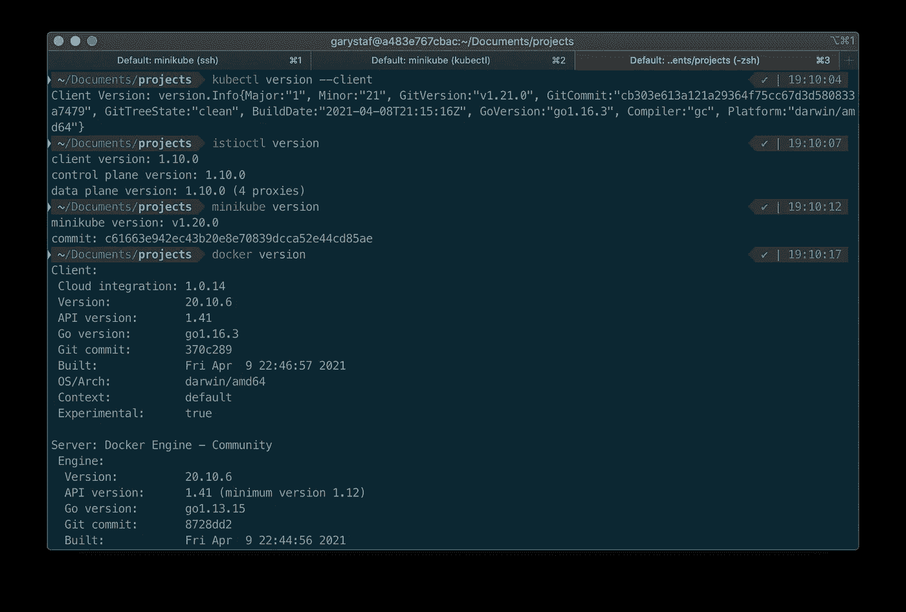

所需应用程序的当前安装版本

在这篇文章中，我使用一台运行 macOS 的苹果 MacBook Pro 作为我的开发机器。某些命令可能特定于 macOS。

## 源代码

这篇文章的源代码是开源的，可以在 GitHub 上公开获得。使用以下命令克隆 GitHub 项目:

```
clone --branch 2021-istio \
    --single-branch --depth 1 \
    [https://github.com/garystafford/storefront-demo.git](https://github.com/garystafford/storefront-demo.git)
```

## 迷你库贝

作为 Kubernetes 项目的一部分， [minikube](https://minikube.sigs.k8s.io/docs/) 是本地的 Kubernetes，致力于使 Kubernetes 易于学习和开发。Minikube 在 macOS、Linux 和 Windows 上快速建立本地 Kubernetes 集群。鉴于我们将部署到 minikube 的 Kubernetes 资源的数量，我建议至少 3 个 CPU 和 4–5 GB 的内存。如果您选择部署多种可观察性工具，如果您负担得起，您可能希望增加这两种资源。在设置这个演示的时候，我多次使 CPU 和内存达到极限，导致 minikube 临时锁定。

```
minikube --cpus 3 --memory 5g --driver=docker start start
```

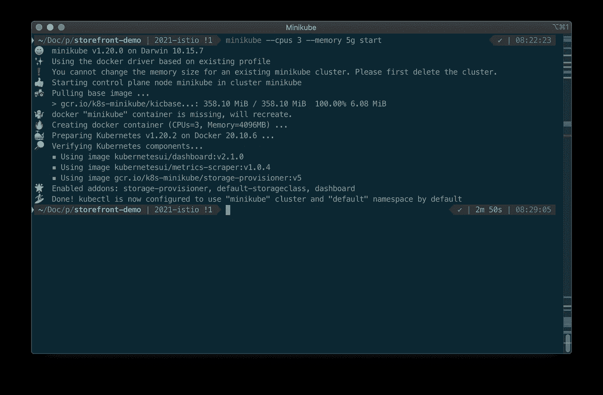

Docker 驱动程序允许你将 Kubernetes 安装到现有的 Docker 安装中。如果您正在使用 Docker，请注意您必须至少有等量的资源分配给 Docker 才能分配给 minikube。

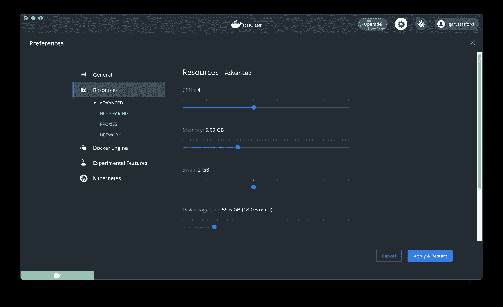

继续之前，确认 minikube 已启动并运行，并确认`kubectl`的当前上下文为`minikube`。

```
minikube status
kubectl config current-context
```

这些状态应该类似于以下内容:

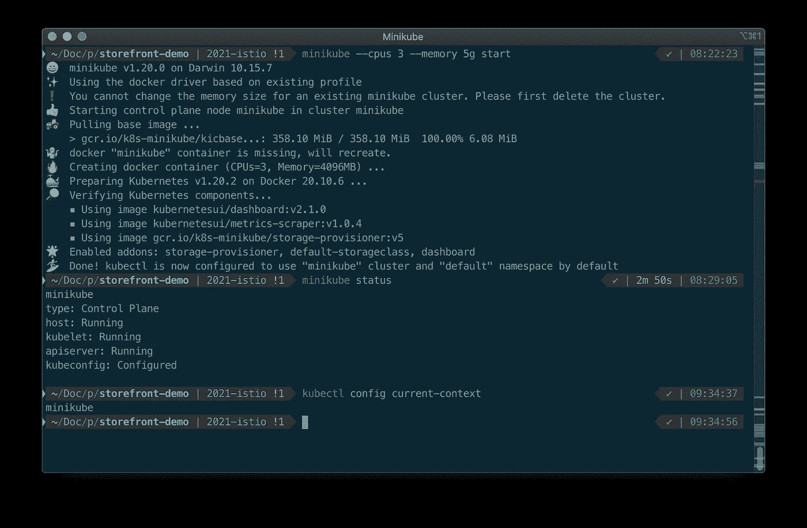

使用下面的`eval`命令将您的 shell 指向 minikube 的 docker-daemon。您可以使用`docker image ls`和`docker container ls`命令来确认正确的上下文，以查看 minikube 上正在运行的 Kubernetes 容器。

```
eval $(minikube -p minikube docker-env)docker image lsdocker container ls
```

输出应该类似于下面的屏幕截图。请注意正在运行的 Kubernetes 容器。

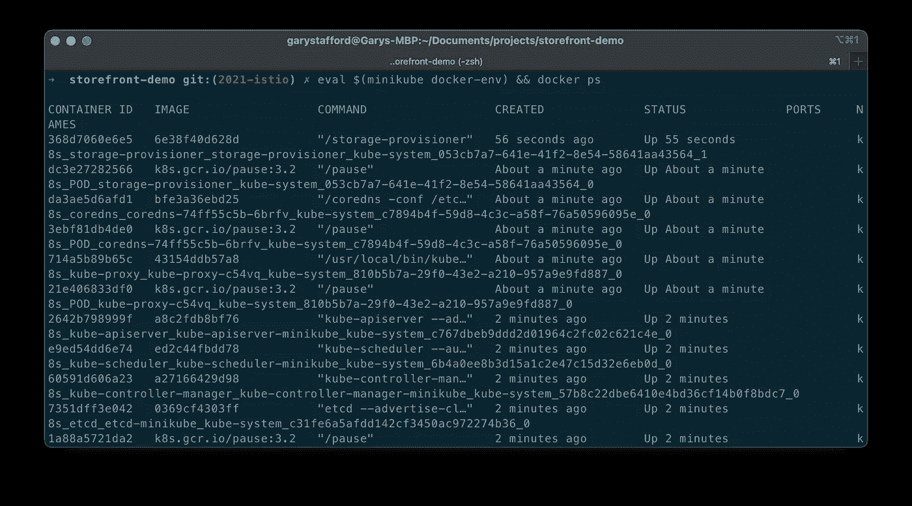

你也可以从 Docker 桌面查看 minikube 的状态。Minikube 作为一个容器运行，从 Docker 映像实例化，`gcr.io/k8s-minikube/kicbase`。查看容器的统计信息，如下所示。

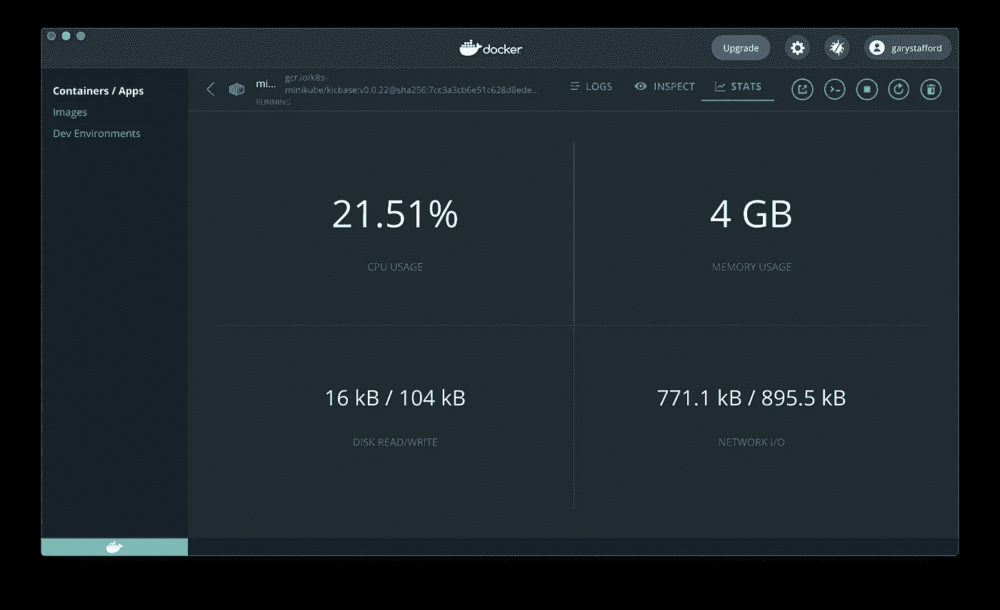

## 伊斯迪奥

假设您已经下载并配置了 Istio，将其安装到 minikube 上。我目前已经安装了 [Istio 1.10.0](https://istio.io/latest/news/releases/1.10.x/announcing-1.10/) ，并且在我的 [Oh My Zsh](https://ohmyz.sh/) `.zshrc`文件中设置了`ISTIO_HOME`环境变量。我还在我的`PATH`环境变量中设置了 Istio 的`bin/`子目录。`bin/`子目录包含了`istioctl`可执行文件。

```
echo $ISTIO_HOME *> /Applications/Istio/istio-1.10.0*where istioctl*> /Applications/Istio/istio-1.10.0/bin/istioctl*istioctl version

*> client version: 1.10.0
  control plane version: 1.10.0
  data plane version: 1.10.0 (4 proxies)*
```

Istio 带有几个内置配置[配置文件](https://istio.io/latest/docs/setup/additional-setup/config-profiles/)。这些配置文件提供了对 Istio 控制平面和 Istio 数据平面侧柜的定制。

```
istioctl profile list*> Istio configuration profiles:
    default
    demo
    empty
    external
    minimal
    openshift
    preview
    remote*
```

对于这个演示，我们将使用默认的概要文件，它安装了`istiod`和一个`istio-ingressgateway`。我们不需要使用`istio-egressgateway`，因为所有组件都将在 minikube 上本地安装。

```
istioctl install --set profile=default -y*> ✔ Istio core installed
  ✔ Istiod installed
  ✔ Ingress gateways installed
  ✔ Installation complete*
```

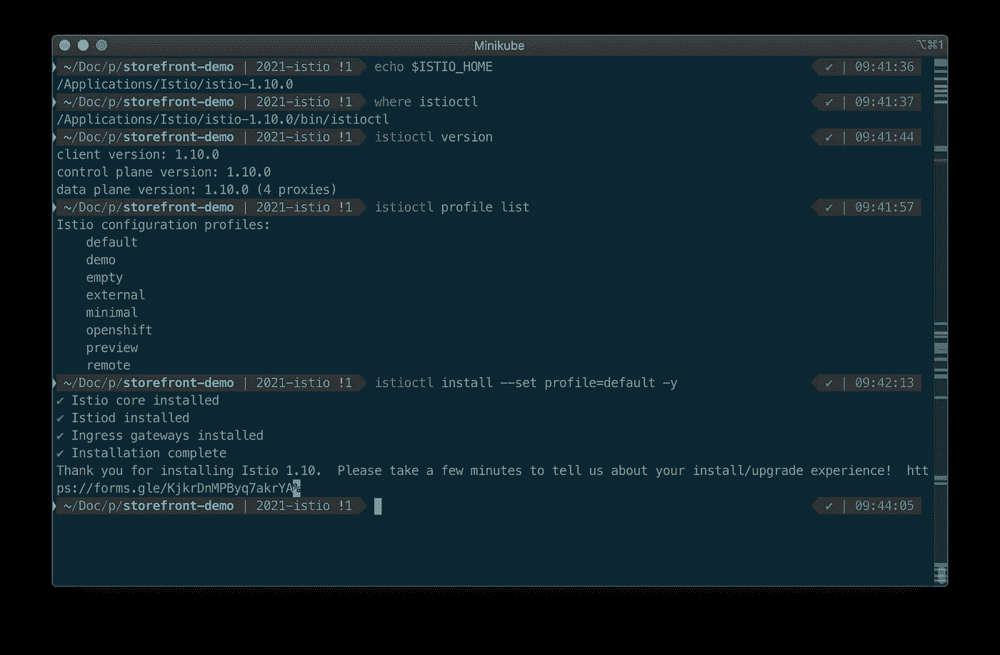

## 迷你库贝隧道

类型为`LoadBalancer`的 Kubernetes 服务可以通过使用`minikube tunnel`命令公开(不要将 Spring Boot *服务*(又名微服务)与 Kubernetes *服务*资源类型混淆)。Minikube 隧道必须在单独的终端窗口中运行，以保持`LoadBalancer`运行。我们之前创建了`istio-ingressgateway`。运行以下命令，注意`EXTERNAL-IP`的状态为`<pending>`。目前没有与我们的`LoadBalancer`相关联的外部 IP 地址。

```
kubectl get svc istio-ingressgateway -n istio-system
```

要关联 IP 地址，请在单独的终端选项卡中运行`minikube tunnel`命令。因为它需要打开特权端口 80 和 443 来暴露，这个命令将提示您输入您的`sudo`密码。

```
minikube tunnel
```

重新运行上一个命令。现在应该有一个与`LoadBalancer.`相关联的外部 IP 地址，在我的例子中是`127.0.0.1.`

```
kubectl get svc istio-ingressgateway -n istio-system
```

显示的外部 IP 地址是我们将用来[访问我们选择在 minikube 上对外公开的资源](https://minikube.sigs.k8s.io/docs/handbook/accessing/)的地址。

## Minikube 仪表板

再次，在一个单独的终端选项卡中，打开 Minikube 仪表板(又名 Kubernetes 仪表板)。

```
minikube dashboard
```

仪表板将为您提供所有已安装的 Kubernetes 组件的可视化概览。

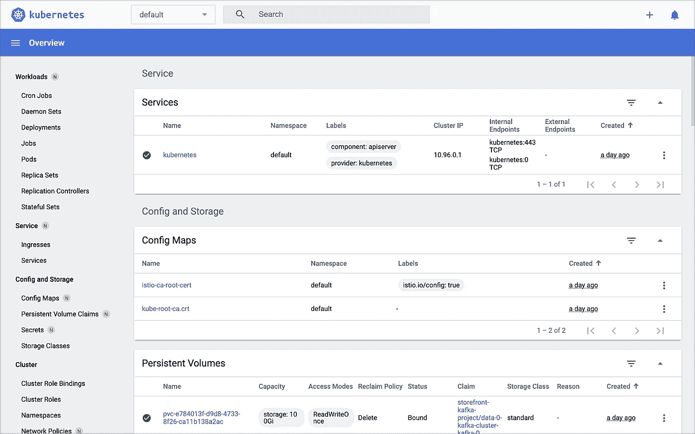

显示 istio-system 名称空间的 Minikube 仪表板

## 名称空间

Kubernetes 支持由同一个物理集群支持的多个虚拟集群。这些虚拟集群被称为[名称空间](https://kubernetes.io/docs/concepts/overview/working-with-objects/namespaces/)。在这个演示中，我们将使用四个名称空间来组织我们部署的资源:`dev`、`mongo`、`kafka`和`storefront-kafka-project`。`dev`名称空间是我们将部署 Storefront API 的微服务的地方:`accounts`、`orders`和`fulfillment`。我们将把 [MongoDB](https://www.mongodb.com/1) 和 [Mongo Express](https://github.com/mongo-express/mongo-express) 部署到`mongo`名称空间。最后，我们将使用`kafka`和`storefront-kafka-project` 名称空间将 [Apache Kafka](https://kafka.apache.org/) 部署到 minikube，使用 [Strimzi](https://strimzi.io/) 、一个[云本地计算基金会](https://cncf.io/)沙盒项目和 CMAK。

```
kubectl apply -f ./minikube/resources/namespaces.yaml
```

## 自动边车注射

为了利用 Istio 的所有功能，网格中的单元必须运行 Istio 边车代理。当您在一个名称空间上设置了`istio-injection=enabled` `label`并且启用了 injection webhook 时，在该名称空间中创建的任何新 pod 都会自动添加一个 sidecar。将`dev`命名空间标记为[自动边车注入](https://istio.io/latest/docs/setup/additional-setup/sidecar-injection/#automatic-sidecar-injection)确保我们的店面 API 的微服务——`accounts`、`orders`和`fulfillment`——将有 Istio 边车代理自动注入到它们的 [pods](https://kubernetes.io/docs/concepts/workloads/pods/) 中。

```
kubectl label namespace dev istio-injection=enabled
```

## MongoDB

接下来，将 MongoDB 和 Mongo Express 部署到 minikube 上的`mongo`名称空间。为了确保从 Mongo Express 成功连接到 MongoDB，我建议在部署 Mongo Express 之前给 MongoDB 一个完全启动的机会。

```
kubectl apply -f ./minikube/resources/mongodb.yaml -n mongosleep 60kubectl apply -f ./minikube/resources/mongo-express.yaml -n mongo
```

要确认部署成功，请使用以下命令:

```
kubectl get services -n mongo
```

或者使用 Kubernetes 仪表板来确认部署。

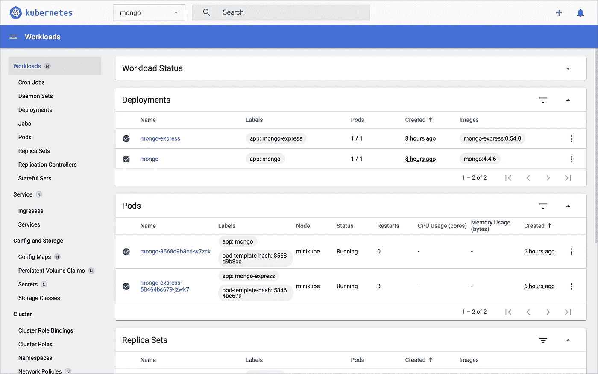

## Mongo Express 用户界面访问

对于应用程序的某些部分(例如，前端)，您可能希望将服务公开到集群外部的外部 IP 地址上。Kubernetes `[ServiceTypes](https://kubernetes.io/docs/concepts/services-networking/service/#publishing-services-service-types)`允许你指定你想要什么样的服务；默认是`ClusterIP`。

注意，MongoDB 使用的是`ClusterIP`，而 Mongo Express 使用的是`[NodePort](https://kubernetes.io/docs/concepts/services-networking/service/#nodeport)`。使用 NodePort，服务在每个节点的 IP 上的一个静态端口上公开(即`NodePort`)。您可以通过请求`<NodeIP>:<NodePort>`从集群外部联系`NodePort`服务。

在单独的终端选项卡中，使用以下命令打开 Mongo Express:

```
minikube service --url mongo-express -n mongo
```

您应该会看到类似如下的输出:

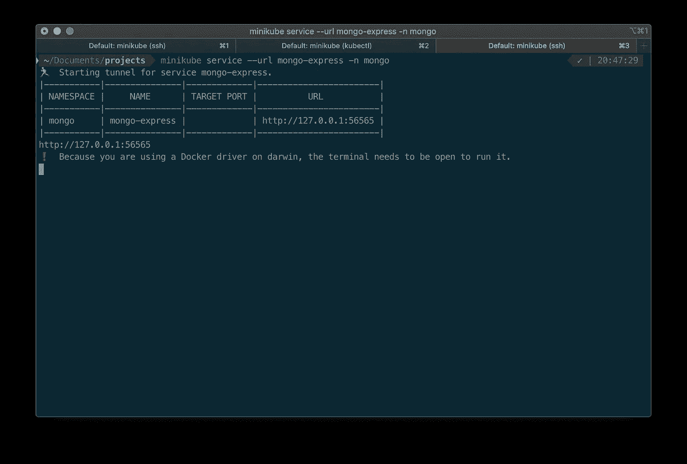

点击链接打开 Mongo Express。在 UI 中应该可以看到三个 MongoDB 操作数据库。这三个店面数据库和集合将在本文后面自动创建:`accounts`、`orders`和`fulfillment`。

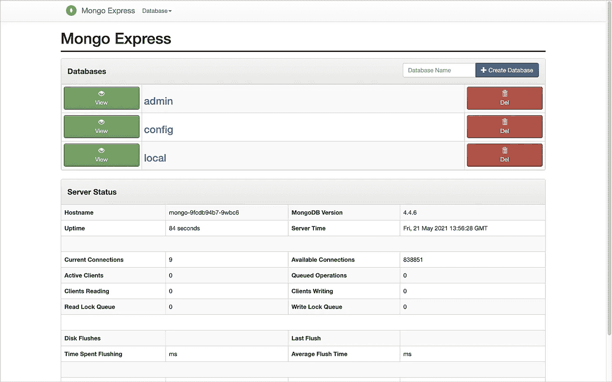

## 阿帕奇卡夫卡使用斯特里姆齐

接下来，我们将使用 [Strimzi](https://strimzi.io/) 将 Apache Kafka 和 Apache Zookeeper 安装到 minikube 上的`kafka`和`storefront-kafka-project` 名称空间中。由于 Strimzi 有一个很棒的，易于使用的[快速入门指南](https://strimzi.io/docs/operators/latest/quickstart.html)，我不会在这篇文章中详述完整的安装过程。我建议使用他们的指南来理解这个过程和每个命令的作用。然后，使用我在下面包含的稍加修改的 Strimzi 命令来安装 Kafka 和 Zookeeper。

```
*# assuming 0.23.0 is latest version available* curl -L -O [https://github.com/strimzi/strimzi-kafka-operator/releases/download/0.23.0/strimzi-0.23.0.zip](https://github.com/strimzi/strimzi-kafka-operator/releases/download/0.23.0/strimzi-0.23.0.zip)unzip strimzi-0.23.0.zipcd strimzi-0.23.0sed -i '' 's/namespace: .*/namespace: kafka/' install/cluster-operator/*RoleBinding*.yaml*# manually change STRIMZI_NAMESPACE value to storefront-kafka-project* nano install/cluster-operator/060-Deployment-strimzi-cluster-operator.yamlkubectl create -f install/cluster-operator/ -n kafkakubectl create -f install/cluster-operator/020-RoleBinding-strimzi-cluster-operator.yaml -n storefront-kafka-projectkubectl create -f install/cluster-operator/032-RoleBinding-strimzi-cluster-operator-topic-operator-delegation.yaml -n storefront-kafka-projectkubectl create -f install/cluster-operator/031-RoleBinding-strimzi-cluster-operator-entity-operator-delegation.yaml -n storefront-kafka-projectkubectl apply -f ../storefront-demo/minikube/resources/strimzi-kafka-cluster.yaml -n storefront-kafka-projectkubectl wait kafka/kafka-cluster --for=condition=Ready --timeout=300s -n storefront-kafka-projectkubectl apply -f ../storefront-demo/minikube/resources/strimzi-kafka-topics.yaml -n storefront-kafka-project
```

## 动物园入口

我们想安装雅虎的[CMAK](https://github.com/yahoo/CMAK)(Apache Kafka 的集群管理器)，为 Kafka 提供一个管理界面。然而，CMAK 要求接触动物园管理员。你不能从 CMAK 直接访问 Strimzi 的动物园管理员；这是为了避免性能和安全问题。参见[GitHub 问题](https://github.com/strimzi/strimzi-kafka-operator/issues/1337)以获得更好的解释。我们将使用适当命名的动物园入口作为 CMAK 动物园管理员的代理来克服这个挑战。

要安装动物园入口，请查看 GitHub 项目的安装指南，然后使用以下命令:

```
git clone [https://github.com/scholzj/zoo-entrance.git](https://github.com/scholzj/zoo-entrance.git)cd zoo-entrance*# optional: change my-cluster to kafka-cluster* sed -i '' 's/my-cluster/kafka-cluster/' deploy.yamlkubectl apply -f deploy.yaml -n storefront-kafka-project
```

## Apache Kafka 的集群管理器

接下来，安装雅虎的[CMAK](https://github.com/yahoo/CMAK)(Apache Kafka 的集群管理器)给我们一个 Kafka 的管理界面。运行以下命令将 CMAK 部署到`storefront-kafka-project`名称空间中。

```
kubectl apply -f ./minikube/resources/cmak.yaml -n storefront-kafka-project
```

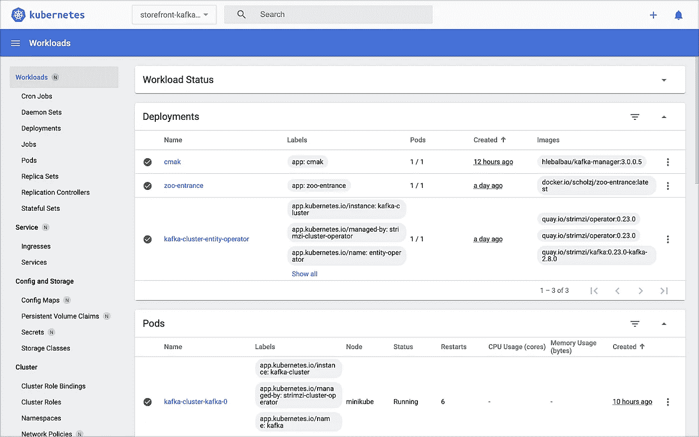

类似于 Mongo Express，我们可以使用它的`NodePort`访问 CMAK 的 UI。在单独的终端选项卡中，运行以下命令:

```
minikube service --url cmak -n storefront-kafka-project
```

您应该看到类似于 Mongo Express 的输出。点击提供的链接访问 CMAK。在 CMAK 选择“添加集群”,将我们现有的 Kafka 集群添加到 CMAK 的管理界面。使用 Zoo Enterence 的服务地址作为集群 Zookeeper Hosts 值。

```
zoo-entrance.storefront-kafka-project.svc:2181
```

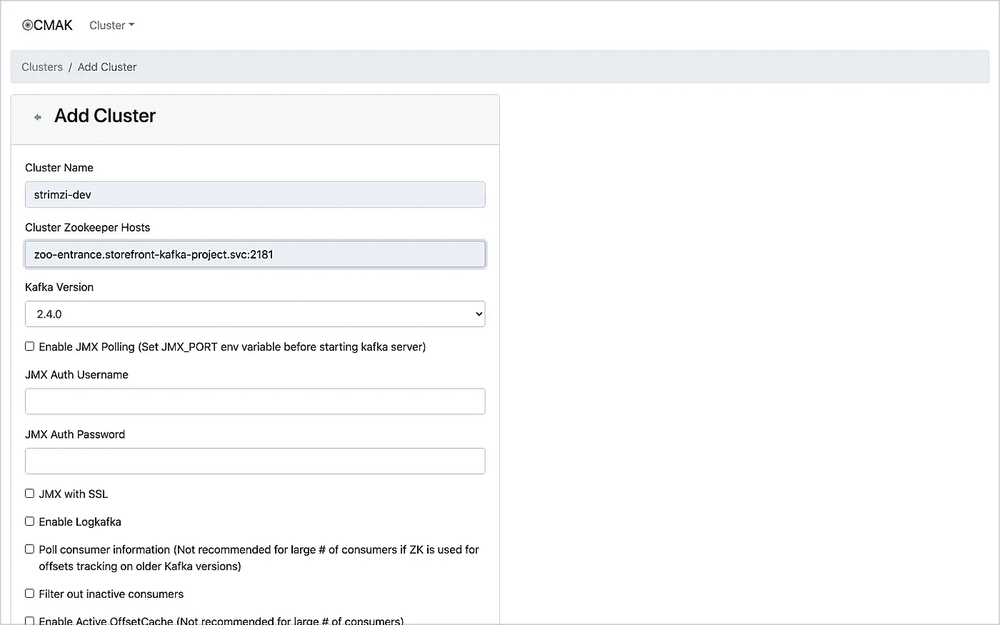

一旦完成，您应该会看到我们之前用 Strimzi 创建的三个 Kafka 主题:`accounts.customer.change`、`fulfillment.order.change`和`orders.order.change`。每个主题将有三个分区、一个副本和一个代理。您还应该看到`_consumer_offsets`主题，Kafka 使用它来存储关于每组消费者(groupID)的每个`topic:partition`的[承诺补偿](https://kafka.apache.org/0110/documentation.html#impl_zkconsumeroffsets)的信息。

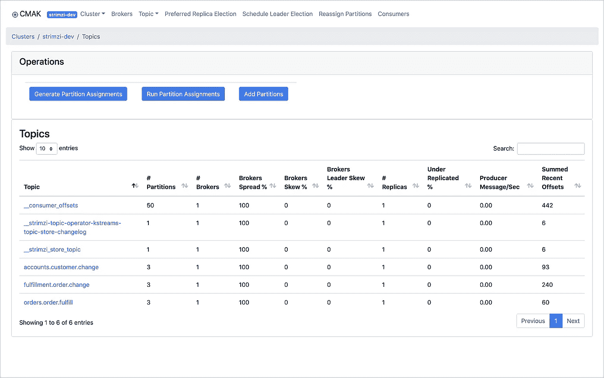

## 店面 API 微服务

我们终于准备好将 Storefront API 的微服务安装到`dev`名称空间中了。每个微服务都被预先配置为在各自的名称空间中访问 Kafka 和 MongoDB。

```
kubectl apply -f ./minikube/resources/accounts.yaml -n devkubectl apply -f ./minikube/resources/orders.yaml -n devkubectl apply -f ./minikube/resources/fulfillment.yaml -n dev
```

Spring Boot 服务通常需要大约两分钟才能完全启动。从[docker.com](https://hub.docker.com/u/garystafford)下载 Docker 映像所需的时间和启动时间意味着三个微服务中的每一个都可能需要 3-4 分钟来准备接受 API 流量。

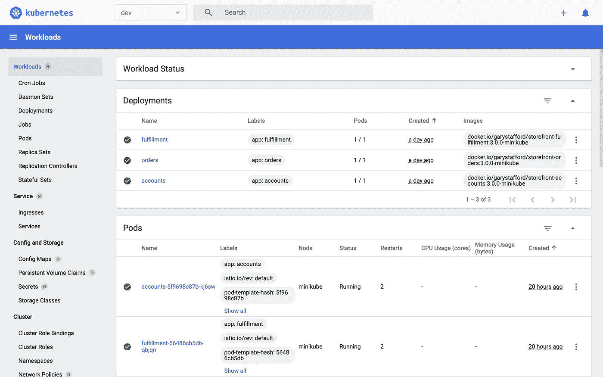

下面我们看到一个`accounts` pod 同时运行一个`accounts`容器和一个`istio-proxy`容器。pos 还包含一个`istio-init` init 容器。

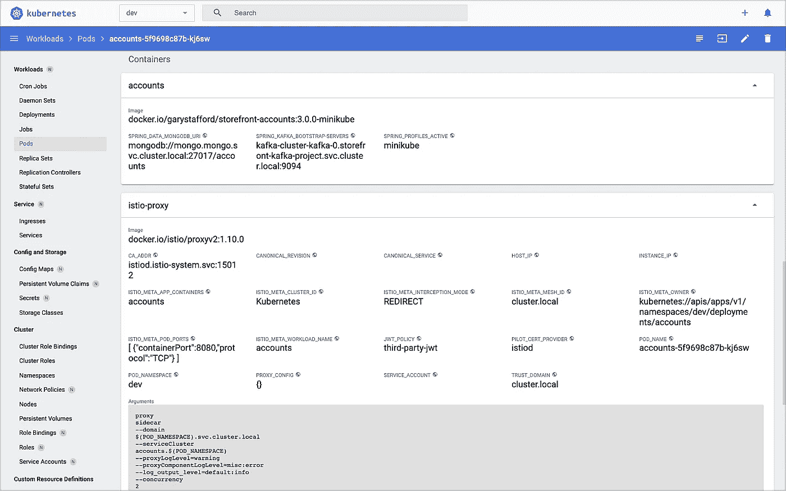

## Istio 组件

我们希望能够通过我们的 Kubernetes `LoadBalancer`访问我们的店面 API 的微服务，同时利用 Istio 作为服务网格的所有功能。为此，我们需要部署一个 Istio `[Gateway](https://istio.io/latest/docs/reference/config/networking/gateway/)`和一个`[VirtualService](https://istio.io/latest/docs/reference/config/networking/virtual-service/)`。我们还需要部署`[DestinationRule](https://istio.io/latest/docs/reference/config/networking/destination-rule/)`资源。`[Gateway](https://istio.io/latest/docs/reference/config/networking/gateway/)`描述了在网格边缘运行的负载均衡器，接收传入或传出的 HTTP/TCP 连接。`[VirtualService](https://istio.io/latest/docs/reference/config/networking/virtual-service/)`定义了当主机被寻址时要应用的一组流量路由规则。最后，`[DestinationRule](https://istio.io/latest/docs/reference/config/networking/destination-rule/)`定义了在路由发生后应用于服务流量的策略。

```
kubectl apply -f ./minikube/resources/destination_rules.yaml -n devkubectl apply -f ./minikube/resources/istio-gateway.yaml -n dev
```

## 测试系统并创建样本数据

我提供了一个 Python 3 脚本，该脚本针对 Storefront API 以特定的顺序运行一系列七个`HTTP GET`请求。这些调用将验证部署，确认 API 的 Spring Boot 服务可以访问 Kafka 和 MongoDB，生成一些初始数据，并根据初始 Insert 语句自动创建 MongoDB 数据库集合。

```
*python3 -m pip install -r* ./utility_scripts/*requirements.txt -U*python3 ./utility_scripts/refresh.py
```

该脚本的输出应该如下所示:

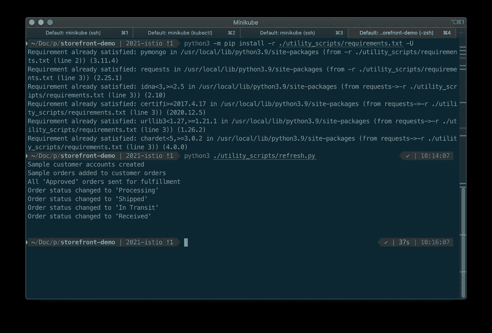

如果我们现在看一下 Mongo Express，我们应该注意到三个新的数据库:`accounts`、`orders`和`fulfillment`。

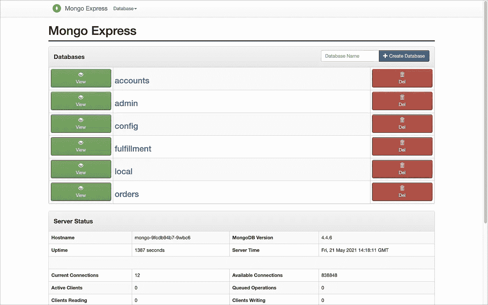

## 可观察性工具

Istio 使得[将](https://istio.io/latest/docs/ops/integrations/)与几个常用工具集成变得很容易，包括[证书管理器](https://cert-manager.io/)、[普罗米修斯](https://prometheus.io/)、[格拉夫纳](https://grafana.com/)、[基亚里](https://kiali.io/)、[齐普金](https://zipkin.io/)和[耶格](https://www.jaegertracing.io/)。为了更好地观察我们的店面 API，我们将安装三个著名的观察工具:Kiali、Prometheus 和 Grafana。幸运的是，这些工具都包含在 Istio 中。您可以将这些软件中的任何一个或全部安装到 minikube 上。我建议一次安装一个工具，以免压垮 minikube 的 CPU 和内存资源。

```
kubectl apply -f ./minikube/resources/prometheus.yamlkubectl apply -f $ISTIO_HOME/samples/addons/grafana.yamlkubectl apply -f $ISTIO_HOME/samples/addons/kiali.yaml
```

部署完成后，要访问这些工具的任何 UI，请在新的终端窗口中使用`istioctl dashboard`命令:

```
istioctl dashboard kialiistioctl dashboard prometheusistioctl dashboard grafana
```

## 基亚利

Kiali 是一个基于 Istio 的服务网格的管理控制台。它提供了仪表板、可观察性，并允许您使用健壮的配置和验证功能来操作网格。下面我们看到了 Kiali 的一个视图，其中店面 API 流量流向 Kafka 和 MongoDB。

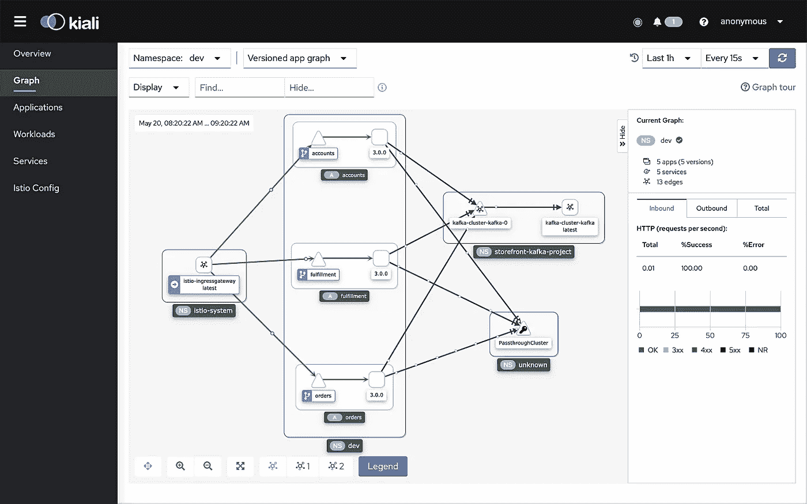

来自 Kiali 的店面 API 流量视图

## 普罗米修斯

Prometheus 是云本地计算基金会的一个项目，是一个系统和服务监控系统。它以给定的时间间隔从配置的目标收集度量，评估规则表达式，显示结果，并可以在观察到指定条件时触发预警。

三个 Storefront API 微服务都有对 Micrometer 的依赖，具体来说就是对`micrometer-registry-prometheus`的依赖。作为一个仪器门面， [Micrometer](https://micrometer.io/) 允许您通过一个供应商中立的接口用维度度量来测试您的代码，并在最后一步决定监控系统。用 Micrometer 检测核心库代码允许将库包含在向不同后端传送度量的应用程序中。给定[微米普罗米修斯](https://micrometer.io/docs/registry/prometheus)依赖，每个微服务公开一个`/prometheus`端点(例如`[http://127.0.0.1/accounts/actuator/prometheus](http://127.0.0.1/accounts/actuator/prometheus),)` [)](http://127.0.0.1/accounts/actuator/prometheus),) 如下图所示在 Postman。

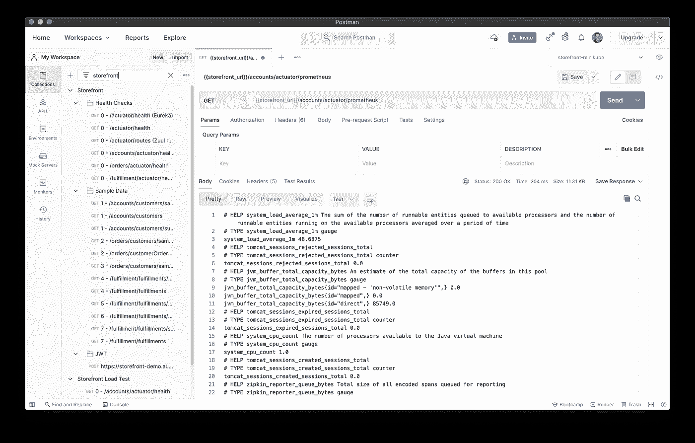

`/prometheus`端点公开了许多有用的指标，并被配置为由 Prometheus 收集。这些指标可以显示在 Prometheus 中，并通过 Prometheus 间接显示在 Grafana 仪表板中。我已经定制了 [Istio 的普罗米修斯](https://istio.io/latest/docs/ops/integrations/prometheus/)版本，并将其包含在项目(`prometheus.yaml`)中，该项目现在抓取店面 API 的指标。

```
scrape_configs:
    - job_name: 'spring_micrometer'
 **metrics_path: '/actuator/prometheus'**      scrape_interval: 5s
      static_configs:
        - targets: ['accounts.dev:8080','orders.dev:8080','fulfillment.dev:8080']
```

在普罗米修斯中，我们可以看到一个春天卡夫卡听众指标`spring_kafka_listener_seconds_sum`的示例图。我们的系统向普罗米修斯暴露了几十个指标，我们可以对其进行观察和警告。

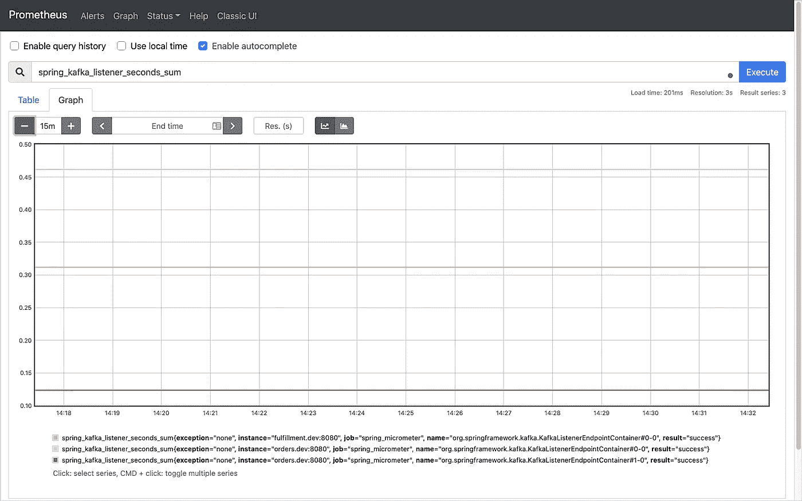

## 格拉夫纳

Grafana 允许您查询、可视化、提醒和了解您的指标，无论它们存储在哪里。与您的团队一起创建、探索和共享仪表板，以培养数据驱动的文化。最后，这里有一个 Grafana 的 [Spring Boot 仪表板](https://grafana.com/grafana/dashboards/11378)的例子。Grafana 的社区[仪表盘页面](https://grafana.com/grafana/dashboards)提供了更多仪表盘。Grafana 仪表板使用 Prometheus 作为其指标数据的来源。

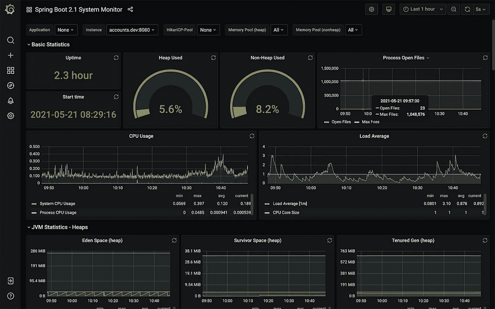

## 店面 API 端点

这三个店面 API 的 Spring Boot 服务都是功能齐全的 [Spring Boot](https://spring.io/projects/spring-boot) 、 [Spring Data REST](https://projects.spring.io/spring-data-rest/) 、 [Spring HATEOAS-enabled](https://spring.io/projects/spring-hateoas) 应用。每个都公开了一组丰富的 CRUD 端点，用于与微服务的数据实体进行交互。为了更好地理解 Storefront API，每个 Spring Boot 微服务都使用 [SpringFox](http://springfox.github.io/springfox/) ，它为用 Spring 构建的 API 生成自动化的 JSON API 文档。微服务构建还包括`springfox-swagger-ui` [web jar](http://www.webjars.org/) ，它与 [Swagger UI](https://github.com/swagger-api/swagger-ui) 一起提供。 [Swagger](https://swagger.io/) 利用一系列用于生成、可视化和维护 API 文档的解决方案，将手工工作从 API 文档中解放出来。

从 web 浏览器中，您可以使用三个微服务中的任何一个的`[/swagger-ui](http://127.0.0.1/accounts/swagger-ui/)/`子目录/子路径来访问全功能的 Swagger UI(例如`[http://127.0.0.1/accounts/swagger-ui/](http://127.0.0.1/accounts/swagger-ui/)`)。

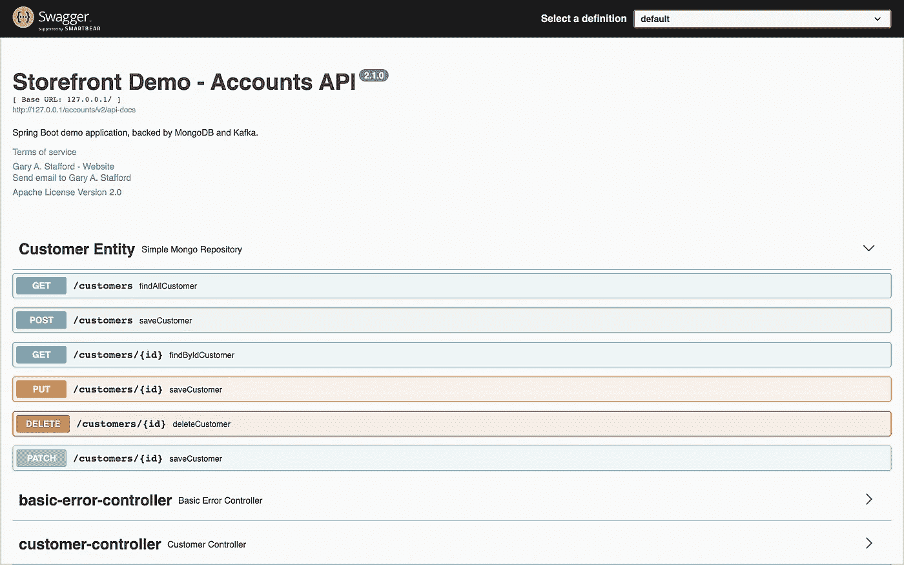

帐户服务客户实体端点

每个微服务的数据模型(POJOs)也通过 Swagger UI 暴露出来。

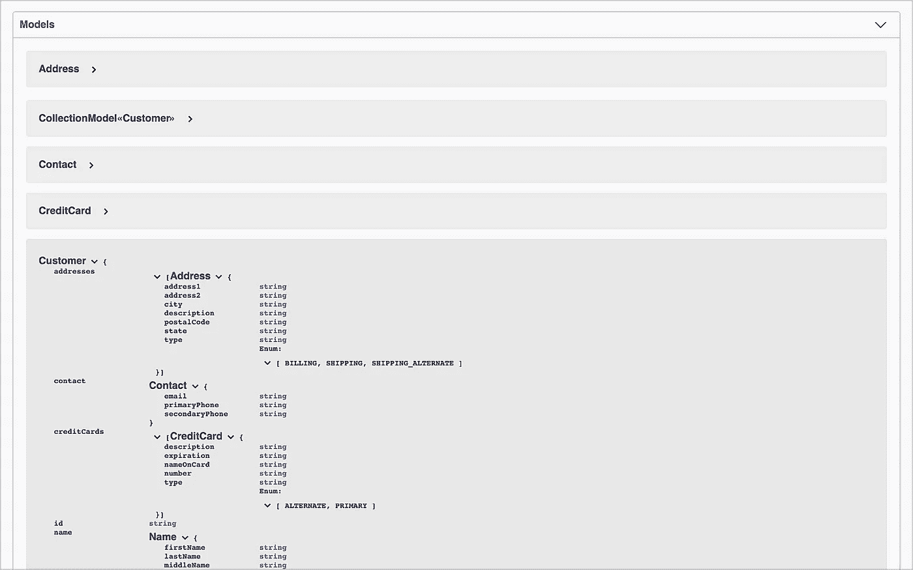

帐户服务数据模型

## Spring Boot 执行器

此外，每个微服务包括 [Spring Boot 致动器](https://docs.spring.io/spring-boot/docs/current/reference/html/actuator.html#actuator)。致动器公开了额外的操作端点，允许我们观察正在运行的微服务。使用 Actuator，您可以获得许多功能，包括使用`/actuator/`子目录/子路径(例如`[http://127.0.0.1/accounts/actuator/](http://127.0.0.1/accounts/actuator/)`)访问可用的面向操作的端点。在这个演示中，我没有限制对任何可用执行器端点的访问。

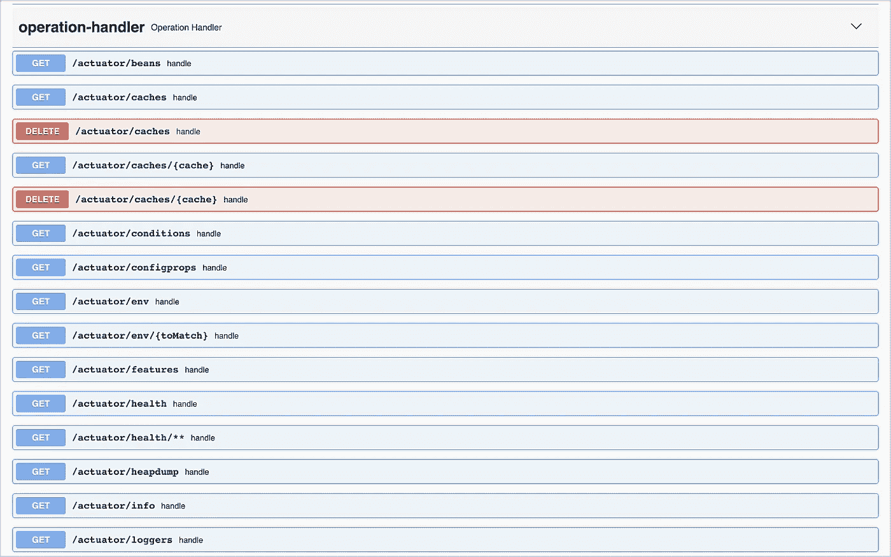

使用 Swagger 看到的 Spring Boot 执行器端点的部分列表

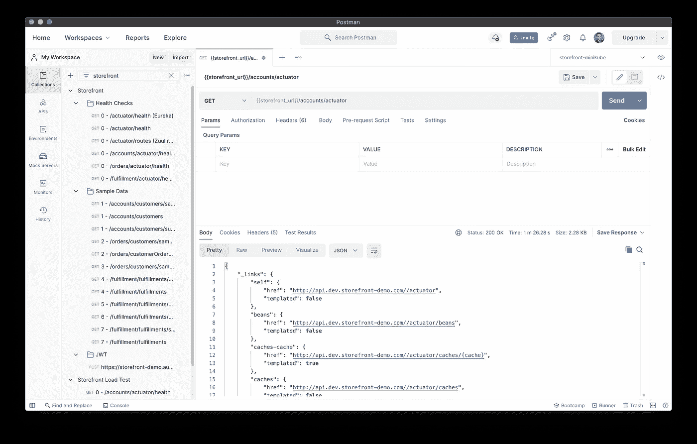

使用 Postman 看到的 Spring Boot 执行器端点的部分列表

# 结论

在这篇由两部分组成的文章中，我们学习了如何使用 Spring Boot 构建一个 API。对于 Apache Kafka 项目，我们使用 pub/sub 模型和 Spring 来确保 API 的分布式数据完整性。当一个微服务更改了相关数据时，该状态更改会触发一个状态更改事件，该事件会使用 Kafka 主题与其他微服务共享。

我们还学习了如何使用 minikube 在 Kubernetes 上运行的本地开发环境中部署和运行 API。我们增加了经过生产测试的可观察性工具来提供操作可见性，包括 CMAK、Mongo Express、Kiali、Prometheus 和 Grafana。

这篇博客代表我自己的观点，而不是我的雇主亚马逊网络服务公司(AWS)的观点。所有产品名称、徽标和品牌都是其各自所有者的财产。