# 探索流行的开源流处理技术:第 2 部分，共 2 部分

> 原文：<https://itnext.io/exploring-popular-open-source-stream-processing-technologies-part-2-of-2-2832b7727cd0?source=collection_archive---------2----------------------->

## Apache Spark 结构化流、Apache Kafka 流、Apache Flink 和 Apache Pinot 与 Apache 超集的简短演示

根据[TechTarget](https://www.techtarget.com/searchdatamanagement/definition/stream-processing),*流处理是一种数据管理技术，涉及* ***摄取连续的数据流，以实时快速分析、过滤、转换或增强数据*** *。处理后，数据被传递给应用程序、数据存储或另一个流处理引擎。* " [Confluent](https://www.confluent.io/learn/batch-vs-real-time-data-processing/) ，一家完全管理的 Apache Kafka 市场领导者，将流处理定义为"*一种软件范例，它在连续的数据流还在运动的时候* ***接收、处理和管理它们*** *。*

这篇由两部分组成的博文和 YouTube 上的视频演示探索了四个流行的开源软件(OSS)流处理项目: [Apache Spark 结构化流](https://spark.apache.org/docs/latest/structured-streaming-programming-guide.html)、 [Apache Kafka 流](https://kafka.apache.org/documentation/streams/)、 [Apache Flink](https://flink.apache.org/) 和 [Apache Pinot](https://pinot.apache.org/) 。

这篇文章使用了开源项目，使得跟随演示变得更加容易，并且将成本保持在最低。然而，您可以很容易地用开源项目替代您喜欢的 SaaS、CSP 或 COSS 服务产品。

## 第二部分

我们将从第一部开始继续我们的探索。在第二部分中，我们将介绍[阿帕奇弗林克](https://flink.apache.org/)和[阿帕奇皮诺](https://pinot.apache.org/)。此外，我们将把 [Apache 超集](https://superset.apache.org/)合并到演示中，以将我们的流处理管道的实时结果可视化为仪表板。

# 演示#3: Apache Flink

在四个演示的第三个中，我们将检查[阿帕奇弗林克](https://flink.apache.org/)。对于本文的这一部分，我们还将使用三个 GitHub 存储库项目中的第三个，`[flink-kafka-demo](https://github.com/garystafford/flink-kafka-demo)`。该项目包含一个用 Java 编写的 Flink 应用程序，它执行流处理、增量聚合和多流连接。

Apache Flink 演示的高级工作流

## 新的流堆栈

首先，我们需要用第二个[流 Docker 群栈](https://github.com/garystafford/streaming-sales-generator/blob/main/docker/flink-pinot-superset-stack.yml)替换在[第一部分](https://garystafford.medium.com/exploring-popular-open-source-stream-processing-technologies-part-1-of-2-31069337ba0e)中部署的第一个[流 Docker 群栈](https://github.com/garystafford/streaming-sales-generator/blob/main/docker/spark-kstreams-stack.yml)。第二个堆栈包含[阿帕奇卡夫卡](https://kafka.apache.org/)、[阿帕奇动物园管理员](https://zookeeper.apache.org/)、[阿帕奇弗林克](https://flink.apache.org/)、[阿帕奇皮诺](https://pinot.apache.org/)、[阿帕奇超集](https://superset.apache.org/)、阿帕奇卡夫卡的 [UI、](https://github.com/provectus/kafka-ui)[项目 Jupyter](https://jupyter.org/) (JupyterLab)。

堆栈将需要几分钟才能完全部署。完成后，堆栈中应该有十个容器在运行。

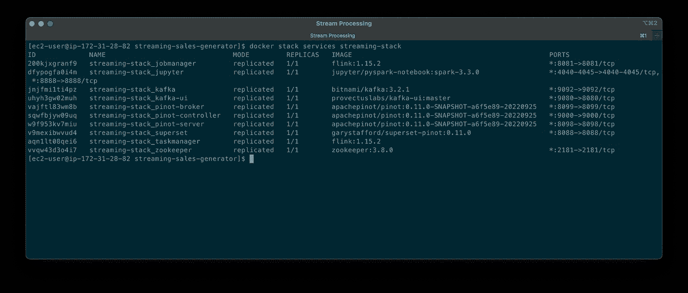

查看 Docker 流堆栈的十个容器

## Flink 应用程序

Flink 应用程序有两个入口类。第一个类`[RunningTotals](https://github.com/garystafford/flink-kafka-demo/blob/main/src/main/java/org/example/RunningTotals.java)`，执行与前面的 KStreams 演示相同的聚合函数。

第二个类`[JoinStreams](https://github.com/garystafford/flink-kafka-demo/blob/main/src/main/java/org/example/JoinStreams.java)`，连接来自`demo.purchases`主题和`demo.products`主题的数据流，实时处理和组合它们，成为一个丰富的事务，并将结果发布到一个新主题`demo.purchases.enriched`。

产生的丰富的购买信息类似于以下内容:

丰富的购买信息示例

## 运行 Flink 作业

要运行 Flink 应用程序，我们必须首先将它编译成一个 uber JAR。

我们可以将 JAR 复制到 Flink 容器中，或者通过 Apache Flink 仪表板(一个基于浏览器的 UI)上传。对于这个演示，我们将通过 Apache Flink 仪表板上传它，可以通过端口 8081 访问。

项目的`[build.gradle](https://github.com/garystafford/flink-kafka-demo/blob/main/build.gradle)`文件已经预置了主类(Flink 的入口类)为`org.example.JoinStreams`。可选地，要运行运行总数演示，我们可以更改`build.gradle`文件并重新编译，或者简单地将 Flink 的入口类更改为`org.example.RunningTotals`。

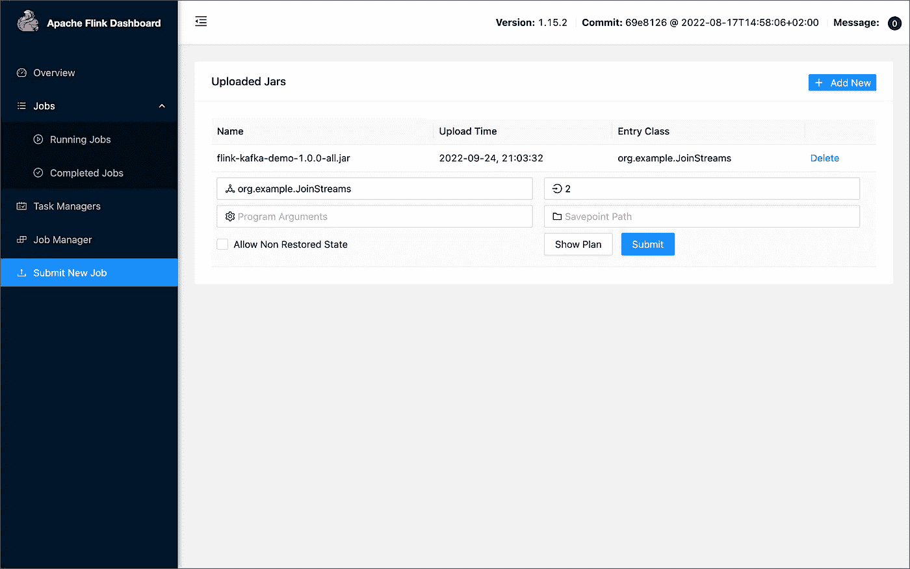

将 JAR 上传到 Apache Flink

在运行 Flink 作业之前，在后台重启销售生成器(`nohup python3 ./producer.py &`)以生成新的数据流。然后开始 Flink 工作。

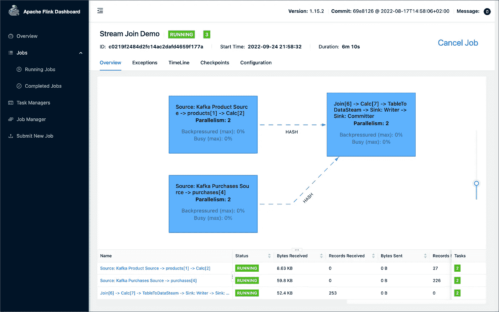

Apache Flink 作业运行成功

为了确认 Flink 应用程序正在运行，我们可以使用 Kafka CLI 检查新的`demo.purchases.enriched`主题的内容。

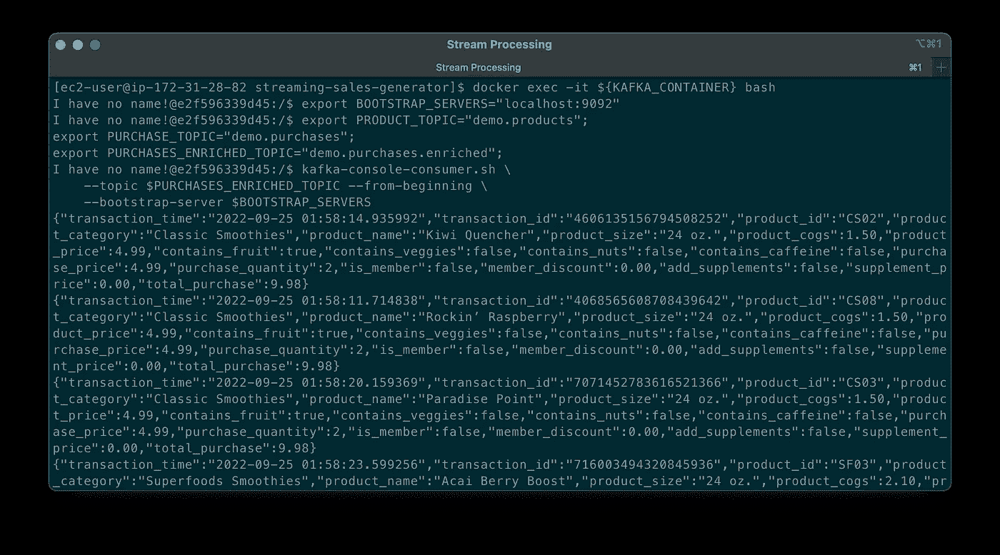

新的 demo.purchases.enriched 主题填充了来自 Apache Flink 的消息

或者，您可以使用 Apache Kafka 的 UI，可以在端口 9080 上访问。

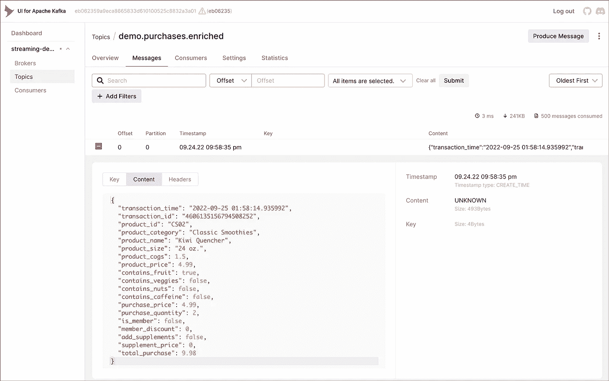

查看 Apache Kafka 用户界面中的消息

# 示范#4:阿帕奇皮诺

在第四次也是最后一次演示中，我们将探索[阿帕奇皮诺](https://pinot.apache.org/)。首先，我们将使用 SQL 查询来自 [Apache Kafka](https://kafka.apache.org/) 的无界数据流，这些数据流由销售生成器和 Apache Flink 应用程序生成。然后，我们在 Apache 超集中构建一个实时仪表板，使用 Apache Pinot 作为我们的数据源。

## 创建表格

根据 Apache Pinot [文档](https://docs.pinot.apache.org/basics/components/table)，“*表是表示相关数据集合的逻辑抽象。它由列和行组成(在 Pinot 中称为文档)。*“皮诺表有三种类型:离线、实时和混合。在本演示中，我们将创建三个实时表。实时表从流中摄取数据——在我们的例子中是 Kafka——并从消耗的数据中构建[段](https://docs.pinot.apache.org/basics/components/segment)。进一步，根据[文档](https://docs.pinot.apache.org/basics/components/table)，*中的每一个表都与一个* [*模式*](https://docs.pinot.apache.org/basics/components/schema) *相关联。模式定义了表中的字段和数据类型。该模式存储在 Zookeeper 中，与* [*表一起配置*](https://docs.pinot.apache.org/configuration-reference/table) *。*

下面，我们看到了三个实时表之一`purchasesEnriched`的模式和配置。注意这些列是如何被分成三个[类别](https://docs.pinot.apache.org/basics/components/schema)的:维度、度量和日期时间。

`purchasesEnriched Realtime table`的模式文件

`purchasesEnriched Realtime table`的配置文件

首先，将三个 Pinot 实时表模式和配置从`[streaming-sales-generator](https://github.com/garystafford/streaming-sales-generator)` GitHub 项目复制到 Apache Pinot 控制器容器中。接下来，使用一个`docker exec`命令调用 Pinot [命令行接口](https://docs.pinot.apache.org/operators/cli)的(CLI) `AddTable`命令来创建三个表:`products`、`purchases`和`purchasesEnriched`。

要确认这三个表是正确创建的，请使用可以在端口 9000 上访问的 Apache Pinot 数据浏览器。使用集群管理器中的表选项卡。

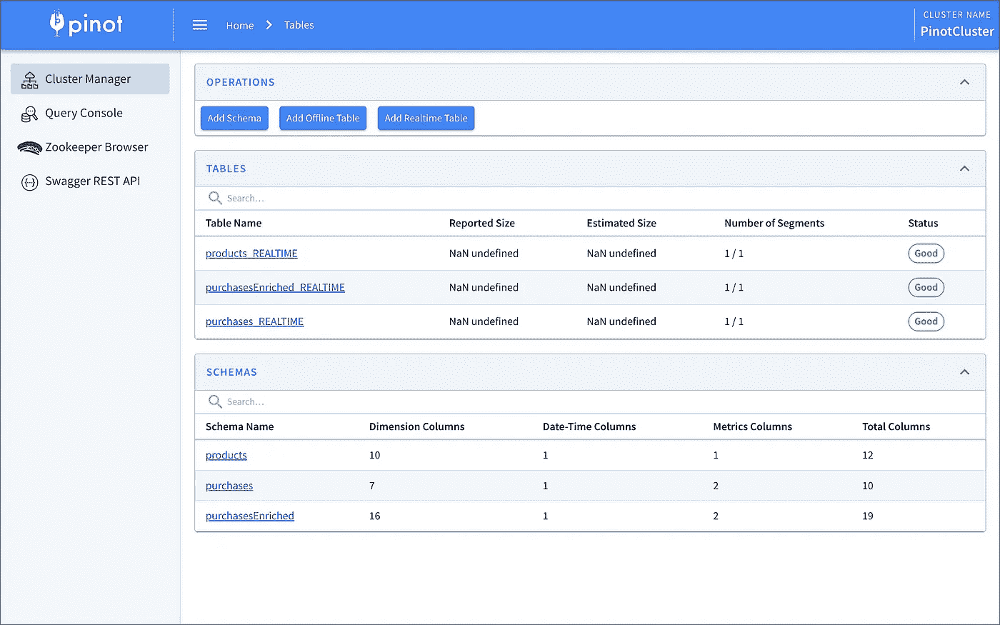

Cluster Manager 的 Tables 选项卡显示了三个实时表和相应的模式

我们可以从集群管理器的 Tables 选项卡中进一步检查和编辑表的配置和模式。

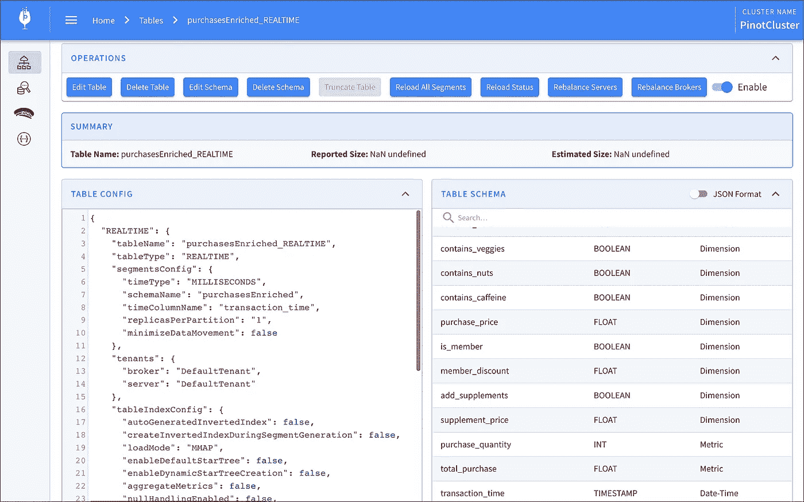

实时表的可编辑配置和模式

这三个表被配置为从相应的 Kafka 主题:`demo.products`、`demo.purchases`和`demo.purchases.enriched`中读取无界数据流。

## 用比诺查询

我们可以使用 Pinot 的查询控制台通过 SQL 查询实时表。根据文档，“ *Pinot 提供了一个用于查询的 SQL 接口。它使用【Apache】*[*方解石*](https://calcite.apache.org/) *SQL 解析器解析查询，并使用* `*MYSQL_ANSI*` *方言。*”

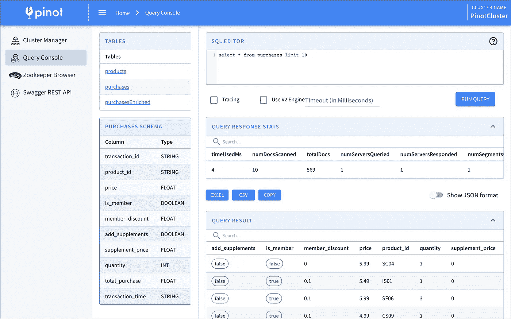

purchases 表的架构和查询结果

在发电机仍然运行的情况下，在查询控制台中重新查询`purchases`表(`select count(*) from purchases`)。您应该注意到，每次重新运行查询时，文档数量都会增加，因为销售生成器会向`demo.purchases`主题发布新消息。

*如果您没有观察到计数增加，请确保销售生成器和 Flink enrichment 作业正在运行。*

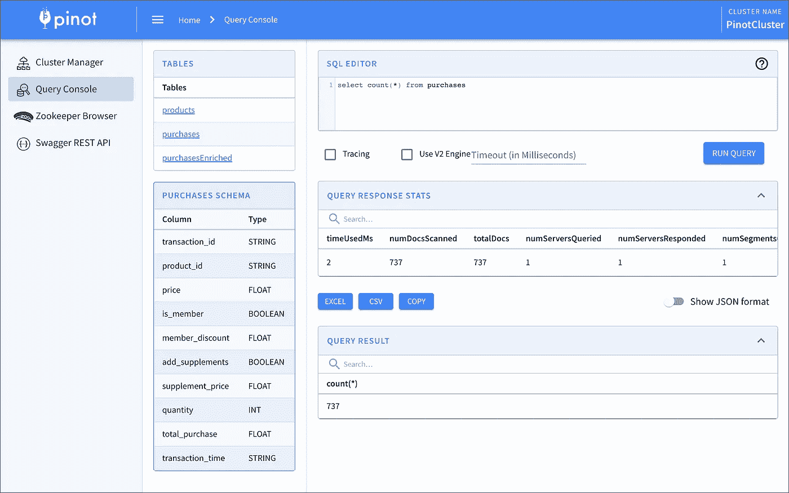

查询控制台显示采购表的文档数继续增加

## 表连接？

想要复制我们在关于`demo.products`和`demo.purchases`主题的演示的第三部分中用 Apache Flink 执行的相同的多流连接似乎是合乎逻辑的。此外，我们可能假设通过在 Pinot 的查询控制台中编写 SQL 语句来连接`products`和`purchases`实时表。然而，根据[文档](https://docs.pinot.apache.org/users/user-guide-query/querying-pinot)，在本文发表时，Pinot 的 0.11.0 版本[目前]不支持连接或嵌套子查询。

这个当前的连接限制是我们创建实时表`purchasesEnriched`的原因，它允许我们在`demo.purchases.enriched`主题中查询 Flink 的实时结果。我们将同时使用 Flink 和 Pinot 作为我们流处理管道的一部分，充分利用每种工具各自的优势和能力。

注意，根据主分支上 Pinot 的最新版本的[文档](https://docs.pinot.apache.org/users/user-guide-query/querying-pinot),*最新的 Pinot 多级支持内部连接、左外连接、半连接和开箱即用的嵌套查询。它针对内存中的进程和延迟进行了优化。*"有关作为 Pinot 新的多阶段查询执行引擎一部分的连接的更多信息，请阅读文档[多阶段查询引擎](https://docs.pinot.apache.org/developers/advanced/v2-multi-stage-query-engine)。

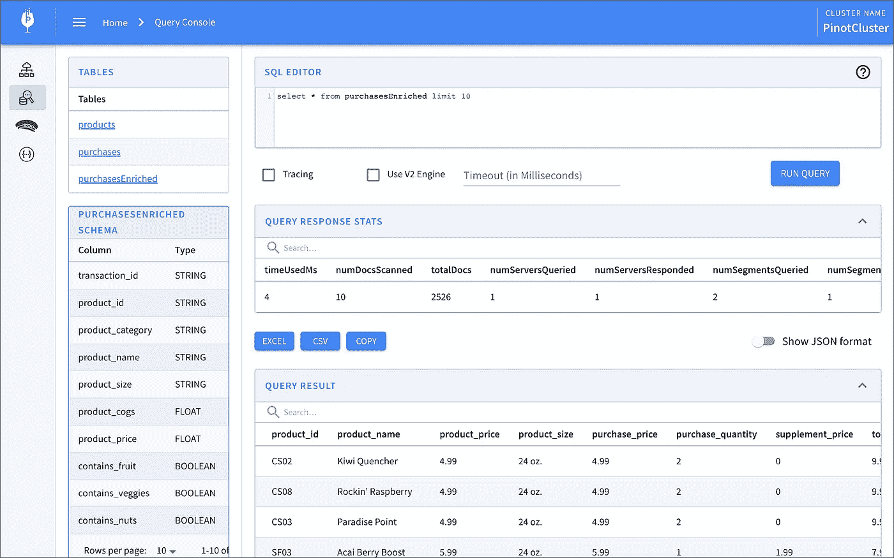

查询实时显示来自`demo.purchases.enriched`主题的结果

## 聚集

我们可以使用 Pinot 丰富的 SQL 查询接口执行实时聚合。例如，像以前的 Spark 和 Flink 一样，我们可以实时计算售出商品的数量和每种产品的总销售额。

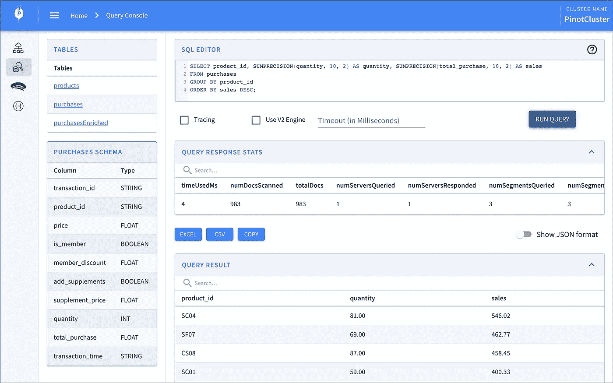

汇总每个产品的累计总数

我们可以对`purchasesEnriched`表做同样的事情，它将使用来自 Apache Flink 应用程序的丰富的连续事务数据流。使用`purchasesEnriched`表，我们可以添加产品名称和产品类别以获得更丰富的结果。每次运行查询时，我们都会获得基于正在运行的销售生成器和 Flink enrichment 作业的实时结果。

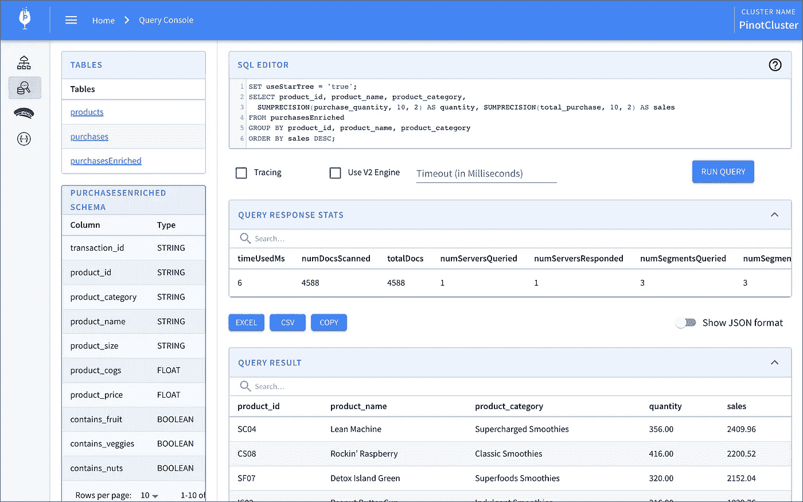

汇总每个产品的累计总数

## 查询选项和索引

注意上面显示的 SQL 查询开头对[星型树索引](https://docs.pinot.apache.org/basics/indexing/star-tree-index)的引用。Pinot 提供了几个[查询选项](https://docs.pinot.apache.org/users/user-guide-query/query-options)，包括`useStarTree`(默认为`true`)。

Pinot 中提供了多种[索引技术](https://docs.pinot.apache.org/basics/indexing)，包括正向索引、反向索引、星形树索引、布隆过滤器和范围索引等。在不同的查询场景中各有优势。根据[文档](https://docs.pinot.apache.org/basics/indexing)，默认情况下，Pinot 为每一列创建一个字典编码的前向索引。

## SQL 示例

这里有几个 SQL 查询的例子，您可以在 Pinot 的查询控制台中尝试:

## Pinot 故障排除

如果在创建表格或查询实时数据时遇到问题，可以从查看 Apache Pinot 日志开始:

# 使用 Apache 超集的实时仪表板

为了显示 Apache Flink 流处理作业产生的实时数据流，并通过 Apache Pinot 进行查询，我们可以使用 [Apache 超集](https://superset.apache.org/)。Superset 将自己定位为一个现代数据探索和可视化平台。“超集”允许用户探索和可视化他们的数据，从简单的折线图到非常详细的地理空间图。”

根据[文档](https://superset.apache.org/docs/databases/installing-database-drivers),“*超集需要为每个要连接的数据存储安装一个 Python DB-API 数据库驱动程序和一个*[*SQLAlchemy*](https://www.sqlalchemy.org/)*方言。*“在 Apache Pinot 的例子中，我们可以使用`[pinotdb](https://pypi.org/project/pinotdb/)`作为 Python DB-API 和 SQLAlchemy 方言来表示 Pinot。由于现有的[超集 Docker 容器](https://hub.docker.com/r/apache/superset)没有安装`[pinotdb](https://pypi.org/project/pinotdb/)`，我用驱动程序构建并发布了一个 Docker 映像，并将其部署为第二个容器流堆栈的一部分。

首先，我们需要配置超集容器实例。这些指令被记录为超集 Docker 映像[库](https://hub.docker.com/r/apache/superset)的一部分。

配置完成后，我们可以登录到基于 web 浏览器的超集 UI，该 UI 可在端口 8088 上访问。

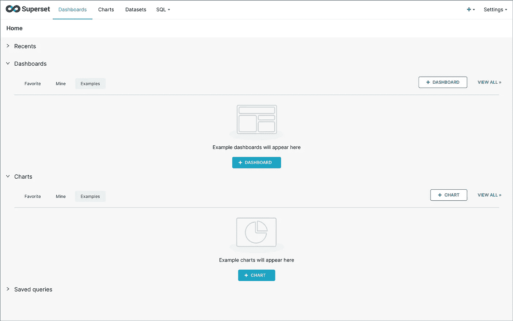

基于 web 浏览器的超集用户界面的主页

## Pinot 数据库连接和数据集

接下来，为了从超集连接到 Pinot，我们需要创建一个[数据库连接](https://superset.apache.org/docs/databases/db-connection-ui/)和一个[数据集](https://superset.apache.org/docs/creating-charts-dashboards/creating-your-first-dashboard)。

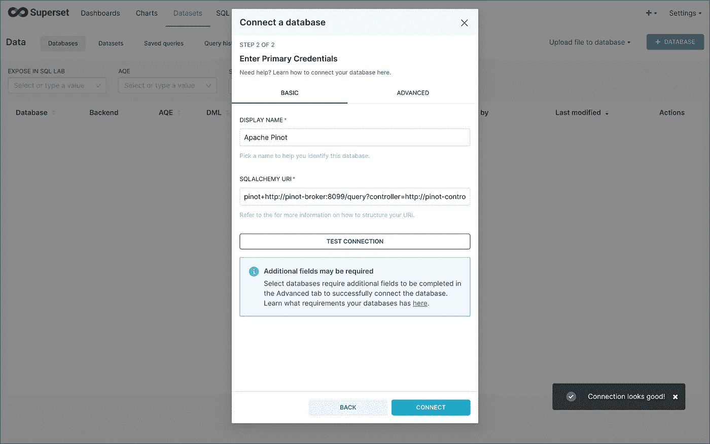

创建到 Pinot 的新数据库连接

SQLAlchemy URI 如下所示。输入 URI，测试您的连接(“测试连接”)，确保成功，然后点击“连接”。

接下来，创建一个引用`purchasesEnriched`皮诺表的数据集。

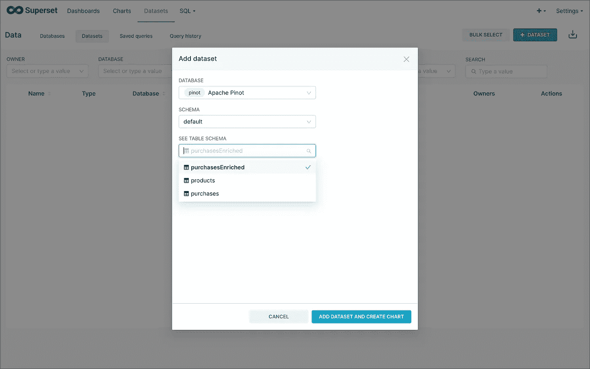

创建一个新的数据集，允许我们访问`purchasesEnriched` Pinot 表

修改数据集的`transaction_time`列。检查`is_temporal`和`Default datetime`选项。最后，将日期时间格式定义为`epoch_ms`。

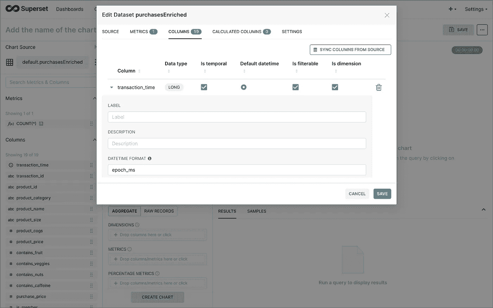

修改数据集的`transaction_time`列

## 构建实时仪表板

使用连接超集和`purchasesEnriched` Pinot 表的新数据集，我们可以构建单独的图表放在仪表板上。制作一些图表，放在您的仪表板上。

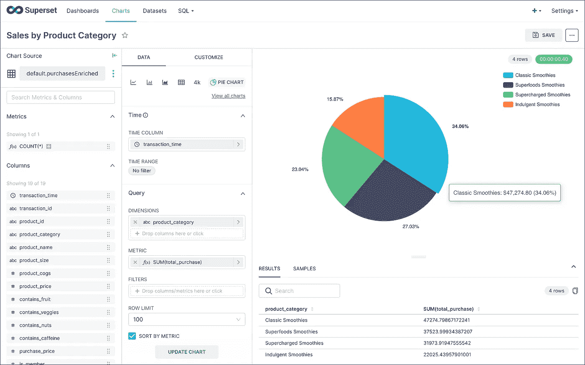

数据源为新数据集的图表示例

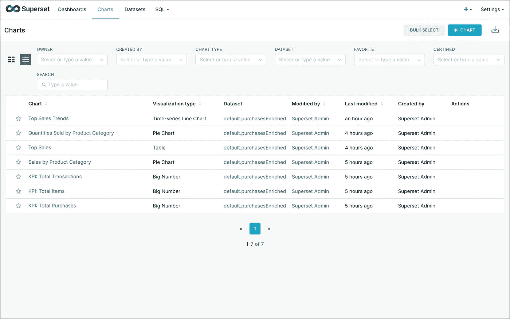

仪表板上包含的图表列表

创建一个新的超集仪表板，并添加图表和其他元素，如标题、分隔线和选项卡。

Apache 超集仪表板显示来自 Apache Pinot 实时表的数据

我们可以将刷新间隔应用于仪表板，以连续查询 Pinot 并近乎实时地可视化结果。

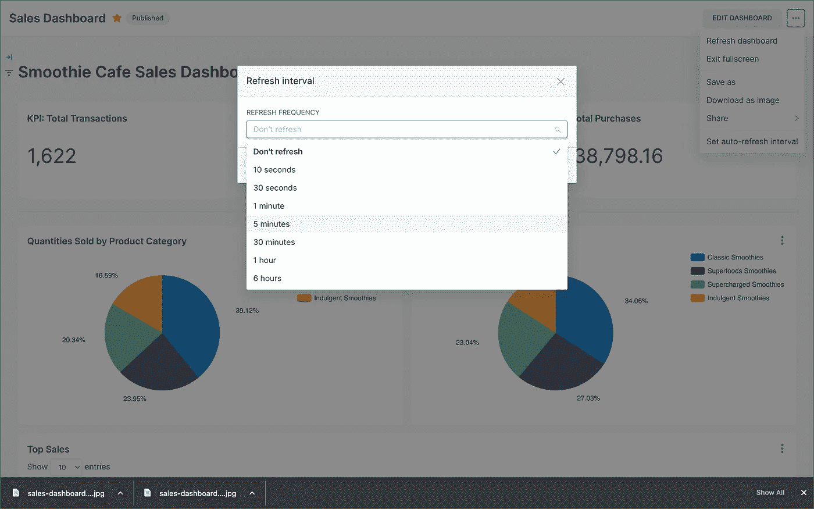

为仪表板配置刷新间隔

# 结论

在这个由两部分组成的系列文章中，我们介绍了流处理。我们探索了四个流行的开源流处理项目:Apache [Spark 结构化流](https://spark.apache.org/docs/latest/structured-streaming-programming-guide.html)、 [Apache Kafka 流](https://kafka.apache.org/documentation/streams/)、 [Apache Flink](https://flink.apache.org/) 和 [Apache Pinot](https://pinot.apache.org/) 。接下来，我们学习了如何使用不同的流技术解决类似的流处理和流分析挑战。最后，我们看到了如何将 Kafka、Flink、Pinot 和 Superset 等技术集成起来，以创建有效的流处理管道。

本博客代表我的观点，而非我的雇主亚马逊网络服务公司(Amazon Web Services)的观点。所有产品名称、徽标和品牌都是其各自所有者的财产。除非另有说明，所有图表和插图都是作者的财产。