# 用恒星探索标记

> 原文：<https://itnext.io/exploring-tokens-with-stellar-291172208639?source=collection_archive---------3----------------------->

## 为交换数字代币创造独特的用户体验

# 概观

在过去的几个月里，我的团队一直在尝试如何简化资产支持证券的发行和管理过程。为了加快我们的交付进度，我们对网络的 [Stellar](https://www.stellar.org/) 进行了标准化，并围绕该平台定义了一种体验。在本文中，我们将展示我们对 Stellar 的使用，以及使用 [GraphQL](https://graphql.org/) 和基于 [React](https://reactjs.org/) 的 UI 体验来演示客户端编程模型。

**作者注:**由于对这个话题的强烈兴趣，我们于 2019 年 3 月 14 日在 GitHub 上发布了组织 [token-factory](https://github.com/token-factory) 下的源代码。

# 创建用户

首先，我们想先介绍一下 Stellar 如何管理客户的背景。Stellar 将账户流程描述为

> [账户保存你在 Stellar 中的所有资金，并允许你发送和接收付款——事实上，Stellar 中的几乎所有东西都以某种方式与账户相关联。每个重要帐户都有一个公钥和一个秘密种子。](https://www.stellar.org/developers/guides/get-started/create-account.html)

这里明显的差距在于如何管理这些帐户，以及如何将用户与帐户相关联。为了解决这个问题，我们定义了一个简单的用户注册中心，按照租户对用户进行分组，并允许一些基本的用户标识和密码管理。对于企业用例，这将很快被 LDAP 等企业用户管理系统所取代。

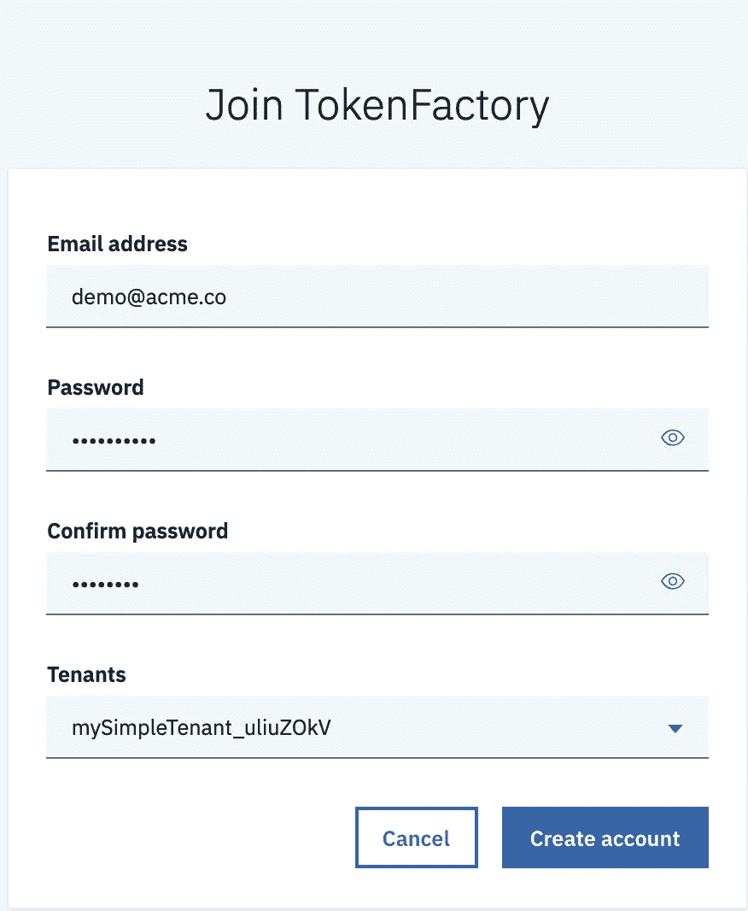

注册页面

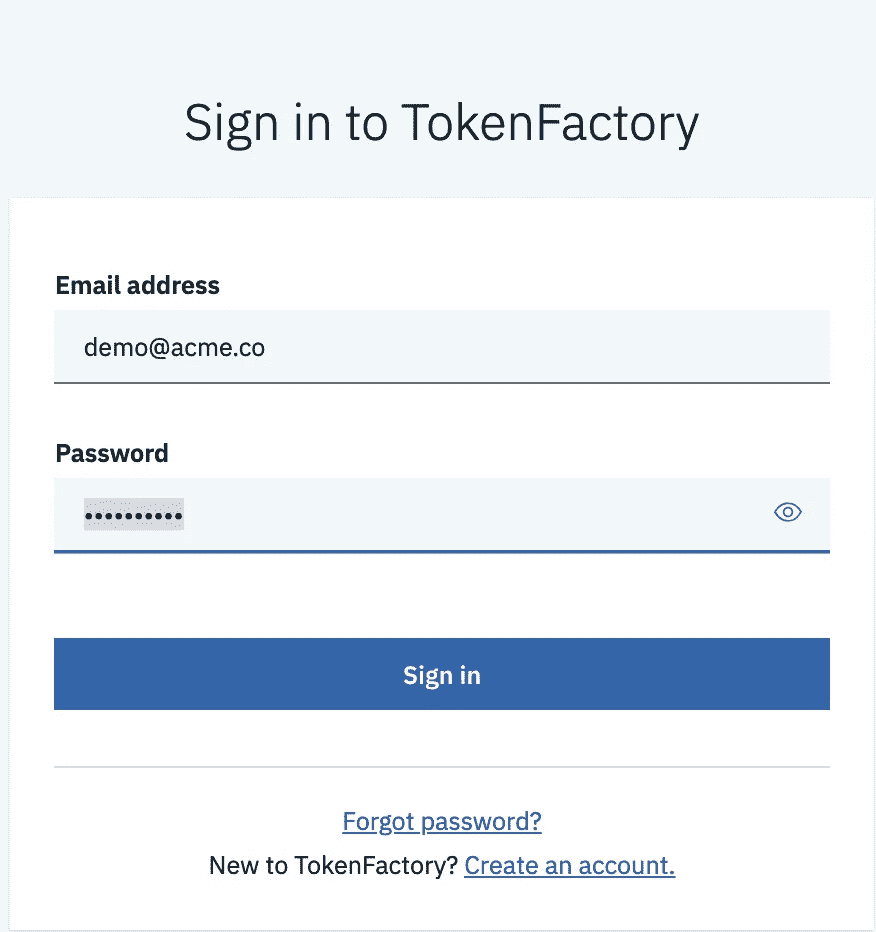

登录页面

# 改进了在 Stellar 上创建和管理帐户的方法

如前一节所述，帐户由公钥和私钥组成。因为我们希望将 Stellar 帐户与用户以及这些帐户的管理相关联，所以我们增强了帐户创建，用描述和密码短语来扩充帐户信息。这使得用户能够根据描述快速定位帐户。该密码短语还简化了交易过程，因为用户不需要记住与每个 Stellar 账户相关联的复杂秘密种子，而是可以使用该密码短语来签署 Stellar 交易。

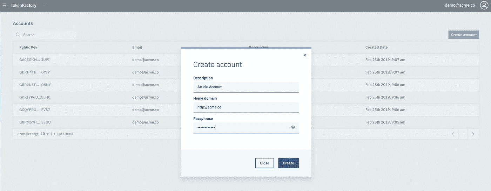

帐户创建

对于上面的用户，我们已经创建了一组代表系统中各种角色的帐户。每个帐户将负责管理自己的资产和帐户设置。帐户设置嵌套在每个帐户中，可以在创建帐户后进行配置，如下所示。

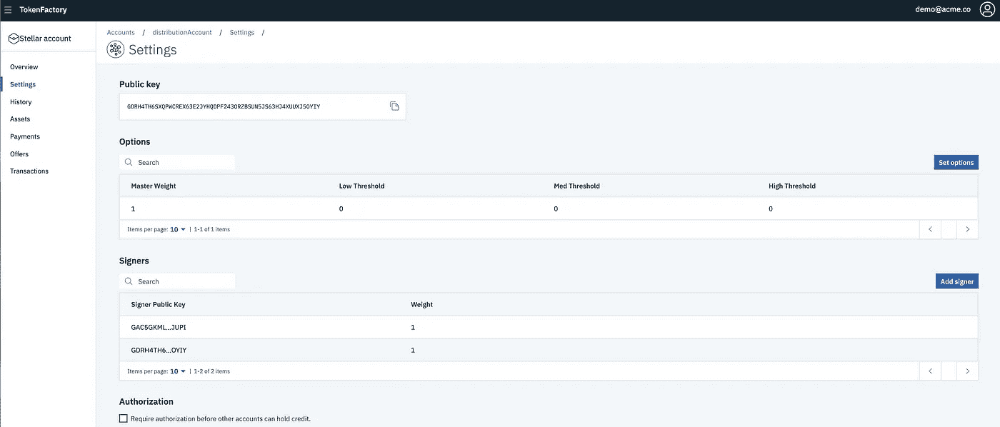

帐户设置页面

Stellar 提供各种帐户管理设置，包括设置交易阈值和添加额外的签名人，以批准交易或恢复丢失的帐户。这些选项在金融交易中非常常见，金融机构在批准交易前可能需要多个签名。

# 使用上下文创建资产

Stellar 的支柱是给定账户的资产管理。资产相当于在恒星网络中用于提供和支付的货币。除了维护用户和帐户的关联，我们还希望能够快速将资产所有权与用户关联起来。对于每个重要账户，我们都创建了一个概述页面，显示账户余额和资产发行人。此资产页面提供帐户资产和余额的实时视图。


帐户概览页面

在客户 Todd 帐户中，我们最初为该帐户设定了 10，000 XLM(流明)。该资产用于支付该账户交易的款项和手续费。在上面的示例中，客户 Todd 帐户拥有自定义资产 Gunther 和 Astro，这些资产可用于系统中其他用户的报价和付款。

# 付款

将资产转移到账户的最简单的交易是支付。支付是一种单向交易，一个账户将资产转移到另一个账户。对于自定义资产，帐户需要在收到资产付款之前信任该资产。信任资产的流程是通过市场资产视图完成的。

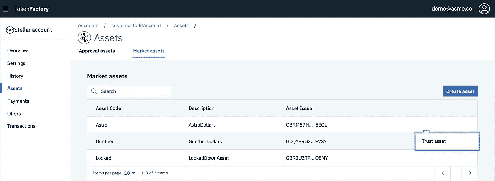

市场资产视图

一旦建立了信任额度，持有该资产的账户就可以根据账户所有者信任的金额向信任账户付款。

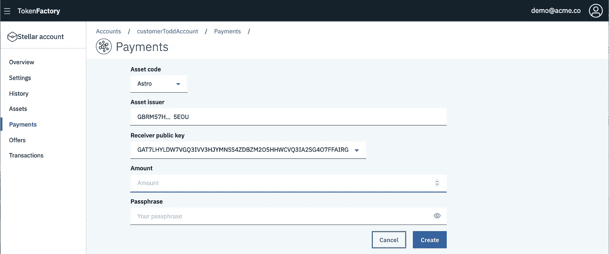

支付页面

# 出价

在 Stellar 中出价实际上是围绕资产的出价和出价，其中网络匹配出价并要求两个资产。这些交易也需要建立相同的信用额度，主要区别在于支付是双向的，因为交换的是两项资产。要约的视图类似于支付，但是被增强为包括两个资产的转移。

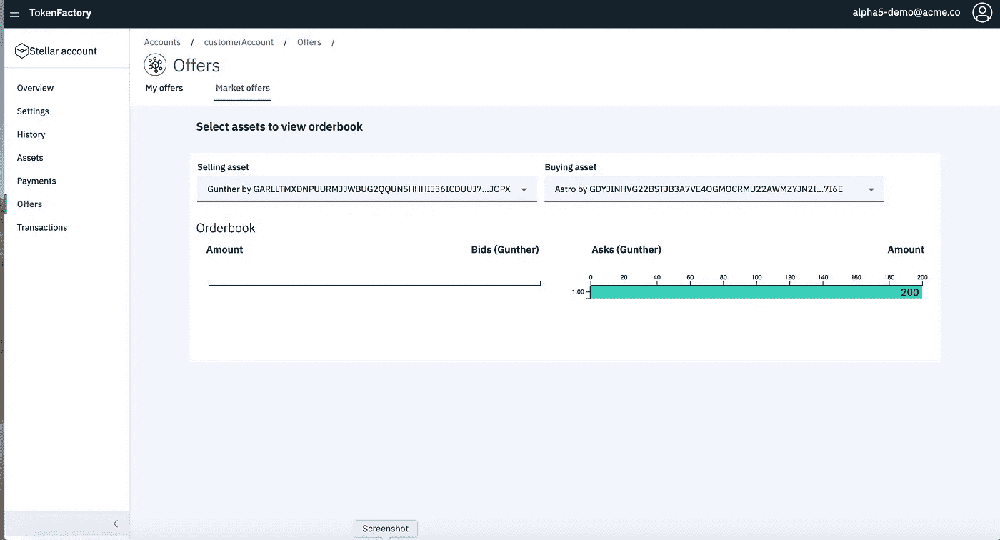

一旦出价被接受，出价的历史视图将更新如下。

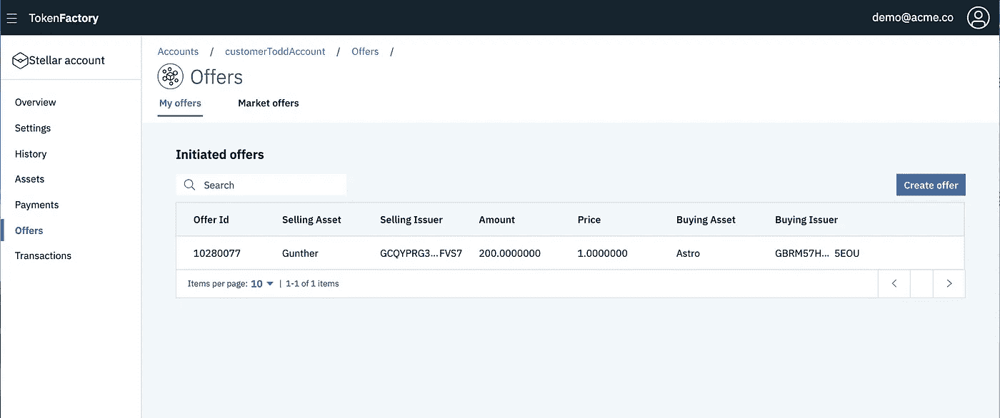

优惠历史页面

# 待定交易

Stellar 目前的差距之一是缺乏对未决交易的可见性。作为实现的一部分，我们为需要最终用户操作的未决事务创建了一个视图。这组视图被设计成主细节的形式，您可以在其中深入到给定的事务，以了解事务的当前状态。在本例中，帐户创建了一个正在等待匹配报价的报价。

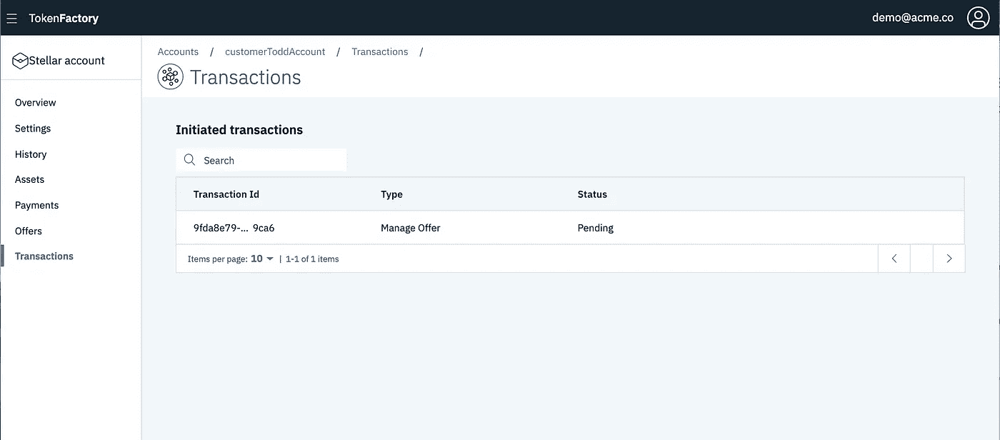

主交易页面

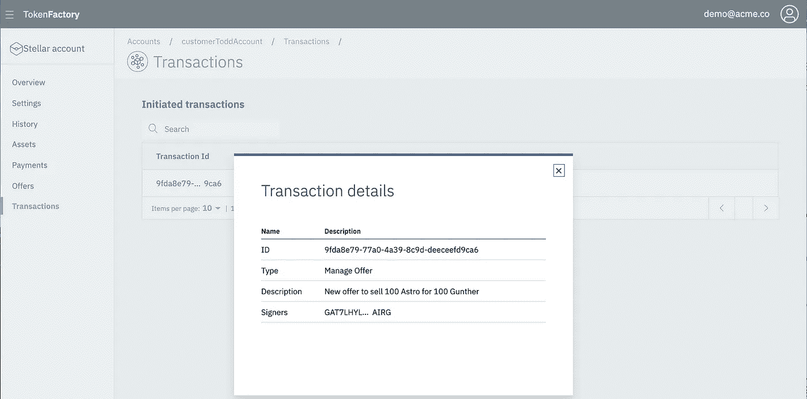

主详细页

# 采用 GraphQL

从这个项目一开始，我们就围绕 GraphQL 调整了我们的 API 策略。GraphQL 为灵活且可消费的数据模型提供了基础，允许我们的前端开发团队快速组装上面演示的视图。API 小组交付了 GraphQL API 文档，作为 CI/CD 流程的一部分，这将在下面详细讨论。通过 API 文档和 GraphQL playground 的强大组合，前端开发人员可以验证和测试 API，作为交付各种视图的设计过程的一部分。

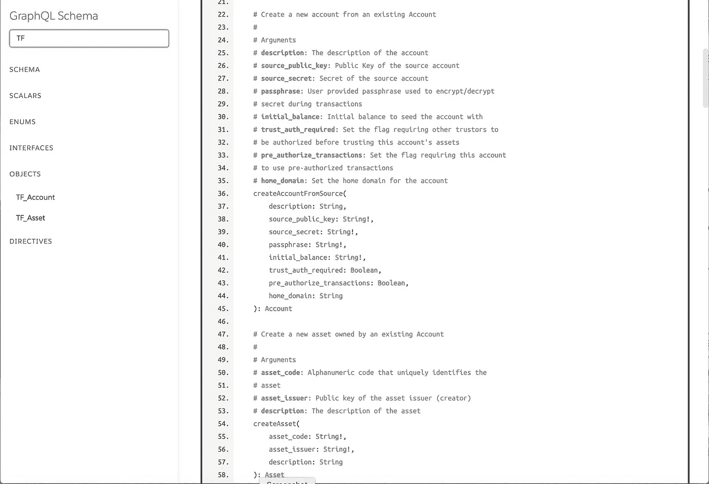

GraphQL 文档

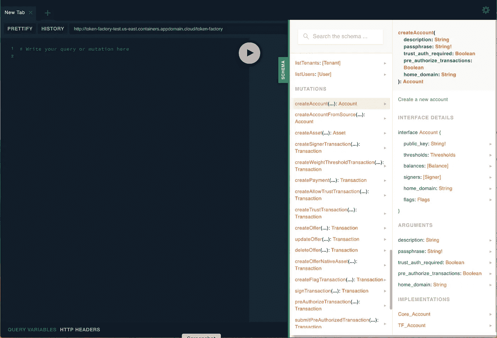

GraphQL 游乐场

# 通过 GraphQL 拼接与社区 API 集成

Stellar 是一项令人惊叹的技术，同时也是一项新兴技术。当我们构建平台时，我们试图限制我们偏离各种恒星 API 的数量，以及我们在本地数据库中坚持使用令牌的数量。我们的关键发现之一是存在一个名为[https://core-test.gly.sh/graphql](https://core-test.gly.sh/graphql)的第三方 GraphQL 端点，它为测试网络上的各种恒星模式对象公开了 GraphQL APIs。我们决定将这些 API 用于各种查询(读取 API ),这减少了我们为存储在 Stellar 网络内部但无法通过 Stellar SDK 访问的数据编写自定义 API 的开销。这项工作真正验证了我们使用 GraphQL 的决定，因为 [GraphQL 拼接](https://medium.com/provablyfair/graphql-remote-schema-stitching-in-a-multi-service-architecture-ac329037f082)使我们能够利用多个 GraphQL 提供者/端点，同时维护一个 API 端点供我们的前端开发人员使用。

# 使用独立恒星节点进行测试

我们测试的原则之一是限制依赖性和测试过程中可能失败的事情，比如网络连接。当我们深入测试我们的 Stellar GraphQL APIs 时，由于测试网络上的速率限制，我们偶尔会遇到网络中断或延迟。为了解决这一问题，我们决定在 CI/CD 流程中部署社区 Stellar docker 映像。这大大减少了我们暴露的表面积，因为每个构建都部署了 Stellar 独立节点的本地实例，并在测试完成时丢弃了该节点。这确保了我们在每次测试运行时都有一个干净的环境，并且提供了我们需要的稳定性。在我们的 Make 脚本中，建立节点实际上就像…

```
stellar-quickstart:
docker pull stellar/quickstart
docker run — rm -d -p “127.0.0.1:8000:8000” — name stellar stellar/quickstart — standalone
```

# 使用 GitOps 和 Helm 实现 CI/CD 的方法

当我们开始这个项目时，我们在 Kubernetes 上实现了托管工作负载的标准化。选择 Kubernetes 是显而易见的，因为我们希望支持各种各样的部署目标，并抽象出我们部署到的目标环境。为了实现团队自治并保持每个团队的速度，我们规定了一个模型，其中我们将代码项目从部署项目中分离出来。每个微服务负责为他们的服务构建、测试和发布 Docker 映像。当有一个成功的构建时，该构建触发了一个针对该服务的部署者项目的 PR。

deployer 项目是 GitOps 社区中正在兴起的一个项目。随着配置即代码的模式已经被 Ansible 等采用，GitOps 正在采取下一步措施，通过清晰的审计跟踪和实时部署的可观察性来加速部署。

在我们的项目中，我们使用 Helm 来协调我们的 K8 部署。在我们的部署报告中，我们的舵图是在 Git 中管理的。当给定代码报告的构建成功时，会针对部署报告自动生成一个 PR，以更新刚刚更新的组件的图像标记。这个 PR 然后被自动合并，这触发了一个 Helm chart 的部署到我们的 Kubernetes 或者我们的测试或者演示环境。这为团队提供了我们部署的历史记录，它直接映射到我们的 git repos 提交历史记录，以帮助在失败或倒退的情况下进行调试。

# 结论

在本文中，我们讨论了在 Kubernetes 上简化构建和部署 Stellar 的一些方法。我们发现 Stellar 具有丰富的功能，只是觉得有必要在几个方面扩展 Stellar，以改善令牌生命周期的整体用户体验。如果您正在寻找一个基于令牌的解决方案，我们希望您能从我们在本文中探讨的一些想法中学到一些东西。