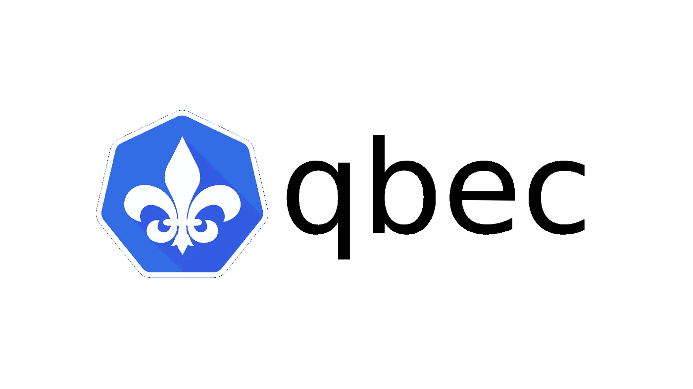

# 用 qbec 和 jsonnet 扩展 Terraform json/yaml 模板

> 原文：<https://itnext.io/extend-terraform-json-yaml-templates-with-qbec-and-jsonnet-aac372602a7d?source=collection_archive---------5----------------------->

Terraform 对[模板](https://www.terraform.io/docs/language/functions/templatefile.html)有原生支持，但在模板化复杂的 json 或 yaml 文档时有所限制。通常，配置需要基于多种因素生成，如目标环境、外部约束(如 API 调用)或在某些情况下需要基于一些可用输入值的复杂计算。Terraform 模板适合一般的字符串模板用例，json/yaml 是其中的特例。通常，随着大小和复杂性的增加，字符串模板变得难以阅读和管理。很少支持可以跨模板和配置使用的模块化或可重用组件。

进入 [qbec Terraform provider](https://registry.terraform.io/providers/splunk/qbec/latest/docs?pollNotifications=true) ，这是一种为 Terraform 编写 json 和 yaml 模板的强大而便捷的方式。它利用 [qbec](https://qbec.io) 的力量，让管理 Terraform 复杂的 json 和 yaml 数据变得轻而易举。qbec 实现了一个自以为是的 [Jsonnet](https://jsonnet.org/) VM，它提供了一些额外的特性，比如[额外的本地函数](https://qbec.io/reference/jsonnet-native-funcs/)、[一个全球导入器](https://qbec.io/reference/jsonnet-glob-importer/)和[一个数据源导入器](https://qbec.io/reference/jsonnet-external-data/)。我们将在接下来的章节中研究这些特性。

如果你想了解更多关于 qbec 的知识，可以看看我之前的文章-[qbec——多 kubernetes 环境的部署工具](https://harsimranmaan.medium.com/qbec-the-deployment-tool-for-multiple-kubernetes-environments-c39b6bd7ea07?source=your_stories_page-------------------------------------)。

# 设置

为了更好地理解 qbec Terraform 提供者必须提供什么，让我们实现一个完全虚构的场景。想象一下，编写一个 AWS S3 存储桶策略，拒绝对存储桶的访问，除非调用者驻留在某个公司网络上。有一些测试系统的 IP 不会随时间而改变。动态公司 IP 的列表随时间而变化，并由 API 服务公开。最终的策略如下所示

最终的 AWS S3 存储桶策略

我们将看看 qbec provider 如何使编写模块化代码变得更容易(想象一种情况，您想要使用相同的策略，但是来自 Terraform 之外的某个工具，比如 aws CLI)，查询外部 API，然后生成 json 策略。

# 履行

在这一节中，我们将使用 qbec Terraform provider 逐步构建端到端解决方案。在第一步中，我们将编写一个 Jsonnet 库，它接受一个 bucket 名称和一个企业 IP 列表，并公开一个方法`s3DenyNonCorpPolicy`,该方法返回一个代表最终策略的 Jsonnet 对象。

Jsonnet lib 公开了一个助手来呈现 s3 存储桶策略

接下来，我们编写一个 Jsonnet 文件，使用这个库来呈现最终的策略。

用硬编码值呈现 s3 策略

我们可以使用 qbec CLI 快速测试到目前为止的设置。

```
$ qbec eval policy-v1.jsonnet # try -o yaml to test yaml rendering
{
  "Statement": [
    {
      "Action": "s3:*",
      "Condition": {
        "NotIpAddress": {
          "aws:SourceIp": [
            "11.11.11.11/32",
            "22.22.22.22/32",
            "33.33.33.33/32",
            "44.44.44.44/32"
          ]
        }
      },
      "Effect": "Deny",
      "Principal": "*",
      "Resource": [
        "arn:aws:s3:::the-bucket",
        "arn:aws:s3:::the-bucket/*"
      ],
      "Sid": "SourceIP"
    }
  ],
  "Version": "2012-10-17"
}
```

下一步是获取作为静态配置提供的众所周知的 IP 列表。

包含必须允许访问的已知 IP 列表的静态 JSON 文件

我们将使用 [qbec glob importer](https://qbec.io/reference/jsonnet-glob-importer/) 来导入所有静态定义的 IP。

使用 qbec glob importer 从多个 json 文件导入静态 IP 列表

`qbec eval policy-v2.jsonnet`将显示与最终所需策略相同的结果。

最后一个需求是从外部服务获取企业 IP 的动态列表。我们将使用 [qbec jsonnet 数据源](https://qbec.io/reference/jsonnet-external-data/)来完成这项工作。qbec 允许运行外部命令，然后无缝地使用 jsonnet 中的输出。

编写一个自定义程序，从 API 获取公司 IP。更有趣的是，程序以 YAML 的形式返回输出(显然是由某个热爱 k8 的开发人员编写的)。

获取公司 IP 的自定义程序

```
$ ./fetch-dynamic-corp-ips.sh corpIPs # output key is based on input
corpIPs:
  - '33.33.33.33/32' 
  - '44.44.44.44/32'
```

现在，我们准备使用 qbec 数据源合并上述程序的输出，并使用 qbec 提供的本地 jsonnet 函数`parseYaml`读取 jsonnet 中的值

最终的 policy.jsonnet 获取动态 IP，并与静态列表结合生成 s3 策略

# 将它与 Terraform 结合在一起

到目前为止，我们一直在 terraform 之外工作，准备我们的动态生成的策略用于 terraform。

qbec Terraform provider 公开了一个简单的接口，以便将 qbec 的功能与 Terraform 结合使用，并无缝集成到现有的 Terraform 代码中。

Terraform 片段展示了由 qbec 支持的 Jsonnet 动态生成的 JSON

我们现在可以运行一个 terraform 计划来查看上面代码片段中提出的更改。

```
$ terraform planChanges to Outputs:
  + result = {
      + Statement = [
          + {
              + Action    = "s3:*"
              + Condition = {
                  + NotIpAddress = {
                      + aws:SourceIp = [
                          + "11.11.11.11/32",
                          + "22.22.22.22/32",
                          + "33.33.33.33/32",
                          + "44.44.44.44/32",
                        ]
                    }
                }
              + Effect    = "Deny"
              + Principal = "*"
              + Resource  = [
                  + "arn:aws:s3:::the-bucket",
                  + "arn:aws:s3:::the-bucket/*",
                ]
              + Sid       = "SourceIP"
            },
        ]
      + Version   = "2012-10-17"
    }You can apply this plan to save these new output values to the Terraform state, without changing any real infrastructure.──────────────────────────────────────────────────────────────────────────────────────────────────────────────────────────────────────────────────────Note: You didn't use the -out option to save this plan, so Terraform can't guarantee to take exactly these actions if you run "terraform apply" now.
```

就这样，我们现在可以将这个程序扩展到高级用例，这些用例需要生成复杂的 JSON/YAML 文档，以便与 terraform 一起使用。使用与 AWS CLI 相同的策略(提示:`qbec eval`)留给读者作为练习。还可以探索 qbec 的其他强大功能，参见 [qbec 文档](https://qbec.io/getting-started/)。

# 概述

在本文中，我们学习了如何编写用于 Terraform 的 Jsonnet 片段。我们使用 qbec 的特性，如[附加的本地函数](https://qbec.io/reference/jsonnet-native-funcs/)、[一个全局导入器](https://qbec.io/reference/jsonnet-glob-importer/)和[一个数据源导入器](https://qbec.io/reference/jsonnet-external-data/)来丰富模板化体验。

本文中示例的完整源代码可以在 github.com/harsimranmaan 的[网站](https://github.com/harsimranmaan/medium.com/tree/main/terraform-provider-qbec)找到



qbec 徽标(鸣谢:https//qbec.io)