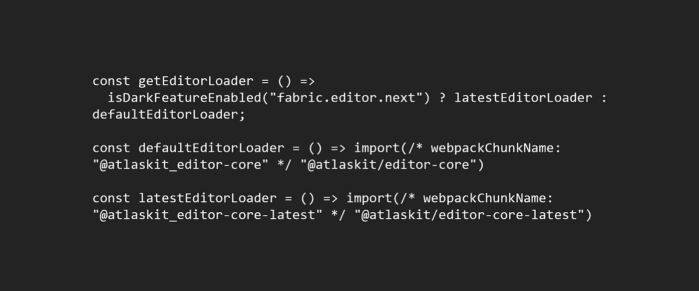

# 功能可标记的 NPM 依赖升级

> 原文：<https://itnext.io/feature-flaggable-npm-dependency-upgrades-a505c0d34cf7?source=collection_archive---------8----------------------->



Atlassian 正在采用他们自己的名为 [Atlaskit](https://atlaskit.atlassian.com/) 的设计系统。这意味着我们越来越多地将产品功能从 Atlaskit repo“外包”给 npm 模块。

虽然这是一个很大的进步，但是有些依赖项包含了太多的功能。我们觉得有必要在给大众升级之前先给一部分用户升级。优选地通过特征标志。

我最初认为这是不可能的，因为你怎么可能安装同一个依赖项的两个版本呢？！但是在尝试之后，使用 package.json 别名&代码分割变得相对简单。

# 怎么

在 package.json 中添加一个依赖项的别名，然后运行 yarn，这样锁就会得到更新。这是我添加到 package.json 中的内容:

```
"@atlaskit/editor-core": "^70.2.18",
"@atlaskit/editor-core-latest": "npm:@atlaskit/editor-core@71.0.22",
```

然后确保使用代码分割来加载依赖项。在 Confluence 中，我们使用[react-loable](https://github.com/jamiebuilds/react-loadable)对组件进行代码拆分。为 npm 别名添加第二个加载程序:

```
const getEditorLoader = () =>
  isDarkFeatureEnabled("fabric.editor.next") ? latestEditorLoader : defaultEditorLoader;const defaultEditorLoader = () => import(/* webpackChunkName: "@atlaskit_editor-core" */ "@atlaskit/editor-core")const latestEditorLoader = () => import(/* webpackChunkName: "@atlaskit_editor-core-latest" */ "@atlaskit/editor-core-latest") const LoadableEditor = Loadable({
  loader: getEditorLoader(),
  loading() {
    return <div>Loading...</div>
  }
});
```

**重要提示:确保 webpackChunkName 的不同**

这就是你需要做的，简单吧？

# 警告

在像@atlaskit/editor-core 这样的大型依赖项的情况下，由于现在有两个版本需要捆绑，我们会受到相当大的 webpack 构建时间的影响。

yarn tooling 不喜欢 package.json 别名，所以像 upgrade & upgrade-interactive 这样的工具不能用于升级最新版本。相反，您必须手动升级 package.json + run yarn 中的版本来更新锁文件

这种方法不支持 FF 在运行时改变，并且在 FF 改变之前需要刷新。这可以通过在 redux 容器中创建加载器来解决，但是对于我们的特定用例，我觉得不值得增加额外的复杂性。

# 有用的脚本

我们添加了一些脚本来自动完成这个过程，这些脚本对于想要重用这种方法的人来说很方便。

升级特征标记版本的脚本:[https://gist . github . com/marcodejongh/8 cc 8d 16 FBC 451838581014098 DC 0 FB 71](https://gist.github.com/marcodejongh/8cc8d16fbc451838581014098dc0fb71)

接受特征标记版本并重新碰撞隐藏版本的脚本:[https://gist . github . com/marcodejongh/fa 2 BC 1 ebb 7845 af 0119 c 6748 d8c 26750](https://gist.github.com/marcodejongh/fa2bc1ebb7845af0119c6748d8c26750)