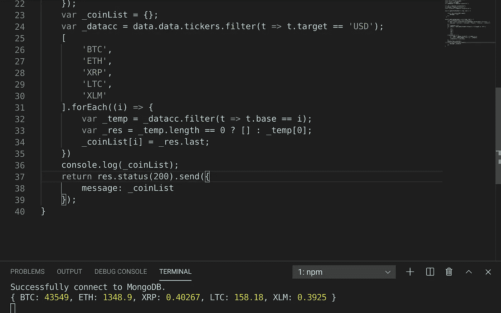

# 使用 CoinGecko 和 NodeJS 获取加密货币价格

> 原文：<https://itnext.io/fetching-cryptocurrency-prices-with-coingecko-using-nodejs-29d5455bf57c?source=collection_archive---------2----------------------->

使用 NodeJS 获取 BTC、瑞士联邦理工学院、TRX 和其他加密货币的实时价格


CoinGecko 是一个获取加密货币价格的免费 API 工具，公开提供，没有限制。在写这篇文章的时候，他们跟踪了超过 6285 枚硬币，关于时间和延迟的数据是可靠的。

本教程介绍了如何使用 CoinGecko-API 库([https://github.com/miscavage/CoinGecko-API](https://github.com/miscavage/CoinGecko-API))在 NodeJS 上使用 CoinGecko 的基本指南，coin gecko-API 库是一个与 API 交互的包装器。

要安装它，我们使用 npm install 命令:

```
npm install coingecko-apiconst CoinGecko = require('coingecko-api');
```

新的可以开始从客户端获取价格。在这种情况下，我选择使用市场 bitfinex 来获取价格，并且我只请求比特币:

```
const CoinGeckoClient = new CoinGecko();
    let data = await CoinGeckoClient.exchanges.fetchTickers('bitfinex', {
        coin_ids: ['bitcoin']
    });
    var _coinList = {};
    var _datacc = data.data.tickers.filter(t => t.target == 'USD');
    [
        'BTC'
    ].forEach((i) => {
        var _temp = _datacc.filter(t => t.base == i);
        var _res = _temp.length == 0 ? [] : _temp[0];
        _coinList[i] = _res.last;
    })
console.log(_coinList);
```

如果我们想获取更多的硬币，我们需要以 coin _ ids 的形式请求它们，并在以后检测它们，如下例所示:

```
const CoinGeckoClient = new CoinGecko();
    let data = await CoinGeckoClient.exchanges.fetchTickers('bitfinex', {
        coin_ids: ['bitcoin', 'ethereum', 'ripple', 'litecoin', 'stellar']
    });
    var _coinList = {};
    var _datacc = data.data.tickers.filter(t => t.target == 'USD');
    [
        'BTC',
        'ETH',
        'XRP',
        'LTC',
        'XLM'
    ].forEach((i) => {
        var _temp = _datacc.filter(t => t.base == i);
        var _res = _temp.length == 0 ? [] : _temp[0];
        _coinList[i] = _res.last;
    })
    console.log(_coinList);
```



CoinGecko 结果

# 结论

现在我们可以使用这个库来开发多种项目，从加密钱包到水龙头。根据我们想要实现的解决方案，我会推荐使用套接字或轮询；否则，让用户知道获取价格的最后时间，因为价格可能在此期间变高/变低。