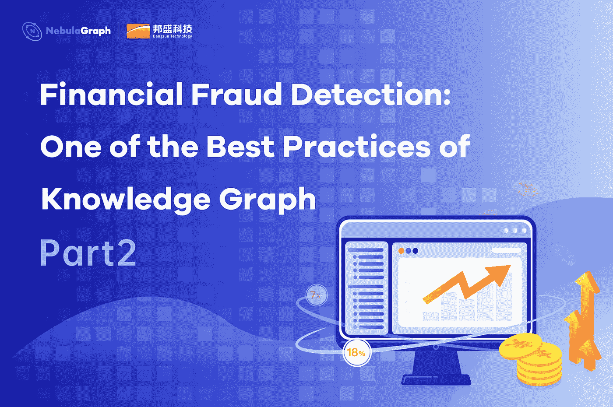
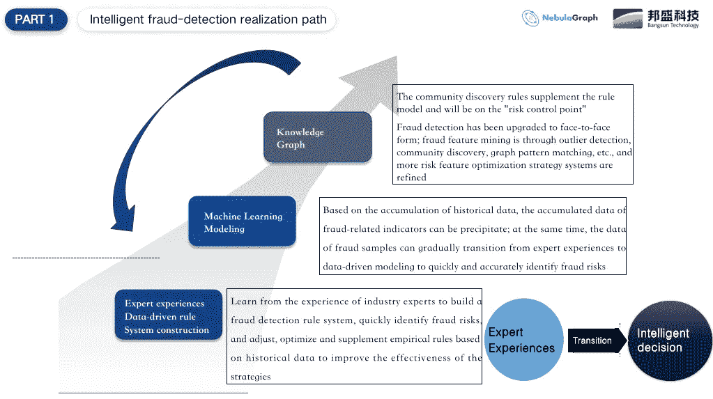
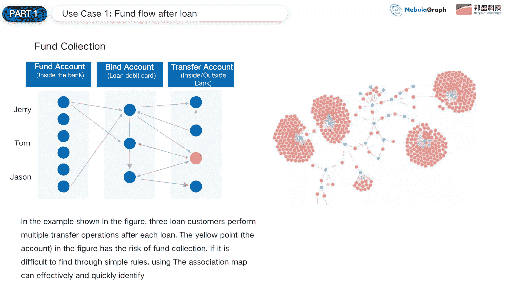
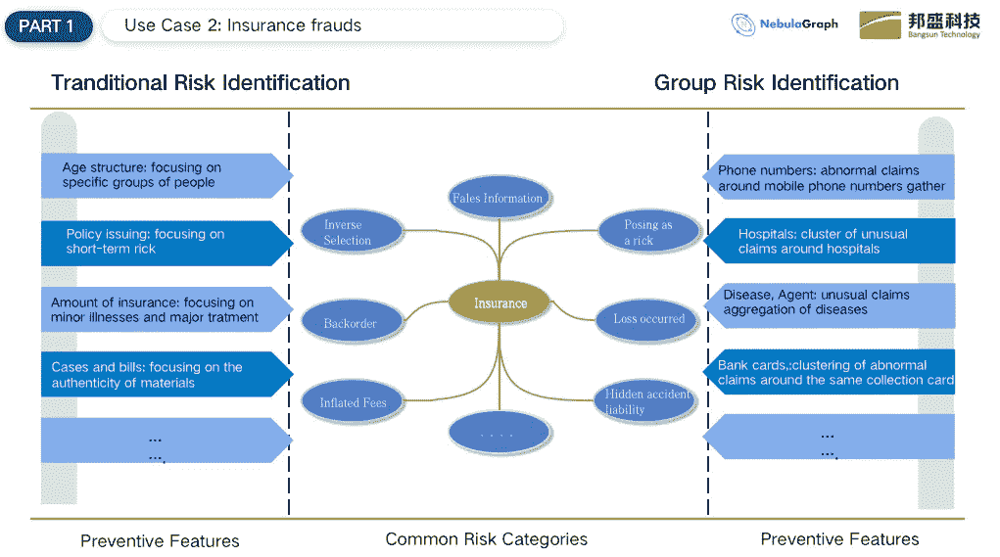
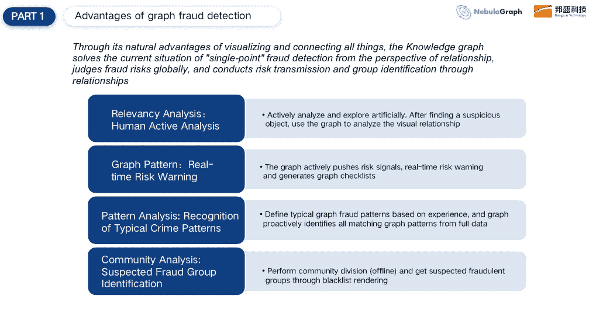

# 财务欺诈检测:知识图与星云图的实践

> 原文：<https://itnext.io/financial-fraud-detection-a-practice-of-knowledge-graph-with-nebulagraph-1e4a9c892f6?source=collection_archive---------2----------------------->

## 背景:传统欺诈检测解决方案的问题

近年来，财务欺诈仍然是一个热门话题。出现了一种新的趋势，欺诈者被组织起来，联合起来。很难核实客户提供的信息是不是假的。这种不一致的信息很难识别真正的欺诈行为，并导致许多问题。由于客户信息的不确定性，银行可能会通过提高处理贷款申请的要求来控制通过率，这是有效的，但带来了损失。

2022 年政府工作报告称，金融包容性将进一步扩大，客户群将包括农村客户，这意味着将有没有信用报告的“白色账户”。传统的欺诈行为包括虚假信用报告、佣金代理和串通。

一些机构专注于少数银行的信用卡申请或贷款。那些机构知道银行的底线和红线。只要不触及底线，他们就能成功申请贷款。这些机构甚至知道如何提高贷款额。

传统的欺诈检测解决方案非常依赖专家规则，即风控专家通过经验设定一批规则，然后调整触发条件，在通过率和拒绝率之间找到一个业务平衡。伪造身份证号和银行卡流水之类的东西成本很低。对于大规模和高数量的欺诈，没有好的控制手段。

## 授权图表:智能欺诈检测解决方案之路

让我们来看看智能欺诈检测解决方案的发展路径。

第一步是建立专家规则，但很难通过专家经验覆盖所有风险。第二步是建立一个机器学习模型来预防和控制整体风险，然后使用专家规则来帮助模型。专家规则和机器学习模型可以很好地互补。然而，根据目前的经验，我们在建立机器学习模型时可能会面临许多问题。第一个原因是数据不足，第二个原因是样本数据增长有限。因为申请贷款或信用卡大概有 6~7 种方式，最后需要人工检查，所以数据增长很低。下面会有一个案例来说明问题。

因此，我们需要使用关系图来破解信息不一致的问题。无论是集团诈骗还是代理诈骗，都有一批申请行为。我们可以使用可视化的图表来识别欺诈样本。通过这种方式，我们可能会捕获数十到数百份欺诈性申请。这也是一种非常有效的样品补充方式。图表也可以用于一致性检查。多个信息来源证明了信息的不一致性。图表是从关系维度展示的，有助于我们做二次验证。例如，共享相同信息(如相同的电话号码和 IP 地址)的多个应用程序被视为集团欺诈。

为了检测这些群体欺诈，我们使用图表来帮助我们找到关系规则。这些规则是对原始专家规则的补充。另一方面，我们可以提取图形信息来优化机器学习模式，这增加了模式检测群体欺诈和标记更多可疑对象的能力。因此，专家规则、机器学习模型和图表构建了一个有效的生态闭环，并相互补充以检测欺诈。

就关系图的具体应用而言，我列举了以下应用:

***应用图形*** :一个例子是使用图形来检测贷款和信用卡的欺诈申请人。群体的一个特征是群体成员共享信息。从图形数据的可视化查询中，会发现大量的相关性。较为常见的信息包括身份证、手机号码、设备指纹、电子邮件地址等。我们使用这些信息来探索这些数据之间的关系，然后直观地分析具体的欺诈技术。 ***‍***

***交易图*** :对于多级转账关系，我们主要关注资金的最终流向以及受益人是谁。最近的赌博欺诈问题是金融监管者关注的主要焦点，这也是我们关注的主要方向之一。我们有许多客户案例。通过我们内部监管规则模型提供的嫌疑人名单，可以发现可疑交易。在此过程中，我们使用历史流量数据从收集的账户开始探索更多的数据层。我们还可以使用图形探索功能或图形平台，如[星云图数据库](https://nebula-graph.io)来分析现有数据，以进行增量预防和控制。

***企业图/内部控制图*** :如今，两个或两个以上的企业业务之间存在相互联系。外部风险对企业的影响越来越大。使用图表可以勾勒出企业风险的全貌。结合外部风险的引入，可以尽早预测外部风险对企业的影响。内部控制图通常用于检测道德或操作风险，如滥用或未能根据规则和法规进行某些操作。道德风险更多地发生在员工与企业之间不寻常的财务交易中，如非法集资或挪用资金。防范核心是用图形查员工实际控制账户。因为银行员工对银行的业务非常熟悉。很少有员工为某些罪行承担自己的责任。这些控制账户的识别可以通过图表的方式来研究。比如亲戚的户口。我们有一个股份制银行的案例。在这种情况下，目标位于员工女朋友的账户中，因为从视觉图形中我们发现许多资金实际上流向了女朋友的账户。用传统的方法很难侦破这样的案件。

***洗钱图*** :洗钱问题由来已久。不同时期衍生洗钱方式多种多样。流行的方式有地下钱庄、“订单偷偷”平台等。犯罪分子将他们的钱藏在偷单客户日常消费交易正常的平台上，然而，在视觉图上实际上有一个固定的模式来检测这样的案件。那么如何用图建立业务关系，制定图规则进行实时监控和检测，就成为邦太阳作为图技术平台赋能业务开发者的重要任务。我们以后再谈。

***车辆保险/运营图*** :对于车辆保险/运营领域，我们将初始化网络与顶点和边的设计相结合，然后查询一个数据相对合适且相关的子图，再结合业务专家的经验进行一些探索性和分析性的工作。

## 用例 1:资金流动

这里也简单列举了一些具体的应用场景。第一个是贷款获批后的资金流向。

我们可以通过图表关注商业和消费贷款，跟踪批准的贷款是流入住房市场还是股票市场。在这个过程中，我们会利用图形的穿透能力来计算转移资金的金额和比例。此后，我们可以很容易地发现风险和违规行为，并为调查提供依据。监管机构目前对互联网信贷遵循“三个办法、一个指引”的原则，因此我们通过图表建立实时风险控制，关注资金流向。

接下来可以展示一下具体的方法。比如贷款直接流入黑名单账户或者自己的账户转到不在自己名下的账户，但该账户可能是受控账户。账户用于投资理财。这些都可以用图形和资金的具体模式来分析，因为资金的流动会在直观的图形上形成非常明显的分布或模式。

这种模式很难用以前的专家规则来刻画，因为专家规则只能发现一维关系，最多只能发现二维关系，而图更擅长于多维关系检测。在海量的交易结构中，我们也可以发现一些模式化的结构。比如上图所示的 4–5 个顶点，涉及到一些集中转入、分散转出，以及树枝、蚁巢之类的链式交易结构，都是非常规的资金模式。通过直观的图形，结合业务知识，很多时候，一眼就能看出是有问题的。至于具体问题出在哪里，我们可以通过图提供的一些功能来查看，比如 k 度查询或者重要节点的发现算法。

## 用例 2:保险欺诈

第二个用例是保险欺诈，如车辆保险或健康保险。主要的车辆保险问题是串通索赔欺诈。通过监控和关联共享的身份信息，可以更容易地找到组成员，并排除无关的数据。至于健康险，我们一般更侧重于医患或提供方的不正当关系。一旦某个药物或疾病上出现大量离散值，就代表造假。这是过去检测个人欺诈的常用方法。现在集团诈骗问题严重。集团诈骗犯有一个思维转变，就是几十个账户通过个人支付账户购买同一种药物。还有聚合账户等很多共性。结合图形分析和算法，可以检测出这些群体欺诈。

## 摘要:图形欺诈检测的优势

图形欺诈检测的优势主要包括以下四个方面。

**联想分析:**这是指人们主动探索发现可疑特征，然后用图形进行一些视觉联想。业务开发人员主动使用图形工具进行可视化探索，然后结合不同业务领域(如洗钱、信用卡申请和贷款申请)的特征来发现一些可疑点。不同地区的可疑点当然是不一样的，但是经常使用图形工具的业务开发人员对这种可疑点是有一定敏感度的。

**图形规则:**这方面更多的是针对增量监控。与以前的专家规则不同，图规则使用与知识比较相关联的图探索的手段来得出一些结论。我们从关系的维度得出图规则，然后系统使用这些规则来检测风险。

**模式分析:**我们最近称之为同一个模式，因为很多诈骗模式都有一个固化的模式，比如信用卡套现。在分析了这些固化的模式之后，我们将图形查询语言中的模式转换成用于遍历查询的图形库。与上面介绍的图形规则相比，这是一种检测现有数据的方法。

**社区分析:**如上所述，建模图形数据缺乏足够的数据，社区分析实际上是一个非常好的功能，通过算法和结合数据标签来发现欺诈群体。

上述四个图形欺诈检测优势可以帮助我们实时、及时和事后检测欺诈。它们都是反欺诈的主要图形功能，被认为是我们的优势。这些优势目前被我们的几十个客户所应用。