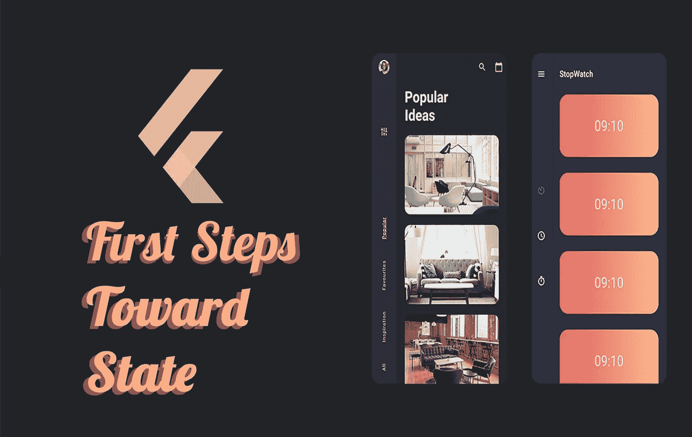

# 迈向国家的第一步

> 原文：<https://itnext.io/first-steps-toward-state-9241aff83584?source=collection_archive---------5----------------------->

建立颤振状态解的第一步

学习 Flutter 的最好方法是教你如何构建你的第一个状态解决方案，并开始构建定制的小部件和几个 UI 优化的应用程序。这将是一个小周系列的文章，所以你应该想办法得到其余的文章。

如果您已经是 Medium 的成员，那么您可以通过在 Medium 上关注我来获得文章的通知。

# **样板文件设置**

**项目布局是洋葱式的分层架构，将日志设置为单例，构建变体，以及一些基本的 DevOPS 来获得适当的代码质量反馈。完整的源代码在:**

[https://github . com/Fred grott/ddi _ flutter/tree/master/arch/state/lifting _ up _ state/inherited _ widget](https://github.com/fredgrott/ddi_flutter/tree/master/arch/state/lifting_up_state/inherited_widget)

**使用的插件有:**

从属关系下

https://pub.dev/packages/logging 伐木公司

https://pub.dev/packages/logging_appenders 伐木附加设备公司

凯切·https://pub.dev/packages/catcher

https://pub.dev/packages/intl 国际机场

谷歌字体 https://pub.dev/packages/google_fonts

Flutter 平台小部件(UI)https://pub . dev/packages/flutter _ Platform _ Widgets

开发依赖项下

林特·https://pub.dev/packages/lint

建设亚军(devo PS)https://pub.dev/packages/build_runner

德里·https://pub.dev/packages/derry

https://pub.dev/packages/dart_code_metrics dart 代码度量(DevOps)

黄金工具包(测试)](https://pub . dev/packages/golden _ Toolkit)

[给当然后(测试)https://pub.dev/packages/given_when_then

页面对象(测试)https://pub.dev/packages/page_object

https://pub.dev/packages/mocktail 测试版

# **迈向状态的一些最初步骤**

**最终目标是有一个漂亮的小 DI 来帮助我们管理状态，并继续学习其余的 flutter 小部件和全面的 UI 掌握。最后的步骤将使我们能够使用一些 OOP 模式和关于有状态窗口小部件生命周期的知识，从而摆脱对有状态窗口小部件的纠缠。**

现在，我们需要专注于提升状态的方法来达到这个目标。当我们移动或取消使用 setState 时，这叫做提升状态。

第一步，因为它是 Flutter 默认计数器应用程序，所以我们需要一个实体来表示模型的属性:

**这是我们从实体到模型的非常小的契约，这是我们如何实施我们非常小的 API:**

**那是个人模型，不是视图模型，这里是视图模型:**

它在 binders 子文件夹中的原因是大多数架构应用模式实际上是 MVVM 应用模式，这实际上要求活页夹是完整的 MVVM 模式。

绑定的另一部分是计数器更新通知:

**现在让我们来看看用户界面。**

# **UI 代码**

**计数器动作就是增量计数器按钮:**

**和计数器显示:**

**现在这里是主页 UI 代码:**

**请记住，我使用的是 flutter 平台小部件，因为该插件会根据运行 Flutter 应用程序的平台在 Material 和 Cupertino 小部件之间自动切换。因此，您将看到一些与该设置相关联的附加声明。**

# **我们做了什么**

**我们做了什么？请注意，我们在某种程度上摆脱了指定 setState。但是我们还没有完全不用有状态部件。此外，我们还必须找到一种方法来加入日志记录，以便我们获得状态更改通知来调试日志记录。您可能已经注意到，在 MyHomePage UI 代码中，我们仍然在 UI 中嵌入了业务逻辑行为。**

下一步是探索继承模型和完全继承的绑定解决方案，看看有什么可以改进的，然后最终得到一个完全 DI 状态管理的微小解决方案，它允许我们停止使用有状态的小部件。

# **结论**

**这些只是迈向小型 DI 和状态管理解决方案的第一步。但是在一周内，您将有剩余的文章来完整地完成这个解决方案，并根据自己的需要进行修改。而且，只要花一些时间完整地记录这个解决方案；在你的简历中，你会得到一个很好的部分，在面试中展示首席采购官或首席技术官。**

# **关于我，弗雷德·格罗特**

我是一名改过自新的 Android、Java、Kotlin 和前端开发人员。我是一个改过自新的多动症患者，编码和设计牛仔。

我贡献的 Flutter 插件有:

颤振平台部件

[https://pub.dev/packages/flutter_platform_widgets](https://pub.dev/packages/flutter_platform_widgets)

捕手

[https://pub.dev/packages/catcher](https://pub.dev/packages/catcher)

一些有用的指南是:

选择颤振状态管理解决方案[https://medium . com/p/choosing-A-Flutter-State-Management-Solution-cccf 1 B2 AC F10](https://medium.com/p/choosing-a-flutter-state-management-solution-cccf1b2acf10)

我如何学会信任我的多动症

[https://medium . com/p/how-I-learn-to-trust-my-ADHD-DBF 4f 80518 cc](https://medium.com/p/how-i-learned-to-trust-my-adhd-dbf4f80518cc)

颤振完美设置

[https://medium.com/codex/flutter-perfect-setup-c5462b412f78](https://medium.com/codex/flutter-perfect-setup-c5462b412f78)

颤振专家 IDE 设置

[https://medium . com/geek culture/flutter-expert-ide-set-up-25791 ce 690 c](https://medium.com/geekculture/flutter-expert-ide-set-up-25791ce690c)

全局 Dart 文件是反模式

[https://medium . com/p/globals-dart-file-is-an-anti pattern-92975320 e30c](https://medium.com/p/globals-dart-file-is-an-antipattern-92975320e30c)

在 Flutter 中的函数式编程，用沙箱保护你的函数

[https://medium . com/p/functional-programming-in-flutter-sandbox-your-functions-ee 679d 3 db 7d 5](https://medium.com/p/functional-programming-in-flutter-sandbox-your-functions-ee679d3db7d5)

颤振应用的专家捕捉器设置

[https://medium . com/p/expert-catcher-setup-for-flutter-apps-a9ee 3a 6a 9 e 08](https://medium.com/p/expert-catcher-setup-for-flutter-apps-a9ee3a6a9e08)

我是在大学期间开始写 Flutter Dev 系列丛书的疯子。不仅如此，我还通过中型文章写作有机地创建了我的 Flutter 开发人员书籍章节。

更正式的“即将出版”代码位于:

[https://github.com/fredgrott/ddi_flutter](https://github.com/fredgrott/ddi_flutter)

我的写作方法有些不同。一起掌握旋舞和飞镖的唯一方法就是做不舒服的工作。也就是说，每周我都要掌握新的日常事物，拓展我的思维模式工具集。

了解了状态管理，这意味着我必须用完全裸的基准构建状态管理演示，然后用所有样板构建它们，包括 Flutter 平台小部件和完整测试。

对于 UI 本身，这意味着为顶级应用程序中的 col 屏幕布局案例建立一个完整的 UI 解决方案目录。这意味着为模型工具生成图形化的分层屏幕。

在 CS-wise 级别上，这意味着成为 reactive 方面的专家，包括高级库。这与状态管理相互交叉，因为特定的反应方法在语句管理中起作用。

如果你和我一起建造我所说的东西，在建造完所有这些东西之后，你将会是一个颤振专家。