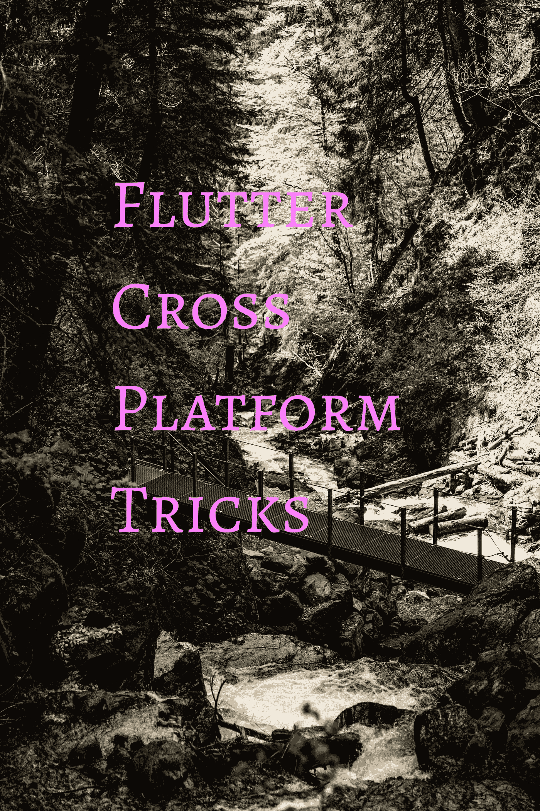

# 颤振跨平台技巧

> 原文：<https://itnext.io/flutter-cross-platform-tricks-2196986c619c?source=collection_archive---------0----------------------->



Marcel Strauss 在 [Unsplash](https://unsplash.com/?utm_source=unsplash&utm_medium=referral&utm_content=creditCopyText) 上拍摄的照片

谷歌没有考虑的主要问题是如何让你的 flutter 小工具符合目标平台的平台主题 Material 或 Cupertino。相反，谷歌教授手动编写材料方式和库比提诺方式，让两个应用程序根据目标平台切换到一个或另一个。因为大多数人都不想写双倍的代码；让我告诉你一个更简单的方法。

我正在使用的插件是我贡献的一个，名为 Flutter Platform Widgets:

【https://pub.dev/packages/flutter_platform_widgets 

虽然，它目前是测试版；他们紧跟 Material 和 Cupertino widgets 的所有变化，因此使用他们的方法制作完整的跨平台 flutter 应用程序非常有用。

# **背景**

问题是，虽然谷歌在向你介绍小工具方面做得很好；在成熟市场中开发专业应用程序并不需要掌握这些技术。那是我自己分配的工作，推出介质文章和我的颤振设计与开发丛书。

我发现，通过展示很酷的视觉和动画，我可以让你们做无聊的 devOPS、OOP 和 FP，让你们了解颤振专家的要点。涵盖的一些主题有:

DevOPS

为 Flutter 开发调优一台廉价的 MS Windows 笔记本电脑[https://medium . com/p/tuning-A-Cheap-MS-Windows-Laptop-for-Flutter-app-Development-572d 09 CD4 d 19](https://medium.com/p/tuning-a-cheap-ms-windows-laptop-for-flutter-app-development-572d09cd4d19)

日志驱动学习颤振[https://medium . com/codex/log-Driven-Learning-Flutter-d 76 b 49 b 75 a 8 c](https://medium.com/codex/log-driven-learning-flutter-d76b49b75a8c)

UML 在颤动中变得冷静[https://itnext.io/uml-coolness-in-flutter-6bb14217b5f2](/uml-coolness-in-flutter-6bb14217b5f2)

线头像个老板[https://itnext.io/lint-like-a-boss-60b85e82c227](/lint-like-a-boss-60b85e82c227)

麦凯布周期在颤动[https://medium.com/p/mccabe-cycles-in-flutter-3aa913e19428](https://medium.com/p/mccabe-cycles-in-flutter-3aa913e19428)

获取真实代码覆盖率[https://medium . com/p/getting-Real-Code-Coverage-951231 afa2 BC](https://medium.com/p/getting-real-code-coverage-951231afa2bc)

https://medium.com/p/lcov-on-windows-7c58dda07080[视窗上的 lcov](https://medium.com/p/lcov-on-windows-7c58dda07080)

测试秘密，测试套件【https://itnext.io/test-secrets-test-suites-99f8390b8d4b 

how-to-flutter 内部包[https://it next . io/how-To-Flutter-Internal-Packages-CAD 1285 fe8c](/how-to-flutter-internal-packages-cad1285fe8c)

安架构布局[https://medium . com/codex/an-Architecture-Layout-8f 414271 B2 B4](https://medium.com/codex/an-architecture-layout-8f414271b2b4)

日志，专家方式[https://medium . com/codex/logging-The-Expert-Way-5b E5 c 967 e 44](https://medium.com/codex/logging-the-expert-way-5beb5c967e44)

Catch Flutter 应用程序异常[https://it next . io/catch-Flutter-Application-Exceptions-CAD 036d 0 FD 4 e](/catch-flutter-application-exceptions-cad036d0fd4e)

颤振完美设置[https://medium.com/codex/flutter-perfect-setup-c5462b412f78](https://medium.com/codex/flutter-perfect-setup-c5462b412f78)

酷扑文档[https://medium.com/p/cool-flutter-docs-383b951d7feb](https://medium.com/p/cool-flutter-docs-383b951d7feb)

视觉的

用户喜爱的动画(rive)[https://medium.com/codex/animations-users-love-75a57a8cad5](https://medium.com/codex/animations-users-love-75a57a8cad5)

全扑背景绝招[https://medium . com/p/全扑-背景-绝招-d1ea813470d2](https://medium.com/p/full-flutter-background-trick-d1ea813470d2)

Flutter 应用中的 Cool Rive 背景动画[https://medium . com/p/cool-Rive-Background-Animation-in-Flutter-Apps-2fd 5 e 58 BC 81 b](https://medium.com/p/cool-rive-background-animation-in-flutter-apps-2fd5e58bc81b)

由于我的文章出现在多种出版物上，因此保持更新的最佳方式是加入这些社交平台之一，并使用我的个人资料链接关注我:

LinkedIN[https://www . LinkedIN . com/in/fredgrottstartupfluttermobileappdesigner/](https://www.linkedin.com/in/fredgrottstartupfluttermobileappdesigner/)

邢[https://www.xing.com/profile/Fred_Grott/cv](https://www.xing.com/profile/Fred_Grott/cv)

不和[https://discordapp.com/users/9388/](https://discordapp.com/users/9388/)

Gitter(加入本论坛获取文章链接)【https://gitter.im/flutter/flutter 

slack[https://app . slack . com/client/TGT 6 yf2 j 1/cgs 4 qdj 56/user _ profile/uhk 8 pnr gu](https://app.slack.com/client/TGT6YF2J1/CGS4QDJ56/user_profile/UHK8PNRGU)

推特[https://twitter.com/fredgrott](https://twitter.com/fredgrott)

中型[https://fredgrott.medium.com](https://fredgrott.medium.com)

Reddit FlutterDev Subedit(只要加入这个论坛，你就会通过 Reddit 得到通知)[https://www.reddit.com/r/FlutterDev/](https://www.reddit.com/r/FlutterDev/)

一如既往，文章和书籍的代码可以在以下位置找到:

Github 上的 flutter design and arch Rosetta[https://Github . com/Fred grott/flutter _ design _ and _ arch _ Rosetta](https://github.com/fredgrott/flutter_design_and_arch_rosetta)

我贡献的插件有

颤振平台小部件[https://github.com/stryder-dev/flutter_platform_widgets](https://github.com/stryder-dev/flutter_platform_widgets)

颤振驱动(播放器)插件[https://github.com/rive-app/rive-flutter](https://github.com/rive-app/rive-flutter)

# **跨平台背景**

我将展示跨平台颤振应用程序设计和创建的错误方法。不要这样做！有了这个警告，让我们开始吧。

谷歌想出了这个愚蠢的方法，使用 MaterialApp，切换底层的平台架构，去掉一些关键的小部件。问题是，它在 Cupertino widgets 上充其量也是不完美的，出现了足够多的差异，以至于你赶走了 iOS 用户。这也是我警告你不要这么做的原因。

另一个主要原因是，您最终会得到许多不可共享的代码。如果您查看 Google 自己的示例 platform_design，您会看到其中有 10%或更多的不可共享代码:

[https://github . com/颤振/samples/tree/master/platform _ design](https://github.com/flutter/samples/tree/master/platform_design)

现在，即使谷歌的方式意味着有 10%的不可共享代码，它也有一个附带的好处，那就是他们必须设置它，以便你可以在库比蒂诺这边使用材料小部件。这意味着，只要父容器是一个材质小部件容器，像材质运动、波纹等事实上可以重用。

但首先，让我们看看一些关键的平台差异。

# **移动平台差异**

Android 有两个导航栏，app 栏，底部 navbar 而 iOS 只有一个底部导航栏。安卓有一套材质设计颜色；而苹果的 iOS 有着平淡的设计色彩。

然后，我们有材料设计和苹果公司的平面设计人机界面指南之间的差异，通过文本内容属性可以看出字体主题在两个平台上的工作方式。

Flutter Platform Widgets 插件的好处在于它允许你以一种简单的方式适应这些差异。让我告诉你怎么做。

# **跨平台第一步**

要安装 Flutter 平台的小部件，你应该安装 google_fonts 插件，方法是:

```
flutter_platform_widgets: ^1.9.0google_fonts: ^2.0.0
```

它被放在 pubspec 的 dependencies 块下。主函数代码只是我在以前的几篇文章中提到的内容的组合:

现在，我们已经为代码的 myapp 部分做好准备。

# **MyApp 代码**

我们有这个 myapp 代码:

现在，我们来了解一下谷歌的方法和这种方法的区别。我们利用了主题可以有一个子部件的事实。Flutter Platform Widgets 然后用它来建立一个平台提供商。

# **平台提供商**

这不是一个 Google 风格的提供者，因为它只是一个有状态的小部件，允许访问驱动该插件如何检测目标平台并交付正确的 targtplatformApp 的函数。

每个 Flutter 平台部件都有一个构建器，一边是材质部件，一边是 Cupertino 部件。

对于 Flutter 平台小部件，有一些助手功能。让我展示给你看。

# **颤振平台 Widgets 助手功能**

我们有 PlatformThemeData，它可以用于为 material 和 Cupertino 小部件样式设计非颤振平台小部件。例如:

```
Text(platform.text,textAlign: TextAlign.center,style: platformThemeData(context,material: (data) => data.textTheme.headline5,cupertino: (data) => data.textTheme.navTitleTextStyle,),)
```

有时候，我们需要呈现一个不同平台的父窗口小部件，但是有相同的子元素。这是一个平台小部件构建器:

```
PlatformWidgetBuilder(;cupertino: (_, child, __) => GestureDetector(child: child, onTap: _handleTap),material: (_, child, __) => IniWell(child: child, onTap: _handleTap),child: Container(child: Text('Common text')),);
```

现在来看看使用这种策略的注意事项。

# **对 Flutter 平台部件策略的跨平台考虑**

材料工厂使用非声明性的覆盖窗口小部件，并且具有材料支架依赖性，因此没有办法在这种跨平台策略中真正使用它。但是，可以使用定位窗口小部件作为替代，因为我们不能在 Cupertino 平台上使用任何导航窗口小部件。

这些跨平台的 Flutter 平台部件的一个独特的好处是，我们可以更好地控制字体定制。使用谷歌的策略，你将不得不为每个窗口小部件单独加载自定义字体，因为当对每个窗口小部件同样使用这种策略时，你不会得到为文本平台定制的主题。

然而，使用 Flutter Platform Widgets 策略，可以为每个平台设置文本主题来定制字体。例如:

这是我使用 Flutter 平台小部件和谷歌字体插件定制字体的库比蒂诺文本主题。Cupertino 方面必须有更多的东西，因为 Cupertino 与平面设计用户指南相关，而材料字体与材料设计指南相关。

您需要做一些编码工作的另一个主要考虑是 Cupertino 平台目标的颜色设置。你必须重新定义一切，因为 Cupertino 没有任何材料配色方案:

```
import 'package:flutter/cupertino.dart';import 'package:flutter/material.dart';// In CupertinoApp Widgets we do not have ColorScheme// and so this is the best approximation. Define// Primary, PrimaryVariant, Secondary, and SecondaryVariantCupertinoDynamicColor myCupertinoPrimaryColor =const CupertinoDynamicColor.withBrightness(color: Colors.purple,darkColor: Colors.cyan,);CupertinoDynamicColor myCupertinoPrimaryContrastingColor =const CupertinoDynamicColor.withBrightness(color: Colors.deepPurple,// ignore: prefer-trailing-commadarkColor: Colors.deepPurpleAccent);
```

通过这种方式，颜色可以在库比蒂诺平台的浅色和深色主题中恰当地流动。

现在，让我向您展示 UI 代码的其余部分。

# **UI 代码的其余部分**

主页代码如下所示:

完整的来源在回购中:

[https://github . com/Fred grott/flutter _ design _ and _ arch _ Rosetta](https://github.com/fredgrott/flutter_design_and_arch_rosetta)

它位于 base_ui_platexp 项目中的 foundation_base 子文件夹下。

# **结论**

现在，这比拥有额外的 10%不可共享的代码更容易吗？第四，我将展示如何依赖注入平台主题，每个状态的明和暗的变体，每个状态的解决方案，以及其他与状态技巧相结合的花式。

# **资源**

特定于文章的资源:

颤振设计和 arch Rosetta[https://github . com/Fred grott/flutter _ design _ and _ arch _ Rosetta](https://github.com/fredgrott/flutter_design_and_arch_rosetta)

一般颤振和飞镖资源；

扑社区资源[https://flutter.dev/community](https://flutter.dev/community)

颤振 SDK[https://flutter.dev/docs/get-started/install](https://flutter.dev/docs/get-started/install)

Android Studio IDE[https://developer.android.com/studio](https://developer.android.com/studio)

MS 的 Visual Studio 代码[https://code.visualstudio.com/](https://code.visualstudio.com/)

颤振文件[https://flutter.dev/docs](https://flutter.dev/docs)

dart Docs[https://dart.dev/guides](https://dart.dev/guides)

谷歌 Firebase 移动设备测试实验室[https://firebase.google.com/docs/test-lab](https://firebase.google.com/docs/test-lab)

# **商标公告**

Google LLC 拥有以下商标:飞镖，颤振，机器人，机器人，诺托。苹果公司拥有 iOS、MacOSX、Swift 和 Objective-C 的商标。苹果公司拥有 SF Pro、Sf Compact、SF mono 和 New York 字体的商标。JetBeans Inc .拥有 JetBeans、IntelliJ 和 Kotlin 的商标。甲骨文公司拥有 Java 商标。微软公司拥有微软视窗操作系统和 Powershell 的商标。Gradle 是 Gradle Inc .的商标。Git 项目拥有 Git 的商标。Linux 基金会拥有 Linux 的商标。智能手机 OEM 自有商标到其手机产品名称。尽我所能，我遵守上述商标的品牌和使用指南。

# **关于我，弗雷德·格罗特**

我正在进行一次不同的冒险，创建一个创造者工作室，以引导的方式向你们教授 Flutter 应用程序设计和开发。

我的基本资料在 https://keybase.io/fredgrott[的](https://keybase.io/fredgrott)