# Flutter +本地化+ Google Sheets API + Python = >内部化天堂

> 原文：<https://itnext.io/flutter-localisation-google-sheets-api-python-internalisation-paradise-8439cab57866?source=collection_archive---------2----------------------->

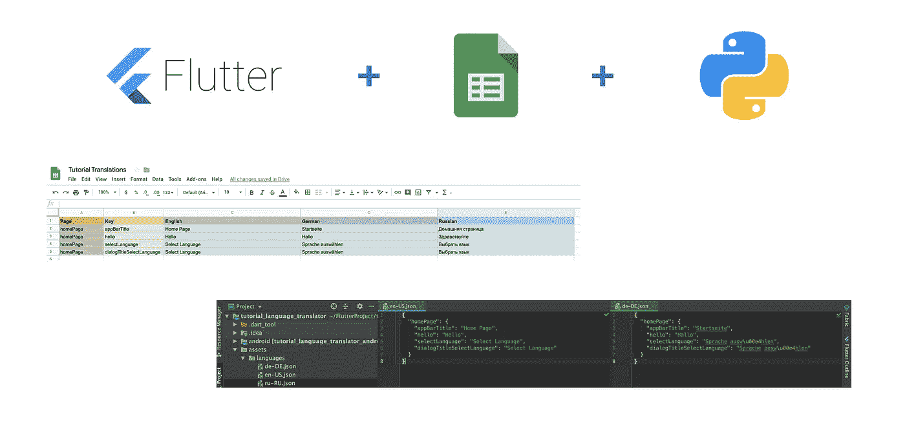

## 介绍

正如你所知道的，本地市场的本地化应用程序提供了非常好的用户体验。我们需要记住的是，当脸书将他们的应用程序本地化到其他市场时，他们的吸引力就已经达到了顶点。

目前，我正在启动另一家创业公司。这次我不是一个人。我与我才华横溢的联合创始人并肩工作，由于我们的产品面向许多不同的市场，我们需要一种方法在应用程序中实现本地化。

我们是一家初创公司，成本对我们来说非常重要。我决定更深入地挖掘——我如何能想出一些简单的本地化方法和简单的可伸缩性。最重要的是，简单的协作，任何人都可以在任何时候查看和更新语言。

当前的方法允许我们非常容易地更新/添加/删除翻译。这种方法非常有效，因为我们坚持了几个星期，我们对此非常满意。

## TLDR；最终结果

所有你需要做的是运行脚本和语言自动本地化，并在你的 Flutter 文件夹中替换。

**谷歌工作表**

Google Sheets 中的翻译

**运行脚本**

语言生成

**输出文件自动覆盖颤振文件夹。**

Flutter 中自动生成的文件

**手机演示**

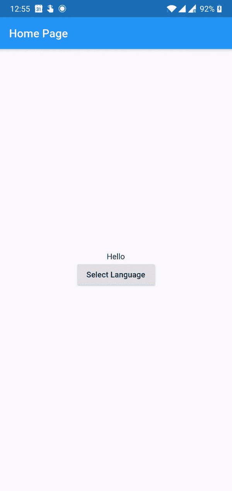

## 回购

flutter—[https://bit bucket . org/deimantasa/tutorial-translations-mobile/src](https://bitbucket.org/deimantasa/tutorial-translations-mobile/src)

翻译脚本—[https://bit bucket . org/deimantasa/tutorial-translations-API/src](https://bitbucket.org/deimantasa/tutorial-translations-api/src)

# 摆动

对于本地化，我使用的是 [easy_localization](https://pub.dev/packages/easy_localization) (目前是 2.1.0+2)。

## 项目结构

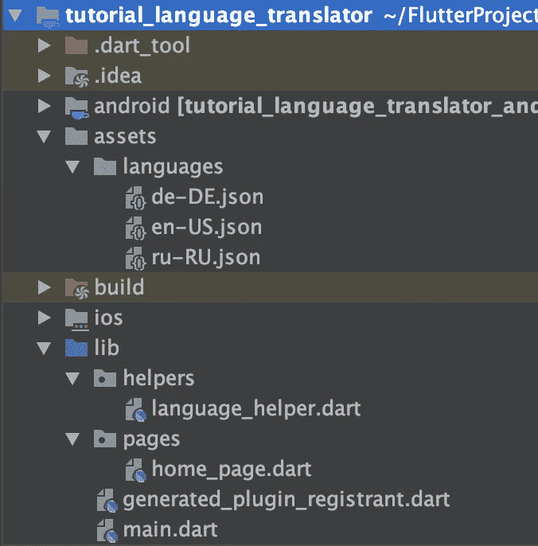

项目结构

我们的结构非常简单。 **main.dart** main 我们的启动文件，该文件将执行并打开 **home_page.dart** 。你必须添加新的目录**资产/语言**并放入你喜欢的语言。这条路非常重要。

为了让 Flutter 访问它的文件，在 **pubspec.yaml** 中，你需要添加这个文件。

你所做的就是告诉 Flutter 可以从这个特定的路径访问文件。

## 本土化

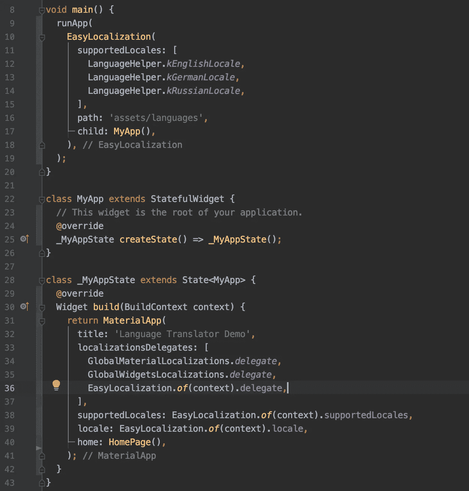

首先，我们需要用 **EasyLocalization** 包装 **MyApp** (第 17 行)。它带有几个我们需要提供的参数。这是一个支持语言的列表(第 11 行)和一个路径，在那里我们保存我们的语言资产(第 16 行)。**路径**应该和我们之前在 **pubspec.yaml** 中提供的一样。

再往前走，我们遇到 MaterialApp(第 31 行)。我们必须提供 **localizationDelegates** (第 33 行) **supportedLocales** (第 38 行)和 **locale** (第 39 行)。做完所有这些后，我们准备好了！算是吧。

**语言助手**

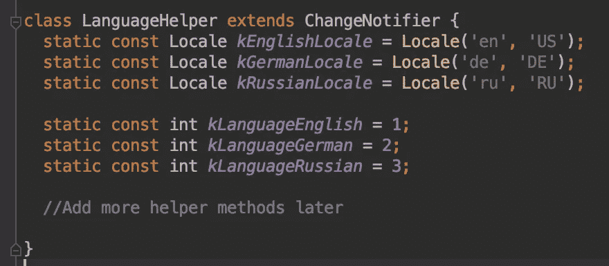

正如你在 main.dart 文件中注意到的，我有一些对 **LanguageHelper** 的引用。这里我只保留了各种帮助器方法和支持的语言。我喜欢把东西保持整洁，放在一个地方。

**首页**

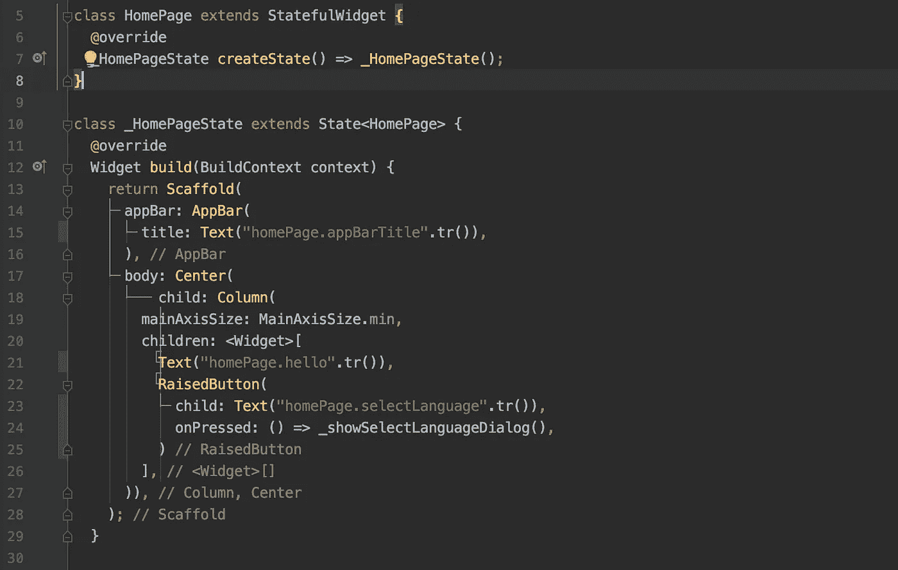

带有文本和按钮的非常简单的页面。这里您会注意到，在**文本**小部件中，我使用了来自我的 JSON 的**键-值**对，它调用了 **tr()** 方法。这就是奇迹发生的地方。根据所选择的语言环境，将读取适当的语言文件(json ),然后从 key(**home page . appbartitle**)中获取指定的字符串。

为了选择语言，我们只显示对话框。

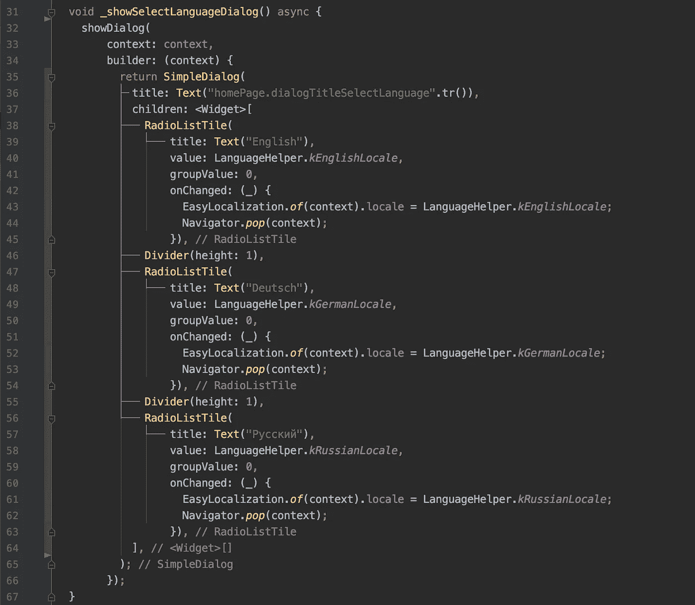

要更改语言，我们只需为 EasyLocalizations 提供程序(**easy localization . of(context))分配新的语言环境。locale = newLocale** ) 。然后，来自 **EasyLocalization** 的整个提供者树被触发并重建，给我们的新文本带来变化。非常简单的概念。

# **脚本**

现在有趣的部分——我们的 python 自动化脚本。一旦你打开 **generate_translations** 文件，你将需要改变几个变量。

1.  Flutter 项目路径— path，你的语言文件(jsons)本地存储在哪里；
2.  Credentials json 文件路径—本地路径，credentials.json 所在的位置(这不需要更改，因为它位于同一个文件夹中)；
3.  翻译工作表名称—您将使用的 google 工作表的名称。

我不会深入脚本本身，我希望它足够自我解释。

关键功能是用提供的语言生成 json 文件。

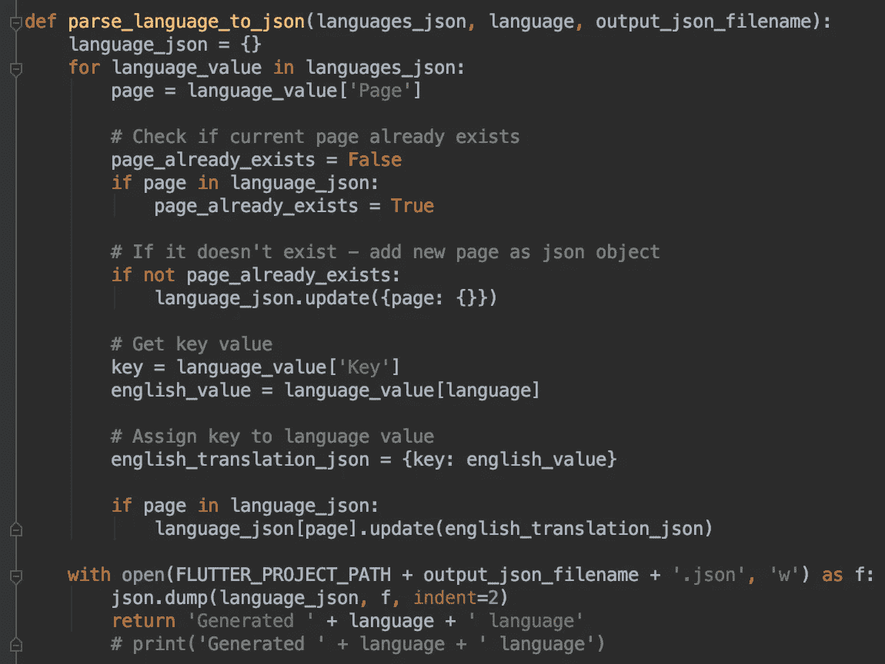

我们基于列(在 Google Sheets 中)**页**、**键**和**提供的语言**生成语言 json 文件。我将在下一节对此进行更多的讨论。

# **获取谷歌凭证**

为了填充 credentials.json，我们需要执行几个步骤，包括:

1.  在谷歌云中创建项目；
2.  启用 Google Sheets 和 Google Drive APIs
3.  在 Google Sheets 凭证中创建服务帐户。

首先我们去[https://console.cloud.google.com/](https://console.cloud.google.com/)，点击**新项目**。

然后输入项目名称，点击**创建**。

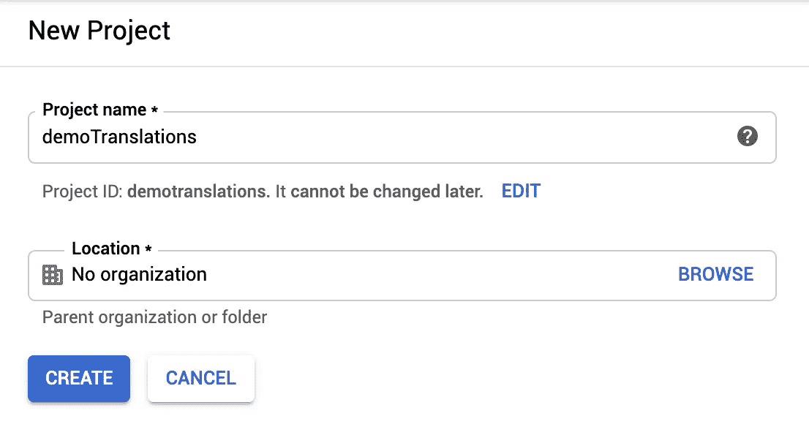

一旦我们创建了我们的项目，在我们的仪表板中，我们导航到我们的 API 部分并点击**转到 API 概述**。

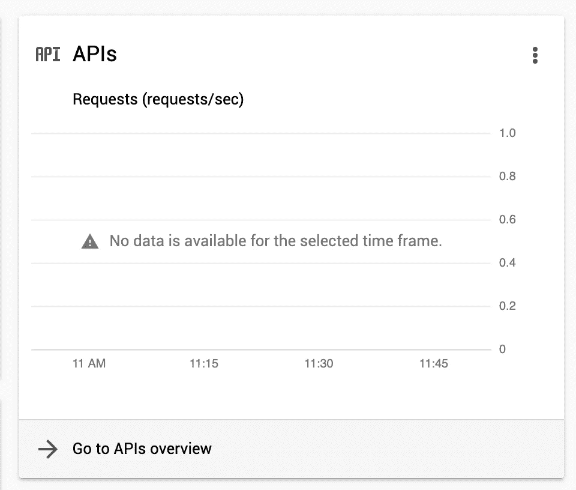

一旦到了那里，我们需要启用驱动和工作表 API。让我们点击**启用 API 和服务**

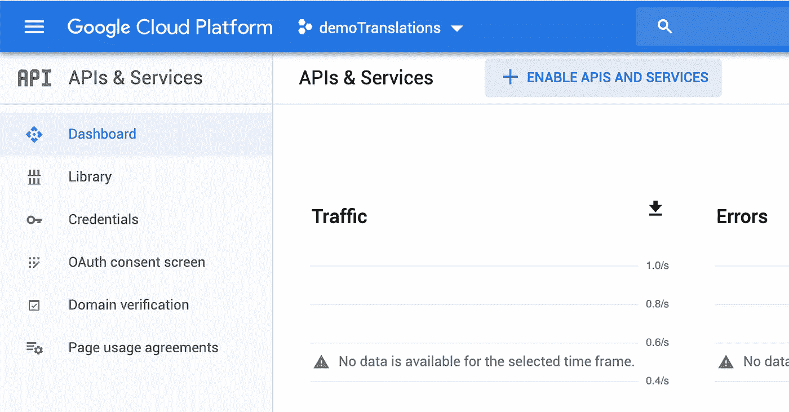

在这里，我们搜索工作表和驱动 API 并启用它们

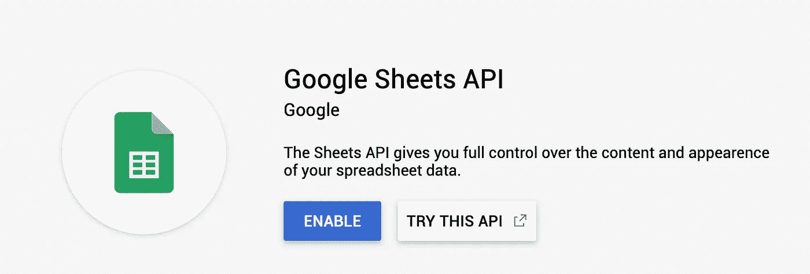

一旦启用了表和驱动器 API，我们就导航到表 API 凭证部分。

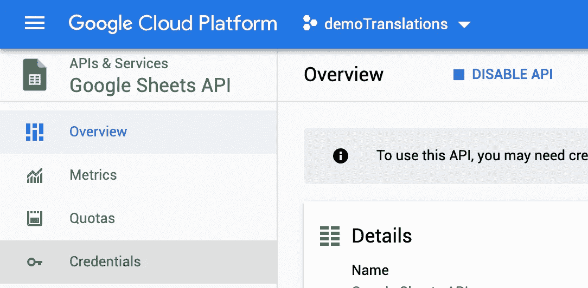

我们需要创建新的服务帐户。

输入姓名后，继续并创建服务帐户。

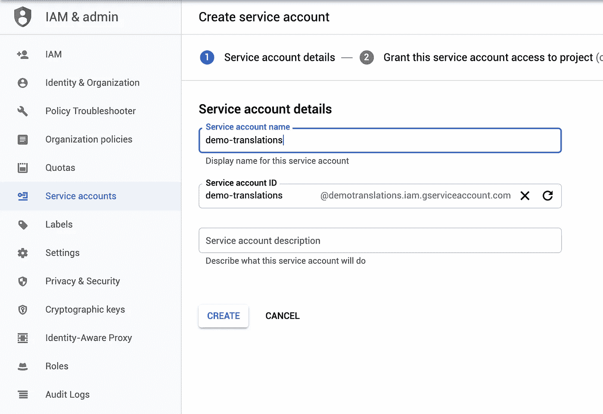

创建完成后，单击它，用您的凭证创建新的 JSON 文件。

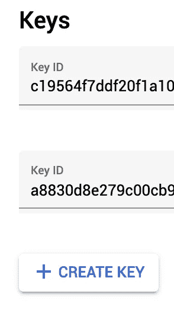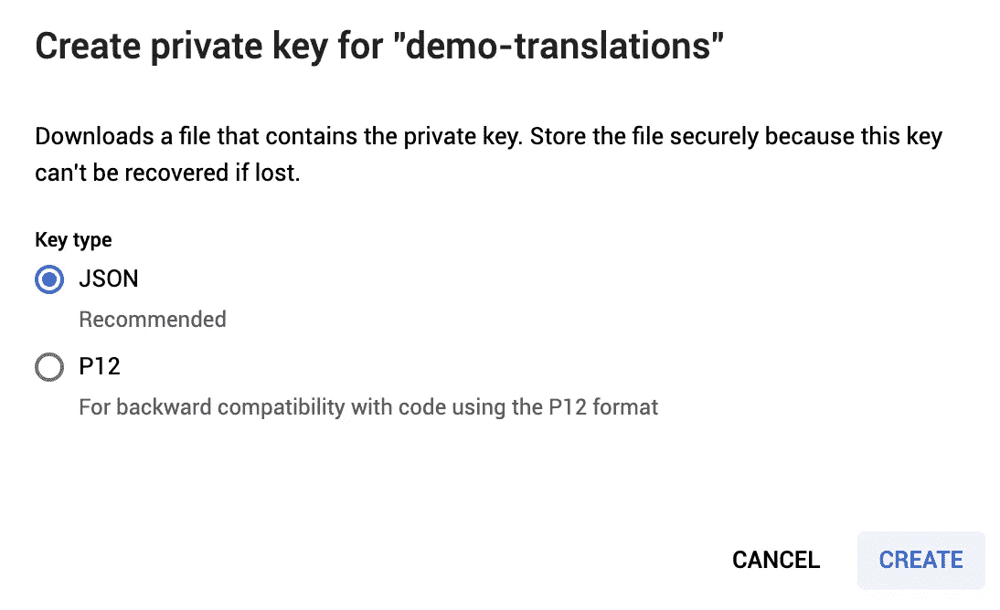

创建后，你会收到 json 文件。将其内容粘贴到 python 根目录下的 **credentials.json** 文件中。

就这样，现在我们有了服务客户。

# 谷歌工作表

最后一步是创建谷歌表。只需转到[http://sheets.google.com/](http://sheets.google.com/)并创建一个工作表。它的名称非常重要，因为它必须在**TRANSLATIONS _ SHEET _ NAME**变量中被引用。
板材结构如下:

页面，按键，

正如您从脚本中注意到的，这些字符串区分大小写。最终版本:

现在，您可以邀请服务帐户用户。点击**分享**

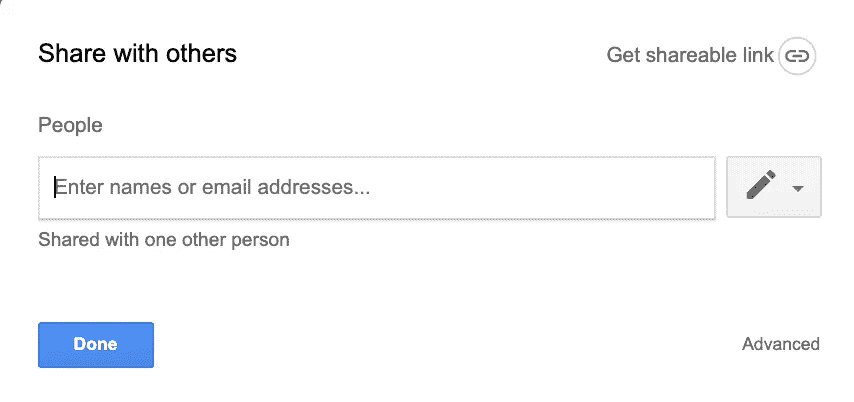

用 **client_email** 键粘贴你从下载的凭证中找到的地址。

之后，你的服务帐户将能够访问谷歌表。

我们结束了。

# 运行脚本

现在剩下的就是运行脚本了。只需转到 python 目录的根目录并编写**python 3 generate _ translations . py**几秒钟后脚本就会完成，你会看到生成了哪些语言。

仅此而已。您拥有完全可伸缩的自动化脚本。
可以进行以下改进:

1.  在云中作为服务制作的脚本；
2.  生成语言 json 文件后，会自动上传到一些云存储中；
3.  一旦建立在 Flutter 之上，它就会触发语言服务。如果有一些更新，语言服务会生成新的语言，它们会在 Flutter 中自动下载和替换。

那将是完全自动化。但是，就目前而言，我对目前的方法很满意。也许一旦我有更多的时间，我会继续进一步完善剧本。

希望你能从这篇文章中学到一些新的东西，它能帮助和激励你做一些很酷的东西！有一个光明的一周！