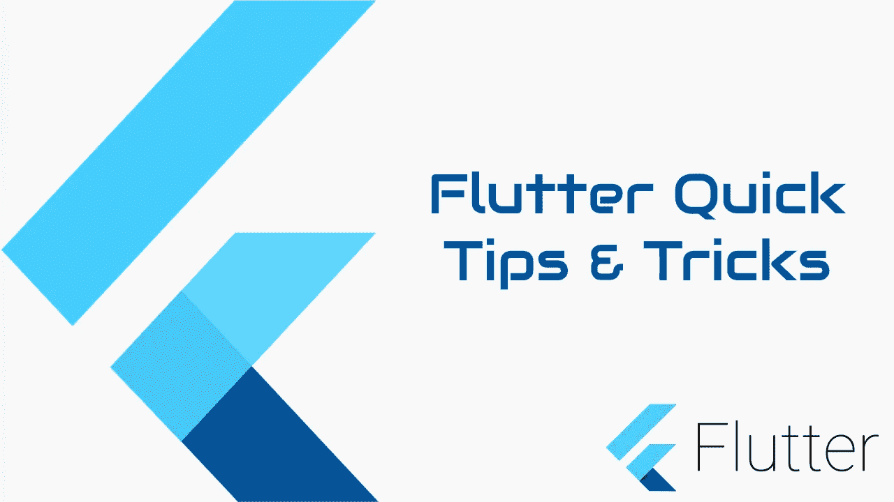

# 颤振快速提示和技巧

> 原文：<https://itnext.io/flutter-quick-tips-tricks-9d10fecc62c0?source=collection_archive---------3----------------------->

在这里你会看到一些快速编码技巧和窍门。



颤振快速提示和技巧

***让我们开始……***

# 观看视频教程

颤动提示和技巧

# 关闭键盘

要关闭键盘，我们必须使用手势检测器将焦点设置在不同的节点上，如下例所示。

```
dismissKeyboard(BuildContext context) {
   FocusScope.of(context).requestFocus(new FocusNode());
 }

 Widget body1() {
   return GestureDetector(
     behavior: HitTestBehavior.opaque,
     onTap: () {
       _dismissKeyboard(context);
     },
     child: Container(
       color: Colors.white,
       child: Column(
         children: <Widget>[
           TextField(),
         ],
       ),
     ),
   );
 }
```

# 用不同的方式上色

*以不同的方式使用不透明度给小工具的背景上色。
您可以使用不透明的 RGB 颜色或不透明的十六进制颜色。*

```
Widget body2() {
    return  Container(
       color: Color.fromRGBO(0, 0, 0, 0.5),
    );
    return  Container(
      color: Color(0xFF4286f4),
    );
    return  Container(
      color: Color(0xFF4286f4).withOpacity(0.5),
    );
    return Container(
      color: Color(0xFF4286f4),
    );
  }
```

# 圆形容器

```
Widget body4() {
    return Container(
      height: 40.0,
      padding: EdgeInsets.all(20.0),
      margin: EdgeInsets.all(30.0),
      decoration: BoxDecoration(
        color: Colors.green,
        borderRadius: BorderRadius.all(
          Radius.circular(5.0),
        ),
      ),
    );
  }
```

# 带有圆形图像的容器

```
Widget body5() {
   return Container(
     width: 250.0,
     height: 300.0,
     padding: EdgeInsets.all(20.0),
     margin: EdgeInsets.all(30.0),
     decoration: BoxDecoration(
       color: Colors.green,
       borderRadius: BorderRadius.circular(50.0),
       image: DecorationImage(image: NetworkImage(imgUrl), fit: BoxFit.fill),
     ),
   );
 }
```

# 使用 ClipOval 的圆形图像

```
Widget body6() {
    return ClipOval(
      child: Image.network(
        imgUrl,
        fit: BoxFit.fill,
        width: 190.0,
        height: 190.0,
      ),
    );
  }
```

# 使用圆形头像的圆形图像

```
Widget body7() {
   return Container(
     height: 300,
     width: 200,
     child: CircleAvatar(
       radius: 100.0,
       backgroundImage: NetworkImage(
         imgUrl,
       ),
     ),
   );
 }
```

# 使用 InkWell 在您点击小部件的任何地方喷溅

```
Widget body3() {
  return Container(
    color: Colors.orangeAccent,
    height: 100.0,
    child: Material(
      color: Colors.transparent,
      child: InkWell(
        splashColor: Colors.white.withOpacity(0.2),
        onTap: this._onSelect,
        child: Center(
          child: Text("Hello"),
        ),
      ),
    ),
  );
}
```

# 自定义 ListView 分隔符

```
Widget body8() {
   return ListView.separated(
     separatorBuilder: (context, index) => Divider(
           color: Colors.black,
         ),
     itemCount: 20,
     itemBuilder: (context, index) => Padding(
           padding: EdgeInsets.all(8.0),
           child: Center(child: Text("Index $index")),
         ),
   );
 }
```

# 零感知运算符

这里有一个初始化空变量的简写

```
if (imgUrl == null) {
  imgUrl =
      '[https://images.pexels.com/photos/40984/animal-ara-macao-beak-bird-40984.jpeg?cs=srgb&dl=animal-colorful-colourful-40984.jpg&fm=jpg'](https://images.pexels.com/photos/40984/animal-ara-macao-beak-bird-40984.jpeg?cs=srgb&dl=animal-colorful-colourful-40984.jpg&fm=jpg%27);
}
```

这是做上面代码的简写。

```
imgUrl ??=
    '[https://images.pexels.com/photos/40984/animal-ara-macao-beak-bird-40984.jpeg?cs=srgb&dl=animal-colorful-colourful-40984.jpg&fm=jpg'](https://images.pexels.com/photos/40984/animal-ara-macao-beak-bird-40984.jpeg?cs=srgb&dl=animal-colorful-colourful-40984.jpg&fm=jpg%27);
```

# 计时器

```
void periodic() {
  Timer.periodic(
    Duration(seconds: 1),
    (Timer time) {
    print("time: ${time.tick}");
    if (time.tick == 5) {
        time.cancel();
        print('Timer Cancelled');
    }
   },
  );
}
```

# 获取设备类型

获取设备的两种方式，您当前正在运行的应用程序是…

```
void getDevice() {
    bool ios = Platform.isAndroid;
    print('iOS1: $ios');
    bool isIOS = Theme.of(context).platform == TargetPlatform.iOS;
    print('iOS2: $isIOS');
}
```

# 不要做

```
// Do not explicitly initialize variables to null.
var test; //good
var test1 = null; // bad
```

# 淡化图像

在项目根目录下的“images”文件夹中添加一个“*loading . gif”*图像。我们将使用此图像作为下载图像的占位符。

注意:确保您在项目根目录下的 *pubspec.yaml* 文件的“assets”部分指定了“images”文件夹。

#要向应用程序添加资产，请添加一个资产部分，如下所示:

```
assets:
  - images/
  ...
```

在代码中…

```
Widget fadeImage() {
    return FadeInImage.assetNetwork(
        placeholder: 'images/loading.gif',
        image: fadeImgUrl,
    );
}
```

# 缓存图像

轻松在应用程序中缓存图像。

在 *pubspec.yaml* 文件中添加图像缓存插件。

```
dependencies:
  flutter: 
    sdk: flutter

  ...
  cached_network_image: ^1.0.0
  ...
```

# 列小部件中的 ListView

如果您正在将 *ListView* 添加到*列*小部件中，请确保您将它添加到*展开的*小部件中，否则将导致溢出或错误。

```
Widget list() {
    List<String> companies = [
      'Google',
      'Facebook',
      'Apple',
      'Google',
      'Facebook',
      'Apple',
      'Google',
      'Facebook',
      'Apple',
      'Google',
      'Facebook',
      'Apple',
      'Google',
      'Facebook',
      'Apple',
      'Google',
      'Facebook',
      'Apple',
      'Google',
      'Facebook',
      'Apple',
      'Google',
      'Facebook',
      'Apple',
    ];
    return Expanded(
      child: ListView.builder(
        itemCount: companies.length,
        itemBuilder: (BuildContext context, int index) {
          return Padding(
            padding: EdgeInsets.all(20.0),
            child: Text(
              companies[index],
              style: TextStyle(color: Colors.black),
            ),
          );
        },
      ),
    );
  }

....
// In the build method...

body: Container(
    padding: EdgeInsets.all(20.0),
    child: Column(
        children: <Widget>[
        list(),
        ],
    ),
),
```

目前就这些。

让我知道你最喜欢哪个提示。

如果你觉得这篇文章有用，请鼓掌，并在下面留下你的宝贵意见。

感谢阅读。

请关注我的频道[这里](https://www.youtube.com/channel/UC5lbdURzjB0irr-FTbjWN1A)获取更多教程。

访问我的博客[这里](https://www.coderzheaven.com/)。