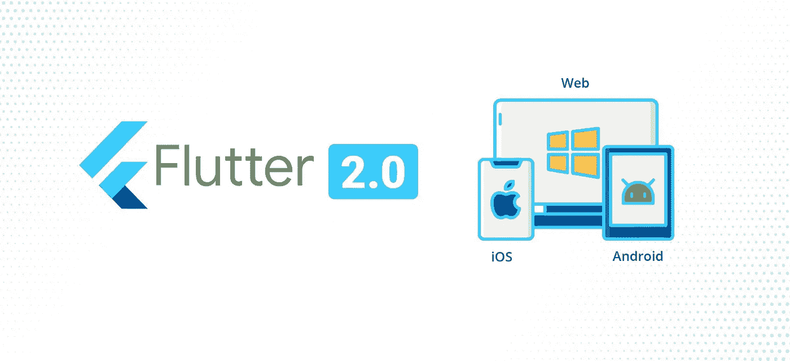

# Flutter Web:我应该使用它吗？(第四部分-我相信是这样的)

> 原文：<https://itnext.io/flutter-web-should-i-use-it-part-4-i-believe-so-b1003938dcce?source=collection_archive---------4----------------------->

这是这个系列的最后一部分，如果你还没有，这里是前一部分的背景。

 [## Flutter Web:我应该使用它吗？(第 3 部分—其他考虑事项)

### 这一次，我们来看看在决定 flutter web 是否适合你之前需要考虑的最后几件事。

itnext.io](/flutter-web-should-i-use-it-part-3-other-considerations-ec4efc2c651b) 

在这一部分，我将介绍一些想法和建议，我认为这些想法和建议最适合从事 Flutter Web 项目的人。

# 只是一个网络项目…

这很简单，因为你只针对一种平台类型，建立代码库很简单，只需遵循来自 [flutter.dev](https://flutter.dev/) 的文档

# 使用移动应用程序添加或定位 web

这是我认为你应该花些时间考虑一个更干净的方法的地方，web 和移动之间有很大的不同，迎合所有这些可能会无意中膨胀你的代码库。

如果您希望确保所有用户(无论是 web 用户还是移动用户)在使用您的应用程序时都有良好的体验，您可能需要考虑一种更加独立的项目方法。

移动设备在布局上非常一致，手机通常都遵循高而薄的显示方式，因此一致的外观和用户体验非常容易。

另一方面，浏览器有多种分辨率，用户并不总是全屏，他们也可能在手机和平板电脑上使用它，因此媒体查询在这里变得非常重要，您可能还希望调整某些控制或交互的方式，以便获得更像网络的用户体验。

# 设置建议…

虽然将您的 web 和移动代码放在同一个项目和文件夹中绝对是可能的，而且肯定会奏效，但您可能希望在这一点上将其分成 3 个独立的部分。

您可以考虑以下几层

在 Web 和移动层，你将主要实现你的布局代码，比如容器、抽屉、应用栏、底部导航等等。

所有特定于用户界面的微件，所有在 Web 和移动平台上都相同的东西，都可以放在共享层，所有自定义微件组和可能的一些完整屏幕都可以存储在那里，然后与您的 Web 和移动层共享，这样，可重用和可配置的组件本身可以保持其用户界面结构和逻辑，同时仍然以最适合目标平台的方式进行布局。

除了小部件，共享层还可以存储业务逻辑的某些方面和一些网络逻辑，尤其是状态很可能跨层共享，因为您将显示的内容以及何时保持一致，这是我们试图保持更多控制的“外观”。

使用共享层中的平台委托也可以简化逻辑共享，如果你考虑像文件下载这样的事情，这在移动上比在 web 上更无缝地工作，web 需要一点创造力来实现，这也将导致必须使用 web 特定的代码，这将阻止单元测试。

我将在这里详细介绍如何设置平台代理:[将 Flutter web 添加到现有的应用程序中](https://medium.com/wyzetalk-tech/adding-flutter-web-to-an-existing-application-926730158c8b)

这使您仍然可以维护一个非常可重用的代码库，同时对目标平台的特定用户体验有更多的控制。

在手机上，你可以更自由地把它放进去，几乎忘记它，只需要关心风景和肖像。

对于 web，您可以对布局进行更多的控制，也许可以操纵您的小部件并排显示在两列数据中，或者调整它们如何跨越各种断点。

然后，您还可以更容易、更干净地在较大的断点处为 web 实现顶部水平导航，并且只在较小的断点处返回到抽屉中，而不使用底部导航，而对于移动设备，则使用抽屉和底部导航。

在这种情况下，Drawer 可以作为一个共享的小部件，而 Top Nav 只存在于项目的 web 端，而 Bottom 在移动端，这样也减少了平台上不必要的代码。

# 需要注意的事项…

到目前为止，根据我的经验，Web 的代码方面是无缝的，我唯一想指出的是:

Flutter 在构建时没有定义渲染引擎，默认情况下它会选择 canvas for web 和 HTML for mobile。

您可以通过在构建命令后添加`-web-rendered [html|canvas]`来做出选择。

如果您正在使用外部来源的图像，正如我在第一部分中引用的从外部来源获取各种加密货币的图标一样，在构建时将 HTML 作为渲染引擎会更简单，因为当前 canvaskit 仅支持同源图像，为了使用远程图像，您首先需要将图像数据转换为字节码，并将其提供给`Image`小部件。

然而，如上所述，需要注意的是`dart:html`不能被导入到将要进行单元测试的文件中，你需要确保代码的逻辑写在一个平台委托中，以确保测试框架利用移动实现。

# 结论

这就是我对这个系列的看法，我希望我已经给了你足够的细节，让你对 Flutter 的 Web 实现是否是你下一个项目的可行想法做出更明智的决定。

我希望您对此感兴趣，如果您有任何问题、评论或改进，请随时发表评论。享受你的颤振发展之旅:D

如果你喜欢，一颗心会很棒，如果你真的喜欢，一杯[咖啡](https://www.buymeacoffee.com/remelehane)会很棒。

感谢阅读。

*原载于 2021 年 7 月 11 日*[*https://remelehane . dev*](https://remelehane.dev/posts/flutter-web-should-i-use-it-part-4/)*。*

 [## 在 M1 Mac 上开发(颤振)

### 作为一名开发新款 M1 Macbook Pro 的 Flutter and React 开发人员，我有一个简短的见解

remelehane.medium.com](https://remelehane.medium.com/developing-on-an-m1-mac-flutter-563c8dcc28f)  [## 在家工作适合我…

### 在过去的一年里，我们中的许多人都发生了很大的变化，对一些人来说变化非常剧烈。

remelehane.medium.com](https://remelehane.medium.com/working-from-home-it-works-for-me-2904c9edc0a4)