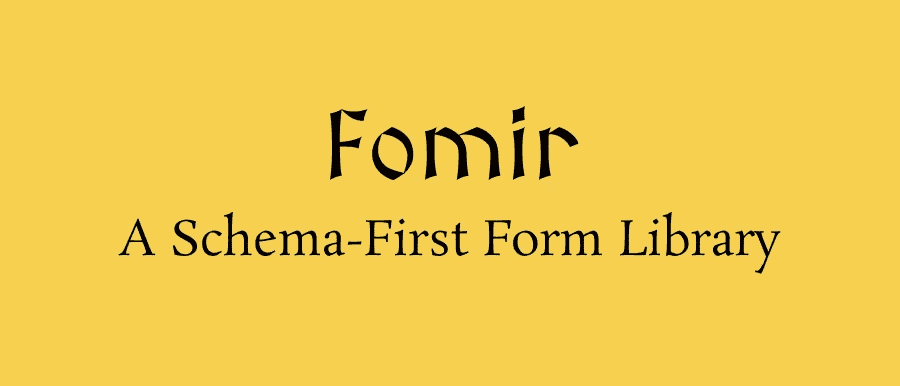

# Fomir:一个模式优先的表单库

> 原文：<https://itnext.io/fomir-a-schema-first-form-library-6a6fb7c5697c?source=collection_archive---------2----------------------->



# 什么是 Fomir？

Fomir 是一个用于构建表单的模式优先库。

Github 中的源代码: [Fomir](https://github.com/forsigner/fomir) 。

# 为什么要创建新的表单库？

我试过很多表单库，像 redux-form，formik，final-form，react-hook-form…没有一个适合我的口味。我希望表单库具有以下特性:

*   使用模式
*   易于更新表单状态
*   高性能
*   更抽象

所以我创建了一个新的表单库，并将其命名为 [Fomir](https://github.com/forsigner/fomir) 。

# 哲学

# 模式优先

Fomir 通过传递一个表单模式(json 树)来创建表单。表单模式非常灵活，你可以通过模式创建任何表单。

# 国家驱动的

表单模式中的所有东西都是状态，你可以很容易地创建表单界面。这在创建动态表单时非常有用。

# 高性能

在某些情况下，形式表现非常重要。由于基于订阅的表单状态管理，Fomir 的性能很高。当您更新单个字段时，它不会重新呈现整个表单。

# 分享和协作

在 fomir 中，表单模式中的组件属性决定如何呈现表单字段。Fomir 将推动你创建一些表单组件，如输入，选择，日期选择器…这将使你很容易在团队中共享表单组件。

# 低代码友好

Fomir 用模式构建表单，所以 fomir 在低代码场景中非常容易使用。当您想要创建类似 form builder 的东西时，Fomir 可能是一个不错的选择。

# 强类型

Fomir Form 通过 Typescript 提供强类型，允许您在编码时捕捉常见的错误，并提供编码智能感知。

# 装置

```
npm install fomir fomir-react
```

# 基本用法

```
function BasicForm() {
  const form = useForm({
    onSubmit(values) {
      alert(JSON.stringify(values, null, 2))
      console.log('values', values)
    },
    children: [
      {
        label: 'First Name',
        name: 'firstName',
        component: 'Input',
        value: '',
      },
      {
        label: 'Last Name',
        name: 'lastName',
        component: 'Input',
        value: '',
      },
      {
        component: 'Submit',
        text: 'submit',
      },
    ],
  }) return <Form form={form} />
}
```

# 证明文件

更详细的用法请见文档: [fomir.vercel.app](https://fomir.vercel.app/) 。