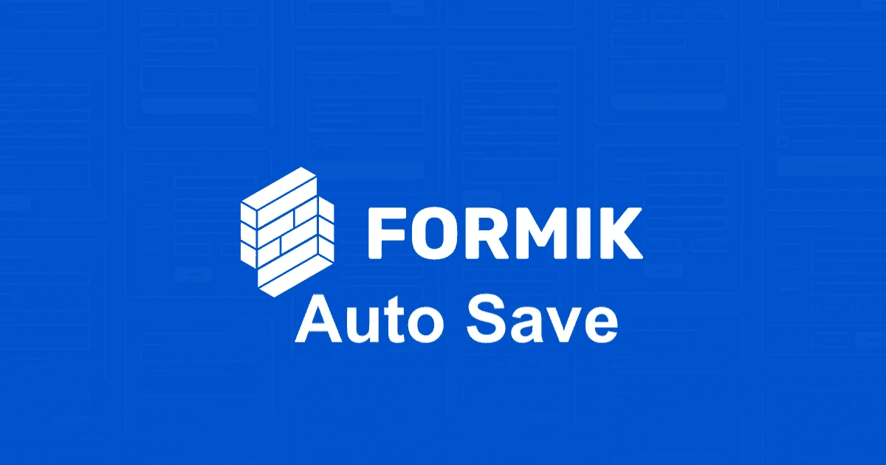

# Formik —介绍和自动保存(React)

> 原文：<https://itnext.io/formik-introduction-autosave-react-19d4c15cfb90?source=collection_archive---------2----------------------->



Formik 是用于 React 表单的非常好的工具。react 上处理表单和所有事件有时会很紧张。但是福米克会帮助你:)

如果您想查看**自动保存**部分，您可以跳过入门部分。

# 入门指南

要查看 Github 上的资源库，您可以点击下面的链接。

[**Github 页面**](https://github.com/jaredpalmer/formik) **|** [**NPM 页面**](https://www.npmjs.com/package/formik)

**Formik** 在 3 个主要方面为您提供帮助

1.  获取表单状态内外的值
2.  验证和错误消息
3.  处理表单提交

## 装置

```
npm install formik --save
```

或者

```
yarn **add** formik 
```

**Formik 的基本用法**

从示例中可以看出，我们初始化了 **initialValues**

验证了我们的值，并添加了提交函数来提交表单值。

这基本上就是在 react 应用程序中创建表单所需的全部内容:)

# 使用 Formik 自动保存

在 React hooks 和**formik . useformiccontext()**的帮助下，我们可以创建 FormikAutoSave 组件，如下所示。你可以在这里改变你想要的反跳，或者在渲染时作为道具调用你的组件。

创建了 FormikAutoSave 组件后，我们可以在表单组件中使用它，如下所示。

现在，我们将**去抖设置为 1000 毫秒**，当你改变输入字段时，它会在提交功能时去抖。

注意:重要的知识可以去学 [**去抖**](https://lodash.com/docs/#debounce)

*如果你觉得这篇文章很有帮助，你可以通过使用我的推荐链接注册一个* [***中级会员来访问类似的文章***](https://melihyumak.medium.com/membership) *。*

***关注我*** [**推特**](https://twitter.com/hadnazzar)


在 Youtube 上订阅更多内容

# 编码快乐！

梅利赫