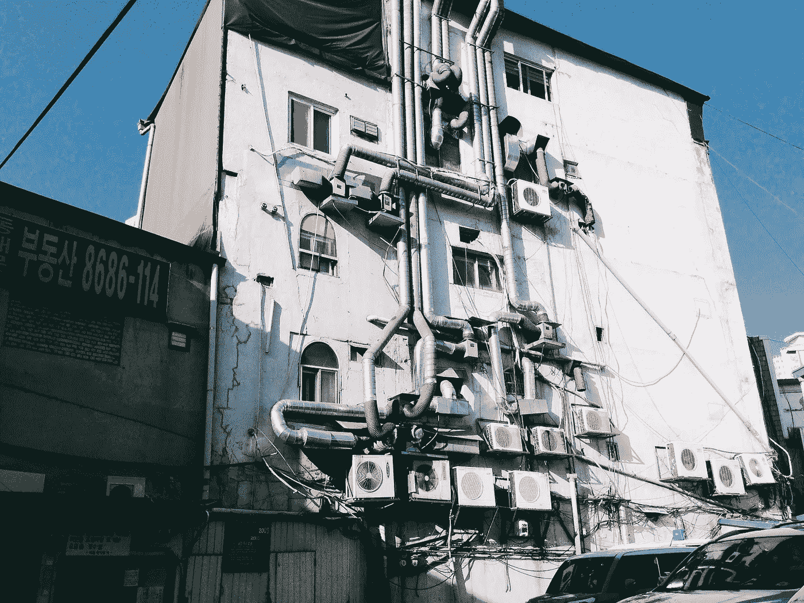

# 使用自动气象站云形成的四个原则

> 原文：<https://itnext.io/four-principles-for-using-aws-cloudformation-6205ba1458a8?source=collection_archive---------1----------------------->

# 提高可靠性和有效性的最佳实践

[林哈](https://unsplash.com/@lintin9095?utm_source=unsplash&utm_medium=referral&utm_content=creditCopyText)在 [Unsplash](https://unsplash.com/s/photos/complexity?utm_source=unsplash&utm_medium=referral&utm_content=creditCopyText) 上拍照

*“我的组织将基础设施作为代码来使用，这是一种最佳实践——通过管道部署云计算。然而，我们仍然难以及时、准确地理解、更新和部署我们的基础设施。我们如何正确地组织我们的基础设施代码和部署管道，以便基础设施更新尽可能地快速和无错误，从而最大化开发人员时间的回报？”*

如果您打算使用 AWS 本机 IaC 工具，目前实现上述目标的最佳方式是使用 AWS 云开发工具包，或 CDK。CDK 允许您利用 CloudFormation stack 部署和管理系统的所有功能，同时用 Typescript 或 Python 等通用编程语言编写基础架构规范。这种方法提供了完整编程语言的好处，包括包管理/库共享、控制流以及将基础结构抽象成可重用的类。该规范既可以合成到 JSON CloudFormation 模板中，通过 AWS cli 部署，也可以直接通过 CDK cli 部署，对您完全隐藏 CloudFormation 的细节。

尽管 CDK 有其优势，而且 CloudFormation 的可预测性和冗长性导致阅读枯燥和耗时的写作，但许多使用 AWS 的组织还没有为 CDK 做好准备。CloudFormation 是使用特定的模式作为模板编写的，因此对于基础设施工程师(他们可能不是熟练的开发人员)来说，它被认为相对容易编写和阅读。事实上，在许多组织中继续使用 CloudFormation 而不是 CDK 可以说是 DevOps 文化没有充分扎根的一个标志——例如，团队没有足够的交叉功能。

无论您是编写 CDK 代码还是 CloudFormation 模板，底层 CloudFormation 堆栈部署系统处理堆栈依赖、资源命名和删除的方法都会导致意外的部署问题。它还允许以可能导致部署时配置不确定的方式注入参数。

当使用任何 IaC 工具时，所有 DevOps 从业者都可以从遵循某些最佳实践中受益，以保持他们在正确的道路上；以下是对这些的解释，以及将这些实践应用到 CloudFormation 模板的具体建议。

这些简单的最佳实践包括:

*   **版本控制您的 IaC，并尽可能使其不可变:**版本控制是任何具有不止一次迭代的代码项目的基本要求。不变性创造了确定性和可重复性。
*   **通过自动化管道部署栈:**使用一个部署管道允许部署的可重复性和可观察性，并且只有一个真实的来源。
*   **为独立性和短暂性设计您的堆栈:**没有依赖关系的堆栈，可以轻松更新、拆除和部署到其他地方。
*   **学习并利用 CloudFormation 的固有功能(并避免其固有的缺陷):**为了获得最大的效率，要学会充分利用您的工具。

# 对 IaC 进行版本控制，尽可能使其不可变

**"…** *在几乎所有的情况下，我们的环境中比我们的代码中有更多数量级的可配置设置。因此，这是最需要进行版本控制的环境。”*

金，汉布尔，德波伊斯，威利斯，《开发工作手册》，第 117 页

让您的模板处于版本控制中。使用拉式请求、代码审查和静态分析工具来审查您的变更，然后将您的 PR 合并到 master。设置在合并时部署到主服务器的管道。这样，主分支就是所部署内容的真实来源。

对于特定于环境的值，使用硬编码到模板中的映射，而不是参数。尽可能减少参数的数量。必须为每个部署指定参数，因此拥有少量参数可以降低部署任务的复杂性。理想情况下，唯一的参数应该是您正在部署的环境的标志。如果您使用每个帐户一个环境的最佳实践，甚至可以通过将值映射到帐户 Id 来消除这个参数，帐户 id 的当前值由伪参数 AWS::AccountId 访问。

在可能的情况下，避免将值从管道外部的服务注入到模板中，如 SSM 参数。虽然便利性和灵活性很诱人，但是这种能力降低了配置的确定性，从而降低了部署时的行为。通过将您的 env 配置硬编码到映射中，您将总是知道部署的配置是什么。

这条经验法则的一个明显例外是*秘密*。在版本控制中，机密不应该包含在模板的明文中。一种解决方案是使用 CloudFormation 对存储在 Secrets Manager 中的秘密的动态引用，这些秘密可以在模板中解析。不幸的是，这些值不能在 Mappings 部分进行解析，因此必须在 Parameters 部分进行解析，或者直接作为资源属性进行解析。一般来说，最好将它们解析为参数，以便在模板中获得最大的可重用性。此外，这样每次栈更新时，秘密的最新值将作为参数注入。请记住，在 Secrets Manager 中更新注入值不会触发堆栈更新，如果将机密直接注入资源，则该资源不会更新注入值，除非堆栈更新专门更新该资源。

如果机密是作为 CodeBuild 过程的一部分使用的，另一种可能性是在到 CodeBuild 的映射中传递机密的名称，并在 CodeBuild 中使用 aws cli 从 Secrets Manager 中提取机密。请注意，如果您不小心的话，这可能会导致机密以明文形式打印到日志中。

# 通过管道部署堆栈

对于共享环境(意味着您团队的应用程序在其中运行的开发、测试和生产环境)，您应该始终使用一个由默认分支的合并所触发的管道来部署您的 CloudFormation 模板。您的单一真理报告中的单一真理分支是必要的——如果您有多个长期运行的分支，其中任何一个都可以用于部署，您就失去了对部署内容的确定性。

通过管道进行的部署允许环境的多个用户拥有关于环境和部署状态的单一真实来源(即云形成堆栈)，这是维护开发人员对堆栈的理解的关键，从而保持代码从开发到生产的连续流动。

如果您有一个仅供自己使用的沙盒环境，那么可以从本地机器将模板部署到沙盒中。

您的管道可以使用许多不同的工具来构建，但是如果您在 AWS 范例中工作，CodePipeline 是一个明显的选择。CodePipeline 管道也可以在 CloudFormation 中指定(或者更简单地说，在 CDK 中)。一般来说，你的管道应该按照升级顺序自动创建你的开发、测试和生产环境；基于单一的、受版本控制的真实来源；提供对部署在何处的内容、当前正在运行的流程以及失败的内容和原因的观察；并允许重复运行相同的部署步骤。CodePipeline 旨在轻松启用具有这些特征的流程。管道还应该包含自动化测试，这有助于确保新的变化不会降低现有的功能。

为了确保共享环境中的所有部署都由管道完成，建议不允许使用 IAM 权限进行本地部署。

CloudFormation 服务处理堆栈的状态，因此使用 CloudFormation 比使用 Terraform 更容易从本地机器进行部署。但是，如果管道是按照上面的指导方针设计的，那么您的工程师就更容易使用管道来可视化和控制部署。

# 为独立性和短暂性设计您的书库

尽可能将相关的堆栈合并成一个堆栈。栈应该是可部署资源的独立功能单元，没有外部依赖性。

消除不必要的跨堆栈依赖。导致跨栈依赖的跨栈引用是伪装成特性的 CloudFormation 陷阱之一。堆栈依赖关系使堆栈的更新变得复杂——如果堆栈 B 依赖于堆栈 A 的输出，则不可能更新堆栈 A 的输出值，并且当堆栈 B 仍然存在时，您也不能删除堆栈 A。导入由另一个堆栈生成的信息(比方说，由另一个团队拥有的堆栈，如网络团队)是一个需要解决的常见问题，跨堆栈引用一个长期存在且不经常变化的堆栈(如网络堆栈)通常是可以的。然而，这种模式也可以在没有以其他方式显式引用堆栈输出的情况下实现；例如，网络堆栈可以用它本来会输出的值创建 SSM 参数，而依赖堆栈可以注入这些参数，从而打破耦合。如果网络堆栈确实是长期的，并且输出值是静态的，那么依赖的值也可以硬编码到依赖模板中。

信任 CloudFormation 解决堆栈内资源依赖性的能力。没有必要创建一个包含应该首先创建的资源的堆栈，然后创建另一个引用这些资源的堆栈——如果它们都在同一个堆栈中，CloudFormation 将正确排序它们的创建。如果绝对必要，有指定资源之间依赖关系的语法。

如果你按照上面的建议将模板组合在一起，你的模板会变得更长——但是不要担心！为了增加可理解性，将较长的模板组织成相关资源的部分，并使用注释来标记这些部分。现代代码编辑器将允许你折叠相关代码的部分，这样你就不需要每次都滚动浏览全部代码。

不要对堆栈应用终止保护，也不要对资源应用删除保护。堆栈应该易于删除和修改。(一个例外可能是数据库堆栈，但是我们将把对有状态资源(如数据库)的 IaC 处理留到另一篇文章中讨论)。与其依赖控制来保护您的云信息资源，不如让您的员工了解云是如何工作的，并使用自动化测试、自动化备份和变更集来建立部署信心。从长远来看，这将节省部署时间。一般来说，在您的用户所承担的角色中依赖最低特权 IAM 权限，并且相关地，不要将管理员特权授予您的所有用户。如果您习惯了上下移动堆栈，您将自然地自动化和简化部署的所有方面，并更好地应对停机。

特定资源上的端接保护可能会产生比堆栈上更糟糕的部署结果。CloudFormation 可能无法识别资源是否启用了终止保护，部署可能会在反复尝试删除资源时挂起。省省你自己的麻烦吧，不要一开始就启用它。

# 了解并利用云形成的固有功能

让 CloudFormation 自动命名资源。不要为云信息资源使用自定义名称。虽然用自定义名称命名资源以使它们在特定于资源的控制台中更容易识别很有吸引力，但是如果 CloudFormation 必须替换自定义命名的资源，它不会更新堆栈。这是前面提到的部署陷阱之一，不要忽视这一点。

然而，这个命名问题并不适用于堆栈——使用堆栈名称前缀的命名约定，以便在共享环境的团队/应用程序之间保持有序。

使用 CloudFormation 控制台作为查找资源的切入点。找到您需要的堆栈，然后找到相关的资源。打破直接到资源控制台查找资源的习惯——这种习惯使您依赖于资源的自定义名称。

学习使用所有的云形成功能-！Sub！加入！Ref 和所有其他的允许您为您的资源定义提供动态值，这些值随着资源或环境的变化而变化。伪参数允许您访问堆栈上下文固有的值，条件函数允许您有条件地部署资源，或者与伪参数 AWS::NoValue 一起设置或删除资源属性。

想要一次部署到多个帐户？了解堆栈集。想要在应用模板更新之前仔细检查哪些资源将发生变化？了解变更集。CloudFormation 比它看起来更加强大和灵活，但是你必须掌握它复杂的语法才能发挥它的全部力量。(如果你正在寻找一种方法来使用 CloudFormation 的全部功能和更好的语法，CDK 就是这种方法。在下一篇文章中会有更多的介绍)。

如果您正在部署 lambdas，请使用无服务器应用程序模型。SAM 是 CloudFormation 的转换，这意味着它是一个超集，您可以在 SAM 中使用 CloudFormation 资源语法，但是 SAM 也有自己的功能和特定于无服务器部署的资源类型。在部署之前，SAM 模板被转换成 CloudFormation 模板。SAM 为 lambda 定义和部署提供了比普通 CloudFormation 更好的抽象和工具。

CloudFormation 同时支持 JSON 和 YAML。只使用 YAML。千万不要用 JSON。JSON 语法会使你的模板比需要的更长，更难阅读。

向提供该属性的资源添加基于特定功能的描述。你以后会感谢自己的。

部署堆栈时，在堆栈级别应用公共标记，而不是在模板内的每个资源上应用。这将减少模板的长度和冗余。

作者希望这些建议对你有所帮助。欢迎在下面评论。部署愉快！