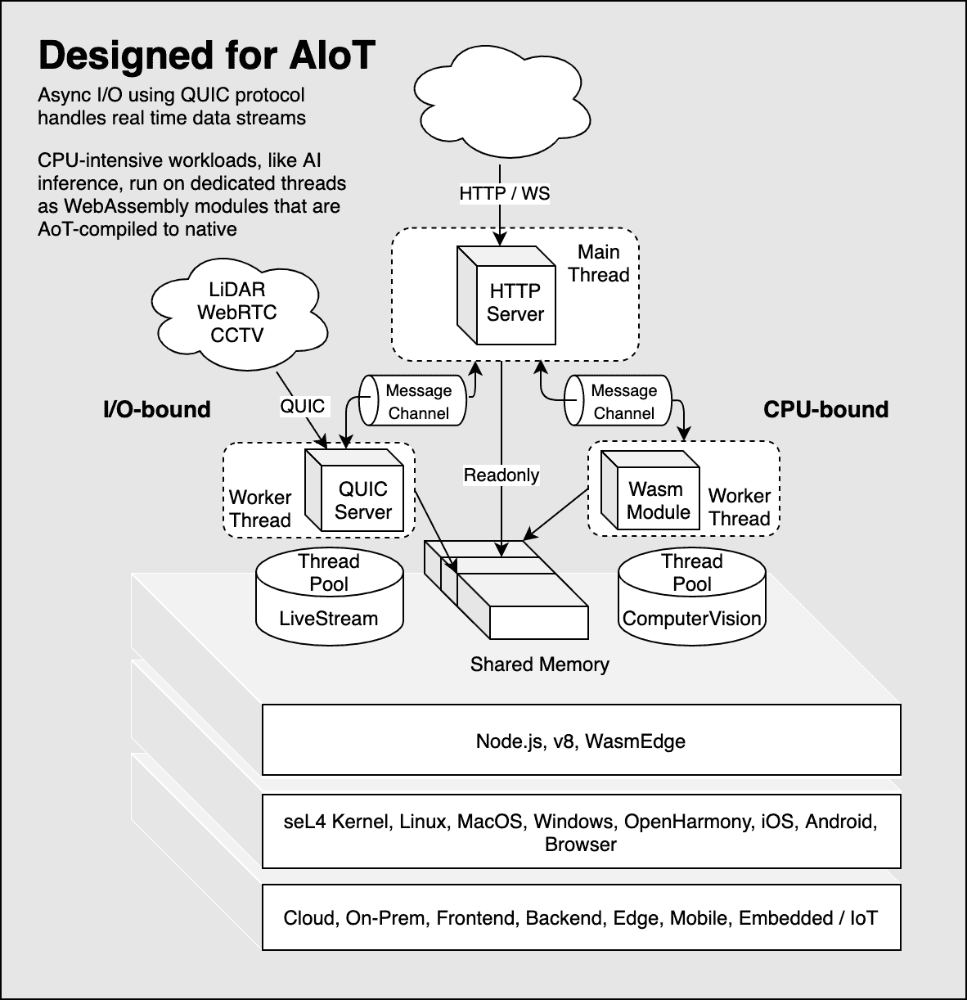

# 分形建筑

> 原文：<https://itnext.io/fractal-architecture-56a1d2d6a599?source=collection_archive---------1----------------------->

## 从原子到恒星，自对称尺度

分形建筑“视觉冲击”

首先在一个*分形架构*的核心建立另一个架构，那就是**联邦架构**。什么是联合架构？如果您熟悉 GraphQL Apollo federation，它是一个 API 网关，旨在以一种内聚而又分离的方式集成多个独立服务的模式(以及允许网飞扩展其微服务的技术)，联合架构在一个无处不在的结构中直接联合对象和数据，该结构涵盖前端、后端、移动、边缘和嵌入式/物联网，支持聚合组件的透明集成和持久性。联邦是嵌入到架构中的，而不是分层的。

联邦架构的核心是**模块联盟**——虽然两者的存在都归功于 Webpack 模块联盟及其创建者 [Zack Jackson](https://medium.com/u/9ef1379caffc?source=post_page-----56a1d2d6a599--------------------------------) 和[Tobias Koppers](https://medium.com/u/cccc522e775a?source=post_page-----56a1d2d6a599--------------------------------)——我们在这里谈论的是架构*模式*，而不是 Webpack *实现*。该模式还有另一个关键实现， **WebAssembly** 。WebAssembly (Wasm)被设计成模块化的，用作运行时而不是编译时的依赖项。运行时依赖或运行时绑定是模块联合的秘密武器。在运行时，根据需要从潜在的多个网络位置和存储库中流式传输小块源代码或中间字节码——与提前在本地存储上安装整个代码库，然后在启动时将其全部加载到内存中相比——这是使模块联邦在操作和开发方面优于传统软件的关键区别。

我在以前的文章中已经详细描述了联邦软件的优势，但是它可以归结为以下两种能力:**自部署**和非中断性，**实时更新**/安装单独开发的组件。这给了我们:

*   部署独立性(不需要当今微服务所要求的分布式架构)；
*   以及跨任何计算原语的通用部署，无论供应商如何，**消除了对部署自动化的需求**。

通用、无人值守、零停机部署是通向分形架构之路的一步，但如果没有运行时的普遍性，它是不完整的，WebAssembly 的**全面可移植性**提供了运行时的普遍性。WebAssembly 不仅提供了部署和语言独立性，不需要分发，而且与 Java 虚拟机不同，Java 虚拟机以前曾试图“编写一次，在任何地方运行”，WebAssembly 小到几乎可以在从微处理器到微控制器的任何平台上运行。因此，模块联合和 WebAssembly 让我们可以从任何来源部署到任何目标。

> 模块联合和 WebAssembly 一起让我们可以从任何源部署到任何目标。

随着摩尔定律的消亡，WebAssembly 作为低级语言的通用编译目标，允许我们将注意力从堆栈的底部转移到顶部，为我们架构的另一个关键需求，即高性能软件提供了答案。对于 AIoT 和 AR 这样的用例，以及对实时流数据执行人工智能推理的需求，糟糕的性能意味着您可以忘记其他一切。

也就是说，如果没有安全性，您可能会忘记性能。WebAssembly 在这里也提供了一个答案；与当今的容器技术相比，它可以提供更好的不受不信任代码影响的保护，而且开销要小得多，使我们能够实现大几个数量级的工作负载密度。因此，结合 WebAssembly 的可移植性、性能和无容器的、基于功能的安全性，我们几乎拥有了今天处理未来工作负载所需的一切。

但是少了什么呢？哦，是的，一座建筑。我们如何将所有这些能力结合成一个有凝聚力的系统？这里的六角形或端口适配器架构简单而有效，在组件的核心逻辑和它的实现之间加强了清晰的边界；以及组件本身之间的差异。这将我们带到自对称和镶嵌:一个运行时能够托管多个可独立部署的六边形组件，缩小后，一个无处不在的自形成网格由多个六边形主机实例组成，所有这些都按照 actor 模型通过消息传递进行集成。这为我们提供了一个分散的、全面的系统，其简单模式可在整个计算环境中重复，从组件库的微观级别到网络的宏观级别，以实现最终的可扩展设计。分形建筑是认知上可及的，补充了当今最有效的技术。更不用说，它追随了世界上最伟大、最成功的设计师大自然的脚步。

你可以在这里找到这种架构的例子。

