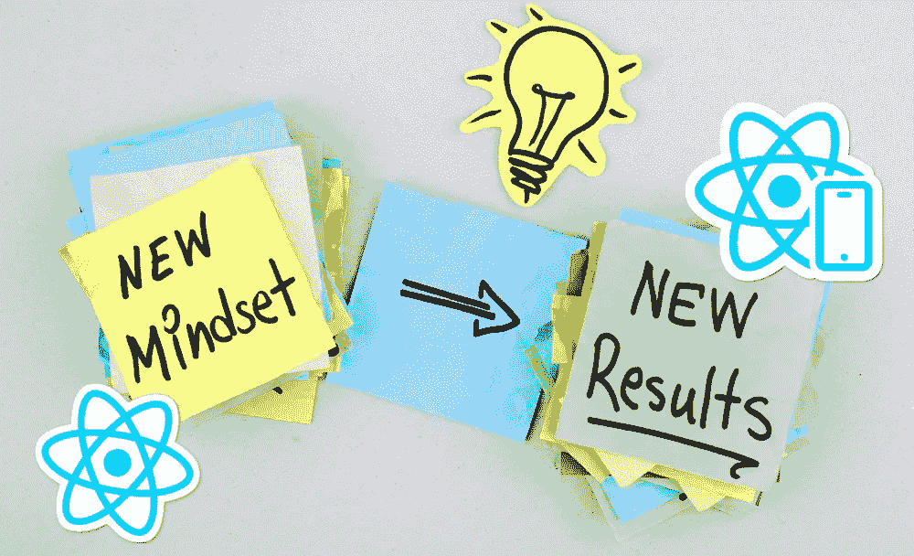
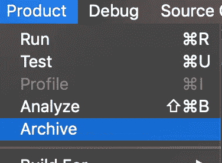
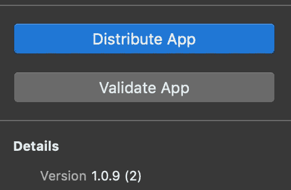

# 从 React 到 React Native——跳槽需要知道什么🚤

> 原文：<https://itnext.io/from-react-to-react-native-what-you-need-to-know-to-jump-ship-61320df96557?source=collection_archive---------1----------------------->

## 前端与移动开发——你需要知道什么来改变你的心态



最近，我一直在尝试向其他已经使用 react 或对该框架有一些基本知识的开发人员和同事解释 React 本机概念和“如何开始”，我总是收到同样的问题。它与 React 有何不同？这让我想起了两年前我刚开始的时候，所以我决定写一些关于它的东西。

当我向前端和原生开发人员介绍 React Native 时，我总是指出 React Native 对于原生开发人员来说更容易掌握。这是因为框架引入了本地平台已经构建的特性。性能问题、构建原生组件和平台的限制或构建动画更多地是特定于平台的，并且原生开发者已经熟悉它们。

换个角度想想，如果有一种语言可以让人们编写 swift，有一种 API 可以翻译这些代码来作出反应+html 代码，难道你不会是那个知道浏览器的所有局限性及其相关问题的人吗？

更容易记住的是，我们是在 React Native 的帮助下构建原生应用，而不是编写 React Native(正如 Ram N 在播客[这里](https://podcasts.apple.com/au/podcast/rnr-130-performance-that-matters-with-ram-n/id1058647602?i=1000446789325)中很好地解释的)。

所以让我来分解一下，当你跳槽时，你必须记住什么，以及一个 react dev 如何将思维方式改变为一种更自然的方式！

# 部署

显然是对的？咿呀...没有那么多。应用程序的部署尽管有人可能认为它明显不同，但许多人并不知道它或它可能有多大的不同。我们过去的想法基本上是把我们的应用程序上传到一个有域名指向它的服务器上，然后构建我们的应用程序..就是这样！在移动开发中，您必须为每个正在运行的部署指定构建版本。对于 iOS，您必须创建签名(自动取款机)。在 Android 上，你需要建立一些安全的密钥，以便能够上传你的第一个版本。最后，对于 android 来说，你可以在控制台上构建和部署你的应用，但是对于 iOS 来说，你需要一些 Xcode 的基础知识才能进行第一次发布(TestFlight 等)。

让我们来看一个 web 过程和本地过程之间的区别的例子。

## Web 部署

部署一个网络应用程序，你需要上传你所有的资产 index.html，css 文件和图像在一个服务器上，可以从一个域，如 myAwesomeWeb.com 访问。类似地，在 create-react-app 上运行 ***react-app build*** 命令来生成这些资产，过程是相同的。

## 对本机部署做出反应

在 React Native 方面，我们使用本机方式部署应用程序。记住 React Native 只是编写原生应用的工具。所有其他过程和逻辑都在本机端运行。所以我们拿 iOS 来看看区别。我假设你已经拥有 iOS 开发者许可证。



xCode 产品选项

假设我们的应用程序已经准备好了，你需要定义你的应用程序的版本和内部版本号，例如 Build: 2 和 Version 1.0.9。然后打开 xCode(如果你还没有这样做的话)并选择 Product -> Archive。这相当于 react for native 上的或 build 命令。

完成后，你就可以把这个版本上传到苹果了，就像我们通过点击两个选项把网页上传到服务器上一样。选择分发应用程序是实现这一目标的方法。



带选项的存档窗口

我想在这里指出，上传完成后，苹果会对你的应用程序运行一些自动测试，以获取应用程序商店提供的基本信息，并让你知道是否有问题。在这之后，你可以通过苹果提供的一个名为 **TestFlight 的程序用其他开发者测试你的应用。这是将应用程序发送到某处进行测试的唯一方法，而无需在您的机器上插入设备。**

*在这里需要注意的是，每个部署都需要通过苹果公司的一些验证，这需要几天时间，以便在测试阶段结束时，我们的版本可以提供给最终用户。*

# 返回应用程序的屏幕和内存状态

在网络上，这甚至不是一个问题。回去吗？？很简单。我按下返回按钮，应用程序重新加载等。事情就是这样发展的，对吗？耶啊..嗯……在这里回去是不一样的。在 iOS back 上，每个屏幕都是通过一个按钮或在屏幕上滑动来操作的，还记得吗？你可能认为隐藏后退按钮会阻止用户返回，但是再想想。你必须把你的头包在它周围，以防止或允许回去。

在 android 上有两种方式，app 上的按钮和手机上的按钮。神奇的是，android 后退按钮在一些设备上的工作方式不同，它要么以不同的方式处理手机的状态，甚至从进程管理器中杀死应用程序！😎

# 与导航的区别

在浏览器的世界里，你有网址。每次有东西改变时，你的 react 路由器就会进来处理这种改变，并把它“翻译”到一个新的页面。在本土世界，情况并非如此。导航的工作原理就像你有不同的卡片，卡片就是屏幕。我们再来比较一下。

## 网


运行中的 react 路由器示例

在 web 上，react(在 react-router 的帮助下)所做的是，当您用新的 url 更新地址时，react 路由器会“监听”该更改，并使用路由和组件交叉引用该 url。

## 反应自然

正如我在 react native 上所说，导航是一个不同的世界，你必须记住这一点。您可以为每个目的定义不同的屏幕组。这是因为用户可以添加或返回到上一个屏幕。

假设您有这 4 个屏幕

*   splash —带有登录或注册选项
*   登录屏幕
*   注册屏幕
*   主屏幕——显示用户信息的地方

你想让用户从 splash 导航到登录/注册，或者从登录/注册导航回 splash。你也不希望有人从主屏幕返回，按下返回按钮登录，比如在 android 上。你需要定义两个堆栈/卡片组，一个用于保存启动、登录和注册，一个用于主屏幕。

`**createStackNavigator({ Home: { screen: HomeScreen } });**`

`**createStackNavigator({ Login: { screen: LoginScreen }, Register: { screen: RegisterScreen }, Splash: { screen: SplashScreen } });**`

这样你可以确保用户不能回到另一副牌。

值得注意的是，在 native 上，你从牌组中定义的第一个屏幕开始，当你添加一个屏幕时，它会出现在牌组的顶部。当你回去的时候，这个也会从甲板上掉下来。这意味着第一个屏幕会在后台加载，直到您关闭堆栈或返回。

所以尽管你看到了牌的顶部，但是牌是在下面的。当您添加屏幕和子组件时，挂载会像常规 react 一样发生，但只有当您更改整个面板时，才会卸载新屏幕。您可以为多组屏幕设置不同的面板/堆叠。在这一点上，我不打算详细说明，因为我主要关注 web 和 native 之间的区别。更多关于 [react 导航的信息](https://reactnavigation.org/docs/en/hello-react-navigation.html)react 本地导航库。

# 模块与 DOM 元素(链接和为什么会这样)

在 web 中，您正在考虑 DOM 元素。DIV、A、SPAN 等是 React Native as is Native 上不存在的元素。这就是 RN api 存在的原因。当您调用 React 本机组件时，该组件将在本机模块下呈现。该模块可以是本地警报或本地卡，或者仅仅是视图。

## 网

在 web 上，你不需要 DIV，因为它已经是 DOM 的一部分了。所以当你写东西的时候

`<div> <span>Hey World</span> </div>`

## 反应自然

对于 React Native，所有定义的东西都必须通过 RN API。这就是为什么你必须“要求”你所使用的一切。因此，前面的等价形式是

```
import { Text, View } from 'react-native';

<View> <Text>Hey Native World</Text> </View>
```

您正在调用这些组件，而 React Native 调用本机模块来为您完成这项工作。“链接”来了。从 React Native 0.60 开始，你不必担心这个问题，因为它是一个自动化的过程，但是知道它是什么是很好的。链接是我们在本机部分定义的地方，在那里它可以找到一个模块并导入它，这样我们就可以在 react-native 上使用它。如果我们不这样做，系统就找不到它，当我们要使用它的时候就会崩溃。就像上面 react-native 的例子一样，当我们第一次使用**create**-**react**-**native**-**app 开始项目时，react-native 模块已经为我们链接好了。**同样的程序适用于所有其他组件

# **原生功能(推送通知、摄像头等)**

想想手机能提供多少超酷的功能。推送通知、摄像头或地理定位都是很好的例子。在网络上，尽管这些应用程序通常是为桌面用户设计的，所以并不经常使用。构建应用程序时，您必须考虑何时请求用户许可，或者如何处理这些许可，以便将来使用您的应用程序，例如，当您请求用户许可相机以更新其个人资料图片时，您每次都需要进行此检查，因为用户可能会按下不给予许可。

这些权限必须首先在本机端的应用程序中定义，以便用户和应用程序知道他们将权限授予何处。


Android 权限示例

正如你所看到的，你需要定义应用程序需要访问互联网的许可！很酷吧。

# 觉得动画像原生，忘记 CSS 动画

本机动画是通过一种机制构建的，以便识别插值等。所以 CSS 很难被翻译成这样的代码。多次运行 RN App，很明显它是在考虑 iOS 的情况下构建的。动画 API 就是这些情况之一。命名几乎完全相同。最近我在制作 Spotify 播放器动画，你可以拖动打开它。为了完成这项工作，我没有使用其他库，只使用了 RN 动画 API。由于有很多手势操作，我花了很大力气才让它工作起来，但是我的一个 iOS 开发同事给了我解决方案！是的，他还能够识别出许多关于动画的代码问题！

**加成**:还记得说导航和堆屏吗？这些屏幕的底部堆栈上的动画循环将导致您的堆栈上的任何屏幕出现问题，因为它将在后台运行，直到您更改堆栈🙌

# 模拟 vs 真实设备 vs 浏览器

我们前端开发者对浏览器很熟悉，对每一个浏览器的限制或者有浏览器+平台这样的组合的时候会出现一些问题。测试你周围的东西很容易打开一个浏览器窗口并开始测试。

当谈到本地开发时，你必须总是考虑平台(iOS、android) …平台在管理事物的方式上是非常不同的。当涉及到模拟时，它们就更不同了。虽然有些人可能认为我在测试或构建应用程序时很优秀，但在很多情况下他们是错的。模拟永远无法 100%复制真实设备的硬件。你可以发现一个应用程序在模拟器上没有任何错误，在实际设备上没有问题。这里的 Android 更复杂，差异更大，因为设备更多。此外，推送通知服务只能在真实设备上工作。所以你必须忘记简单的浏览器构建！

# 编译编译时间！

很快的一点。构建 web 应用程序时，您忘记了代码编译或编译器。嗯……当你写本地代码时，代码会在每次修改时被编译。在 React Native 的帮助下，代码不需要每次都编译，除非你链接/添加一个新的本机模块。🤔因此，你需要重新编译应用程序，根据你的应用程序大小，这需要一些时间。编译时间=煮咖啡的时间！☕

# 应用程序状态(在前台或后台推送应用程序)

还有两件事需要担心，用户在后台使用你的应用程序，还是用户在前台使用你的应用程序。这一点非常重要，但通常会被遗忘，但想想看，一个用户把你的应用程序放在后台，你希望它回来时显示一些东西或用一些东西更新你的 redux 状态。用户在你的应用程序上来回切换是很常见的，你必须经常思考这个问题。还有一件事你在网上不用担心。

> 你的应用将会和 native 一样强大。

# 全部的

用 react native 构建的应用程序会有局限性，但所有 API 都有(渐变、大规模动画等)。React Native framework 的目标不是将您与本机代码隔离开来，而是为您提供从零开始的灵活性，并在不了解您正在编写的系统的情况下非常容易地维护它，并在多个平台上发布它。但是，当你用 React Native **编写本地代码时，你知道或理解 swift 或 java** 以便理解底层机制来解决问题是非常有益的。

你有其他有用的想法吗？你觉得这些有用吗？让我知道你的想法！

> 如果你喜欢这篇文章，可以考虑点击 clap👏并且你可以随时访问[我的其他文章](https://medium.com/@panagiotisvrs)🔥