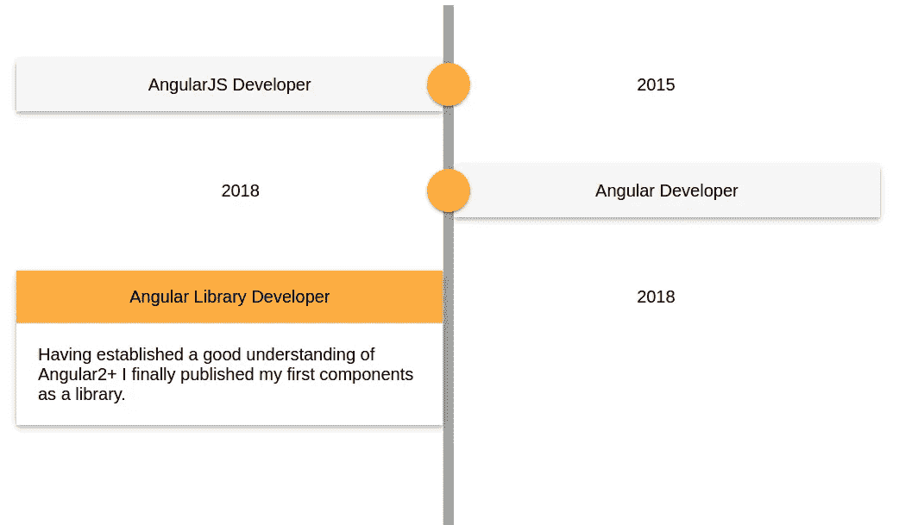

# 从编写有角度的应用程序到在 NPM 上发布一个库

> 原文：<https://itnext.io/from-writing-angular-apps-to-publishing-a-library-on-npm-99df247e151e?source=collection_archive---------4----------------------->

我开发 Angular 应用程序已经有一段时间了，在那段时间里我使用了很多 NPM 的库。当我最近在做一个项目时，我必须按时间顺序显示一些事件，我必须想出一个组件来可视化这些事件。在我实现了这个组件的基础之后，我决定在 NPM 上发布它。

[*点击这里在 LinkedIn* 上分享这篇文章](https://www.linkedin.com/cws/share?url=https%3A%2F%2Fitnext.io%2Ffrom-writing-angular-apps-to-publishing-a-library-on-npm-99df247e151e)

运行中的角度-mgl-时间线

*这篇文章将揭示我从编写 Angular 应用程序到向 NPM 发布我的第一个库的旅程中学到了什么。我打算帮助其他开发人员了解进行更改需要哪些步骤，以及需要克服哪些问题和障碍。请随意在 github 上查看我的库项目的源代码:*

 [## 臀线/角度-mgl-时间线

### 角度-mgl-时间线-角度的时间线组件

github.com](https://github.com/glutengo/angular-mgl-timeline) 

当你像我一样开始时，你已经有了一个成熟的项目。在这个项目的某个地方，将会有一个您希望发布为库的组件。

第一个任务是从应用程序中提取即将出现的库代码。为了实现这一点，您首先需要封装组件，使它们独立于应用程序中的其他组件和服务。使用输入和/或使用内容投影是一个很好的模式，也称为 transclusion。如果你对 transclusion 比较陌生，我可以推荐 sotch.io 上的[这篇文章。在我的例子中，一个 CV 组件被转换成五个新组件:](https://www.google.de/amp/s/scotch.io/amp/tutorials/angular-2-transclusion-using-ng-content)

*   原始 CV 组件。这个组件知道它从服务中获取的数据。
*   时间轴组件，时间轴条目的容器
*   时间线条目组件
*   时间线条目标题组件
*   时间线条目内容组件

包含 transclusion 后的 CV 组件模板

通过使用 transclusion，与时间轴相关的组件根本不需要知道任何关于数据或其内容的信息，而只是充当可视化容器组件。这样，我可以很容易地确定哪些组件被允许/期望作为子组件，并可以将它们放在 DOM 中的正确位置，并与它们进行交互。

下一步，新创建的组件从主模块移动到一个单独的模块，该模块被导入到主模块中。当您达到这一点时，在自己的 NPM 库中拥有时间轴组件的区别仅在于导入语句——至少从消费应用程序的角度来看是这样的。

注意:使用上面显示的方法总是有帮助的——即使你不打算以库的形式发布任何东西——因为它会产生组织良好的代码。每当一组组件被设计成只能通过输入和输出与周围环境通信时，你应该考虑将它们封装到自己的模块中。

现在是时候建立一个主要包含库代码的新项目了。我确信有很多方法可以做到这一点，但我选择坚持使用我熟悉的工具，所以我用 angular cli 创建了这个新项目。你当然可以以后再改，但我想这是为我的新图书馆想一个好名字的好时机。我想用这个名字涵盖三个方面:

*   框架:为了确保当人们在寻找 Angular 库时，我的库可以被找到，它需要以某种方式在其名称中包含 Angular。在 NPM 上，人们有好几种方式来做到这一点，例如，在它前面加上 *ngx* 、 *ng* 、 *angularx* 或仅仅是 *angular* 。我决定用后者。
*   主题:图书馆的名字也需要有它的目的，这样人们就知道它是关于什么的。由于我的组件是一个时间线组件，所以这部分名称对我来说将是*时间线*。
*   区别:除了这个名字可能已经被占用的事实之外，仅仅称我的库为 *angular-timeline* 可能意味着它是由 angular 的制作者创建的，而不是由像我这样的某个人创建的。我也想过把它叫做*角度-材料-时间线*，但是这又会让人们认为这是来自角度-材料家伙的官方的东西，而且材料在我的图书馆里甚至不是强制性的。所以我决定完全区分，以我大部分时间使用的后缀形式引入我自己的名字，那就是 *mgl* 。

所以我的库最终被命名为 *angular-mgl-timeline* 。

设置好我的新项目后，现在是时候将时间线模块代码从初始项目移到新项目了。由 angular-cli 创建的应用程序组件和模块可用于为您的库创建演示内容。我还重命名了它们，所以它们现在被称为演示而不是应用程序，但这是可选的。

既然我们的图书馆项目已经建立，我们需要找到一种方法将我们的图书馆发布到 NPM。当我们这样做时，我们只想发布我们的库模块。app / demo 模块对于通过 NPM 下载库的人来说并不重要。我想我确实明白 angular-cli 和 webpack 是如何工作的，以及它们做了什么。因此，我肯定会找到一种方法来编写一个脚本，只构建我的库代码，并准备好它，以便可以在 NPM 上发布。但这仍然需要一些时间和努力。幸运的是 Angular 社区很棒，他们开发了一个叫做*ng-packar 的工具。*在[ng-packar](https://github.com/dherges/ng-packagr)的帮助下，用 Angular TypeScript 源代码创建一个发布就绪的 NPM 包是非常容易的。[这篇文章](https://medium.com/@nikolasleblanc/building-an-angular-4-component-library-with-the-angular-cli-and-ng-packagr-53b2ade0701e)很好地介绍了这个工具。我只是按照教程中的步骤来做:首先在本地打包我的库，并通过 *npm install* 将其安装在我的原始项目中。在我确认了这个作品之后，我终于出版了《NPM 图书馆》,这就是我们的作品:

 [## 角度-mgl-时间线

### 这是 Angular 2+的动画垂直时间轴组件。支持角形材料，但不是强制性的。

www.npmjs.com](https://www.npmjs.com/package/angular-mgl-timeline) 

正如你可能看到的，我现在使用的是 0.1.7 版本。这可能会告诉你，事情并没有完全按照最初设想的方式运行——这完全没问题。如果我不与你分享这些经历，这篇文章就没有那么多帮助了，所以我开始吧:

*   特性:当您的组件最初从另一个项目中提取出来时，它的特性集很可能被限制在最初计划的用例中。当您决定将您的组件作为一个库共享时，您需要开始跳出框框思考，提供您现在可能不需要但其他用户可能会感兴趣的特性。在我的例子中，我添加了选项来禁用/启用交替布局和切换行为，并更改入口点的颜色和大小。
*   依赖性:再一次，像你的用户一样思考！当您考虑在 Angular(或任何 web)应用程序中使用 NPM 库时，通常会检查它们有什么以及有多少依赖项。如果它很大，你可能会考虑不安装它，并寻找替代品，因为这些依赖关系会扩大你的应用程序大小，或者可能导致不兼容。“好的，但是我仍然需要 Angular 和 angular-cli 添加的所有东西作为依赖项，对吗？“你可能会想。是和不是。当然，当你在你的图书馆工作的时候，你仍然需要他们。但是由于您希望您的库与大量的 Angular 版本兼容，并且您不希望它们包含在您的构建中，您将会把您期望您的库的潜在用户已经包含在他们的项目依赖关系中的任何东西移动到您的 *package.json* 的 *peer-dependencies* 部分。我花了一段时间才理解这个原则，如果对你也一样，我推荐[这篇文章](https://nodejs.org/en/blog/npm/peer-dependencies/)，它很好地介绍了对等依赖。
*   写一篇有意义的*自述。写下你的组件的输入和输出。写下允许的和必需的子组件。添加许可证。添加实时演示–stack blitz 是一个不错的选择，因为您可以共享带有实时编辑的实时演示，也可以只共享演示。这里是我的:[https://stackblitz.com/edit/angular-mgl-timeline](https://stackblitz.com/edit/angular-mgl-timeline)*

关于我的库的当前版本的另一个词:V 0.1.7 也告诉你它还远远没有完成，因为有很多潜在的改进，比如添加更多的功能或添加有意义的测试，仅举两个例子。

然而，我觉得我已经到达了一个点，我已经收集了一批值得分享的经验。我希望我的发现可以帮助一些开发者。你有过相似或不同的经历吗？请在评论区告诉我！