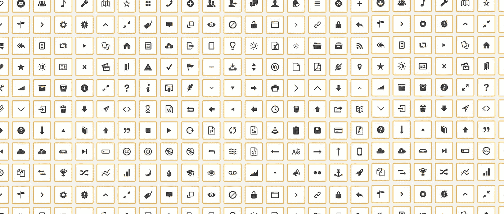

# 前端开发人员，明智地选择您的战斗。

> 原文：<https://itnext.io/front-end-developers-pick-your-battles-wisely-82463fbe2653?source=collection_archive---------2----------------------->

前端环境在不断变化，每天都有新的工具和框架出现。无论您是增强现有功能还是添加全新功能，迟早您都将面临是否对整个系统进行彻底改革的决定。

我们最近在为 [Twine](http://www.twineintranet.com/) 进行图标设置时面临这个挑战，我们必须在采用全新的方法还是改进现有方法之间做出决定。

# 四颗&一颗马星星

Twine 目前使用自定义的“图标字体”，这是一种使用符号和字形而不是通常的字母和数字的字体。这使得“键入”一个图标变得极其容易(假设你知道这个字符),而且不像图像，它允许更高层次的[可定制性](https://css-tricks.com/examples/IconFont/)和可扩展性。很容易理解为什么图标字体变得如此流行，尤其是在响应式设计之后。

然而他们也不是没有怪癖。[可访问性问题比比皆是](https://cloudfour.com/thinks/seriously-dont-use-icon-fonts/)，字形往往受制于[糟糕的渲染](http://stackoverflow.com/questions/12642991/using-an-icon-font-font-awesome-looks-a-little-blurred-and-too-bold)，字体没有优雅地降级，导致爆笑[四星一马星 bug](http://alistapart.com/blog/post/on-our-radar-four-and-a-horse-stars) 。图标字体是一个非常聪明的“黑客”——一种利用网络字体广泛支持的方式。然而，像所有黑客一样，他们缺乏专门构建的解决方案的弹性。

输入 [SVG](https://en.wikipedia.org/wiki/Scalable_Vector_Graphics) ，或者*可缩放矢量图形*。SVG 自 2000 年就存在了，但直到最近才在 web 上得到广泛的采用和支持。因为一个 SVG 只包含指导性信息，比如点和坐标，所以每个 SVG 都可以无限扩展，同时保持紧凑——非常适合图标。我们已经以多种方式使用 SVG，包括用于项目的图标，如 [BA Flying Start](http://ba-flyingstart.com/) 。Twine 跟着 suite 走是合乎逻辑的。这将提供一致性，同时让我们利用新技术积极改进我们的旗舰产品，这是一个必胜的胜利。

# 怪癖

不幸的是，很快就发现这说起来容易做起来难。虽然图标在视觉上是一个*小东西，但它们分散在大多数现代应用程序的每个页面上。改变我们的包含方法将意味着重构 Twine 的每一页(这不是一件小事)，并重新思考我们的构建过程，以允许与我们现有的设置集成。*

*我们还发现了几个有问题的跨浏览器问题。SVG 本身享有广泛的支持，但是(与传统的``标签不同)有许多浏览器特性需要解决。即使保持一致的纵横比[也会成为一个挑战](https://css-tricks.com/scale-svg/)，创建可靠的后退[甚至更难](http://maketea.co.uk/2015/12/14/svg-icons-are-easy-but-the-fallbacks-arent.html)。由于图标在 Twine 中如此普遍，测试和检查一致性可能会成为 QA 的一项巨大任务。很明显，*使用* SVG 是一回事，但是提供足够的回退和跨浏览器支持比我们最初想象的要复杂得多。*

# *采用的成本*

*通过采用一个新的工具或框架，你通常接受一个前期成本——采用将需要时间，最初会减慢速度。我们经常假设它最终会有回报，但很可能到那时一个新的工具已经出现，你将回到起点。*

*今天开始一个新的项目，我们很可能会选择 SVG 图标系统。优势很明显，支持也越来越好(也越来越一致！)按天计算。然而，当处理像 Twine 这样的大规模应用程序时，彻底检查整个系统、工作流和构建过程是没有意义的。前端开发中最困难的事情之一是选择你的战斗。每天都有新的工具、方法或框架，很容易迷失在前沿。作为专业人员，我们为自己的应用程序的稳定性和可靠性感到自豪，而采用一个不太受支持的解决方案来解决一个已经解决的问题就像是资源的错误分配。*

*在介绍新东西之前，重要的是要问:*

*   *技术有多稳定？一些插件和工具经历[不断的破坏重写](https://github.com/ReactTraining/react-router)，需要重新学习甚至重建你的应用程序的大部分。*
*   *它解决了用户(或团队)正在经历的一个真正的问题吗？*
*   *如果是这样的话，有没有一种方法可以解决这些问题，而不彻底检查整个设置？*

*就 Twine 的图标系统而言，我们认为*改进*现有设置比完全废弃更有成效。我们没有花几天时间从头开始，而是花了几个小时来解决当前设置中最大的难点。最后，我们为每个问题都找到了很好的解决方案，并设法改善了用户体验，同时利用了我们现有的设置。*

*尽管人们普遍认为，前端开发最难的部分并不是跟上现代框架和技术。这是一种纪律，让我们退后一步，评估每个新工具对用户和团队的真实价值。通常会有更大的问题需要解决，或者需要改进，这些问题可能不那么令人兴奋，但却为每个相关人员提供了更大的价值。*

## *关于浏览器*

*我们为更好、更高效的工作场所创建企业网络应用。我们已经帮助壳牌、英国航空公司和英国政府等客户提高效率，简化业务。访问我们在[浏览器伦敦](http://www.browserlondon.com)。*

**原载于 2017 年 1 月 30 日*[*www.browserlondon.com*](https://www.browserlondon.com/blog/2017/01/30/front-end-developers-pick-your-battles/)*。**