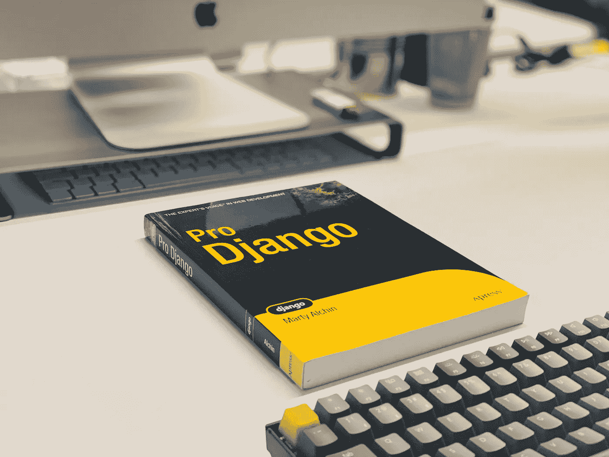

# 完全生产 Django Docker 配置

> 原文：<https://itnext.io/full-production-django-docker-configuration-75824855da03?source=collection_archive---------0----------------------->



当前的软件开发生态系统发展很快，似乎像 Django 或 Rails 这样的旧框架正在成为绝对的，但这是一个巨大的低估！Django 是我最喜欢使用的独特框架之一，因为它包含了所有的东西，只需要一些简单的配置。

假设您想要基于现有的数据库和已经预定义的模型构建一个简单的管理面板。即使项目是用 Node.js 或 Go 编写的，我也总是使用 Django 来创建一个基本的管理面板，因为不需要 UI 编码，只需要简单的 DB 和 python 配置。

另一方面，Django 在制作 API 端点方面提供了很多灵活性和简单性，特别是当 Django Graphene 问世时，我们刚刚在 https://treescale.com[用 Django 和 GraphQL 制作了完整的 API。代码维护变得更加容易和灵活。](https://treescale.com)

# Django 的码头工人？

一般来说，python 生态系统采用 Virtualenv 来运行 python 应用程序，就像当你想拥有多个 python 版本或特定库的多个版本时，你必须在不同的虚拟环境下运行它。有了 Docker，事情变得简单了一些，因为 Docker 本身是一个完全不同的环境和文件系统，包含了所有的库，正因为如此，Python 生态系统是容器化应用程序的首批采用者之一。

当涉及到真正的 DevOps 部署或资源管理的便利性时，在 Docker 中运行 Django 是真正的交易破坏者。所以不管你喜不喜欢在 Docker 容器中运行 Django，都比试图用 Virtualenv 配置它并单独管理代码传输要好得多。

# 入门指南

Django 应用程序本身只是一个结构良好的 python 文件，只有一个入口点。其余的功能，如 Django 框架本身，都存储在 python 包目录中，通常，当您基于最佳实践开发 Python 项目时，您会保存文件`requirements.txt`来管理包及其版本`pip`。

很可能你的`requirements.txt`文件看起来像这样

```
django==3.0.6
graphene-django==2.10.0
psycopg2===2.8.5
django-graphql-jwt==0.3.1
requests==2.23.0
django-cors-headers==3.2.1
```

这是我们在 Django 项目 [TeeScale](https://treescale.com) 中的一个项目，它非常简单，但这里的关键部分是保持特定的包版本定义，否则，你会弄乱你的 Docker 构建和项目执行。有时包会随着一些重大的变化而更新，当它在您的本地开发环境中时，您看不到任何问题，但是当它进入 Docker 构建或生产时，它会崩溃。我去过那里，相信我，一点也不好玩！

保存这个`requirements.txt`文件的一个关键部分是能够自动化 Dockerfile 安装过程，否则，您将很难记住在您的项目中使用哪个包来提供 Docker build 上的安装脚本。

**非常简单的 Docker 构建文件看起来像这样**

```
FROM python:3-alpine
ADD . /api
WORKDIR /api # You will need this if you need PostgreSQL, otherwise just skip this
RUN apk update && apk add postgresql-dev gcc python3-dev musl-dev libffi-dev
RUN pip install -r requirements.txtEXPOSE 8000CMD ["./manage.py", "runserver"]
```

这将用默认的启动脚本构建一个基本的 Docker 映像来运行 Django 开发服务器。继续看，这绝对不是量产版！

# 生产用 UWSGI

如果您不知道专门为可伸缩 Python 服务器执行而设计的特定工具，那么在生产中运行 Django 可能会很有挑战性。事实上，最好的 Python 服务器之一是 UWSGI，它为 Pinterest 或 Dropbox 等大型服务器提供支持！

UWSGI 基本上是一个并发 Python 执行服务器，它处理一般的 HTTP 请求，并使用 OS 的本地基于事件的网络原理模拟连接处理，而 Django 将有时间响应该请求。它非常类似于 Node.js 的请求处理原则，这为您的 Django 应用程序提供了一个巨大的机会，甚至可以每秒处理几千个请求。

**带有 UWSGI 的简单 Dockerfile 看起来像这样**

```
FROM python:3-alpine
ADD . /api
WORKDIR /api# You will need this if you need PostgreSQL, otherwise just skip this
RUN apk update && apk add postgresql-dev gcc python3-dev musl-dev libffi-dev
RUN pip install -r requirements.txt
# Installing uwsgi server
RUN pip install uwsgiEXPOSE 8000# This is not the best way to DO, SEE BELOW!!
CMD uwsgi --http "0.0.0.0:8000" --module api.wsgi --master --processes 4 --threads 2
```

如你所见，如果你的应用程序名是`api`，你可以通过指定一个像`api.wsgi`这样的应用程序模块来运行你的 Django 服务器！有趣的是，有一个特定的配置，比如要启动多少个进程来并行执行，以及每个进程要支持多少个线程。

通常我不喜欢在 docker 文件中编写这种大型配置命令，所以我在根目录下创建了一个名为`runner.sh`的文件，并添加了启动一个实际的 Django 应用程序所需的所有东西。比如运行预定义的迁移或其他必要的事情。

```
#!/usr/bin/env sh# Getting static files for Admin panel hosting!
./manage.py collectstatic --noinput
uwsgi --http "0.0.0.0:${PORT}" --module api.wsgi --master --processes 4 --threads 2
```

看看我是如何指定一个实际的`PORT`来作为环境变量运行 Django 服务器的，这样我就可以通过 Dockerfile 或 Docker 执行环境来控制它。

**因此最终的 docker 文件将看起来像这样**

```
FROM python:3-alpineADD . /api
WORKDIR /api# You will need this if you need PostgreSQL, otherwise just skip this
RUN apk update && apk add postgresql-dev gcc python3-dev musl-dev libffi-dev
RUN pip install uwsgi
RUN pip install -r requirements.txtENV PORT=8000
EXPOSE 8000# Runner script here
CMD ["/api/runner.sh"]
```

构建这个 Docker 映像后，您将获得最简单有效的 Django 服务器，用于在生产环境中运行并支持大量负载！

# 下一步是什么？

这只是一个 Django 服务器配置，但是您还将有其他微服务与您的 Django 服务器通信。这就是 Docker 配置派上用场的地方！我喜欢的设置方式是开始让 Docker 组合服务来一起配置所有东西，就像这个 API Django 服务器和 PostgreSQL docker 实例在同一个网络组中作为链接容器，这样它就不会从服务器公开暴露，但是 Django 将能够通过基本网络链接与 PostgreSQL 实例通信。即使当您运行 Kubernetes 集群时，您也可以简单地使用 Kubernetes 服务完成几乎相同的工作…无论如何，aaa！我可以谈很多关于为几乎任何应用程序设置 Docker 容器的优点，但是本文的重点是展示最简单的 Docker 映像配置，它能够运行几乎所有支持 WSGI 服务器的 Django 版本。

敬请关注，别忘了在 twitter 上关注我，中号带手柄@tigranbs🤟