# Swift 中的依赖功能

> 原文：<https://itnext.io/functions-as-dependencies-in-swift-2bc382f9475d?source=collection_archive---------1----------------------->

# 介绍

在一个应用程序中实现一个架构可能是一个挑战。有我们可以遵循的规则(坚实、干净的架构)和指导我们的模式(MVVM、MVP、MVI、Redux……)但是有时候，我们认为已经很好建立的东西应该后退一步。

最近，我在开发一个依赖于使用[高阶自由函数](https://en.wikipedia.org/wiki/Higher-order_function)的应用程序时就遇到了这种情况。

在这篇文章中，我将试着把你从点燃对高阶自由函数的渴望的火花引导到关于依赖注入的实现。

# 依赖注入

依赖注入是一种处于众所周知的软件工程最佳实践十字路口的技术:抽象和分离、单一责任、依赖倒置。它提供了灵活且可测试的实现。

本文假设依赖注入的优点已经被接受。我们将看到依赖注入和高阶函数是如何很好地结合在一起的。

# 以传统方式实现

在本文的剩余部分，我们将关注一个 UsersRepository 对象，该对象从 Rest API 中获取用户，并在返回之前过滤掉用户。为了演示的目的，这个 API 的所有端点都返回用户，但是根据获取的路由不同，返回的方式也不同。

为此，UsersRepository 将被注入一个 ApiService 协议，其目的是提供一种从 Rest 端点获取用户的方法:

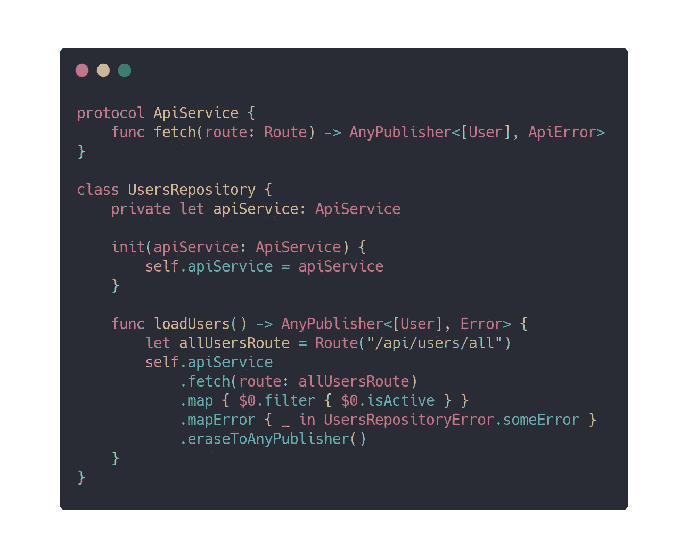

这是一个非常常见的实现。当然，在现实生活的实现中，我们会尝试通过使用泛型类型和约束来使 ApiService 更加通用和安全。

正如我在介绍中所说的，让我们再想一想…为什么是养蜂服务？

事实上，我们只是想检索用户，存储库并不关心他们来自哪里，这是一个实现细节。Rest API 是众多方法中的一种。

一种简单的方法是将 ApiService 重构为更通用的 DataProvider 协议。

但是它的定义呢？

*   “获取”功能不再有实际意义
*   “route”参数在 API 上下文之外变得无关紧要
*   “ApiError”类型太具体了

当然，我们可以找到一种方法来选择更多任何用途的名称和数据结构，但我邀请你寻找另一种方法。

# 注入功能

毕竟，用户存储库只依赖任何一个发布者来完成它的工作，对吗？

将这个发布者作为依赖项直接注入的诱惑很大，但是我们不应该这样做。直接注入意味着在注入过程的早期构建这个发布者，这可能会导致不必要的副作用:可能需要时间来构建，或者需要解决其他依赖关系？用户存储库不知道这一点，也无法对此做出假设。发布器应该只在需要的时候构建。

如果我们不能注入发布者，我们可以注入一个构建它的函数👍，并在我们方便的时候执行。

那我们试试吧。

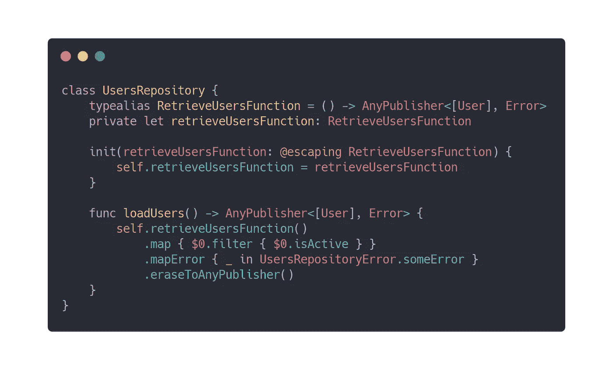

我们在这里做了什么:

*   为了便于阅读，我们声明了一个描述函数签名的 typealias
*   我们已经注入了函数
*   我们用这个函数代替了 ApiService
*   发布者签名有一点改变，从 AnyPublisher 变成 AnyPublisher 。由于错误类型的原因，我们不想在这里泄露实现细节。

到目前为止还不错…但是我们用来传递给 fetch 函数的路径呢？事实上，我们不再需要它了，因为它是特定于蜜蜂服务的；然而，我们将在本文的后面讨论这一点。

额外的好处是，我们还可以注入过滤功能，这样我们就可以根据上下文改变它的行为(例如，过滤器可能在开发、QA 或生产环境之间有所不同)。

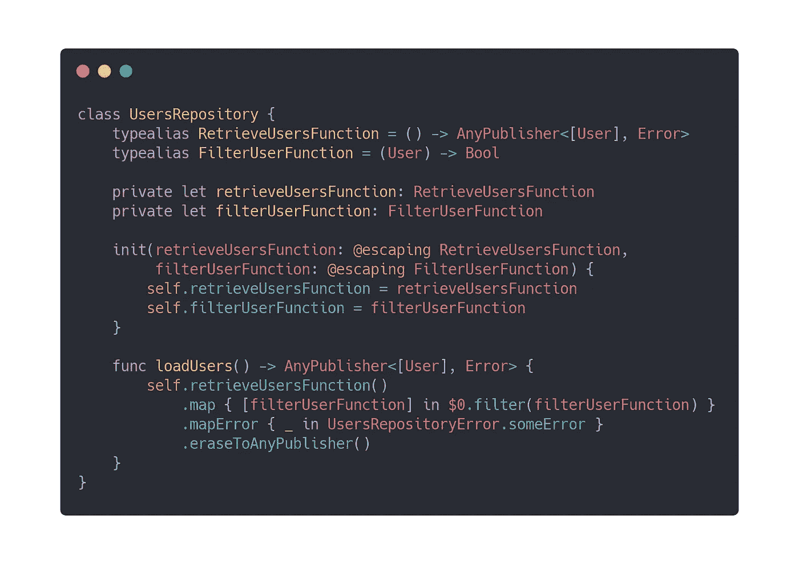

我们再次利用 typealiases 来传递函数。当使用函数作为依赖项时，这几乎是强制性的。

当我们这样做的时候，也许我们可以把我们的思考推得更远一点，向函数的系统化使用迈出最后一步。

为什么我们需要一个存储库？通常，存储库模式用于对一个实体的所有 CRUD 操作进行分组。我们可以假设一个用户存储库有几个加载、更新和删除功能。一旦实现，这些功能将需要一定数量的依赖项。我们将最终得到一个初始化器，它将所有需要的函数作为参数，然而根据我们想要完成的特性，我们可能只需要其中的一部分。这不是最佳的。

摆脱存储库意味着每个功能(加载、更新、删除……)都是自支持的，并且只被注入所需的依赖项。

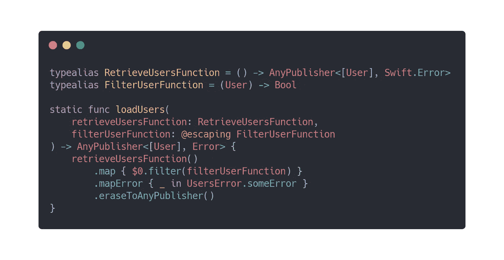

在这里，我们有一个 100%的自主功能。为了清楚起见，我们可以将整个内容包装在一个名称空间中，以缩短一些名称:

我们还可以为 filterFunction 参数设置一个默认值，以使 API 更加简洁

# 对单元测试的积极影响

让我们回到最初的 UsersRepository 实现。为了对 loadUsers 函数进行单元测试，我们必须创建一个模拟的 ApiService 来满足初始化器的需求。被模仿的 ApiService 应该能够成功或失败，以便测试 loadUsers 函数的输出。

在不幸的情况下，ApiService 也需要自己的依赖项，那么我们将被迫实现另一个模拟的依赖项。如果我们将这种策略应用到整个应用程序中，我们最终可能会得到一个复杂的模拟对象层次结构。

当使用函数作为依赖项时，我们当然仍然需要模拟，但是它们通常非常小、简单并且就在单元测试旁边定义:

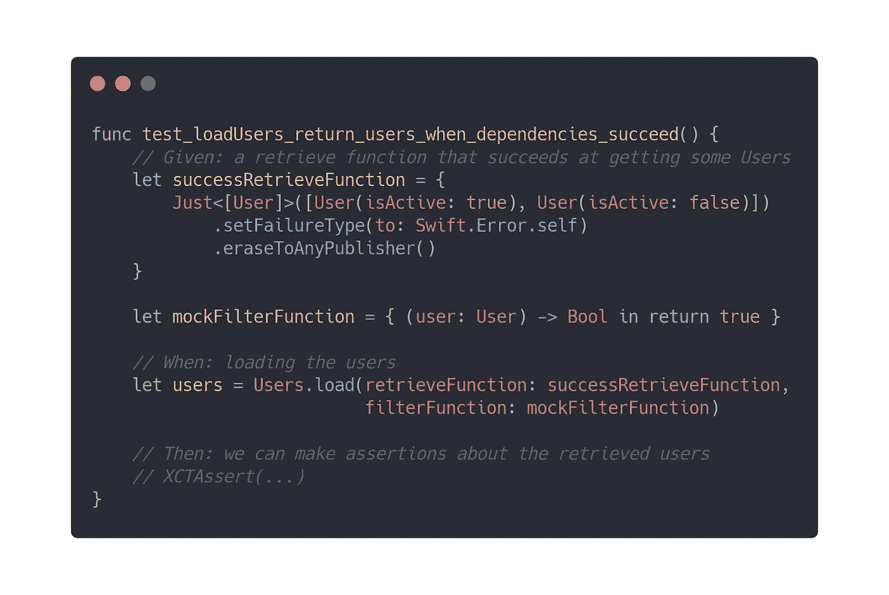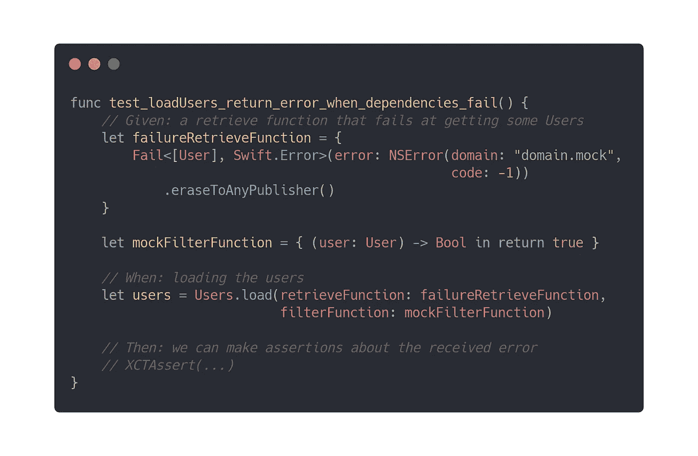

单元测试非常容易想象、编写和阅读。就个人而言，我发现这种技术是达到高(且有意义的)代码覆盖率的非常好的工具。我认为当使用 TDD 方法时，它会有很大帮助。

# 函数式编程的一个技巧

您还记得 UsersRepository 的最初实现吗:它使用 ApiService 来获取由路由定义的端点。即使这已经被注入函数带来的抽象所抹去，最终我们仍然需要提供一个可以真实检索用户的函数。依赖注入机制负责提供兼容的具体实现。

我们有一个 ApiService 供我们使用，但是获取定义与我们需要的签名不匹配:

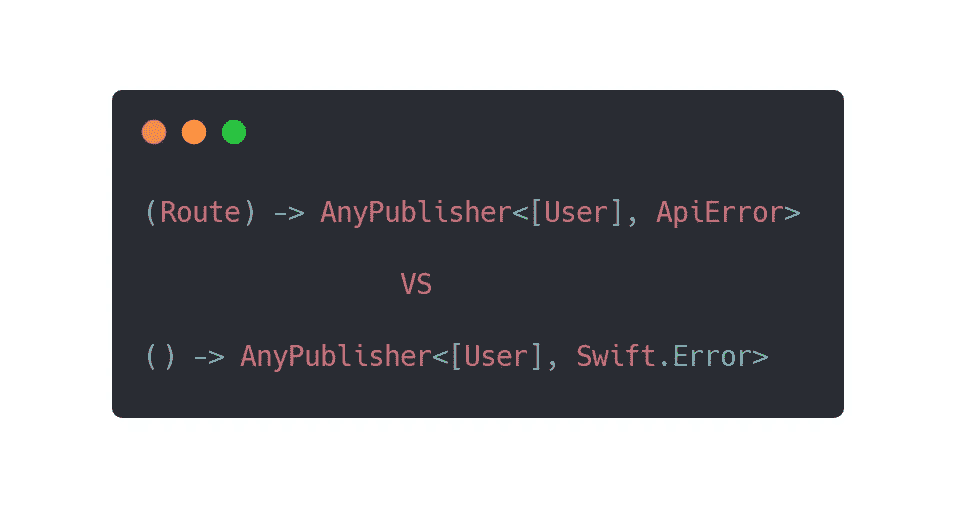

我们需要在这里执行两项更改:

*   删除路线参数
*   更改错误类型

为了删除路由参数，我们可以借用函数式编程中的一些技术，如部分函数或 currying。

这里我们将使用部分函数，尽管 currying 也是一个合理的选择。

将一个函数部分化就像对编译器说嘿，我知道这个函数的一些参数，我可以马上设置它们，但是其余的参数仍然没有定义，请给我一个只接受这些参数的函数，这样我以后就可以调用它了！

让我们看一个例子😏。

dumbFunction 是一个接受两个参数并返回一个布尔值的函数。

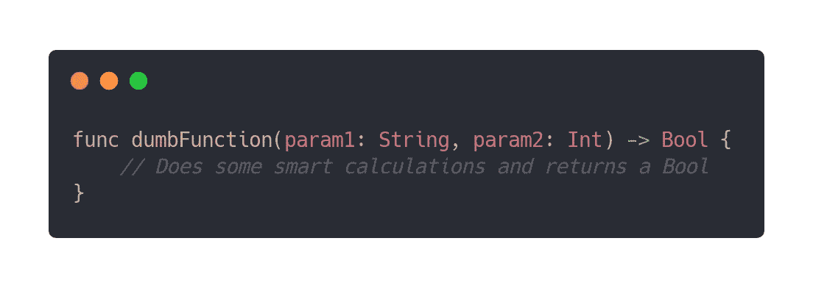

我们可以将该函数部分化，以便能够冻结第一个参数，并返回一个只接受第二个参数的函数。

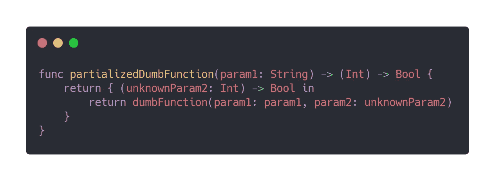

现在，我们可以使用只有一个参数的部分化对应函数，而不是使用带有两个参数的函数“dumbFunction”

这有点像如果我们执行了第一个参数的依赖注入，部分化已经捕获了它。

当然，我们不能为代码库中的每个函数编写一个局部化的版本。有一种方法可以使它具有任意数量的参数。

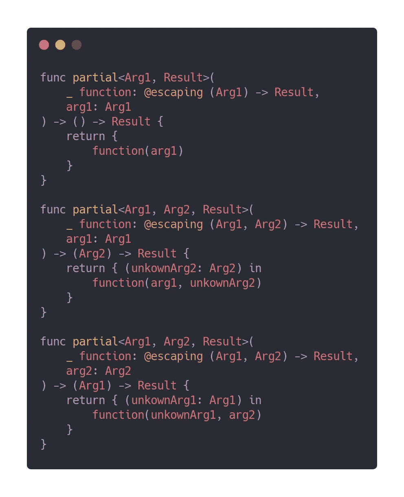

我们可以根据需要编写任意多版本的部分函数。

你明白我在说什么吗？我们从有两个参数的函数变成了只有一个参数的函数。然后，我们可以从一个有参数的函数到一个没有参数的函数！

让我们回到 *ApiService.fetch* 函数，并对其应用部分化:

我们现在有一个带有签名的部分化函数:

**()->any publisher<【User】，ApiError >** ，路线参数已被部分化捕获，将在执行**部分化功能时使用。**

我们就快成功了，我们需要做的就是隐藏 ApiError，幸运的是，Combine 可以帮助我们:

我们有我们的依赖！retrieveUsersFunction 函数签名如下:

**() - > AnyPublisher <【用户】，Swift。>错误**

我们可以在 *Users.load* 函数中注入它👌。

# 总结

## 1:使用函数作为依赖项:

## 2:使用部分化来建立依赖关系:

## 3:注入依赖性

最微妙的部分是第二部分，因为它需要一些管道和样板文件，但它应该被隔离在代码中专门用于依赖注入的特定区域，例如 Swinject 程序集。

# 结论

尽管注入传统的数据结构非常好，并且符合最佳实践，但是注入函数有两个主要好处:

*   这让我们重新认识到泄露实现细节是多么容易，以及我们如何避免它。我们对依赖关系了解得越少越好。我想这完美地说明了德米特里定律
*   这使得单元测试更容易编写、阅读和推理

到处使用函数可能会有一些不愉快的方面，比如使签名难以阅读。但这是我们可以通过使用 typealiases 轻松解决的问题。

到处使用函数也打开了函数式编程的大门。我们品尝了它的部分，但这是一个全新的世界，你应该轻轻地探索。

感谢阅读。当然，也可以随意评论，敬请关注。

# 奖励:Swinject 和函数的注入

Swinject 是 Swift 社区中一个完善的依赖注入框架。它用于注册和解析配方以构建您的依赖项。但是注册和解析函数呢？

没有什么比另一个 **(String) - > String** 函数更像一个 **(String) - > String** 函数了吧！

如果我们需要解析一个已经用同一个签名注册了几次的函数，会发生什么？

Swinject 提供了一种通过使用唯一名称来区分注册服务的方法。如果我们想在我们的 **(String) - > String** 案例中使用它，我们将得到类似这样的结果:

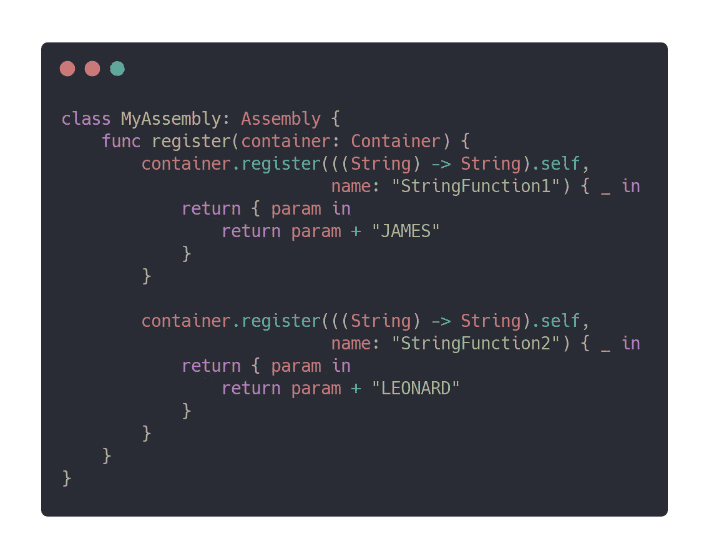

说到解决问题:

虽然这没有什么错，但读起来有点难看。我们可以用一个将函数签名和它的名字分组的协议来改进这一点:

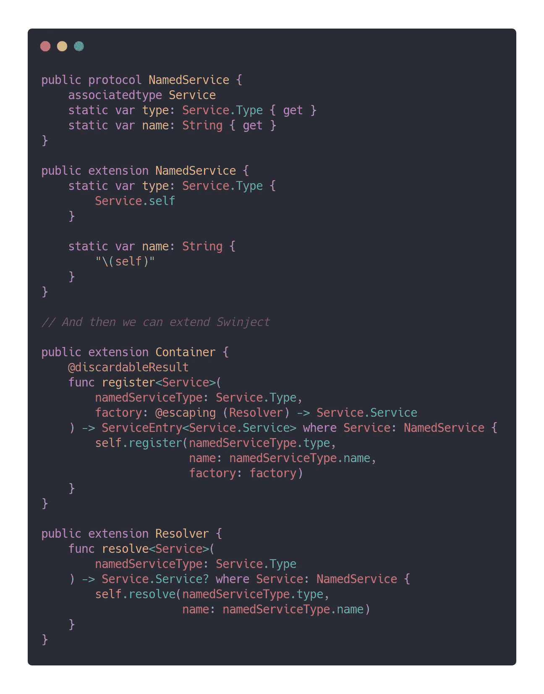

至此，Swinject 程序集现在变成了:

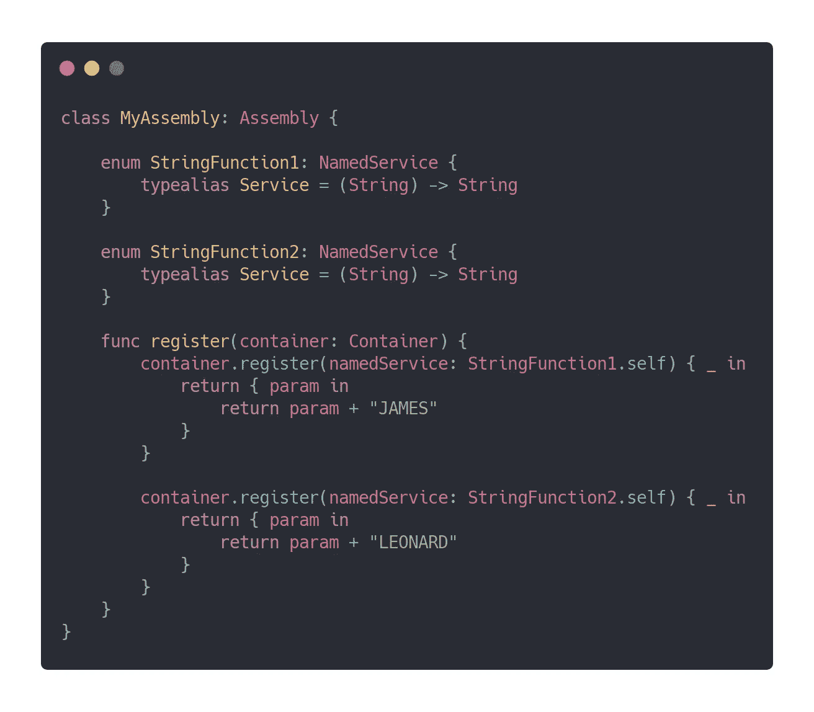

说到解决问题:

即使我们在这方面没有赢得太多，我们也让函数注册/解析看起来像任何传统的数据结构用法。它消除了注入函数中的一个痛点，这个痛点可能会阻止您尝试这种技术😏。