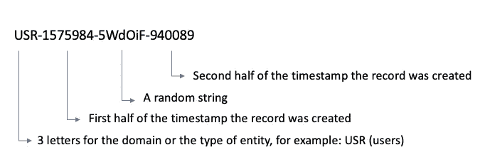

# 数据库中唯一 id 的生成

> 原文：<https://itnext.io/generation-unique-ids-in-the-database-a9a7acd0e721?source=collection_archive---------1----------------------->

## 一种简单的方法使它们更具可读性和性能

当后端向数据库发送插入新文档的请求时，可以指定标识符的值(Mongo 中的 _id 字段),也可以将该任务委托给数据库本身。

当您不指定 id 时，数据库会生成如下内容:

*   ***5df 120015 f1d 26010 EC 56 b 01****(Id 取自 MongoDB)*

根据我的经验，您会经常在 DB 客户机、NodeJs 日志或浏览器中查看数据库记录。所以，id 不会仅仅通过查看就给你任何关于实体的信息。

另一种方法是用函数生成 id，并给它们一些标准代码，使它们可以识别。

## id 一代

那么，如果您使用以下形式的 id 会怎么样:



id 生成代码

因此，这种方法的好处是，您知道实体**是一个用户**，它是在时间戳 ***1575984940089*** 创建的，相比之下***5df 120015 f1 d 26010 EC 56 b 01***则没有这些信息。

就“唯一性”而言，时间戳为毫秒级，随机字符串允许 62 个^ 6 种不同的组合(56.800.235.584 种组合)。

因此，对于每种类型的实体，你每毫秒有 560 亿种选择(听起来很独特😎)

## 生成 id 的代码

这是一个 javascript 实现。

```
**function** randomStr(strLength) {
 **const** chars = [ …,'abcdefghijklmnopqrstuvwxyzABCDEFGHIJKLMNOPQRSTUVWXYZ0123456789' ];
 **return** [ …Array(strLength) ]
 .**map**(() => chars[Math.trunc(Math.random() * chars.length)])
 .**join**(‘’);
}**function** uid(options = {}) {**const** now = **String**(Date.now());
 **const** middlePos = **Math**.ceil(now.length / 2);
 **let** output = `${now.substr(0, middlePos)}-${randomStr(6)}-${now.substr(middlePos)}`;// We add a 3 letter CODE in front of the id to make it more recognizable
 **if** (options.prefix) output = `${options.prefix}-${output}`;**return** output;}
```

要运行该代码片段:

在 CodePen 中生成 UID

## 性能优势

什么？是的，当您使用在实际插入文档之前运行的函数生成 id 时，您可以首先在客户机(浏览器)中运行此代码，然后将其作为参数发送到服务器。

因为在调用服务器之前就有了 id，所以可以“**乐观**”:

*   你创建 id。
*   您将新实体添加到本地存储中(使用 Redux、MobX 或仅添加到 JS 对象中)。
*   重新渲染受新实体影响的组件。
*   然后，您将请求发送到服务器。
*   如果服务器报告了任何不一致，那么您就逆转上面的过程(但是 99.9%的情况下请求应该成功，因为我们说您是“乐观的”)。

您的用户会认为这种方法就像插入是瞬间完成的一样，并且只有在您首先生成 id 的情况下这才是可能的(至少您使用了一些临时 id，然后与服务器值一致，但是这样做有什么意义呢？)

希望这对你有帮助。

来自智利的欢呼！！🇨🇱