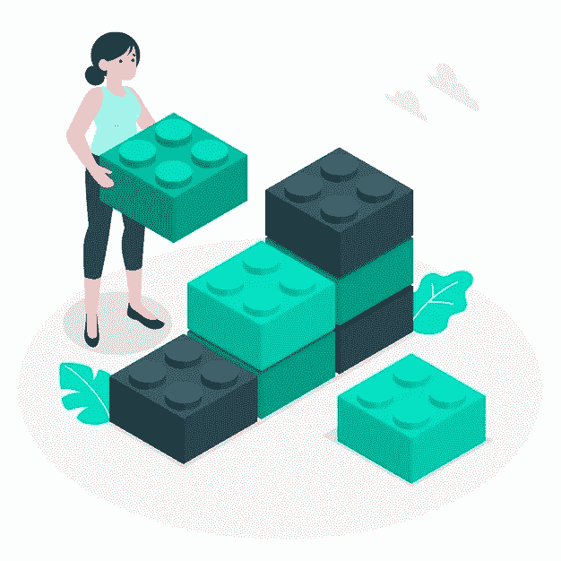

# 通用 UI 组件开发

> 原文：<https://itnext.io/generic-ui-component-development-33cecd7a7139?source=collection_archive---------1----------------------->

在我们应用程序开发的某个阶段，需要做出一个决定。创建组件库。这个决定被所有人接受，开发就开始了。我们从产品/设计给出的要求开始，然后创建我们认为是整个组件的东西。但是随着时间的推移，组件的需求会增加，结果是复杂性增加，可维护性降低。大多数设计师/产品不知道/不关心开发过程，将每个元素视为一个独特的实例，因此他们可以随意提出疯狂的要求。



对于正在进行的示例，我将使用一个按钮组件。我在这个例子中使用了 Angular，但是这个模式可以在每个框架中使用。

```
@Component({
  selector: 'demo-button',
  template: `
        <button (click)="onClick.emit($event)">
          {{text}}
        </button>
  `,
})
export class ButtonComponent {
  @Input() text: string
  @Output() onClick: EventEmitter<any> = new EventEmitter<any>();
}
```

每个按钮组件都是这样开始的。这太神奇了，正如预期的那样有效。它得到一个文本，将出现在按钮上，并有一个点击，将发出给消费者
然后设计者要求添加一个加载指示器…结果我们添加了加载参数和状态。

```
@Component({
  selector: 'demo-button',
  template: `
        <button (click)="onClick.emit($event)">
          {{loading ? 'loading...' : text}}
        </button>
  `,
})
export class ButtonComponent {
  @Input() text: string
  @Output() onClick: EventEmitter<any> = new EventEmitter<any>();
  @Input() loading: boolean
}
```

有趣的部分开始了。
为什么按钮组件需要知道按钮内部的文本？答案是:不应该。
按钮组件为我们提供了一种公认的行为和设计，一旦我们同意使用该组件，我们就会接受它。根据定义，内容是可替换和可改变的，更重要的是，组件并不在乎，**因为它对它没有影响。**

```
@Component({
  selector: 'demo-button',
  template: `
   <button (click)="onClick.emit()">
     <ng-content></ng-content> <--- will put what ever i want inside
   </button>
  `,
})
export class ButtonComponent {
  @Output() onClick: EventEmitter<any> = new EventEmitter<any>();
}

// consumer component// just text
<demo-button>
   {{loading ? 'loading' : text}}
</demo-button>// example of passing on a different component
<demo-button>
    <demo-other-component></demo-other-component
</demo-button>
```

现在我们有了一个通用的按钮，消费者可以放置他们想要的任何东西，而不局限于特定类型的内容，这将使我们在未来更快地开发 UI 元素，并保持我们的组件简洁明了。

接下来的问题是…“如果我们通过了所有的艰苦工作，为什么我们需要一个共享的组件？”
好问题，共享组件有两个主要议程。
1。强制系统化的设计和行为
2。有一个内部处理的单一作业，该作业在某个时候会向消费者更新信息。

该组件将有包装元素，这将创建一个商定的布局。(参见下面的代码)不管内容如何，我的按钮将总是填充 5px 和背景红色。任何附加内容都将受到该组件强制设计的影响。我们可以定义不同的尺寸和响应布局，以保持我们接受的设计。

```
@Component({
  selector: 'demo-button',
  template: `
        <button (click)="onClick.emit($event)" style="padding: 5px; background: red">
            <ng-content></ng-content>
        </button>
  `,
})
export class ButtonComponent {
  @Output() onClick: EventEmitter<any> = new EventEmitter<any>();
}
```

## 内部处理的特定用例

所有我们的按钮组件需要做的，就是告诉消费者它被点击了(在我们的例子中非常简单)，其他都不重要，其他都不重要。我们可以做的是将修改单个作业的组件助手(修改器)传递给按钮。例如:禁用

```
@Component({
  selector: 'demo-button',
  template: `
        <button
         (click)="!disabled ?? oClick.emit() : void"
          style="padding: 5px; background: red"
         [ngClass]="size">
            <ng-content></ng-content>
        </button>
  `,
})
export class ButtonComponent {
  @Input() disabled: boolean; <--- helper
  @Input() size: ButtonSize = ButtonSize.Default <--- ButtonsSizes
  @Output() onClick: EventEmitter<any> = new EventEmitter<any>();
}
```

## 这与实践无关，这是一种心态

组件是为使用而构建的。我们鼓吹可重用性，但实际上我们开发的是一个特定的用例，其结果是不可重用的。按钮是一个简单的例子，但是组件可以是带有移动部件的复杂元素(仍然有一个任务)，但是想法是一样的。
我想重申之前的第二点。

> 共享组件必须有一个在内部处理的单一作业，该作业将在某个时候用信息更新消费者。

如果我们理解了什么是单一的工作，我们就可以把工作要求和其他事情分开。
任何与单一任务无关的事情，都不应该由组件负责(比如我们例子中的文本)，而应该向上一级处理。
只有这样，我们才能制造出真正可重用的、易于使用、阅读和维护的组件。