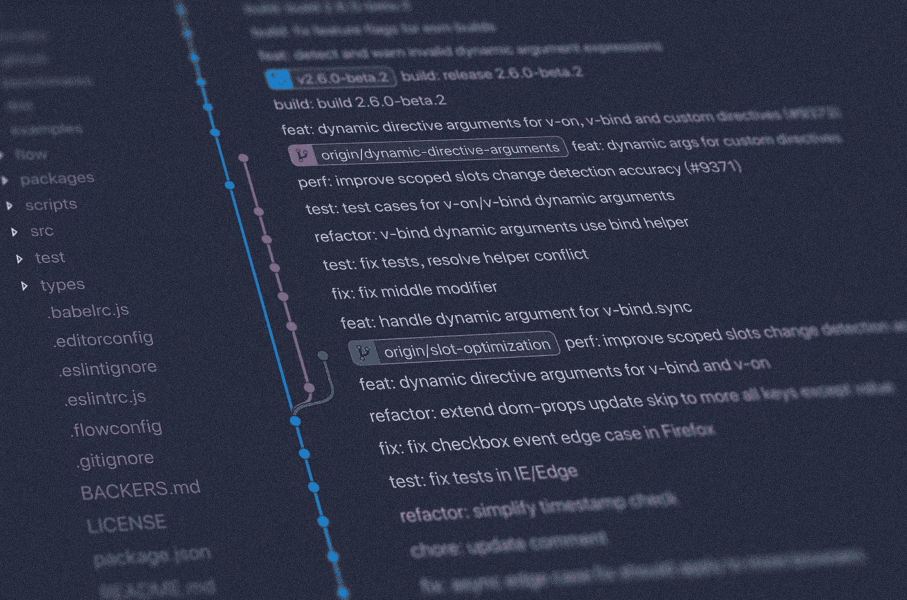

# 新人的 Git 概念—第 3 部分:提交、记录和修改

> 原文：<https://itnext.io/git-concepts-for-newcomers-part-3-commits-log-and-amend-6dcbb05370c?source=collection_archive---------2----------------------->

这是我的初学者 Git 概念系列的第三篇文章。如果你错过了[关于什么是 DVCS 的第一篇文章](/git-concepts-for-newcomers-part-1-what-is-a-dvcs-bc873076c424)，或者第二篇关于[不同区域的 Git 库的文章](/git-concepts-for-newcomers-part-2-git-repository-working-tree-and-staging-area-a2e720bf3528)，请先阅读这些文章。

*   第一部分—什么是 DVCS:[https://it next . io/git-concepts-for-new York-part-1-What-is-a-dvcs-BC 873076 c 424](/git-concepts-for-newcomers-part-1-what-is-a-dvcs-bc873076c424)
*   第 2 部分—工作树和暂存区:[https://it next . io/git-concepts-for-new York-part-2-git-repository-Working-tree-and-staging-area-a2e 720 BF 3528](/git-concepts-for-newcomers-part-2-git-repository-working-tree-and-staging-area-a2e720bf3528)
*   第三部分—提交、记录和修改:[https://medium . com/@ dSebastien/git-concepts-for-new York-part-3-Commits-log-and-amend-6 dcbb 05370 c](https://medium.com/@dSebastien/git-concepts-for-newcomers-part-3-commits-log-and-amend-6dcbb05370c)
*   part # 4-Branches:[https://medium . com/@ dSebastien/git-concepts-for-新人-part-4-Branches-52 aee 1 da 4385](https://medium.com/@dSebastien/git-concepts-for-newcomers-part-4-branches-52aee1da4385)



图片由 [Yancy Min](https://unsplash.com/@yancymin) 提供

在本系列的第三篇文章中，我们将探索如何用 Git 创建和修改提交，以及如何查看提交日志。

# 什么是提交？

**提交**在 Git 中(以及任何版本控制系统，真的)超级重要。为了实际保存您的更改，您需要创建提交(即提交您的代码)。如果您不*提交*您的更改，那么它们可能会在任何时候丢失(例如，因为您的工作树中的错误操作或者如果您覆盖了您的临时区域的内容)。提交是 Git 的基本工作单元。

此外，没有提交，你将无法与他人*分享*你的作品。

在上一篇文章中，我已经解释了 Git 的 staging area 是如何工作的，并且我已经告诉你添加到这个区域的所有东西都是由 Git 跟踪的。

如果您还记得，在使用了`git add`命令之后，我们的“hello.txt”文件被添加到了临时区域(也就是索引)。一旦完成，`git status`命令告诉我们以下内容:

正如我在上一篇文章中所说的，Git 认为暂存区的任何部分都是接下来应该提交的内容。在上面的示例中，“hello.txt”文件已经准备好提交，因为它是临时区域的一部分。

我们一起看到 Git 的暂存区存储了添加到其中的文件/行的“快照”。但是我坚持认为，即使您可以从暂存区恢复文件(就像我们在上一篇文章中所做的那样)，它也不过是一个*临时*工作区；这是*而不是*你实际上*一劳永逸地保存*你的工作。

staging area 只是一个工具，你可以用它来保存你的工作的快照和组装*提交。“组装”这个术语在这里非常重要。您可以选择在下一次提交中包含哪些文件，甚至哪些行，从而允许您创建仅包含相关内容的提交。*

但是将文件添加到暂存区/索引*不会*创建提交，它只会*准备*您的下一次提交；记住这一区别很重要。要创建提交，您需要使用`git commit`命令；我们很快就会知道了。

一旦基于登台区中的内容创建了提交，该内容就被添加/移动到存储库(我们在上一篇文章中讨论过的第三个区域)，并因此存储在。git "目录(即存储库)。因此，一旦创建了提交，暂存区将为空。

一旦创建了提交，即使工作树被完全删除(除了“.git 文件夹)，即使临时区域被清除，您的内容仍然可以被恢复。

您可以将提交视为存储在 Git 存储库中的长期且稳定的快照。提交是稳定的，因为 Git 永远不会修改提交*的内容，除非您明确要求它修改*(我们将在本文后面看到如何修改)。

# Git 日志

在我们创建第一个提交之前，让我们首先发现**提交日志**。了解它是很有用的，因为你会一直用到它。

提交日志是 Git 存储库中所有提交的日志，首先显示最近的提交(除非您添加参数来更改内容/顺序)。

要显示日志，可以使用`git log` [命令](https://git-scm.com/docs/git-log)。

下面是一个来自官方文档的提交日志示例:

```
$ git log
commit ca82a6dff817ec66f44342007202690a93763949
Author: Scott Chacon <schacon@gee-mail.com>
Date:   Mon Mar 17 21:52:11 2008 -0700

    Change version number

commit 085bb3bcb608e1e8451d4b2432f8ecbe6306e7e7
Author: Scott Chacon <schacon@gee-mail.com>
Date:   Sat Mar 15 16:40:33 2008 -0700

    Remove unnecessary test

commit a11bef06a3f659402fe7563abf99ad00de2209e6
Author: Scott Chacon <schacon@gee-mail.com>
Date:   Sat Mar 15 10:31:28 2008 -0700

    Initial commit 
```

正如您在上面看到的，默认情况下，每个提交都列出了:

*   **提交哈希:**唯一标识本次提交，对应提交内容的哈希
*   **提交作者**
*   **创建日期/时间**
*   **提交消息**

如果我们把(大量的)技术细节放在一边，那么您现在知道了提交由最重要的信息组成；除了实际的修改。

在后面的文章中，我将分享一些 bash 别名，您可以使用它们来查看更实用的日志。

如果您查看我们的测试存储库的提交日志，就不会这么有趣了:

```
$ git log
fatal: your current branch 'master' does not have any commits yet
```

事实上，因为我们还没有创建一个提交，所以这里没什么可看的。让我们现在就解决这个问题！

您可以在这里了解更多关于 git log 命令[的信息。](https://git-scm.com/book/en/v2/Git-Basics-Viewing-the-Commit-History)

# 如何创建提交

一旦使用`git add`命令进行了修改，创建提交就非常容易了；你只需要调用`git commit` [命令](https://git-scm.com/docs/git-commit)。这个命令是你最常用的命令，还有`git add`。

像大多数 Git 命令一样， [git commit](https://git-scm.com/docs/git-commit) 有许多选项。这里我们只探讨几个基本的。

继续从您的工作树中执行`git commit`命令(假设您仍然将我们之前所做的修改添加到登台区):

```
git commit
```

一旦您这样做了，Git 将打开默认编辑器(在我的例子中是 vim)让您输入**提交消息**。提交消息应该描述您提交到存储库的一组变更:

完成后，保存文件并关闭编辑器。之后，Git 将在存储库中实际创建提交:

```
$ git commit
[master (root-commit) d0f8595] Added the hello world example
 1 file changed, 1 insertion(+)
 create mode 100644 hello.txt
```

正如你在上面看到的:

*   Git 创建了一个 commit，它改变了一个新创建的文件:“hello.txt”
*   该提交有一个特定的消息:“添加了 hello world 示例”
*   那个 commit 有一个特定的 hash: d0f8595(注意实际的 hash 要长得多，但是 Git 通常只显示短的 7 个字符的版本；你可以在这里[了解更多信息](https://stackoverflow.com/questions/43665836/in-git-what-is-the-difference-between-long-and-short-hashes#:~:text=A%20short%20hash%20is%20just,c26cf8af130955c5c67cfea96f9532680b963628%20you%20were%20looking%20for.&text=The%20short%20hash%20shows%20the%20first%20seven%20characters%20of%20the%20hash.)

既然您的提交已经创建，您可以使用`git status`来查看状态:

```
$ git status
On branch master
nothing to commit, working tree clean
```

既然已经创建了提交:

*   我们的工作树是“干净的”；它与存储库的内容完全匹配
*   暂存区是空的，因为我们放在那里的快照现在已经作为提交的一部分被移动到存储库中

太好了！最后但同样重要的是，我们现在可以再次查看提交日志:

```
$ git log
commit d0f8595d422d8c9dd5c55afd88a3052b19af6e5a (HEAD -> refs/heads/master)
Author: Seb <[seb@developassion](mailto:seb@dsebastien.net).be>
Date:   Tue Jun 2 15:15:17 2020 +0200Added the hello world example
```

这次的日志更有趣；我们现在看到我们的提交确实已经被添加到 Git 存储库中，因此安全地存储在。git 文件夹。

附注:在日志的第一行，您可以看到我们提交的完整散列。之后还有一个“隐晦”的提及:`(HEAD -> refs/heads/master)`。我会在下一篇文章中解释清楚，当我们发现什么分支是 T8，它们是如何工作的，以及分支的“头”是什么。

额外的好处:如果你想在头脑中已经有一个好的心智模型，那么接受我们的提交已经被添加到“主”分支的想法，因为它是当前被检出并显示在我们的工作树中的分支。除非我们切换到不同的分支，否则我们的提交将是该分支的一部分。此外，通过创建提交，我们已经向前移动了分支的头部(也称为 *tip* );它现在指向我们新创建的提交。这意味着，如果我们切换到不同的分支并再次签出主文件，我们将处于历史中完全相同的点。如果这还不清楚，不要担心；很正常。我将在下一篇文章中回到这个问题。

这里有一些关于`git commit`命令的有用提示:

*   你可以这样直接传递消息:`git commit -m 'Insert your message here'`
*   您可以添加`— dry-run`参数来查看提交将会做什么，而不用实际去做
*   如果你意识到你犯了一个错误，你可以在创建一个提交后立即使用`git reset` [命令](https://git-scm.com/docs/git-reset)。这将删除提交并将相应的更改放回临时区域。请注意，只有在分支中至少有两次提交时，该命令才会起作用。你可以在这里找到更多关于这个[的信息](https://devconnected.com/how-to-undo-last-git-commit/)
*   可以用`git commit --all`让 git 自动检测修改/删除(不是新的！)文件，将它们添加到索引中，然后提交它们；一步到位。虽然，我真的不建议这样。精确地选择应该添加的内容会更安全、更干净，这样您的提交会更干净、更切题。当你迭代你的代码时，这个选项可能是有用的，但是如果你真的使用它，那么你绝对应该在与他人分享之前重做你的提交；否则你会把你的 Git 日志弄得一团糟(这是一个非常普遍的问题)
*   您可以使用`git commit --patch`交互地选择提交中包含的内容。我提到了它，但实际上我建议使用可视化 Git 工具，它对用户友好得多
*   您可以使用`— no-verify`标志绕过预提交和提交消息挂钩。我们将在本系列的后面学习钩子，因为它是一个高级主题。在创建提交之前具有自动行为的项目中，或者在验证提交消息符合特定约定时，该标志通常是有用的，因为在某些情况下，您不需要/不希望整个 shabang 运行

好了，现在继续创建数百万个提交。不要担心，在你工作的时候，尽可能多的创建一些。正如我将在接下来的文章中向您展示的，您可以使用 Git 轻松地修改/重组/重新排序/等等您的提交(稍后我会告诉您一些注意事项)。

# SVN 提交与 Git 提交

对于那些来自 SVN 的人，我想花点时间来澄清一些你们可能对 Git 提交的误解。

Git 提交和 SVN 提交根本不是一回事。以下是一些需要记住的主要区别:

*   使用 SVN，提交是在中央存储库上创建的，并且需要它可用才能提交；Git 就不是这样了。Git 提交是在本地创建/存储的，不依赖于任何其他系统/服务器/存储库的可用性
*   SVN 跟踪差异(即，提交代表前一版本和下一版本之间的差异)，而 Git 创建整个文件的快照。如果您创建了 3 个对同一个文件的不同修改的提交，Git 实际上将保存该文件三次。这对性能非常有益，因为 Git 不需要像 SVN 那样通过一次又一次地应用 diff 来重组文件。相反，它总是有完整的文件随时可用。不要担心性能；它工作得非常好。顺便说一下，这种基于快照的设计对 Git 中的许多事情都有巨大的影响(例如，在分支之间切换时的性能)

# 用修正来修正错误

如果你创建了一个提交并意识到你犯了一个错误；例如，如果您忘记在提交中添加一个文件，那么您可以使用`git commit`的`--amend`标志轻松修改最后一次提交。

为此，您只需使用`git add`发布您的附加变更(或者取消先前变更的变更)。然后执行`git commit --amend`。

让我们试一试。目前，你的工作树应该是干净的。让我们对“hello.txt”做一些修改:

```
$ echo "Git is cool" >> hello.txt
$ cat hello.txt
Hello world
Git is cool
```

现在，检查新状态:

```
$ git status
On branch master
Changes not staged for commit:
 modified:   hello.txtno changes added to commit
```

然后，将更改添加到索引中，并再次显示状态:

```
$ git add -A
$ git status
On branch master
Changes to be committed:
 modified:   hello.txt
```

好的，在这一点上我们可以创建一个新的提交，但是我们想要的是更新我们之前的提交，以包含我们的阶段性变化。我们可以使用`--amend`标志轻松做到这一点:

```
$ git commit --amend
[master 7750f16] Added the hello world example
 Date: Tue Jun 2 15:15:17 2020 +0200
 1 file changed, 2 insertions(+)
 create mode 100644 hello.txt
$ git status
On branch master
nothing to commit, working tree clean
```

如您所见，工作树现在又干净了。如果我们要求 Git 向我们展示由我们的提交引入的差异，我们可以看到我们的新行确实包含在我们的提交中:

```
$ git log -c
commit 7750f167330c17ae08193cbe03d5c5c89a91bb4c (HEAD -> refs/heads/master)
Author: Seb <[seb@d](mailto:seb@dsebastien.net)evelopassion.be>
Date:   Tue Jun 2 15:15:17 2020 +0200Added the hello world examplediff --git a/hello.txt b/hello.txt
new file mode 100644
index 0000000..cf3b027
--- /dev/null
+++ b/hello.txt
@@ -0,0 +1,2 @@
+Hello world
+Git is cool
```

很酷，对吧？

修复提交非常有用，但是在这样做的时候，您必须始终保持谨慎，因为它确实会改变您的 git 存储库的历史。

还有一些其他 git 命令也可以重写历史；我将在后面的系列文章中告诉您这些内容。

改变历史本身并不是一个问题，但这是你丢失改变的一种方式。老实说，通常有一些方法仍然可以恢复你的数据，但是这样做可能会变得很难。

更重要的是，如果相关的分支/提交已经被其他人共享，你永远不应该重写 Git 存储库的历史，因为这会导致各种令人讨厌的问题。就像时间旅行一样。你可以回到过去，但永远不要改变历史，否则一切都会失控^^.

# 结论

在本文中，我向您介绍了几个新的 Git 命令，它们允许您真正保存您的工作并查看您的存储库的历史。我还向您展示了可以用来改写历史的第一个工具。

关于 Git 还有很多东西需要学习，但是你已经取得了很大的进步。速度没那么重要；重要的是理解。如果你对正在发生的事情有一个清晰的认识，一步一步，那么你将很快成为 Git 大师！

在本系列的下一篇文章中，我将最后介绍分支，Git 最酷的特性之一。

今天到此为止！

# 喜欢这篇文章吗？点击下面“喜欢”按钮查看更多内容，并确保其他人也能看到！

PS:如果你想学习大量关于软件/Web 开发、TypeScript、Angular、React、Vue、Kotlin、Java、Docker/Kubernetes 和其他很酷的主题的其他很酷的东西，那么不要犹豫[拿一本我的书](https://www.amazon.com/Learn-TypeScript-Building-Applications-understanding-ebook/dp/B081FB89BL)并订阅[我的时事通讯](https://mailchi.mp/fb661753d54a/developassion-newsletter)！