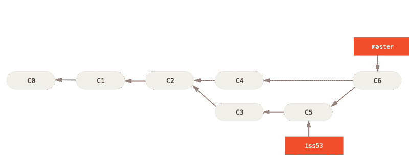

# 新人的 Git 概念—第 4 部分:分支

> 原文：<https://itnext.io/git-concepts-for-newcomers-part-4-branches-52aee1da4385?source=collection_archive---------1----------------------->

现在让我们学习一下 Git 分支！

这是我的初学者 Git 概念系列的第四篇文章。如果你没有读过之前的，那就先去读那些:

*   第一部分—什么是 DVCS:[https://it next . io/git-concepts-for-new York-part-1-What-is-a-dvcs-BC 873076 c 424](/git-concepts-for-newcomers-part-1-what-is-a-dvcs-bc873076c424)
*   第二部分—工作树和暂存区:[https://it next . io/git-concepts-for-new York-part-2-git-repository-Working-tree-and-staging-area-a2e 720 BF 3528](/git-concepts-for-newcomers-part-2-git-repository-working-tree-and-staging-area-a2e720bf3528)
*   第三部分—提交、记录和修改:[https://medium . com/@ dSebastien/git-concepts-for-new yorks-part-3-Commits-log-and-amend-6 dcbb 05370 c](https://medium.com/@dSebastien/git-concepts-for-newcomers-part-3-commits-log-and-amend-6dcbb05370c)


图片由 [Pawel Czerwinski](https://unsplash.com/@pawel_czerwinski) 提供

在这篇文章中，我们将探索 Git 分支，Git 的基本概念之一，当然也是使它成为最好的版本控制系统之一的概念！

分支是你日常使用的核心概念的一部分，所以清楚地理解它们是什么，如何操作它们，以及清楚地理解它们如何“工作”是很重要的。

我们开始吧！

# 什么是分支？

任何喜欢科幻小说的人应该会立刻爱上分支的概念，因为它们就像交替现实。

无论我们谈论的是 Git、SVN 还是其他版本控制系统(VCS)，总有一个默认的分支或“起点”。正如我在本系列的第二篇文章[中提到的，对于 Git 来说，这个默认的分支叫做“master”(但是如果你也认为#blacklivesmatter 可以被重命名)。在 SVN，这一分支通常被称为“主干”。](/git-concepts-for-newcomers-part-2-git-repository-working-tree-and-staging-area-a2e720bf3528)

当我们创建一个全新的存储库时，我们只有主分支，或者代码的“主线”。我们可以向它添加提交，重做那些提交，等等，就像我们在[上一篇文章](/git-concepts-for-newcomers-part-3-commits-log-and-amend-6dcbb05370c)中看到的那样。但是有一个单独的分支是非常受限制的。如果你想尝试新的想法呢？或者在与其他工作整合之前，先兼职做一些事情？分支是这些情况和许多其他情况的解决方案。

分支，有时也称为树，是代码库的独立“版本”,可以彼此独立地发展，但也可以“合并”在一起，以整合变化并创建新的现实；就像《滑块》中的角色去了另一个空间并毁灭了 havok(或者试着不去并悲惨地失败)。每个分支都有自己的历史和提交。

这个名字当然是指树枝，树枝分支:


与实际树的不同之处在于，版本控制系统中的分支可以“加入”(或与其他分支合并)。就像 [linux 发行版](https://upload.wikimedia.org/wikipedia/commons/1/1b/Linux_Distribution_Timeline.svg):



在上面的例子中，取自 Git 的官方文档，从左到右阅读，我们可以看到分支是如何在某一点被创建并在稍后被合并的。让我们通过示例来更好地理解这一点。

首先，在“主”分支上创建了三个提交:C0、C1 和 C2。然后，一个名为“iss53”的分支(如果你喜欢，也可以叫它“替代现实”)基于 C2 的代码状态而创建。在 iss53 分支中，创建了新提交 C3 和 C5。如您所见,“iss53”分支标签附在最后一个 C5 提交上。我会回到这一点，但这代表了所谓的分支的*尖端。*

在 C2 之后添加到主分支的 C4 提交根本不会影响“iss53”分支。它只是没有发生在那个分离的现实中。

最后，C6，一个被称为“合并提交”的特殊提交被添加到主分支中，*将“iss53”分支中所做的更改与主分支合并。C6 提交是主分支的尖端；也叫*头*。*

如果这还不够清楚，让我们来打个比方。想象一下，每次提交都代表一本书中的一页。所以你创建了你的知识库并开始写作。您为封面创建了 C0，为第一页创建了 C1，然后为第二页创建了 C2。这时，你意识到你对接下来的事情有两个想法，所以你创建了一个新的分支，其中你用一个版本的故事创建了 C3(第 3 页)和 C5(第 4 页)。在主分支上，您创建了 C4(第 3 页)，这是故事的另一个版本。毕竟，你意识到这两个故事实际上是可以合并的，你不需要把这两个故事分开。此时，您将“iss53”分支与备选故事合并回“主”分支。

我现在不会进入“合并”的细节，但是想法很简单:将一个分支上的改变应用到另一个分支上；适应过程中需要的一切。

注意分支不一定要合并在一起；你想让它们存在多久，它们就存在多久；没关系。此外，分支机构继续存在，即使它们已经被其他分支机构合并。因此，您可以保留两个分支，并根据需要多次将一个分支合并到另一个分支中(反之亦然)。

例如，拥有与应用程序部署的每个环境相对应的分支(例如，开发、验收、生产)并在需要时更新这些分支并不罕见。我将在后面的文章中告诉你更多关于所谓的“分支模型”的内容。

不过，我通常更喜欢短命的分支，一旦它们被合并到主线中，我就会扔掉它们。

# 分支机构的好处

正如我们在前面的例子中看到的，分支允许并行地或者交替地处理不同的事情。分支是伟大的，因为它们允许我们进行实验，在不影响主线的情况下偏离主线，独立工作并保持事物的整洁。

没有分支，我们将不得不复制存储库，这将是不可管理的。

分支的另一个优点是，如果当它们被其他分支合并时，它们的历史可以被重写，这对于保持一个干净和可读的 git 日志是很棒的。使用 git 重写历史是通过使用`git rebase`命令完成的。我们将在后面的文章中了解如何做到这一点。

最后，branches 支持大量协作工作流。例如，您可以在一个专门的分支中开发一个新的特性，并提议进行评审。批准后，您可以将这些更改合并回主分支。干净简单！

# 为什么 git 分支很棒

现在你知道了分支，我们可以讨论一下为什么 Git 分支经常被认为是 Git 最酷的特性。

正如我提到的，大多数版本控制系统都支持分支。但是在一些这样的系统中，创建一个分支或者从一个分支切换到另一个分支可能是缓慢而复杂的。例如，众所周知，SVN 开设分行的速度很慢。使用 Git，从一个分支切换到另一个分支的速度非常快(几乎是瞬间)。这是由于 Git 处理分支的方式。使用 Git，分支“不过是”指向特定提交的标记指针；知道每个提交指向它的前一个提交。

此外，对于某些系统来说，合并分支也很困难。同样，使用 Git，它真的很流畅(但不一定简单，这取决于您要合并的内容；想象一下将 Linux 和 Windows 的源代码合并在一起..:p)。

所以，在使用 Git 时，不要犹豫创建分支。在这方面，它真的一点也不像 SVN。

使用 git，当您从一个分支切换到另一个分支时(我们将很快了解如何切换)，您的工作树(即文件系统上的实际文件)将会立即改变，以匹配新签出分支的内容。

# 列出现有分支

好了，理论到此为止(目前)。让我们玩一下树枝吧！

列出现有分支很容易。你可以使用`git branch` [命令](https://git-scm.com/docs/git-branch):[https://git-scm.com/docs/git-branch](https://git-scm.com/docs/git-branch)来完成

继续并尝试以下方法:

*   创建一个新目录并进入其中:`mkdir gitbranches && cd gitbranches`(或者使用 [mkcd](/bash-aliases-are-awesome-8a76aecc96ab?source=your_stories_page---------------------------) 如果你已经阅读了[我的关于 Bash 别名的文章](/bash-aliases-are-awesome-8a76aecc96ab?source=your_stories_page---------------------------) :p)
*   在其中初始化一个新的 Git 库:`git init`
*   列出已有的分支:`git branch`

在这一点上，你会认为我是一个骗子，因为在这一点上没有“主”分支。但是继续下去:

*   创建一个文本文件:`touch cover.txt`
*   将文件添加到暂存区:`git add --all`(或`git add -A`或`git add .`)
*   提交吧:`git commit -m 'C0: book cover'`
*   现在再次列出现有的分支:`git branch`

此时，您应该会看到:

```
$ git branch
* master
```

所以，不，我没有说谎，但是主分支只有在至少有一个提交被添加到存储库中时才是“存在的”。

注意，可以用这个命令列出其他存储库的分支并做其他有趣的事情，但是这更高级(不经常使用)。

# 创建分支

也可以使用`git branch <name>`命令或`git checkout -B <name>`创建分支。我主要使用第二个命令，因为它在创建分支后也会切换到该分支，这通常更有用。

让我们试一试。首先，创建一些额外的提交来匹配我们前面的例子:

```
touch p1.txt && git add . && git commit -m 'C1: Page 1'
touch p2.txt && git add . && git commit -m 'C2: Page 2'
```

完成此操作后，存储库的日志应该如下所示:

```
$ git log --oneline
f10ff21 (HEAD -> refs/heads/master) C2: Page 2
4426512 C1: Page 1
7dda3ce C0: Cover
```

现在，让我们创建新的“iss53”分支(或其他:p):

```
$ git branch iss53
Branch 'iss53' set up to track local branch 'master'.
```

如果您现在列出现有的分支，您将看到我们的新分支已经创建:

```
$ git branch
  iss53
* master
```

我们将在下一节中看到如何在分支之间切换。

# 分支跟踪

理解我们新的“iss53”分支跟踪“主”分支是很重要的。

在这一点上，忽略这一点是没有“问题”的，但是一旦你想要推/拉改变(这是我们仍然需要发现的)，这种“跟踪”的概念将成为基本的。

当一个分支被配置为跟踪另一个分支时(无论是在同一个存储库中还是在远处的存储库中)，那么这个分支就是像`git pull`、`git push`、`git status`等操作的默认源/目标。

也可以通过`git branch`命令来配置分支跟踪，但是我们将在稍后研究这个问题。

# 分支之间的切换

要从一个分支切换到另一个分支，可以使用`git checkout` [命令](https://git-scm.com/docs/git-checkout)。

继续切换到“iss53”分支:

```
git checkout iss53
```

要确认这一点，请看`git status`的输出:

```
$ git status
On branch iss53
Your branch is up to date with 'master'.nothing to commit, working tree clean
```

如你所见，我们现在确实在“iss53”分支上。

此外，如果您检查日志，您会看到这个分支确实与“主”分支有完全相同的历史(至少现在是这样):

```
git log
commit f10ff21189d6ed2ca5548163b55a9e7a3d11d692 (HEAD -> refs/heads/iss53, refs/heads/master)
Author: Seb <[seb@dsebastien.net](mailto:seb@dsebastien.net)>
Date:   Tue Jul 28 16:05:12 2020 +0200C2: Page 2commit 44265122220956cfc5603d4ed8c503d213d01e4f
Author: Seb <[seb@dsebastien.net](mailto:seb@dsebastien.net)>
Date:   Tue Jul 28 16:03:12 2020 +0200C1: Page 1commit 7dda3ce83e536f21429e49f1e148f4acdc3a4c45
Author: Seb <[seb@dsebastien.net](mailto:seb@dsebastien.net)>
Date:   Tue Jul 28 15:48:29 2020 +0200C0: Cover
```

请注意，分支之间的切换有时是不可能的。当您的工作目录不干净时，就会发生这种情况。在本系列的后面，我们将讨论 Git 的“stash”特性，您可以使用它来解决这个问题。

# 头部和分支尖端

为了跟踪哪个分支当前被检出，git 将信息存储在一个名为“HEAD”的文件中，并将其存储在。git”文件夹。

现在，您已经切换到“iss53”分支，继续看一看头文件:

```
$ cat ./.git/HEAD
ref: refs/heads/iss53
```

如您所见，该文件仅包含对分支的引用。你可以在 StackOverflow 中学到更多关于头部的知识。

有趣的是，头文件指向的引用存储在。git/heads 文件夹，其中每个分支包含一个文件:

```
$ ls ./.git/refs/heads
total 16K
drwxrwxr-x 2 sebastien sebastien 4,0K jui 28 16:07 .
drwxrwxr-x 4 sebastien sebastien 4,0K jui 28 15:45 ..
-rw-rw-r-- 1 sebastien sebastien   41 jui 28 16:07 iss53
-rw-rw-r-- 1 sebastien sebastien   41 jui 28 16:05 master
```

让我们看看“iss53”文件:

```
$ cat ./.git/refs/heads/iss53
f10ff21189d6ed2ca5548163b55a9e7a3d11d692
```

咄，那是什么？这只是“iss53”分支上最后一次提交的(完整)散列:

```
$ git log --oneline -n 1
f10ff21 (HEAD -> refs/heads/iss53, refs/heads/master) C2: Page 2
```

开始有意义了吗？

所以总结一下:

*   head 指向当前检出分支的 HEAD 引用文件
*   分支的头引用文件指向该分支上的最后一次提交
*   每个提交指向它的前任(即，父)

现在你可以更清楚地理解`git log`命令是如何工作的；它“简单地”跟踪从头部到历史中第一次提交的链接。

顺便说一下，如果您再次查看存储库的历史，您会看到“master”和“iss53”当前确实指向同一个提交:

```
$ git log --oneline
f10ff21 (HEAD -> refs/heads/master, refs/heads/iss53) C2: Page 2
4426512 C1: Page 1
7dda3ce C0: Cover
```

现在，`(HEAD -> refs/heads/master, refs/heads/iss53)`部分应该对你更有意义！

在本系列的后面，这些关于头和枝的知识将变得更加有用；尤其是对于历史重写操作。

附注:当创建提交时，Git 会将元数据附加到它上面。这个元数据的一部分是关于您的，提交的作者(这取决于您的 Git 配置)，另一部分是您设置的消息，还有一部分是到其他提交的 0-n 链接。存储库中的第一个提交没有父提交；普通提交有一个链接，而所谓的合并提交有 2-n 个链接。我们将很快了解如何合并分支。

# 删除本地分支

当然，我们也可以删除分支。要删除一个，只需使用以下命令:

```
git branch -d <name>
```

请注意，这是删除的安全版本；如果有未合并的变更(即，删除分支会丢失的变更)，它会阻止删除。

如果你真的知道自己在做什么，你也可以强制删除:

```
git branch -D <name>
```

当你知道这个分支真的可以消失时(例如，在它被整合到其他地方之后，或者如果你已经放弃了一个想法)，以上是有用的。

# 重命名本地分支

最后，您还可以使用以下命令重命名当前签出的分支:

```
git branch -m <name>
```

# 结论

在本文中，我向您介绍了分支。总之，我们已经看到了它们是什么，为什么它们很酷，为什么 Git 分支特别棒。

然后，我们学习了如何创建分支，如何在它们之间切换，以及如何重命名和删除它们。

一路上，我解释了 HEAD git 的概念，这将在后面被证明是有用的，以及引用、分支提示和提交间链接的概念。

这些知识对于初学者和更高级的 Git 用户都非常有用，因此非常值得学习。虽然，要知道关于分支还有很多要学习的，但是在我们开始之前，我们需要学习如何与远程存储库交互！

在本系列的下一篇文章中，我们将看看如何合并分支。

今天到此为止！

# 喜欢这篇文章吗？点击下面“喜欢”按钮查看更多内容，并确保其他人也能看到！

PS:如果你想学习大量关于软件/Web 开发、TypeScript、Angular、React、Vue、Kotlin、Java、Docker/Kubernetes 和其他很酷的主题的其他很酷的东西，那么不要犹豫[去拿一本我的书](https://www.amazon.com/Learn-TypeScript-Building-Applications-understanding-ebook/dp/B081FB89BL)并订阅[我的简讯](https://mailchi.mp/fb661753d54a/developassion-newsletter)！