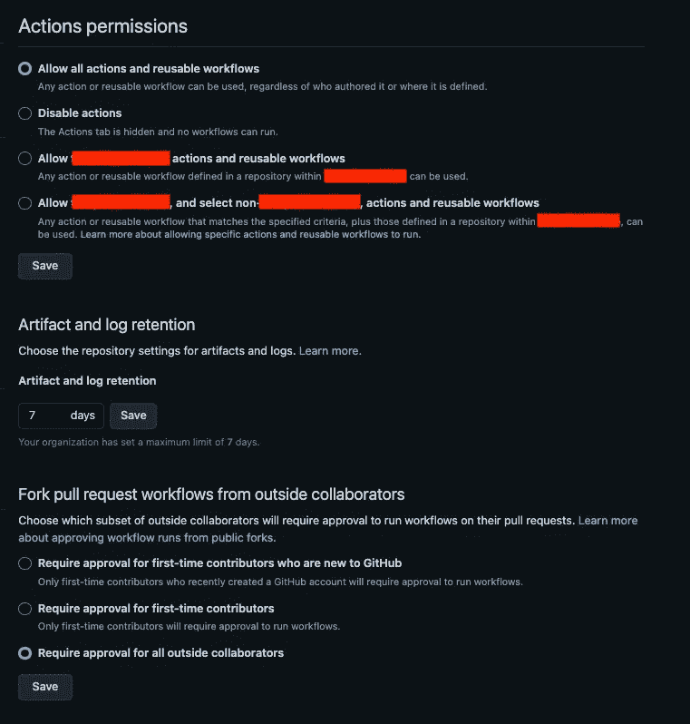

# GitHub actions 共享工作流。

> 原文：<https://itnext.io/github-actions-shared-workflows-a452b6393511?source=collection_archive---------0----------------------->

## 您是否曾经因为新的工作流需求而害怕更新数十甚至数百个需要更改或更新的存储库？很久以前 GitHub 启用了一个非常好的特性，它将显著加快你的进程。

由[亚历山大·格雷](https://unsplash.com/@sharonmccutcheon?utm_source=medium&utm_medium=referral)在 [Unsplash](https://unsplash.com?utm_source=medium&utm_medium=referral) 拍摄的照片

# 如何在 Github 中使用共享工作流？

正如你在我以前的文章中读到的，最佳电报机器人的开发达到了难以置信的复杂程度。在写作的时候，我正在我写的几十个共享库之间周旋——支持从队列、统计数据到连接和微服务等常见任务的任何东西——其中大多数对最终用户是可见的(本着开放和透明的精神——在[可用性统计](https://telegram-bot.app/bots-availability-statistics/)网站上)。作为一个人的团队，我希望构建、测试、部署和相关任务尽可能简单，并且要求的变化不会影响我本可以花在开发或修复 bug 上的时间。

当 github 共享工作流到来时，我高兴极了。最后，我可以消除古老的复制和粘贴方法，并更新所有存储库中的构建，从而简化整个项目生命周期的管理。想清楚这一点后，我为网站(nodejs)、图书馆(golang)和微服务(golang)建立了三个独立的工作流，最终能够在一个地方添加、删除或更新整个 CI/CD 管道，这正是我需要的。

# 设置共享工作流

通过设置新的存储库来存储工作流，开始您的共享工作流之旅。在这个非常简单的步骤之后——确保动作——通用设置允许所有的**动作和可重用的工作流被启用。当然，您可以修改它，并指定您打算用来增加安全性的工作流列表，尽管在当前阶段，这是一个不必要的复杂性。初始设置见下面的截图。出于本文的目的，我们称之为存储库。`shared-workflows.`**

存储库设置—操作—常规。工作流权限设置。

让我们创建一个简单的工作流，我们将从其他存储库中触发它。我已经创建了一个 github 动作示例，现在我们将对它进行剖析。看一下代码

包含的操作需要向其传递两个参数。一个是被动作视为常规变量的**布尔**参数`enable-code-scans`。第二个——`ghcr-token`定义为秘密；因此，步骤`Run sample action`将通过`***`模糊输出。作业本身有条件地运行——如果`enable-code-scans`参数设置为 true。

例如，动作应该保存在`my-actions`库的`.github/workflows/sample.yaml`目录中。

# **如何使用这个共享动作？**

共享的动作可以被其他动作触发，哦，这就是这篇文章的全部目的。让我们假设你有一个组织`my-super-sweet-project`。组织内的每个微服务都有自己的`.github/workflows`目录，其中包含您定义的管道。为了消除代码重复并开始进入 CI/CD 世界的简化冒险——让我们将`test.yaml`工作流添加到微服务存储库中，如下所示。

是的，那是你唯一需要的东西。您的微服务存储库中的工作流将从主分支`my-super-sweet-project/shared-workflows`存储库中触发`sample.yaml`工作流，并将参数传递给它——其中一个将是`enable-code-scans`而另一个是`ghcr-token`的秘密。

# **奖励:环境变量**

我们有一个共享的工作流存储库，所有的微服务都使用它。尽管如此，因为我们不喜欢为一个单一的功能花费大量的金钱(在这个例子中——为 Github 组织付费，所以我们可以使用组织范围内的环境变量——将会有许多存储库需要检查和配置适当的环境变量。为了使我的生活简单，我创建了一个微型脚本，它将遍历组织内的存储库，并为我设置所需的环境变量。

从下载官方 github cli 开始—[https://github.com/cli/cli](https://github.com/cli/cli)
在这一步之后，您将能够使用下面的脚本为您所有的存储库批量创建/更新环境变量。不要忘记根据自己的喜好修改环境变量。

# 奖金#2:共享工作流的想法

如果你仍然好奇，不相信或者想看看真实世界的应用程序——有一组(注意——相当脏的代码，因为我绝对没有时间清理它)工作流，我正在为我的一个项目使用——[https://github.com/telegram-bot-app/ci-scripts](https://github.com/telegram-bot-app/ci-scripts)。包含的共享工作流负责处理微服务和/或网站本身的生命周期，包括部署。

希望你喜欢这本书。这是我一年来的第一篇文章，但我回来了，所以别忘了订阅更多。