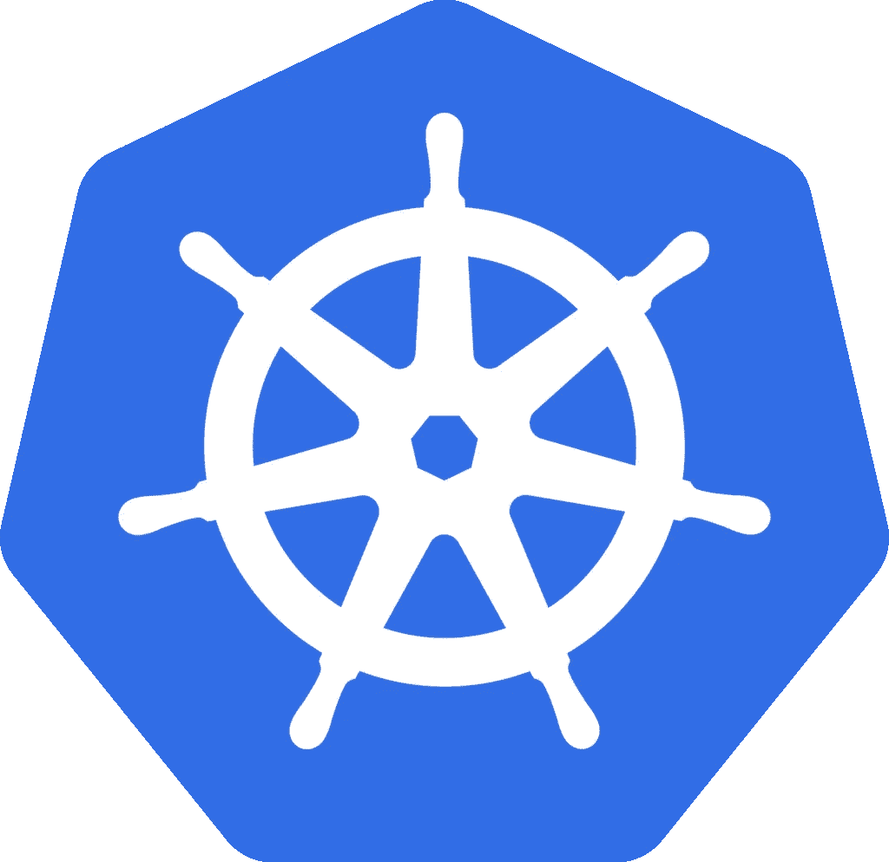

# 带通量和舵操作器的 GitOps

> 原文：<https://itnext.io/gitops-with-flux-and-helm-operator-f41b82e2de95?source=collection_archive---------0----------------------->



来自[https://commons . wikimedia . org/wiki/File:Kubernetes _(container _ engine)。png](https://commons.wikimedia.org/wiki/File:Kubernetes_(container_engine).png)

这些是我为自己做的笔记，因为在过去的几年里，我一遍又一遍地做这个练习。这个想法是使用 [GitOps](https://www.weave.works/technologies/gitops/) 将服务部署到 Kubernetes 集群。在我看来，GitOps 的主要优点是它允许团队的所有成员确切地看到正在部署什么，因为所有东西都在 Git 中。无需在本地笔记本电脑上运行手动`helm`或`kustomize`命令。没有偏离系统的“真实状态”。

有几个工具允许您在 Kubernetes 集群中实现 GitOps 工作流。我选择了[通量](https://fluxcd.io/) (v1，因为 v2 还在……通量里)和[舵操作员](https://github.com/fluxcd/helm-operator)。简而言之，一旦你部署了 Flux，它将监视你在 Flux 配置中指定的 Git repo，每 5 分钟从 repo 中获取最新代码，并对他们在指定目录及其子目录中找到的清单进行一次大的`kubectl apply`。赫尔姆操作员是一个 CRD，知道如何解释类型`HelmRelease`的对象。它基本上是在您的集群中为您运行`helm upgrade`，因此您不必手动操作。我最初的工作是基于来自 Weaveworks 的 Stefan Prodan 写的一篇很棒的文章，这家公司首先想到了 GitOps 这个名字。

也可以配置 Flux 与 Kustomize 一起工作。更多细节见本[示例](https://github.com/fluxcd/flux-kustomize-example)，本[详细博文](https://particule.io/en/blog/flux-kustomize/)。

以下是我关于安装和配置 Flux 和 Helm 操作器的注意事项。我将在下面的命令中使用 Helm v3。

将 FluxCD 存储库添加到本地舵存储库:

```
$ helm repo add fluxcd https://charts.fluxcd.io
```

在 k8s 集群中创建 fluxcd 名称空间:

```
$ kubectl create ns fluxcd
```

获取并扩展通量和舵手-操作员舵手图表:

```
$ mkdir charts
$ cd charts
$ helm fetch fluxcd/flux
$ helm fetch fluxcd/helm-operator
$ tar xvfz flux-1.3.0.tgz
$ rm flux-1.3.0.tgz
$ tar xvfz helm-operator-1.0.1.tgz
$ rm helm-operator-1.0.1.tgz
```

**安装和配置助焊剂**

为您的特定 k8s 集群定制`values.yaml`通量舵图表`mycluster`:

```
$ cd flux
$ cp values.yaml values_mycluster.yaml
```

运行 ssh-keyscan 来获取 git 服务器的 ssh 主机密钥:

```
$ ssh-keyscan git.mydomain.com
```

修改自定义`values_mycluster.yaml`文件:

*   将 ssh-keyscan 的输出添加到 ssh.known_hosts
*   set git . URL:git @ git . my domain . com:cicd/gitops . git
*   设置 git.user 和 git.email
*   将 registry.disableScanning 设置为 true
*   设置 git.path: "clusters/mycluster "

在上面的设置中，我假设您将 GitOps 清单保存在一个名为`gitops`的存储库中。我还假设您的特定`mycluster`集群的清单将存储在那个 git repo 中的`clusters/mycluster`下的目录(和子目录)中。

现在我们准备安装通量舵图(我假设你在包含`values_mycluster.yaml`的目录下):

```
$ helm install flux --namespace fluxcd . -f ./values_mycluster.yaml
```

此时，安装 [fluxctl](https://docs.fluxcd.io/en/latest/references/fluxctl/#installing-fluxctl) 在本地运行各种特定于 flux 的命令非常有用。例如，让我们检索由 flux 创建的 ssh 公钥:

```
$ fluxctl identity --k8s-fwd-ns fluxcd
```

您需要将上面命令打印在屏幕上的密钥添加为部署密钥，方法是转到 gitops git 存储库的设置并粘贴该密钥(具有写访问权限)。

**安装和配置舵操作员**

安装 helmrelease CRD:

```
$ cd helm-operator
$ wget [https://raw.githubusercontent.com/fluxcd/helm-operator/master/chart/helm-operator/crds/helmrelease.yaml](https://raw.githubusercontent.com/fluxcd/helm-operator/master/chart/helm-operator/crds/helmrelease.yaml)
$ kubectl apply -f helmrelease.yaml
customresourcedefinition.apiextensions.k8s.io/helmreleases.helm.fluxcd.io created
```

创建一个 ssh 密钥对和一个名为`helm-operator-ssh`的 k8s 秘密。您需要确保秘密中的私有 ssh 密钥的名称是`identity`(您可以通过在下面的命令中创建 k8s 秘密时指定`from-file=identity=<PATH_TO_SSH_KEY`来做到这一点):

```
$ ssh-keygen -q -N "" -f $HOME/.ssh/identity-helmoperator
$ kubectl create secret generic helm-operator-ssh --from-file=identity=$HOME/.ssh/identity-helmoperator --namespace fluxcd
```

为您的特定 k8s 集群定制`values.yaml`舵手-操作员舵手图表`mycluster`:

```
$ cp values.yaml values_mycluster.yaml
```

运行 ssh-keyscan 来获取 git 服务器的 ssh 主机密钥:

```
$ ssh-keyscan git.mydomain.com
```

修改自定义`values_mycluster.yaml`文件:

*   将 ssh-keyscan 的输出添加到 ssh.known_hosts
*   将 ssh 的 secretName 设置为 helm-operator-ssh

安装舵-操作员舵图(我假设你在包含`values_mycluster.yaml`的目录下):

```
helm install helm-operator --namespace fluxcd . -f ./values_mycluster.yaml
```

此时，您还需要添加$HOME/的内容。ssh/identity-helmoperator 作为 gitops 项目的部署键(不需要写访问)。

现在已经安装了 flux 和 helm-operator 的舵图，您可以验证它们安装的 pod 正在 fluxcd 名称空间中运行:

```
$  kubectl get pods -n fluxcd
NAME                            READY   STATUS    RESTARTS   AGE
flux-57b87fdb6f-pcw28           1/1     Running   0          15m
helm-operator-8d5c65c45-89lhf   1/1     Running   0          53s
```

检查 pod 的日志以确保没有错误也是一个好主意。我最近在舵操作员日志中遇到了类似以下的错误:

```
helmVersion=v2 error="failed to prepare chart for release: open /var/fluxd/helm/repository/cache/stable-index.yaml: no such file or directory"
```

我不得不`kubectl exec`进入 helm-operator pod，通过将`stable` repo 指向其新的规范 URL `charts.helm.sh/stable`来更新 helm2 repos(显然需要一种更好的方法，通过修改 helm-operator 配置，但这只是权宜之计):

```
$ kubectl exec -it helm-operator-6cdf868966-x8cdq -n fluxcd -- bash
bash-5.0# helm2 repo add "stable" "https://charts.helm.sh/stable
bash-5.0# helm2 repo update
bash-5.0#  exit
```

**GitOps 部署示例**

作为如何部署 GitOps 风格的舵图的快速示例，我选择了 Stefan Prodan 编写的`podinfo`图。我在`gitops` repo 中创建了两个目录:`charts_fetched`和`charts`，然后运行以下命令:

```
$ mkdir charts charts_fetched
$ cd charts_fetched
$ helm repo add podinfo [https://stefanprodan.github.io/podinfo](https://stefanprodan.github.io/podinfo)
$ helm fetch podinfo/podinfo
$ cp podinfo-5.1.4.tgz ../charts
$ cd ../charts
$ tar xvfz podinfo-5.1.4.tgz
$ rm podinfo-5.1.4.tgz
```

我还创建了一个名为`clusters/mycluster`的目录，并在它下面创建了名为`namespaces`和`releases`的目录。

在`namespaces`中，我有一个名为`development.yaml`的文件，描述了一个`Namespace` k8s 对象。当 flux 应用时，这将创建一个名为`development`的名称空间:

```
apiVersion: v1
kind: Namespace
metadata:
  name: development
```

在`releases`中，我有一个名为`podinfo.yaml`的文件，描述了一个`HelmRelease` k8s 对象。当 flux 应用时，这将由舵操作员 CRD 解释，并将导致根据本清单中描述的图表执行`helm upgrade`(或最初的`helm install`):

```
apiVersion: helm.fluxcd.io/v1
kind: HelmRelease
metadata:
  name: podinfo
  namespace: development
  annotations:
    fluxcd.io/automated: "false"
spec:
  releaseName: podinfo
  chart:
    git: git@git.mydomain.com:cicd/gitops.git
    path: charts/podinfo
    ref: master
  values:
    replicaCount: 2
```

这里需要注意一些事情:

*   我们为这个图表指定了`development`名称空间——它是通过`namespaces`目录中的清单创建的
*   我们指定通过 git 从与清单本身相同的`gitops`回购中检索`podinfo`图表；或者，您可以将图表源指定为 Helm chart 存储库 URL(如果有)
*   我们在`podinfo`图表中覆盖默认`values.yaml`文件中的一个值；举个例子，我们将`replicaCount`设置为`2`，而不是默认的`1`。

**重要的是**，在上面清单中的`values`部分，您可以修改想要通过 GitOps/Helm Operator 安装的给定图表的任何值。

**有用提示**:我通常从有问题的图表中复制默认`values.yaml`文件的内容，将它们粘贴到 HelmRelease 清单的`values`部分下，将它们向右移动一两个制表符以适当缩进，然后只保留我需要的键并更改它们的值。这将帮助你在缩进问题上保持理智。有些键缩进得很深，如果您错过了缩进级别，它们将不会被正确地覆盖。在那种情况下，可能会引起许多争论。

此时，如果您在`gitops` repo 中提交上面的代码并等待 5 分钟，那么所有的清单都应该由 flux 在您的目标`mycluster` k8s 集群中应用。您还可以通过运行以下命令来强制通量同步，这样您就不会等待 5 分钟:

```
$ fluxctl sync --k8s-fwd-ns fluxcd
```

当然，检查 fluxcd 名称空间中 flux 和 helm-operator pod 的日志。如果一切顺利，您应该会看到在集群的`development`名称空间中创建了一个名为`podinfo`的`HelmRelease`类型的对象。您还应该看到在`development`名称空间中运行的 2 个`podinfo`pod，对应于我们在 HelmRelease 清单中指定的`2`的自定义`replicaCount`:

```
$ kubectl get hr -n development
NAME      RELEASE   PHASE       STATUS     MESSAGE                                                               AGE
podinfo   podinfo   Succeeded   deployed   Release was successful for Helm release 'podinfo' in 'development'.   16m$ kubectl get pods -n developmentNAME                       READY   STATUS    RESTARTS   AGE
podinfo-6db7f57595-njrgk   1/1     Running   0          10m
podinfo-6db7f57595-wvn7w   1/1     Running   0          10m
```

在另一篇文章中，我将展示一个 SonarQube 舵图的真实部署，使用与这里描述的相同的方法。