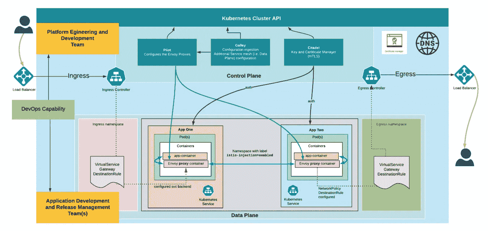

# 走进服务网格兔子洞——为什么您认为您需要它，以及架构考虑

> 原文：<https://itnext.io/going-down-the-service-mesh-rabbit-hole-why-do-you-think-you-need-it-and-architecture-8eb440ea5fea?source=collection_archive---------2----------------------->

先说一个好的背景故事。

总有一天，你会拥有闪亮的**，**新款** Kubernetes Cluster。**

**它可以工作，可以施展魔法，使您能够使用您选择的 CI/CD 发布模型来执行幂等微服务发布。
**是的**，在生产。
你已经为你的 Kubernetes (Nginx 或任何其他)入口控制器、WAF 保护等考虑了应用负载平衡器。**

**您的 K8s 生产微服务(应该)具备所有最佳实践；资源`quotas`、`limits`、`HorizontalPodAutoscaling`，甚至`NetworkPolicy`来保持 SecOps 功能正常运行。**

**这篇博文旨在让*技术*和*管理*读者共同探索*更大的组织视角、*以及欣赏更精细的*细节。*这是*一个*的努力，帮助你在****服务网格的话题上做出*更好的决策*。******

****您可以向生产级 Kubernetes 环境中添加更多的生产服务。一切都很顺利。****

> ****那么你一定听说过这个东西——**服务网格**。****

> ****你查过了。看起来这是每个人解决所有业务和技术扩展问题的方式。It 解决方案位于 DevOps 之后的某个位置，但可能与 SRE 一致，因为它似乎最具敏捷性。所以现在你想要了。你老板肯定要，是时候看看这个兔子洞到底有多深了……****

********

****这正是我呼吁所有人坐下来，喝点令人放松的甘菊茶，并反思这种果汁如何以及为什么值得压榨的时候。****

****我不会剥夺你的幻想，但考虑这样的技术并列是很重要的，**需要**对**想要**，从**为什么**开始，然后是**为什么现在******

# ******尴尬的一点。为什么******

****我们应该进行一个小的坦率的问卷调查，以确保我们涵盖了所有的角度。****

*   ****这是否满足一套**业务需求**？是否有**备选方案**来实现相同的目标，为 mesh 服务？****
*   ******敏捷度**如何**是你的组织**你是否有**工程团队(SRE)的能力**对现有的 Kubernetes 集群进行有经验的、高效的操作？****
*   ****您是否经历过影响 SLA 的停机时间？****
*   ****您的监控功能的**效果如何？您的监控**有多全面**？是否有[任何]待处理的警报需要稍后重新处理？******
*   **您对所有微服务和 Kubernetes 集群状态的**可观察性**能力的有效性如何？**

**你知道要点了。**

**以我最浅显的观点来看，这些只是在跳入游泳池深水区之前值得考虑的一些先决条件。
为了避免任何利益的曲解，**我 100%支持**给出那个闪亮的框架，那个工具，`have-a-go`。**

**作为工程师，我们通常会为正确的工作选择正确的工具。通常情况下。**

**因此，尽管我最初呼吁理性冷静时含糊不清，但如果我们确实有这些简单的问题，并且业务和工程团队都支持对 T1 的需求，那么让我们继续进行具体的规划和架构设计，不要再拖延了。如果我们没有得到所有这些问题的满意答案，停下来评估替代工具并没有错。那里真的有很多——可以更好地满足你的组织需求。**

> **简而言之 **—如果时机或需求不太合适，可以离开服务网。这不是适合工作的工具。事情就是这样。****
> 
> ****没有剧情。****

> **另一方面，如果有*文化*，那么*团队*——也就是复数——随时准备实现这些服务网格特性，以`further`增强由*业务*用例支持的工程能力。**超级。**加入一点*风险偏好——因为事情就是这样*。**

**很高兴**的尴尬位**已经不碍事了。**

**虽然有许多关于(Istio)服务网格的开源实现的精彩演示、详细图表和文章，但我在我的帖子中想要表达的重点更多的是在执行服务网格实现之前的规划和设计考虑。有很多未知因素，但我希望这种规划远见能驱散神话，突出关注领域，并有助于减轻许多未兑现的承诺。**

> **TLDR；我想为您的组织和团队介绍服务网格架构和设计。**
> 
> **因为服务网格的实现很可能会测试组织的开发运维及敏捷准备情况。**
> 
> **让我们来评估一下服务网状部署将如何为您服务。**

****服务网格(Istio)** 模糊了那些众所周知的界限，即**平台**或**基础设施**团队开始并完成他们的`bit`，而**应用** **开发**团队接管对他们的应用`bit`必要且特定的配置。**

**我们都是开发人员，但是平台工程功能包括什么，假设应用程序开发团队现在可能拥有基础设施资产的很大一部分。**

# **规划**

****

**有了承诺，就有了计划。**

**忘记从 Istio 或 LinkerD 文档开始。这是通常被忽略的一点，它是在任何安装之前对您的业务和工程能力的总体评估。让我们试着回答一些问题。**

*   **Kubernetes 集群的当前状态是什么，它现在处于预期的、计划的状态吗(除了网状之外)？**
*   **随着服务网格的引入，当前的入口控制器架构将如何变化？**
*   **您是否需要在您的集群中利用流量整形，以便能够发现新的服务版本？（**
*   **是否有解决任何集群*多租户*的业务需求和工程能力？未来有这样的规划吗？**
*   **在您的组织内，服务网格集成如何影响您当前的运营模式？应用程序和基础设施开发和支持之间的责任矩阵。*如果之前、之后或此时没有考虑过，请在评论中发表。***

# **控制平面和数据平面**

**如果你对服务网格有所了解，比如 Istio，它有两个部分—**控制**平面和**数据**平面。**

**我们需要通过比较和对比场景来理解差异，以及它们如何在更广泛的组织所谓的**运营模式**中得到恰当的运用。**

**这两者是紧密交织在一起的(obv ),但我看到了很多关于这样做的必要性以及在推出时这一切在实际实践中意味着什么的困惑。**

**简而言之，Istio 服务网格的初始[安装](https://istio.io/latest/docs/setup/getting-started/)将在您的 Kubernetes 集群中安装所有必要的组件。他们顶多是**惰性**。**

**您可以使用入口控制器的“经典”选择继续运行您的工作负载，就像`nginx-ingress-controller`不知道。**

**应用团队可以继续执行他们的微服务发布 BAU，平台团队和 DevOps 跨团队功能可以开始探索和挑选服务网格功能和特性，当他们在小的增量步骤。**

**当您开始规划到 Kubernetes 服务的交通路线时，乐趣就开始了。Istio 服务网格有自己的部署，一个服务(和云平台提供的负载平衡器)，你需要深入到`istio-ingressgateway`部署的配置中，并开始用`VirtualService`和`Gateway.`配置这个**入口****

**请参见下图，了解它如何映射到现有工作负载，以及这些组件之间的关联交互提供了哪些`Istio` **组件/功能**。**

**为了开始使用一些附加功能，值得探索一下`[**demo**](https://istio.io/latest/docs/setup/additional-setup/config-profiles/)` [**服务网格配置文件**](https://istio.io/latest/docs/setup/additional-setup/config-profiles/) ，您可以开始使用。通过这种方式，您可以获得最小值，以及相关种类配置的`Istio-IngressGateway`和`Istio-EgressGateway`，并“上路运行”一个工作演示供您仔细阅读。**

**这些是服务网格组件和`demo`服务网格配置文件，当[开始安装 Istio 时，可以使用`istioctl` CLI 命令。](https://istio.io/latest/docs/setup/getting-started/)**

****

**突出显示组件对现有工作负载的映射，以及这些组件之间的关联交互提供了哪些`Istio` **组件/功能**。**

# **大局**

****需要明确的是**,**服务网**推广工作的好处只有在*组织*层面有了`techno-cultural buy-in`才会开花结果**。****

**这些努力的结果可能会实现**只有**用 `all-hands-on-deck`的方法去**学习**，分享&关心的会话，就像`AGILE`你想要的那样(声称)。**

**如果你是一名**工程师**，你可能会欣赏下面**大** **考虑事项**部分中的每一项技术挑战的实际操作。**

**对于**领导层**，可以说——这绝不是一个彻底详尽的操作指南，但可以作为一个**准备情况评估，**来确保你的*组织*达到一个非常令人羡慕的*未来*基础设施状态。你的竞争对手可能会对“我们运行服务网”的声明羡慕不已，但当“意想不到的停机时间”最终真的发生时，他们会首先质疑你的技术实力。这还不算 SLA 对您企业客户的影响。**

## **考虑因素**

**虽然没有什么能阻止您进行大爆炸式安装，但对您现有的工作负载影响很小或没有影响。当**为您的应用程序工作负载启用服务网格**时，有一系列考虑事项需要审查和仔细考虑，我认为您应该审查和评估这些事项。**

*   ****只在需要**的地方用`Istio-injection=true` **启用 Istio 服务网格**。当`envoy`代理在其各自的`Pods`上被注入时，一些应用**将会中断**。`Envoy`边车集装箱充当所有`POD`网络流量的漏斗。这意味着，如果应用程序容器需要在`Quorum`或**上工作，则将**直接连接到其他 POD【容器】**，每个 Pod 上的此类`Envoy`边车会使事情变得复杂，相应的应用程序需要将所有通信重新路由到`127.0.0.1`，以便`Envoy`边车在每个此类 Pod 上拾取和运行。想想`Redis`或者`ZooKeeper`。请参见下面的`Namespace`部分，了解潜在的解决方法。****
*   ******网络策略—** 利用`NetworkPolicy`进行业务流管理，以确保应用业务确实(且仅)通过预定的服务网格入口路由流动(在适当的情况下)。这适用于单租户和多租户环境，最小使用案例为将`Namespace`作为流量源/目的地白名单的`Networkpolicy`配置。请记住，默认情况下，Kubernetes 集群中的所有 Pods 都可以与所有其他 Pods 通信。这意味着服务可以“由东向西”到达——通过其他服务，即使是无意的，也可以通过先前配置的`Ingress(es).`配置一个`NetworkPolicy`将强制流量流过一个单一的批准的路由，并确保您获得服务网格**可观察性**印象分。请在下面阅读更多相关内容。****
*   ******高可用性(PDB)——**通过为服务网格组件(citadel 除外)设置多个**可用的**最小 pod 来确保高可用性，尤其是在*就地*升级过程中。配置`PodDisruptionBudget`以设置在升级和节点池重新平衡期间，每个服务网格组件始终保持的最小`pod`可用性计数。****
*   ******自动伸缩(HPA) &资源配额—** Istio 服务网格入口组件带有一个`Kind: Deployment`。在 Kubernetes (v1.10 或更高版本)中，集群操作**指标-服务器**，公开资源指标。因此，`HorizontalPodAutoscaler` ( `HPA` ) `Kind`可用于配置，以帮助扩展 Istio `IngressGateway` `Deployment`副本数量，从而满足性能需求。执行服务网格组件资源**配额**的正确调整，例如`Envoy` `Proxy`容器和`Ingress` / `Egress` - `gateway`部署**与**它们的实际**利用率**。这确保了`(HPA)`配置在必要时工作。****
*   ******名称空间—** 使用`namespace`逻辑`label`分离工作负载，并使用它来分离**类型的工作负载** ( `istio-system`、`team1`、`team2`、`monitoring`等)。这进一步提高了安全性，因为`NetworkPolicy`可以按名称空间应用，从而实现有效的安全性控制。在适当的名称空间(标签)中逻辑分离工作负载简化了用于服务网格集成的`envoy-proxy`自动边车注入，因为自动特使边车注入作为名称空间*注释*被启用。****
*   ******Ingress&Egress—**`VirsualService`、`Gateway`、`DestinationRule`等组件可以在一个`default`、`namespace`中持久化，在其他名称空间中被引用消耗。最佳实践是确保这些配置是在`default`、`istio-system and kube-system`名称空间之外创建的。相反，它们应该代表一个专用的、本地独立的实体，最好是每个租户。然而，重要的是要提到，在多租户环境中，在某些用例下，`Ingress`应该是*进一步*分离的`Ingress`配置，在期望的`namespace`中带有`exportTo`标志和关联的`DestinationRule`。对称的`Egress`可能会得到类似的处理，有另一个专用的名称空间，与`NetworkPolicy`成对匹配。****

# ****最后的想法****

****服务网格确实令人望而生畏，尤其是它带来了越来越多的更新和特性。我建议从基本的和最小的开始。****

****你有`istio-IngressGateway`——先配置那个**。优化第二个**。********

****确保您有一组高质量的`NetworkPolicy(ies)`，特别是对于多租户 Kubernetes 集群，以确保开始通过服务网格将流量引入服务。****

****您将需要考虑扩展集群服务，以包括一个**证书管理器**和**外部 dns** ，以确保您拥有一个全功能、自动化、动态的能力，来促进相关的 dns 保留和证书颁发(和更新)。在利用`the service mesh`之前，您可能/应该已经具备这样的能力！****

****部署像`**Prometheus**`这样的指标聚合器，以便聚合所有的`istio`指标，并使用适当的仪表板来可视化它们。如果您没有通过服务网格传输流量，您将不会在`**Prometheus**`中看到相关指标。如果您在阅读本文的同时考虑到了服务网格，那么您最好已经在 Kubernetes 集群上拥有了成熟的**监控**和**观察**功能。****

******数据包追踪** —一旦你的服务网可以运行，就使用 **Jaeger + Kiali** 插件。他们是伟大的，但是你可以离开直到最后。我敢肯定，你现在就渴望探索这些承诺的酷功能。但是不要跑题。**婴儿步**。****

****考虑一下**相互 TLS** 、东西向和南北向 TLS(*尽管在后一种情况下探索 Apigee 产品* ) —安全的集群到集群通信是下一个级别要做的事情。这确实使你的设置成倍地复杂化了。你甚至可能希望尝试经营你自己的认证机构。它将有助于管理多集群加密通信。提供 PKI 服务的 Hashicorp Vault 可能会是你感兴趣的一个领域。但现阶段可能有点过了。****

****所以我想现在就这样了。
这绝不是详尽无遗的，但最近的思考和实际上的头脑风暴，我希望能就**服务网格即解决方案**(**SMaaS**——不过这最好不要成为一件事)****

****我希望在接下来的文章中涵盖所有的插件、扩展和扩充。****

****我希望这篇文章能够为您开始设计和构建服务网格实现提供足够的指导。****

****我希望你喜欢阅读，喜欢，分享知识。****

******连接上** [**LinkedIn**](https://www.linkedin.com/in/johas/) **或找我上** [**Istio**](https://istio.slack.com/) **和**[**Kubernetes**](https://slack.k8s.io/)**松弛群。******