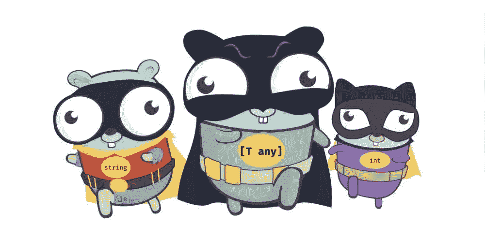

# 面向非初学者的 Golang 泛型

> 原文：<https://itnext.io/golang-generics-for-non-beginners-6ca7a4716aa9?source=collection_archive---------1----------------------->

## 跟上 Go 中泛型的速度



在这个故事中，我不打算教你泛型，而是假设你已经了解泛型、参数化类型或基于模板的编程。

这展示了 Go 泛型的基础。类型参数受接口约束。这意味着您可以要求您的类型参数`T`实现某些方法或者属于某些类型。这里我们指定接口`Number`匹配任何一个`int`、`int64`或`float64`。

```
type Number interface {
    int | int64 | float64
}

func Sum[T Number](numbers []T) T {
    var total T
    for _, x := range numbers {
        total += x
    }
    return total
}
```

你可以在 [Go 游乐场](https://go.dev/play/p/TSQh9jS1XNf)试试这个例子。

## 泛型类型

需要注意的是，在定义参数化类型时，我们添加的方法不能引入新的类型参数。它们只能使用在类型定义中定义的类型。因此，你会注意到对于`Push`和`Pop`，我们没有指定对`T`的约束。事实上，在方法定义中没有任何东西暗示`T`是一个类型参数。相反，Go 从类型定义中获取知识。这是一个值得注意的限制。

```
type Stack[T any] struct {
	items []T
}

func (stack *Stack[T]) Push(value T) {
	stack.items = append(stack.items, value)
}

func (stack *Stack[T]) Pop() {
	n := len(stack.items)
	if n <= 0 {
		panic("Cannot pop an empty stack!")
	}
	stack.items = stack.items[:n-1]
}
```

## 预先打包的约束

在我们的第一个例子中，我们定义了自己的`Number`接口，但是您不必这样做。golang.org/x/exp/constraints T21 软件包提供了大量最有用的约束。以下是约束包中定义的一些接口:

```
type Signed interface {
	~int | ~int8 | ~int16 | ~int32 | ~int64
}

type Unsigned interface {
	~uint | ~uint8 | ~uint16 | ~uint32 | ~uint64 | ~uintptr
}

type Integer interface {
	Signed | Unsigned
}

type Float interface {
	~float32 | ~float64
}

type Ordered interface {
	Integer | Float | ~string
}
```

注意波浪号`~`的用法。这是因为 Go 让你可以很容易地定义新类型，这些新类型是从原始类型派生出来的。例如，当编写代码来模拟火箭发射的物理过程时，我定义了千克和牛顿(力)的类型，如下所示:

```
type Newton float64
type Kg float64
```

如果您没有对`Float`使用波浪符号`~`，那么`Newton`和`Kg`将不会被视为`Float`值，这是不切实际的。

在二叉查找树中定义节点时，我使用了这个包中的约束。

```
import (
	"fmt"
	"golang.org/x/exp/constraints"
)

// A node in a binary tree which you can search by key
type TreeNode[K constraints.Ordered, V any] struct {
	Key         K
	Value       V
	left, right *TreeNode[K, V]
}

// Give string representation of node in print statements
func (n *TreeNode[K, V]) String() string {
	return fmt.Sprintf("TreeNode(%v, %v)", n.Key, n.Value)
}

// Insert node n into a leaf underneath parent node.
// Position will be determined based on value of key
func (parent *TreeNode[K, V]) Insert(n *TreeNode[K, V]) {
	if n.Key >= parent.Key {
		if parent.right == nil {
			parent.right = n
		} else {
			parent.right.Insert(n)
		}
	} else {
		if parent.left == nil {
			parent.left = n
		} else {
			parent.left.Insert(n)
		}
	}
}
```

# 其他与 Golang 相关的故事

如果你有兴趣阅读更多关于围棋的文章，我已经写了一些关于围棋的文章:

*   面向 Go 程序员的 1.18 版本更新——阐明自 Go 获得模块以来 Go 中发生的变化，以及涵盖您在远离 Go 编程时经常忘记的内容。
*   [Go 是系统编程语言吗？](https://erik-engheim.medium.com/is-go-a-systems-programming-language-c243c80eb6f9) —有了自动内存管理，就能成为真正的系统编程语言。是的，这篇文章解释了为什么。
*   [Go 不需要 Java 风格的 GC](/go-does-not-need-a-java-style-gc-ac99b8d26c60) — Go 的垃圾收集方式与 Java 和 C#截然不同。下面我们来看看为什么 Go 比 Java 拥有更简单的垃圾收集器。
*   Go 比 Java 更面向对象
*   让 Go 变得简单——记录我在奥斯陆 NDC 会议上的一次演讲。