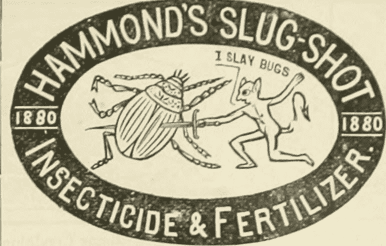
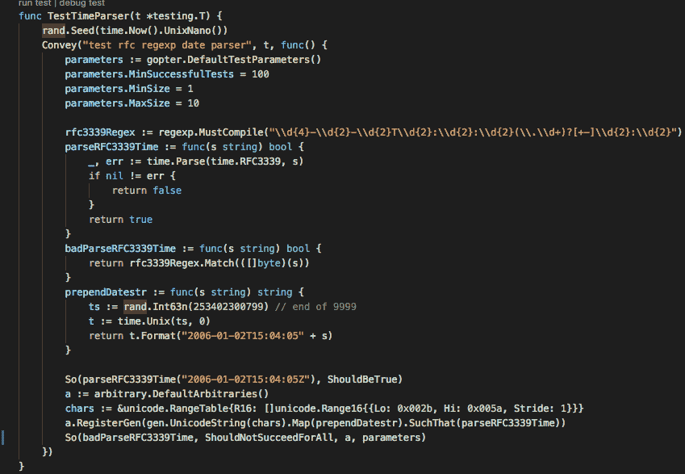
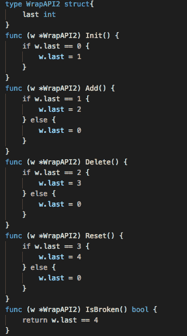
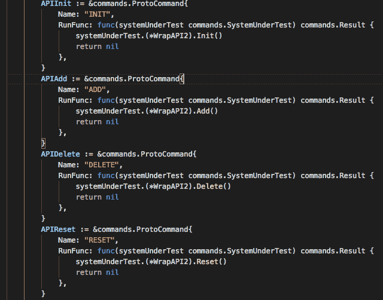
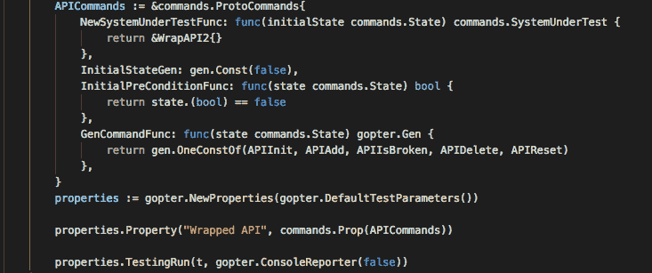
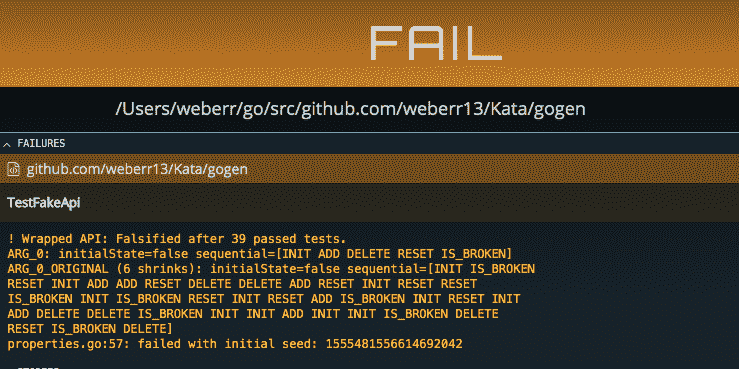

# gopter:Golang 中基于属性的测试

> 原文：<https://itnext.io/gopter-property-based-testing-in-golang-b36728c7c6d7?source=collection_archive---------5----------------------->

上一部:[https://itnext.io/quickcheck-testing-in-golang-772e820f0bd5](/quickcheck-testing-in-golang-772e820f0bd5)

*“一个好的程序员总是在穿过单行道之前先看两边。”*——*道格·林德*

在我的上一篇测试文章中，我介绍了 golang“testing/quick”包中可用的模糊测试，但在这个过程中，我发现尽管这个包很有用，但它并没有复制 QuickCheck 最强大的特性之一。QuickCheck 不仅产生随机输入，还在报告失败案例之前对其执行“收缩”操作。从一个开发者的角度来看，这个“收缩”阶段是至关重要的，他不仅想要保证他们算法的正确性，还想要工具来纠正发现的任何错误。

# 收缩

收缩是通过应用一个“收缩”函数来完成的，该函数将一个给定的类型作为其输入，并返回一个或多个相同类型的值，这些值在某种程度上比原始值“小”。虽然在某些情况下，较小的很难量化，但许多是直观的。例如，字符串收缩器可以接受输入字符串“abcdefg”并生成一个列表(“abcdef”、“bcdefg”)。这些值“更小”，因为它们包含的字符更少。对于像切片和串这样的对象，长度运算是用于确定“最佳”解决方案的逻辑运算。

一旦解决方案收缩，每个可能的更短的值可以反馈到属性测试中，以确定它们中的任何一个或全部是否产生失败。如果有的话，它们可以再次“收缩”,并且这个过程应该重复，直到找到“最短”可能的故障情况。这个过程就是我们熟悉的图遍历问题，在这个问题中，仅仅显示由于输入而出现的 bug 是不够的，但是一旦发现，就应该产生该输入的最小版本。

# Gopter

感谢 redditor[**zombie calypse**](https://www.reddit.com/user/zombiecalypse)指出我们不必自己写这个(这是我最初的担心)，已经有一个包可以让我们将生成测试提升到下一个水平:[https://github.com/leanovate/gopter/](https://github.com/leanovate/gopter/)和其他功能，它产生缩小的结果。除了关键的收缩步骤之外，这个包还提供了许多强大的生成器，我在上一篇文章中没有提到的基于“命令”的测试，以及与 goConvey 的集成。

# 一再

有了上一篇文章中介绍的基础知识，我们可以用一些小的受欢迎的变化来重复上一个测试。首先，我写了一个 goConvey 断言，它与内置的 ShouldSucceedForAll 相反，因为对于这个演示来说，失败正是我们想要的，成功就是失败。

现在剩下的就是构建与上次相同的测试，但是使用 gopter:

我们的解析功能保持不变，但是 gopter 中的生成器在功能上是可组合的。我们可以使用一个字符生成器(大小由参数中的 MinSize 和 MaxSize 决定)来代替并行运行这两个函数，并在随机值之间映射我们的 prepend 函数，还可以通过直接过滤时间来预先检查这些值是否合理。基于解析的过滤器。虽然这不是最有趣的例子，但很明显，通过映射和过滤操作，我们可以生成复杂的生成器，对随机数据进行整形和过滤，以符合合理的约束。正如所希望的那样，属性测试人员很快发现了我们的 bug:

在失败描述中给出了经过的时间和产生错误的情况。

# 命令测试

虽然在上一篇文章中已经给出了命令或序列测试的基本框架，但是它留给了读者很多东西。创建一系列映射到命令的键肯定能完成任务，但是测试很迟钝，需要一些后期处理来理解结果。对于 gopter 命令测试，这更简单。与上一个假 API 类似，我们可以模拟一个在一系列命令之后失败的 API:

不像以前那样使用随机数，可以直接命名和定义这些函数的预期行为。下面是一些简单的包装器，它们为修饰类的函数命名，并允许 gopter 调用它们:

接下来是一个旨在捕捉故障的函数:

最后一步是将所有这些命令很好地包装到一个命令属性中，并运行测试:

运行测试时，我们得到的“失败”比简单使用 testing/quick 时好得多:

不仅代码可读性更好，测试还产生了更短的失败路径，可以很容易地用作 API 调试过程的一部分。

# 缩小的虫子

模糊测试通常比什么都没有好,“测试/快速”已经赢得了赞誉，因为它甚至在核心语言中发现了没有程序员会立即想到的错误。如果目的是在接近无限的空间上运行后台测试，就像密码破解一样，那么持续迭代的“testing/quick”可以确保您很好地利用空闲的 cpu 周期。然而，在这种情况下，你不需要在一个问题上浪费熵，但是你有你想要的软件的正确性保证——或者更糟的是，你在现有系统中有顽固的和难以重现的错误——quick check 和 by proxy gopter 是一个更经济的选择。这种无需额外步骤就能把失败案例压缩成易于重现的集合的能力，应该允许开发人员在用蛮力进行设置和测试会无限期地耗费时间和资源的情况下快速修复错误。

你可以在[https://github . com/weberr 13/Kata/blob/master/gogen/gopter _ test . go](https://github.com/weberr13/Kata/blob/master/gogen/gopter_test.go)找到这里提到的代码

和往常一样，可以通过麻省理工学院的许可获得。