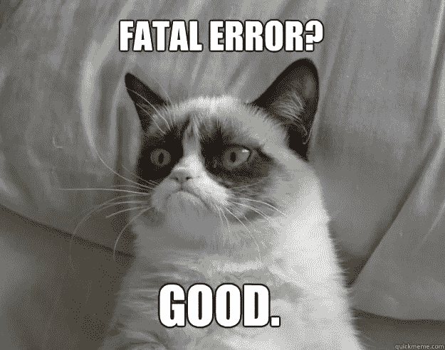

# REST 驱动的 web 应用程序中的优雅错误处理

> 原文：<https://itnext.io/graceful-error-handling-in-rest-driven-web-applications-d4209b4937aa?source=collection_archive---------1----------------------->



你可以尽你所能留住客户，但是如果你把你的用户当成白痴，给他们发“Ooops！出事了！”对于你申请中出现的任何问题，你都必然会疏远和挫败他们。您的客户服务将被来自用户的无用的问题报告淹没，他们看到愚蠢的一般性错误消息；你和你的同事将会浪费他们的时间去追踪这样的报告；当用户对消极的错误信息失去耐心，开始放弃你的服务时，这最终会损害你的底线。

您从后端开发人员那里听到的一个常见论点是，服务器上发生的事情会留在服务器上，出于安全和其他原因，您不应该向客户公开您的业务逻辑。这是一个有效的论点，但是，这不是每当服务器上发生非致命错误时返回没有任何上下文的`500`响应的借口，并且当 HTTP 协议为此专门定义了[一系列](https://developer.mozilla.org/en-US/docs/Web/HTTP/Status) `[4xx](https://developer.mozilla.org/en-US/docs/Web/HTTP/Status)` [错误代码](https://developer.mozilla.org/en-US/docs/Web/HTTP/Status)时。

那么，如何平衡前端 UX/用户界面需求和后端出现的问题呢？你如何以一种既尊重又有帮助的方式向客户传达错误？当它们的交互仅限于 HTTP 代码和有效负载时，如何为前端应用程序提供足够的上下文来决定做什么？

我在之前的文章[中已经开始解决这个问题，用断言和异常改进你的控制器逻辑](https://medium.com/@ismayilkhayredinov/improve-your-controller-logic-with-assertions-and-exceptions-e6efa7009550)。让我用一些额外的技巧和经验来扩展一下。

# **API 提供者**

作为 API 提供者，您的责任是处理客户请求并一致地响应它们。如果您认为客户端应用程序的存在只是为了呈现数据，那么您就错了。客户端应用程序和服务器应用程序都必须做出自己的业务决策。因为客户端应用程序是用户实际交互的对象，所以错误的决策会影响用户体验，并对您的核心业务产生更深远的影响。因此，对于 API 服务器来说，为客户端提供足够的上下文来为用户提供最好的体验是非常重要的。

## **使用正确的 HTTP 错误代码**

HTTP 代码的不正确使用会导致客户端的混乱。`400`、`401`和`403`错误代码有很大区别。从过期的 JWT 令牌中恢复不同于修复表单字段中的某些错误或没有足够的权限提交表单。

## **将有效载荷添加到您的错误响应中**

空的错误响应没有帮助。即使您的应用程序现在不使用它们，以后当您的应用程序增长并且您需要做出更复杂的决策时，它也可能需要更多的上下文。也就是说，要确保有效负载模式在所有响应中都是一致的:无论是返回一个错误对象数组，还是一个错误字符串，都要确保它适用于所有响应。鉴于大多数客户端应用程序都是用 JavaScript 编写的，并且必须提供给用户的浏览器，每增加一个规范化逻辑就意味着用户必须下载额外的千字节。

## **将错误分类**

通过将子类型分配给错误，可以简化客户端的决策过程。HTTP 代码太笼统。`401`错误可能意味着用户尚未登录，或者用户由于不活动而被注销，或者您因为可疑的安全漏洞而重置了您的 JWT 密码。提供更具体的错误消息将改善用户的整体体验。

## 想想 i18n

有可能您最终会想要国际化您的应用程序。确保您的服务器已准备好接受来自客户端的每个请求的区域设置，并在服务器上翻译错误消息；或者发回一条错误消息，作为可以在客户机中本地化的键。您可能希望确保发送任何有助于消息多元化和插值的数据。

假设我们有一个文件上传表单。服务器可能会对文件大小、类型和名称设置限制。让我们假设我们不希望表单验证库使客户端过载，但是我们仍然希望在发生错误时向客户端提供有用的信息。我们的客户使用法语和英语，服务器没有任何国际化功能。像这样的响应将为客户端提供足够的上下文，用法语告诉用户他们应该上传 jpg、png 或 gif，而不是 svg。我们的消息键也是一个错误子类型。

```
*access*-*control*-*allow*-*headers*: *Content*-*Type*, *Accepts
access*-*control*-*allow*-*methods*: *POST
access*-*control*-*allow*-*origin*: *
*content*-*type*: *application*/*json* date: *Sun*, 24 *Nov* 2019 16:39:29 *GMT* status: 400

{
    "status_code": 400,
    "message": "error.upload.file-type",
    "context": {
        "accepts": ['jpg', 'png', 'gif'],
        "submitted": 'svg'
    }
}
```

**API 客户端**

API 客户端应该能够对各种类型的错误做出相应的反应，因此我建议您在做任何事情之前，先实现您的错误处理程序。了解你将如何处理重定向和错误信息将有助于你构建一个更健壮的应用程序。早期定义的集中式错误处理将使其更容易与其他关键组件集成，如路由器、i18n 服务、表单验证库、警报/通知系统等。

如果您正在构建一个 Vue 应用程序，您可能希望将错误处理逻辑隔离在一个 mixin 中，这也将使您能够从进行 API 调用的单个组件中访问全局 API。

如果您正在构建 React 应用程序，请查看 ErrorBoundary 组件。将路由器、react-intl 等注入其中会更容易。您还可以利用 redux 操作，以及通过它的 render()函数集成一个 toast/notification 系统。

## `401` /认证错误

当您遇到来自服务器的 401 错误时，最有可能的做法是将用户转发到登录表单。计划您的错误处理程序，以便您可以访问您的路由器，并在重定向发生后提供通知。例如，如果你正在使用`window.location.href`重定向，你将会丢失任何你试图在重定向发生之前显示的消息。相应地管理应用程序状态—从浏览器存储中清除任何现有的会话和用户数据。

## 400 /验证错误

当用户提交表单时，最有可能出现这样的错误。您需要决定是内联显示验证错误，还是利用全局 toast/通知系统。如果您正在编写验证处理程序，请确保考虑到您可能需要做的异步验证。我见过的许多验证库都让你陷入了一个忽略处理程序的坏习惯:

```
(value) => value.length > 25 ? true : 'Only 25 characters allowed'
```

这又回到了我在文章中提到的关于异常和断言的观点。字符串很难处理，尤其是当你需要异步处理的时候。`true`和非空字符串都可以被强制转换成`true`，所以你可能会在代码中引入错误而没有注意到它们的区别。考虑抛出适当的错误，并在验证处理程序中捕获它们:

**403 /权限错误**

如果您正在构建多角色应用程序，这些错误有助于识别缺少的访问/权限。我相信对用户的权限级别应该是透明的:*你没有足够的权限修改这个对象*或者*你试图访问的资源仅限于职员*。也就是说，如果您从客户端应用程序进行 API 调用时遇到 403 错误，那么您构建组件的方式可能有问题——考虑一下您的条件角色逻辑，您很可能在代码中引入了一些不可靠的东西。

**404 /未发现错误**

根据路由类型，您可以向用户显示 404 错误页面，或者通过通知告知他们缺少资源。例如，如果用户试图访问订单细节，而您的应用程序调用 API 从服务器检索细节并遇到 404，那么显示 404 模板而不是弹出错误消息可能是安全的。但是，如果您从多个来源聚合您的实体并使用 reducers，单个 404 响应可能甚至不需要打扰用户——只需隐藏依赖资源的组件，记录一个错误并在以后调查。

**500 和其他客户端错误**

我相信对用户透明是这里的关键。例如，代理给第三方提供者的 API 调用可能会由于提供者暂时不可用或一些其他配置问题(例如，您上次支付提供者服务失败，您无法访问他们的 API)而导致错误。与其 Ooops，不如直截了当— *我们无法联系我们的支付提供商，请几秒钟后重试*或*上一次操作导致数据完整性违规，可能需要手动干预来解决。请耐心等待*。通知用户错误已被记录，您的团队正在调查，这也是一个好主意。如果他们需要帮助，他们可以随时联系客户支持，并提供您向他们显示的附加上下文信息:数据库或日志聚合器中错误报告的唯一 id，可以帮助您轻松定位问题并在以后调试问题的事务 id:*我们遇到了一个错误，它已被记录为问题 X-XXXXX。我们的团队正在调查这份报告，并将尽快纠正。同时，如果您有任何进一步的问题或意见，请随时使用问题 id 联系我们的支持人员*。

**明智地使用控制台**

生产环境中的浏览器控制台不应包含您的调试逻辑。不要污染它，用它来记录对用户识别问题有用的信息——复制你通过控制台弹出窗口显示的任何消息。

不要直接使用控制台，代理它，这样可以避免在生产中留下控制台调用。

总之，用户不是你的敌人——现在是 2019 年。尽可能开诚布公。最终，这将使他们感觉他们是改进你的软件的一部分，你将花费更少的时间去追踪错误和解决无用的错误报告。